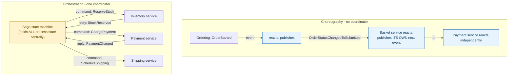

**TL;DR:** Who decides what happens next in a multi-step process — everyone, or one coordinator? Choreography has each service react to the previous event and publish its own next one, with no central coordinator; orchestration has one saga/state machine explicitly track state and issue each step as a command — a real architectural tradeoff between decentralized flexibility and centralized visibility.

> **In plain English (30 sec):** Code you already write — Map, function, API call, just bigger.

**Real repo:** [`dotnet-architecture/eShopOnContainers`](https://github.com/dotnet-architecture/eShopOnContainers), [`MassTransit/MassTransit`](https://github.com/MassTransit/MassTransit)

## 1. The Engineering Problem: a multi-step process needs SOMETHING deciding "what happens next," and where that logic lives is a real architectural choice

Placing an order might mean: reserve stock, charge payment, schedule shipping — each a separate service's responsibility, each depending on the previous step succeeding. Something has to decide "now that stock is reserved, trigger payment" — but WHERE that decision lives is a genuine fork in the road, not a detail. Put it nowhere centrally and let each service react to the last thing that happened, and you get one architecture. Put it in one coordinator that explicitly issues each step, and you get a very different one — with different failure modes, different places to look when debugging, and different costs to change.

---

## 2. The Technical Solution: choreography has no coordinator, orchestration has exactly one

**Choreography**: each service reacts to an event from the previous step and publishes its own next event. No single place holds "the whole process" — the overall flow only exists as the sum of every service's independent reaction. **Orchestration**: one coordinator (a saga/state machine) explicitly tracks the process's state and issues each step as a command, waiting for a reply before issuing the next.



Neither is strictly better — the tradeoff is real, not cosmetic:

- **Choreography** has no single point of coordination failure, and adding a new participant needs zero changes to existing services (they don't even know a new subscriber exists — it just starts listening). The cost: nobody can look at one place and see the whole flow; the process logic is scattered across every participating service's own event handlers, and inserting a new step in the *middle* of an existing flow can require editing several already-deployed services.
- **Orchestration** keeps the entire process explicit in one place — easy to see the whole flow, easy to add a step, easy to implement timeouts and compensation (undo logic) centrally. The cost: the coordinator becomes a dependency every step now routes through, and it has to know about every participant explicitly.

A common misconception worth correcting: orchestration doesn't mean synchronous REST calls, and choreography doesn't mean async is the only option. **The real distinguishing factor is who decides what happens next, not the transport.** A saga orchestrator commonly issues its commands over the exact same async message broker choreography uses — MassTransit sagas, the real example below, are entirely message-driven.

---

## 3. The clean example (concept in isolation)

```csharp
// Orchestration: ONE class declares every state and transition
class OrderSaga : MassTransitStateMachine<OrderState>
{
    public OrderSaga()
    {
        Initially(
            When(OrderSubmitted)
                .Then(ctx => ctx.Instance.OrderId = ctx.Data.OrderId)
                .TransitionTo(AwaitingStock));

        During(AwaitingStock,
            When(StockReserved).TransitionTo(AwaitingPayment),
            When(StockRejected).TransitionTo(Cancelled));

        During(AwaitingPayment,
            When(PaymentCharged).TransitionTo(Completed),
            When(PaymentFailed).TransitionTo(Cancelled));
    }
    public State AwaitingStock { get; set; }
    public State AwaitingPayment { get; set; }
    public State Completed { get; set; }
    public State Cancelled { get; set; }
}
```

---

## 4. Production reality (choreography from `eShopOnContainers`, orchestration mechanism from `MassTransit`)

**Choreography** — no service in eShopOnContainers's Ordering flow knows the whole picture; each just reacts and publishes its own next event:

```csharp
// Application/DomainEventHandlers/OrderStartedEvent/
// ValidateOrAddBuyerAggregateWhenOrderStartedDomainEventHandler.cs
public async Task Handle(OrderStartedDomainEvent orderStartedEvent, CancellationToken ct)
{
    // ... validate/create Buyer aggregate ...
    var orderStatusChangedToSubmittedIntegrationEvent =
        new OrderStatusChangedToSubmittedIntegrationEvent(orderStartedEvent.Order.Id, ...);
    await _orderingIntegrationEventService.AddAndSaveEventAsync(orderStatusChangedToSubmittedIntegrationEvent);
    // this handler has NO idea what happens after - some OTHER service's
    // own handler reacts to OrderStatusChangedToSubmittedIntegrationEvent independently
}
```

**Orchestration mechanism** — MassTransit's own canonical saga state-machine example (a phone call, used here purely to show the *mechanism*: one class, `PhoneStateMachine`, owns every state and transition explicitly):

```csharp
class PhoneStateMachine : MassTransitStateMachine<PrincessModelTelephone>
{
    public PhoneStateMachine()
    {
        InstanceState(x => x.CurrentState);   // ONE saga instance tracks the whole process

        Initially(
            When(ServiceEstablished)
                .Then(context => context.Instance.Number = context.Data.Digits)
                .TransitionTo(OffHook));

        During(OffHook,
            When(CallDialed).TransitionTo(Ringing));

        During(Ringing,
            When(HungUp).TransitionTo(OffHook),
            When(CallConnected).TransitionTo(Connected));

        During(Connected,
            When(LeftMessage).TransitionTo(OffHook),
            When(HungUp).TransitionTo(OffHook),
            When(PlacedOnHold).TransitionTo(OnHold));
    }
    public State OffHook { get; set; }
    public State Ringing { get; set; }
    public State Connected { get; set; }
    public State OnHold { get; set; }
}
```

What this teaches that a hello-world can't:

- **The choreography handler's job ends the moment it publishes its own event** — it has no return value tying it to "what comes next," no awareness of how many services react, and no way to know if the overall business process ever completes successfully. Debugging "why didn't this order ship" means tracing event handlers across every participating service's codebase.
- **`During(Ringing, When(HungUp)..., When(CallConnected)...)` declares BOTH valid transitions FROM one state in a single, readable block** — this is what "the whole process is visible in one place" concretely looks like: every state the saga can be in, and every event that's even valid to receive in that state, lives in this one class. An event arriving that isn't listed under the current `During` block is simply ignored by the state machine — invalid transitions aren't reachable by construction.
- **`InstanceState(x => x.CurrentState)` is the correlation mechanism that makes ONE saga instance track ONE business process across multiple asynchronous messages arriving at different times** — this is the actual coordinator: incoming events are matched to the correct in-flight saga instance (by a correlation ID, not shown here) and its `CurrentState` field is what makes "we're still waiting for `CallConnected`" a real, queryable, persisted fact between messages, not something rebuilt from scratch on each event like choreography's stateless handlers are.

Known-stale fact: a common assumption is that choosing orchestration means giving up the resilience benefits of messaging — it doesn't. MassTransit sagas, like the mechanism shown here, are driven entirely by messages over the same broker choreographed services use; the coordinator is just another message consumer with its own persisted state, not a synchronous RPC hub sitting outside the async system.

---

## Source

- **Concept:** Choreography vs Orchestration (saga coordination styles)
- **Domain:** microservices
- **Repo:** [dotnet-architecture/eShopOnContainers](https://github.com/dotnet-architecture/eShopOnContainers) → [`ValidateOrAddBuyerAggregateWhenOrderStartedDomainEventHandler.cs`](https://github.com/dotnet-architecture/eShopOnContainers/blob/dev/src/Services/Ordering/Ordering.API/Application/DomainEventHandlers/OrderStartedEvent/ValidateOrAddBuyerAggregateWhenOrderStartedDomainEventHandler.cs) — real choreography; [MassTransit/MassTransit](https://github.com/MassTransit/MassTransit) → [`Telephone_Sample.cs`](https://github.com/MassTransit/MassTransit/blob/master/tests/MassTransit.Tests/SagaStateMachineTests/Automatonymous/Telephone_Sample.cs) — the framework's own canonical saga state-machine mechanism.


