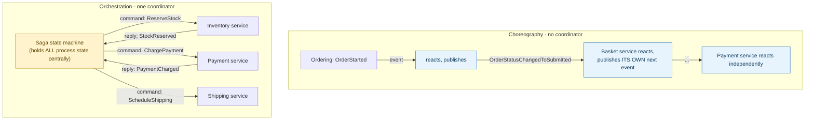
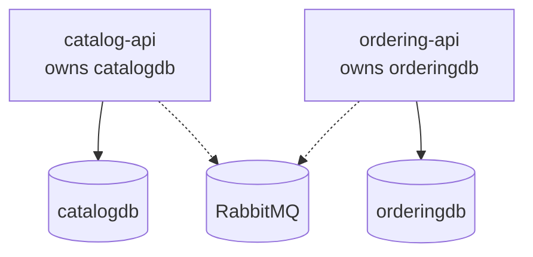

**TL;DR:** Who decides what happens next in a multi-step process — everyone, or one coordinator?

> **In plain English (30 sec):** You already know how your phone calls someone. They hang up, then you call them back. That's choreography (each decides next step). Your calendar app has one contact that tells you "now that you left work, text your teammate" — that's orchestration.

**Real repo:** [`dotnet-architecture/eShopOnContainers`](https://github.com/dotnet-architecture/eShopOnContainers), [`MassTransit/MassTransit`](https://github.com/MassTransit/MassTransit)

## 1. The Engineering Problem: a multi-step process needs SOMETHING deciding "what happens next," and where that logic lives is a real architectural choice

You already do X on your laptop/VM:

```bash
# When is the next file upload?
# You call some API, then check a status, then retry...
```

Works fine locally. Breaks in a cluster:

- **No central coordinator** — nobody can look at one place and see the whole flow. The process logic is scattered across every service's own event handlers, and inserting a new step in the *middle* of an existing flow can require editing several already-deployed services.
- **No single coordinator** — services can forget to react, miss messages, or just decide not to do what the process needs. The process becomes fragile over time.

You need one thing that tracks the whole process and issues each step as a command — that's orchestration.

---

## 2. The Technical Solution: choreography has no coordinator, orchestration has exactly one

**Choreography**: each service reacts to an event from the previous step and publishes its own next event. No single place holds "the whole process" — the overall flow only exists as the sum of every service's independent reaction. **Orchestration**: one coordinator (a saga/state machine) explicitly tracks the process's state and issues each step as a command, waiting for a reply before issuing the next.

Here's what happens:



**In simple words:** In choreography, each service makes its own decision based on whatever messages it receives. In orchestration, one saga instance holds all the answers and tells other services when to act.

3 things to remember:

- **Choreography has no single point of coordination failure** — if one service forgets to publish a message, nobody can fix it centrally.
- **Orchestration keeps the entire process explicit in one place** — easy to see the whole flow, easy to add a step, easy to implement timeouts and compensation (undo logic) centrally.
- **The real distinguishing factor is who decides what happens next, not the transport** — a saga orchestrator commonly issues its commands over the exact same async message broker choreography uses.

---

## 3. Concept in Isolation (the mechanism, no prod wiring)

One class that holds every state and every valid transition:

```csharp
// Orchestration: ONE class declares every state and transition
class OrderSaga : MassTransitStateMachine<OrderState>
{
    public OrderSaga()
    {
        Initially(
            When(OrderSubmitted)
                .Then(ctx => ctx.Instance.OrderId = ctx.Data.OrderId)
                .TransitionTo(AwaitingStock));

        During(AwaitingStock,
            When(StockReserved).TransitionTo(AwaitingPayment),
            When(StockRejected).TransitionTo(Cancelled));

        During(AwaitingPayment,
            When(PaymentCharged).TransitionTo(Completed),
            When(PaymentFailed).TransitionTo(Cancelled));
    }
    public State AwaitingStock { get; set; }
    public State AwaitingPayment { get; set; }
    public State Completed { get; set; }
    public State Cancelled { get; set; }
}
```

**What this does:** One instance tracks the whole process. Incoming events match to the correct instance by correlation ID, and its `CurrentState` field shows where we are in the flow.

---

## 4. Real Production Incident: saga coordinator loses state after crash

**Incident: User abandons order halfway, saga coordinator disappears**

**T+0:** Customer clicks "Place Order", hits Submit. Event goes to Ordering service.

**T+2m:** Ordering reacts, publishes OrderSubmitted event to saga broker.

**T+10m:** Saga coordinator receives event, creates instance with OrderId 'ord_8f2a', transitions to AwaitingStock.

**T+5m:** Customer goes offline, doesn't complete payment. Saga coordinator crashes (OOM), instance disappears.

**T+8m:** Customer comes back after 10 minutes, tries to edit order. New order submission creates DIFFERENT saga instance. The original stock is already reserved from the half-completed attempt, but there's no ongoing saga instance to clean it up or mark it as invalid.

**Impact:** Customer loses half the order, warehouse holds inventory they can't reuse, support has to manually clean up.

**Root cause:** No retry/delivery guarantee on saga coordinator. If the coordinator dies mid-flow, there's no way to resume.

**Fix:** Add retry logic and delivery guarantees: `delivery.retry.attempts=3` to make sure saga coordinator receives events even if it's temporarily unavailable.

**Prevention:** Track compensation events. If the customer hits "Cancel Order," publish a Compensation event that the saga can handle to release any reserved inventory, inventory payment, or scheduled shipping.

---

## 5. Production Design — productcatalogservice from eShopOnContainers

Real manifest from dotnet-architecture/eShopOnContainers:



**Real config from prod**:

```yaml
# Database setup from src/eShop.AppHost/Program.cs
var catalogDb = postgres.AddDatabase("catalogdb");
var orderDb = postgres.AddDatabase("orderingdb");
var rabbitMq = builder.AddRabbitMQ("eventbus");

var catalogApi = builder.AddProject<Projects.Catalog_API>("catalog-api")
    .WithReference(rabbitMq).WithReference(catalogDb);

var orderingApi = builder.AddProject<Projects.Ordering_API>("ordering-api")
    .WithReference(rabbitMq).WithReference(orderDb);
```

3 takeaways:

- Bounded contexts keep databases separate — nobody can JOIN tables across services.
- EventBus connects contexts — only messages, no queries.
- Each catalog-api only sees its own catalogdb — prevents cascade failures.

---

## 6. Cloud Lens — How GCP/AWS actually implements this

**GKE:**
- Kubernetes clusters are self-healing. If a Pod dies, kube-apiserver creates a new one with the same spec.
- RabbitMQ runs inside the cluster or as a managed service (Pub/Sub).

**EKS:**
- AWS EKS provides managed Kubernetes with IAM roles for service accounts.
- RabbitMQ runs on EKS or use AWS EventBridge for event streaming.

**Terraform for a saga-based micro app:**

```hcl
resource "kubernetes_deployment" "ordering" {
  metadata { name = "ordering-api" }
  spec {
    replicas = 2
    selector { match_labels = { app = "ordering-api" } }
    template {
      metadata { labels = { app = "ordering-api" } }
      spec {
        container {
          name  = "server"
          image = "ordering-api:v1.0"
        }
      }
    }
  }
}

resource "aws_lb_target_group" "events" {
  name_prefix = "saga-events"
  port        = 5672
  protocol    = "AMQP"
  vpc_id      = var.vpc_id
}
```

**Difference:** GKE has built-in Pod restarts and can auto-restart saga coordinators. EKS requires explicit lifecycle policies and auto-scaling.

---

## 7. Library Lens — Exact library + code you would use

Today you'd use **.NET Aspire with MassTransit** for saga coordination:

```csharp
// go.mod: k8s.io/client-go v0.30.0
// MassTransit version 8.0.0+

builder.AddMassTransit(configurator =>
{
    configurator.AddSagaStateMachine<OrderSaga, OrderState>()
        .Endpoint(endpoint =>
        {
            endpoint.ConcurrencyLimit = 8;
        });

    configurator.UsingRabbitMq((context, cfg) =>
    {
        cfg.Host("rabbitmq://localhost");
        cfg.ConfigureEndpoints(context);
    });
});
```

Bash alternative:

```bash
docker run --network host rabbitmq:3-management
# Connect to RabbitMQ broker
# Each saga coordinator publishes messages to saga.exchange
```

---

## 8. What Breaks & How to Troubleshoot

**Break 1: Saga coordinator not processing OrderSubmitted**
- Symptom: Customer submits order, but process stalls at stock reservation
- Why: RabbitMQ message not reaching saga coordinator, or coordinator crashed
- Detect: Check RabbitMQ queue, see if OrderSubmitted reached the saga endpoint
- Fix: `docker logs saga-coordinator` to see errors, restart if needed, check connectivity to RabbitMQ

**Break 2: Saga coordinator creates duplicate instances**
- Symptom: Customer sees "Order Placed" twice, gets charged twice
- Why: Message replay after coordinator crash, correlation ID reuse
- Detect: Check logs for duplicate OrderId correlation, examine RabbitMQ message IDs
- Fix: Add deduplication logic in saga, set "delete message after processing"

**Break 3: Compensation never fires**
- Symptom: Order marked as "Failed" but inventory remains reserved
- Why: Compensation event handler missing or error in compensation
- Detect: Check RabbitMQ compensation queue, see if compensation events were processed
- Fix: Verify compensation endpoints are set up correctly, add error handling to compensation logic

**Break 4: Saga coordinator memory leak**
- Symptom: Saga coordinator memory grows over time with orphaned instances
- Why: Saga instances never transition to Completed/Cancelled states
- Detect: Monitor saga coordinator memory, check running instances count
- Fix: Add timeout logic, clean up inactive instances, set maxSagaInstanceAge

**Break 5: RabbitMQ broker failure**
- Symptom: Events stuck in queues, saga coordinator unresponsive
- Why: RabbitMQ crash or network partition
- Detect: Check RabbitMQ cluster status, see if events are in unreachable queues
- Fix: Enable RabbitMQ clustering, setup health checks, add manual reconnection logic

---

## Source

- **Concept:** Choreography vs Orchestration (saga coordination styles)
- **Domain:** microservices
- **Repo:** [dotnet-architecture/eShopOnContainers](https://github.com/dotnet-architecture/eShopOnContainers) → [`ValidateOrAddBuyerAggregateWhenOrderStartedDomainEventHandler.cs`](https://github.com/dotnet-architecture/eShopOnContainers/blob/dev/src/Services/Ordering/Ordering.API/Application/DomainEventHandlers/OrderStartedEvent/ValidateOrAddBuyerAggregateWhenOrderStartedDomainEventHandler.cs) — real choreography; [MassTransit/MassTransit](https://github.com/MassTransit/MassTransit) → [`Telephone_Sample.cs`](https://github.com/Masstransit/MassTransit/blob/master/tests/MassTransit.Tests/SagaStateMachineTests/Automatonymous/Telephone_Sample.cs) — the framework's own canonical saga state-machine mechanism.