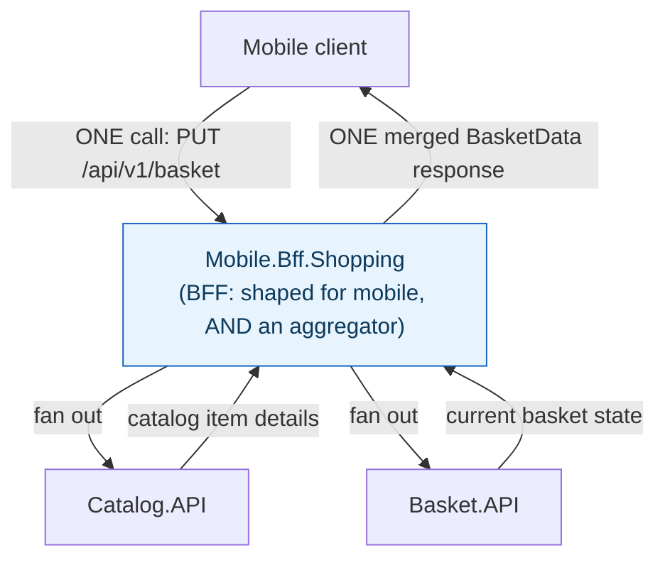
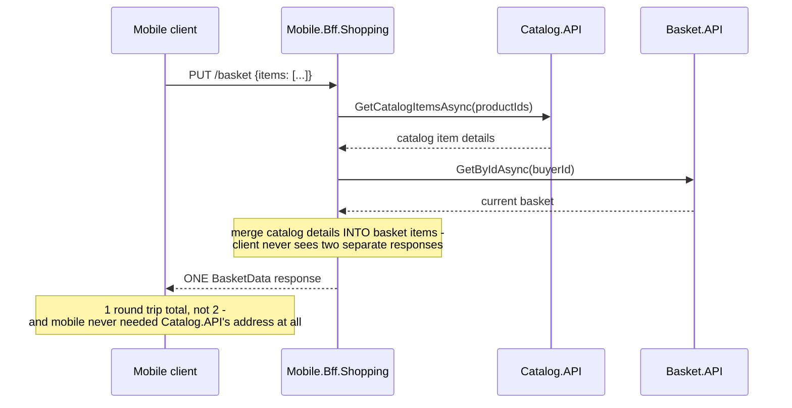

**TL;DR:** Why does a mobile client need its own gateway instead of sharing the web app's? A Backend-for-Frontend gives each client type its own gateway shaped for its own needs, and it's the natural place to put aggregation logic that fans out to multiple backend services and merges the results into one response, so the client makes one call instead of composing data itself.

**Real repo:** [`dotnet-architecture/eShopOnContainers`](https://github.com/dotnet-architecture/eShopOnContainers)

## 1. The Engineering Problem: one shared gateway can't serve every client well, and forcing clients to compose data themselves is worse

A single, generic API Gateway shared by a mobile app and a web SPA forces both to accept the same response shapes and the same round-trip counts. A desktop browser can afford several parallel fetches; a mobile client on a flaky connection wants the fewest possible round trips and the leanest payload — one-size-fits-all serves neither well. It gets worse when a single screen needs data from more than one backend service: "add this item to the basket" needs both the catalog item's details (name, price, picture) *and* the current basket state. Make the client call both services itself, and the client now owns cross-service composition logic, needs to know two backend addresses instead of one, and pays two round trips instead of one — expensive on exactly the connections that can least afford it.

---

## 2. The Technical Solution: a gateway per client type, that also absorbs the fan-out

**BFF (Backend-for-Frontend)**: instead of one shared gateway, each client type — mobile, web, third-party — gets its own gateway, shaped exactly for what that client needs. **Aggregator**: a service that fans out to multiple backend services in a single handler, merges the results, and returns one response — the client makes one call; the aggregator absorbs the N calls to backends. These are separable ideas, but in practice they're frequently the same component: a BFF is exactly the right place to put aggregation logic, because it's already scoped to one client's specific needs.





Core truths: **"BFF" and "API Gateway" are not interchangeable** — a shared API Gateway is deliberately client-agnostic, serving every consumer the same way; a BFF is deliberately client-*specific*, one per frontend type, and it's fine (expected, even) for a mobile BFF and a web BFF to shape the same underlying data completely differently. And **aggregation doesn't require a BFF** — a GraphQL resolver layer solves the same "fan out to N services, combine into one response" problem for a client-agnostic API; the BFF is one place to put that logic, not the only one.

---

## 3. The clean example (concept in isolation)

```csharp
[HttpGet("{buyerId}/enriched")]
public async Task<BasketData> GetEnrichedBasket(string buyerId)
{
    var basket = await _basketService.GetByIdAsync(buyerId);           // call 1
    var items = await _catalogService.GetCatalogItemsAsync(
        basket.Items.Select(i => i.ProductId));                          // call 2

    foreach (var item in basket.Items)
        item.ProductName = items.Single(c => c.Id == item.ProductId).Name;  // merge

    return basket;   // client made ONE call, got fully-enriched data
}
```

---

## 4. Production reality (from `dotnet-architecture/eShopOnContainers`)

The component's own folder name says both things at once: `Mobile.Bff.Shopping/aggregator/` — a BFF, that also aggregates.

```csharp
// src/ApiGateways/Mobile.Bff.Shopping/aggregator/Controllers/BasketController.cs
public async Task<ActionResult<BasketData>> UpdateAllBasketAsync([FromBody] UpdateBasketRequest data)
{
    // Retrieve the current basket
    var basket = await _basket.GetByIdAsync(data.BuyerId) ?? new BasketData(data.BuyerId);
    var catalogItems = await _catalog.GetCatalogItemsAsync(data.Items.Select(x => x.ProductId));

    var itemsCalculated = data.Items
        .GroupBy(x => x.ProductId, x => x, (k, i) => new { productId = k, items = i })
        .Select(groupedItem =>
        {
            var item = groupedItem.items.First();
            item.Quantity = groupedItem.items.Sum(i => i.Quantity);
            return item;
        });

    foreach (var bitem in itemsCalculated)
    {
        var catalogItem = catalogItems.SingleOrDefault(ci => ci.Id == bitem.ProductId);
        if (catalogItem == null)
            return BadRequest($"Basket refers to a non-existing catalog item ({bitem.ProductId})");

        var itemInBasket = basket.Items.FirstOrDefault(x => x.ProductId == bitem.ProductId);
        if (itemInBasket == null)
        {
            basket.Items.Add(new BasketDataItem()
            {
                ProductId = catalogItem.Id,
                ProductName = catalogItem.Name,   // ENRICHED from Catalog.API
                PictureUrl = catalogItem.PictureUri,
                UnitPrice = catalogItem.Price,
                Quantity = bitem.Quantity
            });
        }
        else { itemInBasket.Quantity = bitem.Quantity; }
    }

    await _basket.UpdateAsync(basket);
    return basket;   // ONE response, already merged
}
```

What this teaches that a hello-world can't:

- **The mobile client's request body (`UpdateBasketRequest`) never contains a product name, price, or picture URL — only product IDs and quantities.** The BFF is what fills in the rest by calling `Catalog.API`; the mobile app is deliberately kept ignorant of `Catalog.API`'s existence entirely, let alone its address or response shape.
- **Deduplication happens INSIDE the aggregator (`GroupBy(x => x.ProductId, ...).Sum(i => i.Quantity)`), not in the mobile client.** If a mobile UI accidentally submits the same product twice (a double-tap, a retry), the BFF collapses it into one line with the summed quantity — business logic a naive client-side aggregation would need to duplicate itself, or risk getting wrong.
- **A `BadRequest` for a non-existent catalog item is returned from the BFF, not surfaced as "Basket.API succeeded but the item is missing."** The aggregator validates across both services' data *before* committing the update — a check that's only possible because one component saw both responses together, which neither `Catalog.API` nor `Basket.API` individually could perform.

Known-stale fact: BFF is routinely conflated with API Gateway in casual usage — worth stating precisely: a shared API Gateway serving every client type identically is explicitly the thing a BFF is introduced to move *away* from, once different clients' needs diverge enough that a single shape stops serving all of them well. Treating "we already have an API Gateway" as "we don't need a BFF" misses why teams add one in the first place.

---

## Source

- **Concept:** BFF & Aggregator patterns
- **Domain:** microservices
- **Repo:** [dotnet-architecture/eShopOnContainers](https://github.com/dotnet-architecture/eShopOnContainers) → [`src/ApiGateways/Mobile.Bff.Shopping/aggregator/Controllers/BasketController.cs`](https://github.com/dotnet-architecture/eShopOnContainers/blob/dev/src/ApiGateways/Mobile.Bff.Shopping/aggregator/Controllers/BasketController.cs) — a real mobile-specific BFF that also aggregates across Catalog.API and Basket.API.
