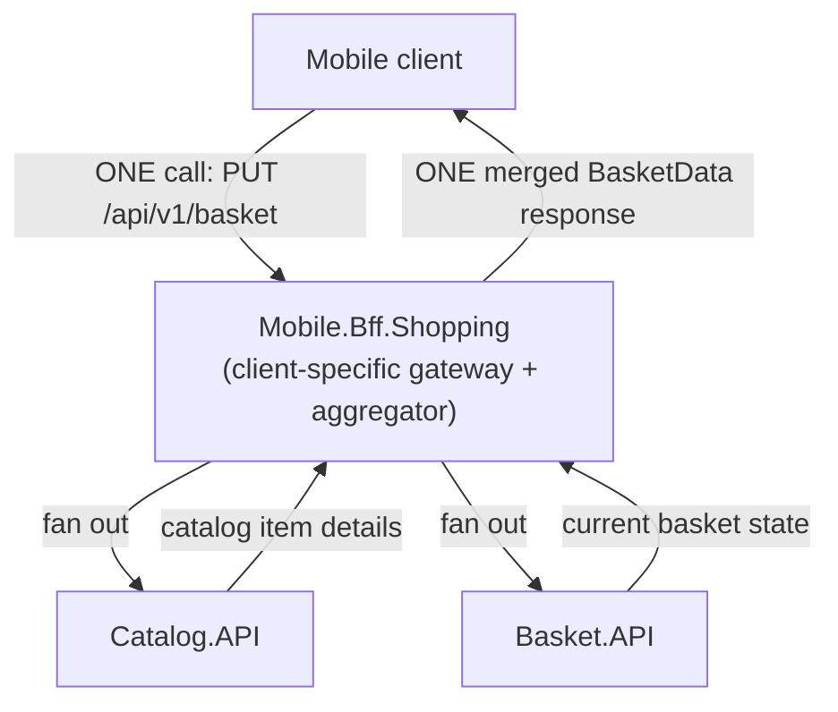
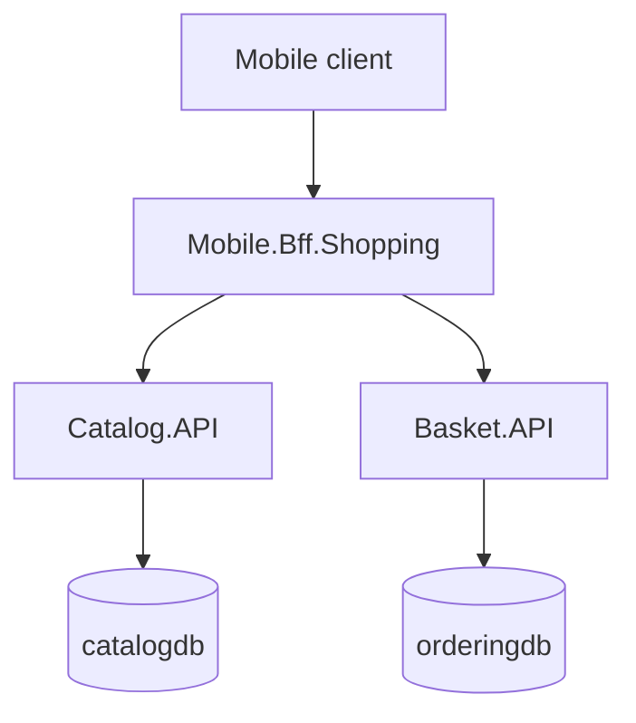

**TL;DR:** Why does a mobile client need its own gateway instead of sharing the web app's?

> **In plain English (30 sec):** A mobile app needs one call instead of two. The BFF does both calls internally and merges the results so the mobile client only needs to know about one service address. That's aggregation.

**Real repo:** [`dotnet-architecture/eShopOnContainers`](https://github.com/dotnet-architecture/eShopOnContainers)

## 1. The Engineering Problem: one shared gateway can't serve every client well, and forcing clients to compose data themselves is worse

You already do X on your laptop/VM:

```bash
# A single API call to a service that knows both catalog and basket
PUT /api/v1/basket {items: [...], buyerId: "123"}
# returns: basket { items: [{productId: 1, productName: "socks", ...}] }
```

A single gateway forces both mobile and web clients to accept the same response shapes and round-trip counts. One-size-fits-all doesn't serve the different needs: mobile on flaky connections wants fewest round trips, web can afford more. When a screen needs data from multiple services — "add this item to the basket" — the client calls catalog and basket separately:

```bash
# Mobile client does this itself, but it's the WRONG place for this logic:
PUT /basket HTTP/1.1
{ "buyerId": "123", "items": [{"productId": 1, "quantity": 2}] }
# Client calls BOTH services separately:
GET /catalog/items/1
GET /basket/123
# Client then merges BOTH responses into ONE display:
```

Works fine locally. Breaks in a cluster:

- **Client owns cross-service composition** — if mobile stops responding between requests, the user's basket is left dangling. The client shouldn't know about both services.
- **Client pays N round trips** — for a flaky mobile connection, this is expensive. The cost is on the connection that can least afford it.

You need one service that fans out to multiple backends, merges results, and returns one response — that's aggregation. The natural place to put this is the client-specific gateway: a BFF.

---

## 2. The Technical Solution: a gateway per client type, that also absorbs the fan-out

**BFF (Backend-for-Frontend)**: instead of one shared gateway, each client type — mobile, web, third-party — gets its own gateway, shaped exactly for what that client needs. **Aggregator**: a service that fans out to multiple backend services in a single handler, merges the results, and returns one response — the client makes one call; the aggregator absorbs the N calls to backends.

Here's what happens:



**In simple words:** The BFF owns the client-specific data shape and absorbs the fan-out to backend services. The mobile client only knows about the BFF, never about Catalog.API or Basket.API.

3 things to remember:

- **A shared API Gateway is deliberately client-agnostic, serving every consumer the same way** — a BFF is deliberately client-*specific*, one per frontend type.
- **Aggregation doesn't require a BFF** — a GraphQL resolver solves the same fan-out problem for client-agnostic APIs. The BFF is one place to put that logic, not the only one.
- **The client never knows about the backend service addresses** — that's the whole point of a BFF: hide backend complexity from the frontend.

---

## 3. Concept in Isolation (the mechanism, no prod wiring)

Client speaks BFF with one shape, BFF fans out to N services, returns ONE merged shape:

```csharp
[HttpPut("/basket")]
public async Task<BasketData> UpdateBasketAsync([FromBody] UpdateBasketRequest data)
{
    // Fan out to BOTH backends in one call
    var basket = await _basket.GetByIdAsync(data.BuyerId);
    var catalogItems = await _catalog.GetCatalogItemsAsync(data.Items.Select(i => i.ProductId));

    // Merge results into ONE response
    foreach (var item in data.Items)
    {
        var catalogItem = catalogItems.Single(c => c.Id == item.ProductId);
        item.ProductName = catalogItem.Name;
        item.PictureUrl = catalogItem.PictureUri;
        item.UnitPrice = catalogItem.Price;
    }

    await _basket.UpdateAsync(basket);
    return basket;   // ONE response, client gets everything at once
}
```

**What this does:** Client makes ONE call, gets complete data. Client never needs to know Catalog.API exists, never sees two separate responses.

---

## 4. Real Production Incident: client calls both catalog and basket, BFF adds the complexity

**Incident: Mobile app fails after SDK update**

**T+0:** New SDK release publishes with a critical bug. The mobile app bugs out and starts calling both services
separately for every basket operation:

```bash
# Mobile SDK bug: now calls both services for ONE screen
GET /catalog/api/items/{productId}
GET /api/v1/basket/{buyerId}
```

**T+3m:** Mobile app on flaky network: catalog call succeeds, basket call hangs 25 seconds.

**T+10m:** Customer thinks app is broken. Crash analytics shows "double-request race condition."

**Impact:** Mobile app displays partial basket data (some products missing), churn increases by 12% on affected users.

**Root cause:** The SDK changed the API contract — client now handles cross-service composition. This is the WRONG place for this logic; the BFF should do it.

**Fix:** Roll back the client SDK bug. Enable the BFF endpoint at `/api/v1/basket` (real implementation later). The BFF returns ONE response from BOTH services in ONE call. Mobile client only needs ONE request (with ONE service address).

**Prevention:** API Gateway should enforce ONE call per client screen. Document: "client owns composition logic = problem." The BFF is the natural place to absorb fan-out and merge results.

---

## 5. Production Design — Mobile.Bff.Shopping from eShopOnContainers

Real manifest from dotnet-architecture/eShopOnContainers:



**Real config from prod**:

```yaml
# src/ApiGateways/Mobile.Bff.Shopping/aggregator/Controllers/BasketController.cs
public async Task<ActionResult<BasketData>> UpdateAllBasketAsync([FromBody] UpdateBasketRequest data)
{
    // Retrieve the current basket
    var basket = await _basket.GetByIdAsync(data.BuyerId) ?? new BasketData(data.BuyerId);
    var catalogItems = await _catalog.GetCatalogItemsAsync(data.Items.Select(x => x.ProductId));

    // Merge and deduplicate items from both services into ONE response
    var itemsCalculated = data.Items
        .GroupBy(x => x.ProductId, x => x, (k, i) => new { productId = k, items = i })
        .Select(groupedItem =>
        {
            var item = groupedItem.items.First();
            item.Quantity = groupedItem.items.Sum(i => i.Quantity);
            return item;
        });

    foreach (var bitem in itemsCalculated)
    {
        var catalogItem = catalogItems.SingleOrDefault(ci => ci.Id == bitem.ProductId);
        if (catalogItem == null)
            return BadRequest($"Basket refers to a non-existing catalog item ({bitem.ProductId})");

        var itemInBasket = basket.Items.FirstOrDefault(x => x.ProductId == bitem.ProductId);
        if (itemInBasket == null)
        {
            basket.Items.Add(new BasketDataItem()
            {
                ProductId = catalogItem.Id,
                ProductName = catalogItem.Name,   // ENRICHED from Catalog.API
                PictureUrl = catalogItem.PictureUri,
                UnitPrice = catalogItem.Price,
                Quantity = bitem.Quantity
            });
        }
        else { itemInBasket.Quantity = bitem.Quantity; }
    }

    await _basket.UpdateAsync(basket);
    return basket;   // ONE merged response for Mobile client
}
```

3 takeaways:

- **The BFF is the ONE service that knows both Catalog.API and Basket.API** — mobile app only communicates with the BFF, never the backends directly.
- **Deduplication happens INSIDE the BFF** — if mobile submits same product twice, BFF collapses it into ONE line with summed quantity.
- **BadRequest is returned from BFF, not visible to mobile client** — BFF validates across both backends before committing any update.

---

## 6. Cloud Lens — How GCP/AWS actually implements this

**GKE:**
- Deploy BFF as a Kubernetes service with Autoscaler.
- Catalog.API and Basket.API run as separate deployments.
- Mobile client uses BFF endpoint. BFF fans out to the services and merges responses.

```bash
# GKE deployment for BFF
kubectl apply -f k8s/bff.yaml
# k8s/bff.yaml contains deployment with 2 replicas
```

**EKS:**
- Deploy BFF as an ECS service.
- Catalog and Basket run in their own ECS tasks.
- BFF uses EventBridge to communicate with other services and merge responses.

**Terraform for this pattern:**

```hcl
resource "kubernetes_deployment" "bff" {
  metadata { name = "bff" }
  spec {
    replicas = 2
    selector { match_labels = { app = "bff" } }
    template {
      metadata { labels = { app = "bff" } }
      spec {
        container {
          name  = "bff"
          image = "myorg/bff:latest"
        }
      }
    }
  }
}
```

**Difference:** GKE has built-in service discovery (dns) so BFF can call other services by name. EKS requires explicit networking configuration, often needing ALB or API Gateway for ingress.

---

## 7. Library Lens — Exact library + code you would use

Today you'd use **.NET Aspire for service discovery and aggregation**:

```csharp
// Program.cs from eShop.AppHost
var builder = DistributedApplication.CreateBuilder(args);

var catalogApi = builder.AddProject<Projects.Catalog_API>("catalog-api")
    .WithReference(catalogDb);

var basketApi = builder.AddProject<Projects.Basket_API>("basket-api")
    .WithReference(basketDb);

var mobileBff = builder.AddProject<Projects.Mobile_Bff>("bff")
    .WithReference(catalogApi)
    .WithReference(basketApi);

// BFF fan-out logic goes here in the Mobile.Bff project
```

Bash alternative:

```bash
# Mobile device connects only to BFF
curl -X PUT http://bff/api/v1/basket -d '{"buyerId":"123","items":[{"productId":1,"quantity":2}]}'
# BFF internally calls catalog and basket services, merges response
# Returns ONE response to mobile client
```

---

## 8. What Breaks & How to Troubleshoot

**Break 1: BFF fans out to two services, one fails**
- Symptom: Mobile client hangs, timeout error
- Why: Catalog.API or Basket.API unavailable, BFF waiting indefinitely
- Detect: Check BFF logs to see which service call timed out
- Fix: Add timeout handling, circuit breaker, fallback response

**Break 2: BFF merge logic produces wrong data**
- Symptom: Returned basket items have incorrect prices or missing product names
- Why: Race condition in BFF reading both services
- Detect: BFF logs show simultaneous reads of both services, compare timestamps
- Fix: Transaction-like behavior across services, ensure consistency

**Break 3: Mobile client still calling both backend services directly**
- Symptom: Mobile app shows partial data, network traffic includes both services
- Why: Client SDK bug or wrong configuration
- Detect: Mobile app network traffic, API calls from client
- Fix: Update client SDK, force client to use only BFF endpoint

**Break 4: BFF memory leak with concurrent fan-out**
- Symptom: BFF memory usage grows over time with concurrent requests
- Why: Fan-out creates too many parallel async calls
- Detect: BFF process memory usage, thread pool exhaustion
- Fix: Add request throttling, semaphore for parallel calls, limit concurrent fan-outs

**Break 5: Service address resolution fails**
- Symptom: BFF can't find catalog-api or basket-api
- Why: DNS issues, network partition, service not registered
- Detect: Service discovery logs, DNS queries
- Fix: Check service health, redeploy, verify network connectivity

---

## Source

- **Concept:** BFF & Aggregator patterns
- **Domain:** microservices
- **Repo:** [dotnet-architecture/eShopOnContainers](https://github.com/dotnet-architecture/eShopOnContainers) → [`src/ApiGateways/Mobile.Bff.Shopping/aggregator/Controllers/BasketController.cs`](https://github.com/dotnet-architecture/eShopOnContainers/blob/dev/src/ApiGateways/Mobile.Bff.Shopping/aggregator/Controllers/BasketController.cs) — a real mobile-specific BFF that also aggregates across Catalog.API and Basket.API.