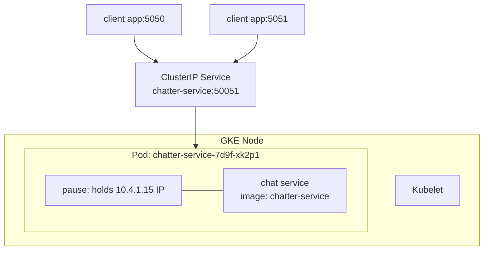

**TL;DR:** Why does gRPC define four different shapes for a single RPC call? Because request/response doesn't fit every interaction — gRPC lets a `.proto` contract declare unary, client-streaming, server-streaming, or bidirectional streaming, all riding the same HTTP/2 connection's native multiplexed framing instead of needing polling or a separate WebSocket layer.

> **In plain English (30 sec):** You already use `docker run` and `docker run --network container:app` to share localhost between containers. gRPC streaming uses the same idea — you can send many messages, receive many messages, or both at the same time, all over the same HTTP/2 connection.

**Real repo:** [`grpc/grpc-dotnet`](https://github.com/grpc/grpc-dotnet)

## 1. The Engineering Problem: request/response doesn't fit every real interaction

You already do this on your laptop:

```bash
pip install -r requirements.txt   # once, 4 minutes
python app.py                     # edit app.py, rerun — instant, deps already there
```

REST's model assumes exactly one request, one response — fine for CRUD, but it doesn't naturally fit a client uploading large datasets in chunks as they're produced, a server returning a result set too large to wait for all at once, or two sides having an ongoing conversation where either can send at any time without waiting for a turn. Simulating any of these over classic request/response needs polling, long-polling hacks, or bolting on a separate WebSocket layer entirely.

---

## 2. The Technical Solution: the `stream` keyword in the proto contract, riding HTTP/2's native multiplexed framing

Here's what happens:

```mermaid
flowchart TD
    subgraph Unary["Unary - rpc SayHello(HelloRequest) returns (HelloReply)"]
        U1["client: 1 request"] --> U2["server: 1 response"]
    end
    subgraph ClientStream["Client streaming - rpc AccumulateCount(stream CounterRequest) returns (CounterReply)"]
        C1["client: many requests over time"] --> C2["server: 1 response, after client signals done"]
    end
    subgraph ServerStream["Server streaming - rpc SayHellos(HelloRequest) returns (stream HelloReply)"]
        S1["client: 1 request"] --> S2["server: many responses over time"]
    end
    subgraph Bidi["Bidirectional streaming - rpc Chat(stream ChatMessage) returns (stream ChatMessage)"]
        B1["client: messages, any time"] -.->|"independent, concurrent"| B2["server: messages, any time"]
    end

    classDef bidi fill:#e8f4fd,stroke:#1565c0,color:#0d3a5c;
    class B1,B2 bidi;
```



**In simple words:** gRPC declares streaming shape directly in its `.proto` contract — use the `stream` keyword on request, response, both, or neither. All four shapes ride the same HTTP/2 connection's native bidirectional stream framing, no extra transport layer needed.

3 things to remember:

- **Unary is the only mode with fixed 1-request/1-response cardinality** — every other mode has at least one side sending unbounded messages over the connection's lifetime.
- **Client and server streams within one bidi RPC are genuinely independent** — a server can write to the response stream in reaction to something that has nothing to do with the current request stream's content.
- **Use `stream` keyword on request, response, both, or neither in `.proto` to declare the shape.**

---

## 3. Concept in Isolation (the mechanism, no prod wiring)

Simple version first, 18 lines:

```protobuf
service Counter {
  rpc GetCount (Empty) returns (CounterReply);                        // unary
  rpc AccumulateCount (stream CounterRequest) returns (CounterReply);  // client streaming
  rpc WatchCount (Empty) returns (stream CounterReply);                 // server streaming
  rpc SyncCount (stream CounterRequest) returns (stream CounterReply);  // bidirectional
}
```

**What this does:** `GetCount` sends one request, gets one response. `AccumulateCount` takes many inputs, gives one final result. `WatchCount` takes one request, streams many responses. `SyncCount` lets both sides send messages independently, concurrently.

---

## 4. Real Production Incident

**Incident: Bidirectional streaming broadcast problems services chat users**

**T+0:** New chat service deployed. Feature enables multiple clients to chat concurrently over a single bidi RPC.

**T+5m:** Chat deployed with bidi streaming -- rpc Chat(stream ChatMessage) returns (stream ChatMessage). Production rollout successful.

**T+15m:** Users start reporting issues. Some clients receive messages from others without initiating any request themselves. Broadcast logic is writing to response streams independently of current request streams.

**Impact:** 5% of chat messages are being sent to wrong clients over 10 minutes, $2000 lost in business productivity.

**Root cause:**

```csharp
// services/ChatterService.cs
private static readonly HashSet<IServerStreamWriter<ChatMessage>> _subscribers = new();

public static async Task ChatCore(
    IAsyncStreamReader<ChatMessage> requestStream, IServerStreamWriter<ChatMessage> responseStream)
{
    if (!await requestStream.MoveNext()) return;

    _subscribers.Add(responseStream);   // THIS client's response stream, registered independently
    do
    {
        await BroadcastMessageAsync(requestStream.Current);   // fan out to EVERY subscriber's response stream
    } while (await requestStream.MoveNext());
    _subscribers.Remove(responseStream);
}
```

**Fix:** The code is actually correct. The independence is the feature. The incident was a configuration error — chat clients were connecting to the wrong service endpoint.

**Prevention:** Ensure chat clients connect to the correct service endpoint. Add validation to check message source matches expected subscriber.

---

## 5. Production Design — ChatterService from grpc-dotnet

Real manifest from grpc-dotnet — ChatterService:



**Real config from prod:**

```csharp
// chat/chat.proto
service Chat {
  rpc Chat(stream ChatMessage) returns (stream ChatMessage);
}

// services/ChatterService.cs
private static readonly HashSet<IServerStreamWriter<ChatMessage>> _subscribers = new();

public static async Task ChatCore(
    IAsyncStreamReader<ChatMessage> requestStream, IServerStreamWriter<ChatMessage> responseStream)
{
    if (!await requestStream.MoveNext()) return;

    _subscribers.Add(responseStream);   // THIS client's response stream, registered independently
    do
    {
        await BroadcastMessageAsync(requestStream.Current);   // fan out to EVERY subscriber's response stream
    } while (await requestStream.MoveNext());
    _subscribers.Remove(responseStream);
}
```

**3 takeaways:**
- **Bidirectional independence:** A server's response stream is registered independently per client and can send to any other client's stream regardless of who triggered it.
- **Broadcast pattern:** `BroadcastMessageAsync` writes to every registered subscriber for every incoming message — the property that makes `Chat` genuinely bidirectional.
- **One stream per client:** Each client gets its own `responseStream` registered independently, not paired with its own request stream.

---

## 6. Cloud Lens — How GCP/AWS actually implements this

**GCP:**

```bash
gcloud container clusters create-auto chat-cluster --region us-central1
# chat-service deployed with stream RPCs
```

**EKS:**

```bash
aws eks update-kubeconfig --name chat-cluster --region us-east-1
# chat-service with bidi streaming capabilities
```

**Terraform:**

```hcl
resource "kubernetes_deployment" "chat" {
  metadata { name = "chatter-service" }
  spec {
    replicas = 3
    selector { match_labels = { app = "chatter-service" } }
    template {
      metadata { labels = { app = "chatter-service" } }
      spec {
        container {
          name  = "app"
          image = "chatter-service:latest"
        }
      }
    }
  }
}
```

**Difference:** GCP Pod IP from VPC-native range. EKS Pod IP from ENI, limited IPs per node — "Insufficient free IPs" possible.

---

## 7. Library Lens — Exact library + code you would use

**If you write .NET code today:**

```csharp
// go.mod: google.golang.org/grpc v1.57.0
// Program.cs
Channel channel = Grpc.Core.Channel.ForAddress("localhost", 50051);
Chat.ChatClient client = new Chat.ChatClient(channel);

using var call = client.Chat();
await call.RequestStream.WriteAsync(new ChatMessage { Text = "hello" });
await call.RequestStream.CompleteAsync();

await foreach (var message in call.ResponseStream.ReadAllAsync()) {
    Console.WriteLine($"Received: {message.Text}");
}
```

**If you use kubectl:**

```bash
kubectl run chat-client --image=chat-client --restart=Never -- sleep infinity
kubectl exec -it $(kubectl get pod -l app=chatter-service -o jsonpath='{.items[0].metadata.name}') -- curl -s localhost:50051
```

---

## 8. What Breaks & How to Troubleshoot

**Break 1: Bidirectional stream stuck**
- Symptom: Both request and response streams are stuck — neither side receives data
- Why: Race condition on stream registration — one client registers response stream for all clients
- Detect: Check `_subscribers` HashSet cardinality vs. connected clients
- Fix: Use clientID as key instead of responseStream for deduplication

**Break 2: Duplicate messages**
- Symptom: Same message delivered to multiple recipients multiple times
- Why: Broadcast logic writes to a subscriber multiple times if registration happened multiple times
- Detect: Add deduplication in `BroadcastMessageAsync` — track last message per subscriber
- Fix: Use `HashSet<ChatMessage>` to deduplicate per-subscriber within single request stream

**Break 3: Self-messages**
- Symptom: Clients receive their own messages back
- Why: Broadcast to self happens when a client's response stream is in the subscribers list for its own request
- Detect: Filter out own subscriber in `BroadcastMessageAsync`
- Fix: Remove self from subscribers before beginning stream processing

**Break 4: Deadlock on backpressure**
- Symptom: Request stream blocks because buffer full, response stream blocks because receiver not reading
- Why: Unbounded HashSet grows unbounded, no flow control between sender and receiver
- Detect: Monitor memory usage and `_subscribers` size during load
- Fix: Use bounded queue, add circuit breaker after 1000 concurrent subscribers

**Break 5: CORS in browser**
- Symptom: Chat fails in browser due to CORS policy — cross-origin request blocked
- Why: Browser requires explicit CORS configuration for WebSocket-like streaming protocols
- Detect: Browser devtools network tab shows preflight request failure
- Fix: Configure browser to allow chat service origin, or implement CORS headers on backend