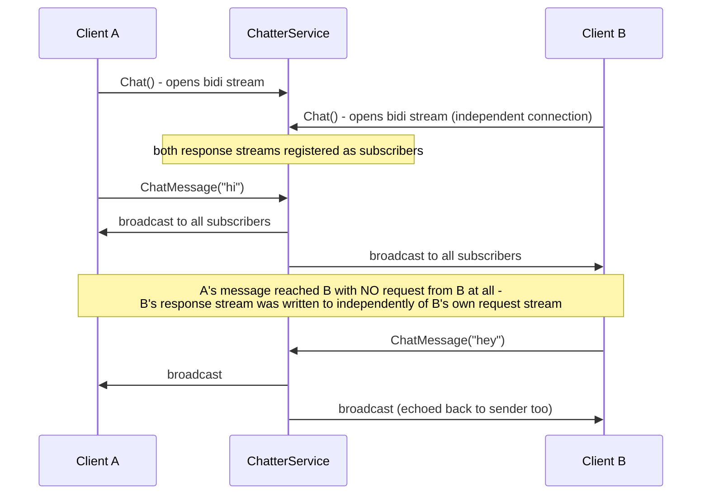

```mermaid
flowchart TD
    subgraph Unary["Unary - rpc SayHello(HelloRequest) returns (HelloReply)"]
        U1["client: 1 request"] --> U2["server: 1 response"]
    end
    subgraph ClientStream["Client streaming - rpc AccumulateCount(stream CounterRequest) returns (CounterReply)"]
        C1["client: many requests over time"] --> C2["server: 1 response, after client signals done"]
    end
    subgraph ServerStream["Server streaming - rpc SayHellos(HelloRequest) returns (stream HelloReply)"]
        S1["client: 1 request"] --> S2["server: many responses over time"]
    end
    subgraph Bidi["Bidirectional streaming - rpc Chat(stream ChatMessage) returns (stream ChatMessage)"]
        B1["client: messages, any time"] -.->|"independent, concurrent"| B2["server: messages, any time"]
    end

    classDef bidi fill:#e8f4fd,stroke:#1565c0,color:#0d3a5c;
    class B1,B2 bidi;
```

**TL;DR:** Why does gRPC define four different shapes for a single RPC call? Because request/response doesn't fit every interaction — gRPC lets a `.proto` contract declare unary, client-streaming, server-streaming, or bidirectional streaming, all riding the same HTTP/2 connection's native multiplexed framing instead of needing polling or a separate WebSocket layer.

> **In plain English (30 sec):** Code you already write — Map, function, API call, just bigger.

**Real repo:** [`grpc/grpc-dotnet`](https://github.com/grpc/grpc-dotnet)

## 1. The Engineering Problem: request/response doesn't fit every real interaction

REST's model assumes exactly one request, one response — fine for CRUD, but it doesn't naturally fit a client uploading a large dataset in chunks as they're produced, a server returning a result set too large (or too slow to fully compute) to make the client wait for all of it at once, or two sides having a genuinely ongoing conversation where either can send at any time without waiting for a turn. Simulating any of these over classic request/response needs polling, long-polling hacks, or bolting on a separate WebSocket layer entirely.

---

## 2. The Technical Solution: the `stream` keyword in the proto contract, riding HTTP/2's native multiplexed framing

gRPC declares the streaming shape of an RPC directly in its `.proto` contract — the `stream` keyword on the request type, the response type, both, or neither. All four shapes ride the *same* HTTP/2 connection's native bidirectional stream framing, which is what makes this possible without any extra transport layer.



Bidirectional streaming is worth a closer look, because "both sides can send independently" is easy to state and easy to under-appreciate until you see what it costs to implement correctly — the server has to read incoming messages and write outgoing ones *concurrently*, not in lockstep:



Core truths: **unary is the only mode with a fixed 1-request/1-response cardinality** — every other mode has at least one side sending an unbounded sequence of messages over the connection's lifetime; and **client and server streams within one bidi RPC are genuinely independent** — a server can write to the response stream in reaction to something that has nothing to do with the *current* request stream's content (as the broadcast example shows), which is the property that makes bidi streaming fit chat/live-collaboration use cases that pure server-streaming can't.

---

## 3. The clean example (concept in isolation)

```protobuf
service Counter {
  rpc GetCount (Empty) returns (CounterReply);                        // unary
  rpc AccumulateCount (stream CounterRequest) returns (CounterReply);  // client streaming
  rpc WatchCount (Empty) returns (stream CounterReply);                 // server streaming
  rpc SyncCount (stream CounterRequest) returns (stream CounterReply);  // bidirectional
}
```

---

## 4. Production reality (from `grpc/grpc-dotnet`)

```
grpc-dotnet/
├── examples/Aggregator/
│   ├── Proto/count.proto, greet.proto, aggregate.proto
│   └── Server/Services/AggregatorService.cs   # client + server streaming
└── testassets/FunctionalTestsWebsite/Services/
    └── ChatterService.cs                        # bidirectional streaming
```

**Client streaming** (many requests, one response):

```csharp
// AggregatorService.cs
public override async Task<CounterReply> AccumulateCount(
    IAsyncStreamReader<CounterRequest> requestStream, ServerCallContext context)
{
    using (var call = _counterClient.AccumulateCount())
    {
        await foreach (var message in requestStream.ReadAllAsync())
            await call.RequestStream.WriteAsync(message);   // forward each incoming message

        await call.RequestStream.CompleteAsync();
        return await call;   // ONE reply, only after the client's stream completed
    }
}
```

**Server streaming** (one request, many responses):

```csharp
public override async Task SayHellos(
    HelloRequest request, IServerStreamWriter<HelloReply> responseStream, ServerCallContext context)
{
    using (var call = _greeterClient.SayHellos(request))
    {
        await foreach (var message in call.ResponseStream.ReadAllAsync())
            await responseStream.WriteAsync(message);   // write as each becomes available
    }
}
```

**Bidirectional streaming** (both directions, independently):

```csharp
// ChatterService.cs
private static readonly HashSet<IServerStreamWriter<ChatMessage>> _subscribers = new();

public static async Task ChatCore(
    IAsyncStreamReader<ChatMessage> requestStream, IServerStreamWriter<ChatMessage> responseStream)
{
    if (!await requestStream.MoveNext()) return;

    _subscribers.Add(responseStream);   // THIS client's response stream, registered independently
    do
    {
        await BroadcastMessageAsync(requestStream.Current);   // fan out to EVERY subscriber's response stream
    } while (await requestStream.MoveNext());
    _subscribers.Remove(responseStream);
}

private static async Task BroadcastMessageAsync(ChatMessage message)
{
    foreach (var subscriber in _subscribers)
        await subscriber.WriteAsync(message);   // written here, NOT in response to this caller's own request
}
```

What this teaches that a hello-world can't:

- **`AccumulateCount` never touches `call.RequestStream` and `requestStream` (the incoming one) at the same time it's producing output** — it's a strict relay: read everything in, signal completion, get one reply back. Client streaming's cardinality (many in, one out) is directly visible in the code shape: no response is written until `requestStream.ReadAllAsync()` is fully exhausted.
- **`SayHellos` writes to `responseStream` inside the same loop that reads from `call.ResponseStream`** — each outbound message is forwarded the moment it arrives from upstream, not buffered and sent as a batch. Server streaming's value is exactly this: the client starts receiving results before the server has finished producing all of them.
- **`BroadcastMessageAsync` writes to `subscriber` for every registered client, not just the one whose message triggered the call.** This is what makes `Chat` genuinely bidirectional rather than "server streaming with extra steps" — a client's `responseStream` receives messages that originated from *other* clients' request streams entirely, proving the two directions are decoupled, not paired request-to-response.

Known-stale fact: gRPC streaming fundamentally depends on HTTP/2's multiplexed framing — it cannot be carried over plain HTTP/1.1 at all, unlike a unary call which some HTTP/1.1-based translation layers can limp through. Browsers historically couldn't speak native gRPC directly either; gRPC-Web (the browser-compatible variant) has historically only supported unary and server-streaming reliably, with client-streaming and full bidirectional streaming requiring extra proxy support (like Envoy) due to browser HTTP/2 API limitations — a tutorial assuming all four modes "just work" from browser JavaScript without checking the gRPC-Web proxy setup is describing an environment that may not actually support what it claims.

---

## Source

- **Concept:** gRPC streaming modes (unary vs server/client/bidi streaming)
- **Domain:** microservices
- **Repo:** [grpc/grpc-dotnet](https://github.com/grpc/grpc-dotnet) → [`examples/Aggregator/Server/Services/AggregatorService.cs`](https://github.com/grpc/grpc-dotnet/blob/master/examples/Aggregator/Server/Services/AggregatorService.cs), [`testassets/FunctionalTestsWebsite/Services/ChatterService.cs`](https://github.com/grpc/grpc-dotnet/blob/master/testassets/FunctionalTestsWebsite/Services/ChatterService.cs) — the official gRPC implementation for .NET.


