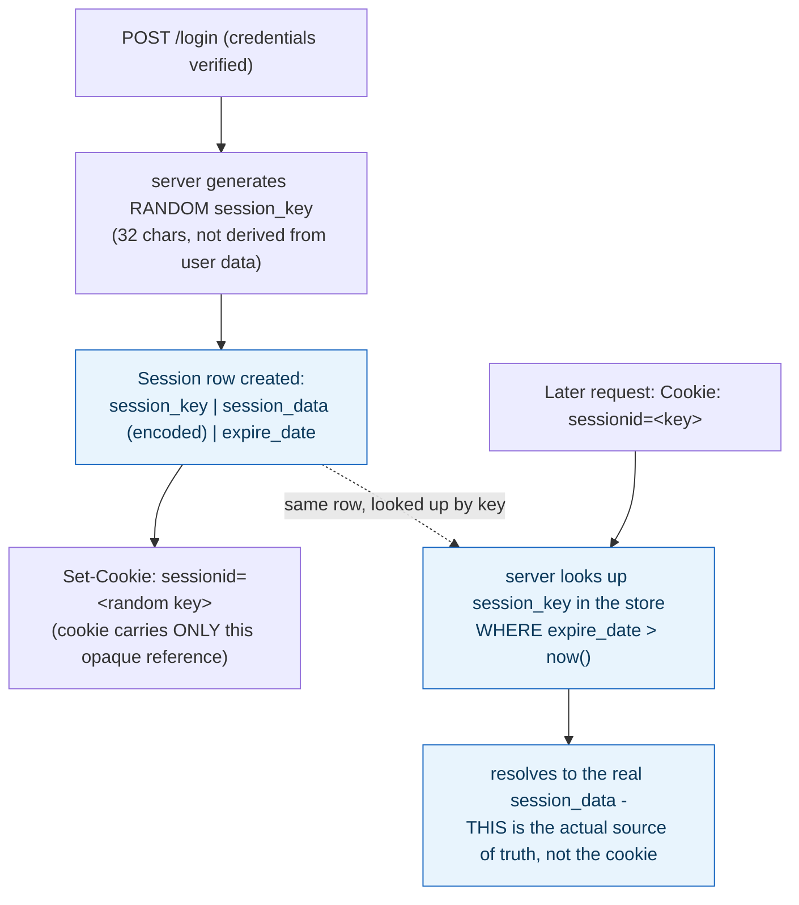
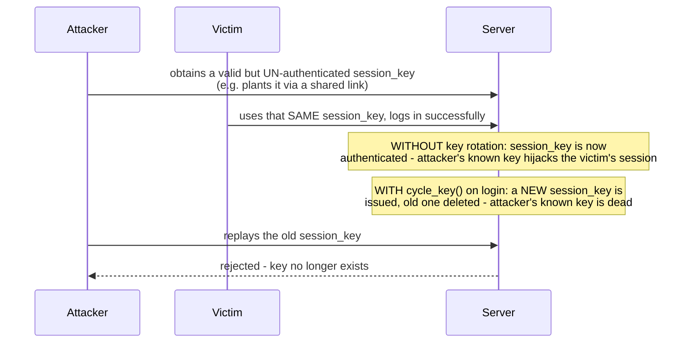

**TL;DR:** Where does "you're logged in" actually live — in the cookie, or on the server? The cookie carries only an opaque, randomly generated session key; the real identity and permissions live server-side, indexed by that key, so revoking a session is just deleting one row.

> **In plain English (30 sec):** Code you already write — Map, function, API call, just bigger.

**Real repo:** [`django/django`](https://github.com/django/django)

## 1. The Engineering Problem: HTTP forgets who you are between requests, and the client can't be trusted to remind it

HTTP is stateless — the request right after a successful login has no inherent memory of that login. The naive fix, putting identity directly into a cookie's value (`user=alice`), is trivially unsafe: nothing about a raw cookie's *content* is server-verified unless it's signed or encrypted, so a client can simply edit their own cookie and claim to be anyone. You need the server to be the sole authority on "who is this, and are they still allowed in" — without trusting anything the client sends except an opaque reference it can't forge into someone else's identity.

---

## 2. The Technical Solution: the cookie carries a random key, the real state lives server-side

**Session-based authentication**: on login, the server generates a random, unguessable key — not derived from or containing any user data — and stores the actual session state (identity, permissions) server-side, indexed by that key. Only the opaque key goes to the client, as a cookie. Every later request, the server looks the key up server-side to resolve identity; the cookie's value alone carries no meaningful information — it's a bearer reference to server state, not the state itself.



The mechanism-level payoff: **revoking a session means deleting one server-side row** — the cookie becomes worthless immediately, with zero client cooperation required. This is a real structural advantage session-based auth has over a purely self-contained token: a stateless credential that carries its own validity can't be revoked before its own expiry without the server maintaining *some* side state anyway (a denylist), which quietly reintroduces the exact server-side lookup session auth does openly.

The session key must also be rotated on privilege change (most importantly, login itself) — otherwise an attacker who knows a pre-authentication session ID can hijack the post-authentication session once the victim logs in using that same ID:



---

## 3. The clean example (concept in isolation)

```python
def login(request, user):
    request.session.cycle_key()      # rotate BEFORE storing the new identity
    request.session["user_id"] = user.id
    # cookie sent to client carries only the (now-rotated) opaque session key
```

---

## 4. Production reality (from `django/django`)

```python
# django/contrib/sessions/backends/base.py
def _get_new_session_key(self):
    "Return session key that isn't being used."
    while True:
        session_key = get_random_string(32, VALID_KEY_CHARS)   # random, NOT derived from user data
        if not self.exists(session_key):
            return session_key

def cycle_key(self):
    """
    Create a new session key, while retaining the current session data.
    """
    data = self._session
    key = self.session_key
    self.create()              # brand new random key
    self._session_cache = data  # carry the data forward
    if key:
        self.delete(key)        # OLD key is gone - dead the instant this runs
```

```python
# django/contrib/sessions/backends/db.py
def create_model_instance(self, data):
    return self.model(
        session_key=self._get_or_create_session_key(),
        session_data=self.encode(data),     # the REAL state, server-side only
        expire_date=self.get_expiry_date(),
    )

@classmethod
def clear_expired(cls):
    cls.get_model_class().objects.filter(expire_date__lt=timezone.now()).delete()
```

What this teaches that a hello-world can't:

- **`_get_new_session_key` generates a random 32-character string with a collision check (`self.exists(session_key)`) — it never derives the key from the username, timestamp, or any predictable input.** A session ID that could be *guessed* from other known facts about a user defeats the entire mechanism; randomness with a uniqueness check is what makes "possessing the cookie" the only way to prove session ownership.
- **`cycle_key()` is not automatically called on every request — it's a deliberate operation the application code must invoke, and Django's own login helper calls it specifically at login.** This is a real, non-obvious detail: session rotation isn't free infrastructure, it's a specific defensive action taken at the specific moment privilege changes (authentication succeeding), and forgetting to call it at that moment is exactly the session-fixation gap.
- **`clear_expired()` is a server-side authority independent of the cookie's own `Max-Age`.** A client's browser might keep sending an old cookie past when the server considers it expired (`expire_date__lt=timezone.now()`), and the server's lookup — not the cookie's client-side expiry hint — is what actually decides whether the session is still valid.

Known-stale fact: "session-based auth doesn't scale, use stateless JWTs instead" is a common but incomplete generalization. Server-side sessions have a real structural advantage a purely stateless token lacks: instant, unconditional revocation via one row delete. A production system reaching for JWTs to avoid session storage almost always ends up needing *some* server-side revocation mechanism anyway (a denylist, a short-lived-token-plus-refresh-token pattern) — the real tradeoff is where and how state is tracked, not whether stateless is unconditionally simpler or better.

---

## Source

- **Concept:** Session-based authentication (cookies + server-side session store)
- **Domain:** security
- **Repo:** [django/django](https://github.com/django/django) → [`django/contrib/sessions/backends/base.py`](https://github.com/django/django/blob/main/django/contrib/sessions/backends/base.py), [`django/contrib/sessions/backends/db.py`](https://github.com/django/django/blob/main/django/contrib/sessions/backends/db.py) — the reference session-auth implementation for one of the most widely deployed web frameworks.


