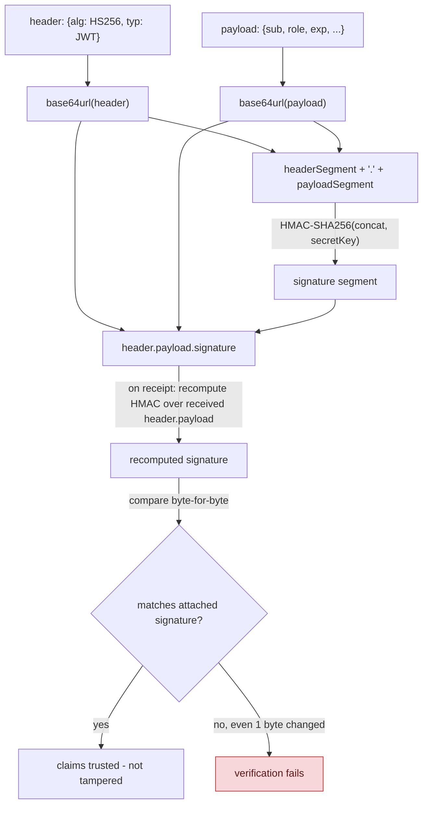
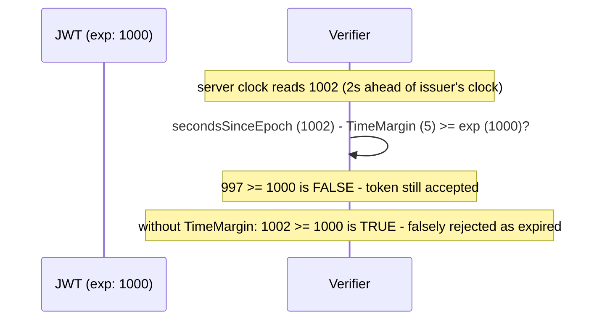

## 1. The Engineering Problem: a self-contained token is only safe if forging it is infeasible

Session-based auth (the previous lesson) works by never trusting anything the client holds — the cookie is an opaque reference, the real data lives server-side. A **token-based** approach flips that: the token itself carries the claims (user ID, role, expiry), so the server doesn't need a lookup on every request. That's the whole appeal — but a token anyone can read is a token anyone might *edit*, unless something makes tampering cryptographically detectable. Base64 is an encoding, not encryption; decoding a JWT's payload takes one line of code for anyone who intercepts it.

---

## 2. The Technical Solution: sign the header and payload together, verify by recomputing

A JWT is three base64url segments: `header.payload.signature`. The signature isn't computed over the payload alone — it's computed over the **entire `header.payload` string**, using a secret (HMAC) or private key (RSA/ECDSA) only the issuer holds. Verifying means recomputing that same signature from the received header+payload and comparing it byte-for-byte against the one attached to the token. Change even one character of the payload, and the recomputed signature won't match — the token fails verification, full stop.



Core truths: **the payload is readable by anyone, signed but not encrypted** — never put a secret value in a JWT payload expecting confidentiality, only integrity. And **the signature protects the header too, not just the payload** — this matters because the header is where the algorithm itself is declared, and an attacker controlling the header is exactly the scenario a verifier has to defend against (more on this below).

Expiration also needs care: comparing "now" to the token's `exp` claim sounds trivial, but real systems need to tolerate small clock differences between the issuing and verifying machines:



---

## 3. The clean example (concept in isolation)

```csharp
var header = new { alg = "HS256", typ = "JWT" };
var payload = new { sub = "user123", role = "customer", exp = 1735689600 };

var headerSegment = Base64UrlEncode(Json(header));
var payloadSegment = Base64UrlEncode(Json(payload));
var signature = HMACSHA256(headerSegment + "." + payloadSegment, secretKey);

var token = $"{headerSegment}.{payloadSegment}.{Base64UrlEncode(signature)}";

// Tamper: decode payload, change role to "admin", re-encode, DON'T re-sign
// -> recomputed signature at verification time won't match -> rejected
```

---

## 4. Production reality (from `jwt-dotnet/jwt`)

```csharp
// src/JWT/JwtEncoder.cs
public string Encode(IDictionary<string, object> extraHeaders, object payload, byte[] key)
{
    var header = extraHeaders is null ? new Dictionary<string, object>() : new Dictionary<string, object>(extraHeaders);
    header.Add("alg", algorithm.Name);   // the algorithm goes IN the signed header

    var headerBytes = GetBytes(_jsonSerializer.Serialize(header));
    var payloadBytes = GetBytes(_jsonSerializer.Serialize(payload));
    var headerSegment = _urlEncoder.Encode(headerBytes);
    var payloadSegment = _urlEncoder.Encode(payloadBytes);

    var stringToSign = headerSegment + "." + payloadSegment;   // BOTH signed together
    var bytesToSign = GetBytes(stringToSign);
    var signatureSegment = GetSignatureSegment(algorithm, key, bytesToSign);
    return stringToSign + "." + signatureSegment;
}
```

```csharp
// src/JWT/Algorithms/HMACSHA256Algorithm.cs
public sealed class HMACSHA256Algorithm : HMACSHAAlgorithm
{
    public override string Name => nameof(JwtAlgorithmName.HS256);
    public override HashAlgorithmName HashAlgorithmName => HashAlgorithmName.SHA256;
    protected override HMAC CreateAlgorithm(byte[] key) => new HMACSHA256(key);
}
```

```csharp
// src/JWT/JwtValidator.cs - expiration check with clock-skew tolerance
private Exception ValidateExpClaim(IReadOnlyPayloadDictionary payloadData, double secondsSinceEpoch)
{
    if (!payloadData.TryGetValue("exp", out var expObj)) return null;
    var expValue = Convert.ToDouble(expObj);

    if (secondsSinceEpoch - _valParams.TimeMargin >= expValue)
        return new TokenExpiredException("Token has expired.") { Expiration = UnixEpoch.Value.AddSeconds(expValue) };

    return null;
}
```

What this teaches that a hello-world can't:

- **`header.Add("alg", algorithm.Name)` puts the signing algorithm inside the SIGNED portion of the token** — the header isn't metadata bolted on afterward, it's part of what `stringToSign` covers. That's precisely why a verifier can't simply trust whatever `alg` a *received* token's header claims: an attacker crafting a malicious token controls that field too, before any signature check happens, since reading the header doesn't require verifying anything yet.
- **`CreateAlgorithm(byte[] key) => new HMACSHA256(key)` is a genuinely different cryptographic primitive from RSA/ECDSA signing**, despite both ending up as a "signature segment" in the token. HMAC is symmetric — the exact same key both signs and verifies, so anything holding that key can mint valid tokens, not just check them. A service using HMAC to *verify* tokens it didn't issue is trusting that shared secret was never exposed anywhere else — a materially different trust model than asymmetric signing, where the verifier only ever needs a public key.
- **`secondsSinceEpoch - TimeMargin >= expValue` is deliberately not a naive `now >= exp` comparison.** `TimeMargin` absorbs small clock differences between machines — real distributed systems don't have perfectly synchronized clocks, and without this tolerance, a token could be falsely rejected as expired seconds before its actual `exp`, purely due to clock drift between the issuer and verifier.

Known-stale fact: **algorithm-confusion attacks are a real, historical CVE class, not a theoretical concern** — because the algorithm is declared inside the token's own (attacker-editable) header, a verifier that blindly uses whatever `alg` the token claims, rather than pinning the algorithm it *expects* server-side, can be tricked. The best-known variant: a service expecting RSA-signed (RS256) tokens, if it naively re-uses whatever key material it has for "the algorithm the token says," can end up treating its own RSA *public* key (not secret at all) as an HMAC *secret* for an attacker-crafted HS256 token — since public keys are, by definition, public, anyone can then forge a validly-signed token. Modern verifiers close this by requiring the caller to explicitly state which algorithm(s) are acceptable, never trusting the token's own header to decide.

---

## Source

- **Concept:** Token-based authentication (JWT structure, signing, verification)
- **Domain:** security
- **Repo:** [jwt-dotnet/jwt](https://github.com/jwt-dotnet/jwt) → [`src/JWT/JwtEncoder.cs`](https://github.com/jwt-dotnet/jwt/blob/main/src/JWT/JwtEncoder.cs), [`src/JWT/Algorithms/HMACSHA256Algorithm.cs`](https://github.com/jwt-dotnet/jwt/blob/main/src/JWT/Algorithms/HMACSHA256Algorithm.cs), [`src/JWT/JwtValidator.cs`](https://github.com/jwt-dotnet/jwt/blob/main/src/JWT/JwtValidator.cs) — a widely-used, real .NET JWT library.
