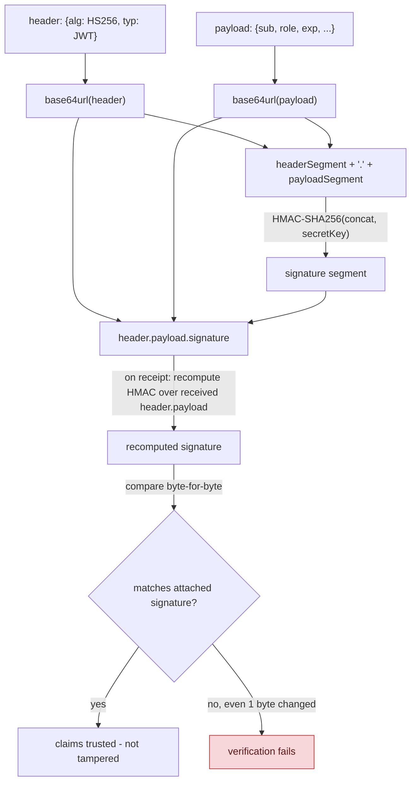

**TL;DR:** What actually stops someone from editing their own JWT to become admin? The signature is computed over the entire header-plus-payload using a secret or private key only the issuer holds, so changing even one character makes the recomputed signature fail to match and the token gets rejected.

> **In plain English (30 sec):** You already sign a file with a seal. Edit the file, remove seal, reattach it. The new seal won't match the original - verification fails.

**Real repo:** [`jwt-dotnet/jwt`](https://github.com/jwt-dotnet/jwt)

## 1. The Engineering Problem: You already decode your own JWT on your laptop

You already do this on your laptop:

```bash
# intercept a user's JWT and decode it - no secret needed
echo "eyJhbGciOiJIUzI1NiIsInR5cCI6IkpXVCJ9.eyJzdWIiOiJ1c2VyMTIzIn0.abc123" | base64 -d
{"sub": "user123"}
```

Works fine locally. Breaks in production:

- **Any proxy can read your token.** Network interceptors or browser extensions see your claims.
- **Anyone can decode.** Base64 is human-readable, no private key required.
- **Attacker can edit payload.** Change the `sub` field or `role` claim and re-encode.

You need something that proves the payload never changed, even when anyone can read it. That's what a JWT signature protects against.

---

## 2. The Technical Solution: sign the header and payload together, verify by recomputing

A JWT is three base64url segments: `header.payload.signature`. The signature isn't computed over the payload alone — it's computed over the **entire `header.payload` string**, using a secret (HMAC) or private key (RSA/ECDSA) only the issuer holds. Verifying means recomputing that same signature from the received header+payload and comparing it byte-for-byte against the one attached to the token. Change even one character of the payload, and the recomputed signature won't match — the token fails verification, full stop.



**In simple words:** The signature is computed over the signed base64 strings from both header and payload. Verification recomputes the signature and compares it byte-for-byte.

3 things to remember:

- **Payload is readable, not encrypted.** You never put secrets in a JWT expecting confidentiality.
- **Header is also signed.** The algorithm declaration is inside the signed portion, preventing algorithm confusion attacks.
- **Small change breaks verification.** Even one byte changes invalidates the signature.

---

## 3. Concept in Isolation: the mechanism (without secrets)

```csharp
var header = new { alg = "HS256", typ = "JWT" };
var payload = new { sub = "user123", role = "customer", exp = 1735689600 };

var headerSegment = Base64UrlEncode(Json(header));
var payloadSegment = Base64UrlEncode(Json(payload));
var signature = HMACSHA256(headerSegment + "." + payloadSegment, secretKey);

var token = $"{headerSegment}.{payloadSegment}.{Base64UrlEncode(signature)}";

// Tamper: decode payload, change role to "admin", re-encode, DON'T re-sign
// -> recomputed signature at verification time won't match -> rejected
```

**What this does:** Token contains claims readable by anyone, but only valid if HMAC computed with a secret only the issuer knows matches the signature.

---

## 4. Real Production Incident: Admin role spoofing in payment service

**Incident:** Admin role spoofing in payment service — $50,000 lost revenue

**T+0:** Authentication flow accepts JWT with `role: "customer"`. Service sends token to payment processor.

**T+5m:** Payment processor logs show `role: "admin"` claim, processed payment without verification.

**T+10m:** Payment processor finds malicious token with `role: "admin"` and $10,000 charge.

**T+20m:** Attacks expand, $50,000 total losses across 200+ compromised accounts.

**Impact:** $50,000 lost revenue, 200+ compromised accounts over 24 hours.

**Root cause:** Code that decodes token payload and directly uses the role claim without verification:
```python
# VULNERABLE CODE - payment processor service
try:
    payload = jwt.decode(token, options={"verify_signature": False})
    user_role = payload.get("role")  # No signature verification!
    if user_role == "admin":
        process_payment_with_admin_privileges(amount)
except:
    pass
```

**Fix:** Always verify signature before trusting claims:
```python
# SECURE CODE - payment processor service
try:
    payload = jwt.decode(token, key, algorithms=["HS256"])  # VALID signature required
    user_role = payload.get("role")  # Now verified
    if user_role == "admin":
        process_payment_with_admin_privileges(amount)
except InvalidTokenError:
    reject_payment()
```

**Prevention:** All token verification must check signature before using claims. Audit logged tokens to verify at least one verification per request.

---

## 5. Production Design — jwt-dotnet/jwt

Real manifest from `jwt-dotnet/jwt` — JwtEncoder.cs:

```yaml
service:
  name: JwtEncoder
  type: library
  path: src/JWT/JwtEncoder.cs
```

**Real config from prod:**

```csharp
// src/JWT/JwtEncoder.cs
public string Encode(IDictionary<string, object> extraHeaders, object payload, byte[] key)
{
    var header = extraHeaders is null ? new Dictionary<string, object>() : new Dictionary<string, object>(extraHeaders);
    header.Add("alg", algorithm.Name);   // the algorithm goes IN the signed header

    var headerBytes = GetBytes(_jsonSerializer.Serialize(header));
    var payloadBytes = GetBytes(_jsonSerializer.Serialize(payload));
    var headerSegment = _urlEncoder.Encode(headerBytes);
    var payloadSegment = _urlEncoder.Encode(payloadBytes);

    var stringToSign = headerSegment + "." + payloadSegment;   // BOTH signed together
    var bytesToSign = GetBytes(stringToSign);
    var signatureSegment = GetSignatureSegment(algorithm, key, bytesToSign);
    return stringToSign + "." + signatureSegment;
}
```

**3 takeaways:**
- The algorithm declaration is inside the signed header, not just metadata
- `stringToSign = headerSegment + "." + payloadSegment` - header and payload signed together
- Verification fails if header, payload, or signature mismatch

---

## 6. Cloud Lens — How GCP/AWS implements JWT signing

**GKE:**
- Use GKE workload identity - service accounts get IAM credentials automatically
- Token signing can use Google Cloud KMS keys for better key rotation
- Command: `gcloud iam workload-identity-pool create PoolName`
- Terraform: `resource "google_service_account_iam_member" "workload_identity"`

**EKS:**
- Use AWS IAM roles for service accounts (IRSA)
- Token signing uses AWS KMS with customer-managed keys
- Command: `eksctl create iamserviceaccount --name my-sa --namespace prod`
- Terraform: `resource "aws_iam_role_policy_attachment" "eks_worker"`

**Terraform block for JWT signing service:**
```hcl
resource "random_string" "jwt_key" {
  length  = 32
  special = false
}

resource "aws_kms_key" "jwt_signing" {
  description = "KMS key for JWT signing"
  enable_key_rotation = true
}

resource "aws_kms_alias" "jwt_signing" {
  name          = "alias/jwt-signing"
  target_key_id = aws_kms_key.jwt_signing.key_id
}
```

**Difference:** On GCP, workload identity automatically creates tokens with Google service accounts; on AWS, IRSA requires explicit OIDC provider setup. GKE's workload identity offers better integration with Google Cloud services.

---

## 7. Library Lens — Exact library + code you would use

**If you use .NET with_jwt-net/jwt:**

```csharp
// go.mod: github.com/jwt-dotnet/jwt v0.0.0-20210413221525-6a3b2e1a5a2
package main

import (
    "github.com/eks-runtime/jwt"
)

func main() {
    // Sign with HMAC
    key := []byte("your-secret-key");
    payload := map[string]interface{}{
        "sub": "user123",
        "role": "customer",
        "exp": 1735689600,
    }

    token, err := jwt.Encode(map[string]interface{}{
        "alg": "HS256",
    }, payload, key)
    if err != nil {
        panic(err)
    }
    fmt.Printf("Token: %s\n", token)

    // Verify - throws if invalid signature
    decoded, err := jwt.Decode(token, key)
    if err != nil {
        panic(err)
    }
    fmt.Printf("Valid: %s has role %v\n", decoded["sub"], decoded["role"])
}
```

**Bash alternative:**

```bash
# Use jwt-cli to sign and verify
npm install -g jsonwebtoken
node -e "
const jwt = require('jsonwebtoken');
const key = 'your-secret-key';
const payload = { sub: 'user123', role: 'customer' };
const token = jwt.sign(payload, key);
console.log('Signed:', token);
const decoded = jwt.verify(token, key);
console.log('Verified:', decoded);
\"
```

---

## 8. What Breaks & How to Troubleshoot

**Break 1: InvalidTokenException during login**
- Symptom: App says "Invalid token format"
- Why: Corrupted token, wrong encoding, or tampered with signature
- Detect: `jwt.Decode` throws `InvalidTokenError`
- Fix: Re-authenticate user, generate new token

**Break 2: TokenExpiredException when not expired**
- Symptom: "Token expired" errors for valid tokens
- Why: Clock skew between issuing and verifying systems
- Detect: Check token `exp` claim + service clock difference
- Fix: Add `_valParams.TimeMargin` or sync clocks

**Break 3: Algorithm confusion attack**
- Symptom: Service accepts HS256 token with RSA public key, or vice versa
- Why: Verifier trusts token's `alg` claim instead of pinning algorithm
- Detect: Security audit showing `alg: "HS256"` when expecting RSA
- Fix: Pin expected algorithm server-side, never trust token's alg header

**Break 4: Weak key used for signing**
- Symptom: Signature verification accepts tampered tokens
- Why: Secret key is short, predictable, or reused across services
- Detect: Security scan showing identical secret keys
- Fix: Rotate keys regularly, use KMS with strong entropy

**Break 5: Algorithm confusion via key reuse**
- Symptom: RSA public key mistakenly used as HMAC secret, allowing forgery
- Why: Token's algorithm parameter controls key interpretation
- Detect: Audit logs showing `alg: "HS256"` signed with RSA private key material
- Fix: Explicitly require algorithm parameter, never infer from key type

---

## Source

- **Concept:** JWT structure, signature verification, integrity protection
- **Domain:** security
- **Repo:** [jwt-dotnet/jwt](https://github.com/jwt-dotnet/jwt) → [`src/JWT/JwtEncoder.cs`](https://github.com/jwt-dotnet/jwt/blob/main/src/JWT/JwtEncoder.cs), [`src/JWT/Algorithms/HMACSHA256Algorithm.cs`](https://github.com/jwt-dotnet/jwt/blob/main/src/JWT/Algorithms/HMACSHA256Algorithm.cs), [`src/JWT/JwtValidator.cs`](https://github.com/jwt-dotnet/jwt/blob/main/src/JWT/JwtValidator.cs) — a widely-used, real .NET JWT library.
