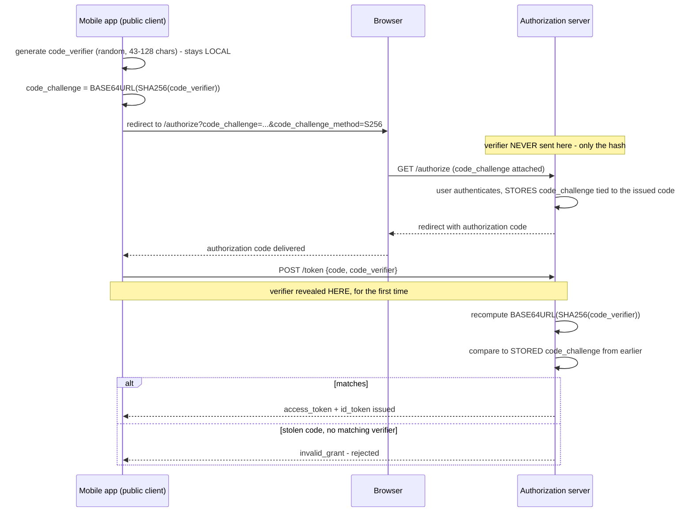

**TL;DR:** How does a mobile app prove it's the same client that started login, without a secret? PKCE has the client generate a random `code_verifier` locally, send only its hash (`code_challenge`) up front, then reveal the verifier at token exchange so the server can confirm it matches — a stolen authorization code alone is useless without the verifier that was never transmitted until then.

**Real repo:** [`ory/hydra`](https://github.com/ory/hydra)

## 1. The Engineering Problem: the authorization code flow assumes a secret the client can't actually keep

OAuth 2.0's authorization code flow was designed around a **confidential client** — a server-side backend that can hold a `client_secret` and use it to exchange an authorization code for tokens securely. A mobile app or single-page app is a **public client** — it can't keep a secret; anyone can decompile the app or read the SPA's JavaScript and extract anything embedded in it. Without a secret, what stops an attacker who intercepts the authorization code itself (a malicious app registering the same custom URL scheme, a compromised network, a leaky browser history) from redeeming that stolen code for tokens? The code alone doesn't prove "I'm the same client that started this flow."

---

## 2. The Technical Solution: PKCE — prove possession of a secret you generate yourself, never transmit until the very end

**PKCE (Proof Key for Code Exchange)**: the client generates a random, high-entropy `code_verifier` locally and computes `code_challenge = BASE64URL(SHA256(code_verifier))`. Only the *challenge* (the hash) goes out in the initial authorization request — the verifier never leaves the client at that point. When redeeming the authorization code for tokens later, the client must also send the original `code_verifier`; the server recomputes the hash and compares it against the challenge it stored earlier.



Core truths: **an attacker who steals the authorization code mid-flight doesn't have the code_verifier** — it was never transmitted anywhere until the final token exchange, which the legitimate client performs itself; and **SHA256 is one-way**, so even if the code_challenge leaked (it's sent in a URL, potentially logged), that alone doesn't let anyone derive the verifier needed to redeem a code. Possessing the code isn't enough anymore — proving you generated the verifier that hashes to the matching challenge is the actual proof of continuity between "who started this flow" and "who's redeeming it."

---

## 3. The clean example (concept in isolation)

```python
import secrets, hashlib, base64

# Step 1 (client, before redirecting to /authorize):
code_verifier = secrets.token_urlsafe(64)[:128]
code_challenge = base64.urlsafe_b64encode(
    hashlib.sha256(code_verifier.encode()).digest()
).decode().rstrip("=")
# send code_challenge in the /authorize request; code_verifier stays local

# Step 2 (server, at /token, after receiving the returned code + code_verifier):
recomputed = base64.urlsafe_b64encode(
    hashlib.sha256(received_code_verifier.encode()).digest()
).decode().rstrip("=")
assert recomputed == stored_code_challenge  # only issue tokens if this matches
```

---

## 4. Production reality (from `ory/hydra`'s vendored `fosite` OAuth2 library)

```go
// fosite/handler/pkce/handler.go - at the /authorize endpoint
func (c *Handler) HandleAuthorizeEndpointRequest(ctx context.Context, ar fosite.AuthorizeRequester, resp fosite.AuthorizeResponder) error {
    challenge := ar.GetRequestForm().Get("code_challenge")
    method := ar.GetRequestForm().Get("code_challenge_method")

    // ... validate challenge/method ...

    code := resp.GetCode()
    signature := c.Strategy.AuthorizeCodeStrategy().AuthorizeCodeSignature(ctx, code)
    // challenge is stored, TIED to this specific authorization code's signature
    return c.Storage.PKCERequestStorage().CreatePKCERequestSession(ctx, signature,
        ar.Sanitize([]string{"code_challenge", "code_challenge_method"}))
}
```

```go
// fosite/handler/pkce/handler.go - at the /token endpoint
func (c *Handler) HandleTokenEndpointRequest(ctx context.Context, request fosite.AccessRequester) error {
    verifier := request.GetRequestForm().Get("code_verifier")

    if nv := len(verifier); nv < 43 {
        return fosite.ErrInvalidGrant.WithHint("The PKCE code verifier must be at least 43 characters.")
    } else if nv > 128 {
        return fosite.ErrInvalidGrant.WithHint("The PKCE code verifier can not be longer than 128 characters.")
    }

    // BASE64URL-ENCODE(SHA256(ASCII(code_verifier))) == code_challenge
    switch method {
    case "S256":
        hash := sha256.New()
        hash.Write([]byte(verifier))
        if base64.RawURLEncoding.EncodeToString(hash.Sum([]byte{})) != challenge {
            return fosite.ErrInvalidGrant.WithHint("The PKCE code challenge did not match the code verifier.")
        }
    }
    return nil
}
```

What this teaches that a hello-world can't:

- **The verifier's length is validated to be 43-128 characters, not just "non-empty."** This isn't arbitrary — RFC 7636 specifies this range to guarantee enough entropy that guessing a valid verifier is computationally infeasible. A verifier that's too short would make the whole scheme brute-forceable; the real implementation enforces the spec's entropy floor explicitly rather than trusting clients to pick a "reasonably random" value.
- **`code_challenge` is stored server-side tied to the authorization code's own signature (`CreatePKCERequestSession(ctx, signature, ...)`), not just held in memory during a single request.** The authorization step and the token-exchange step are genuinely separate HTTP requests, potentially seconds or minutes apart — the server has to persist the challenge somewhere retrievable specifically by the code that was issued alongside it.
- **The `plain` method (`code_verifier == code_challenge`, no hashing) still exists in the code and the spec, gated behind an explicit `EnablePKCEPlainChallengeMethod` config flag** — Ory Hydra requires operators to deliberately opt into the weaker method rather than defaulting to it. `plain` offers far less protection (the "challenge" observable in the authorize request IS the verifier, with no one-way transformation), which is exactly why a real production server treats it as an opt-in exception, not the default.

Known-stale fact: PKCE is often taught as "for public/mobile clients only" — that reflects its original design intent, but current OAuth 2.0 Security Best Current Practice guidance recommends PKCE for **all** clients, confidential or not, as defense-in-depth against authorization code interception regardless of client type. Treating PKCE as something only mobile apps need is outdated; modern OAuth2/OIDC server configs (Ory Hydra's `EnforcePKCE` among them) increasingly make it mandatory across the board.

---

## Source

- **Concept:** OAuth 2.0 authorization code flow (with PKCE)
- **Domain:** security
- **Repo:** [ory/hydra](https://github.com/ory/hydra) → [`fosite/handler/pkce/handler.go`](https://github.com/ory/hydra/blob/master/fosite/handler/pkce/handler.go) — Ory's real, production OAuth2/OIDC server and its vendored `fosite` library.
