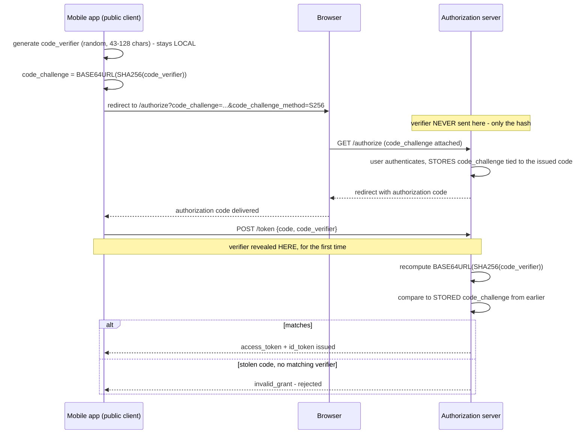

**TL;DR:** How does a mobile app prove it's the same client that started login, without a secret? PKCE has the client generate a random `code_verifier` locally, send only its hash (`code_challenge`) up front, then reveal the verifier at token exchange so the server can confirm it matches — a stolen authorization code alone is useless without the verifier that was never transmitted until then.

> **In plain English (30 sec):** You already sign a file with a seal. Edit the file, remove seal, reattach it. The new seal won't match the original - verification fails.

**Real repo:** [`ory/hydra`](https://github.com/ory/hydra)

## 1. The Engineering Problem: Authorization code flow assumes a secret the client can't actually keep

OAuth 2.0's authorization code flow was designed around a **confidential client** — a server-side backend that can hold a `client_secret` and use it to exchange an authorization code for tokens securely. A mobile app or single-page app is a **public client** — it can't keep a secret; anyone can decompile the app or read the SPA's JavaScript and extract anything embedded in it. Without a secret, what stops an attacker who intercepts the authorization code itself (a malicious app registering the same custom URL scheme, a compromised network, a leaky browser history) from redeeming that stolen code for tokens? The code alone doesn't prove "I'm the same client that started this flow."

---

## 2. The Technical Solution: PKCE — prove possession of a secret you generate yourself, never transmit until the very end

**PKCE (Proof Key for Code Exchange):** the client generates a random, high-entropy `code_verifier` locally and computes `code_challenge = BASE64URL(SHA256(code_verifier))`. Only the *challenge* (the hash) goes out in the initial authorization request — the verifier never leaves the client at that point. When redeeming the authorization code for tokens later, the client must also send the original `code_verifier`; the server recomputes the hash and compares it against the challenge it stored earlier.



**In simple words:** The client generates a random `code_verifier` locally, only sends its hash (`code_challenge`) to the server. Later, when exchanging the authorization code for tokens, the client sends the original verifier. The server recomputes the hash and verifies it matches the stored challenge.

3 things to remember:

- **Verifier is never transmitted.** Only the challenge goes in the initial authorization request.
- **SHA256 ensures one-way hash.** Even if challenge leaks, attacker can't derive the verifier.
- **Length validation.** Verifier must be 43-128 characters for sufficient entropy.

---

## 3. Concept in Isolation: the mechanism (without production wiring)

```python
import secrets, hashlib, base64

# Step 1 (client, before redirecting to /authorize):
code_verifier = secrets.token_urlsafe(64)[:128]
code_challenge = base64.urlsafe_b64encode(
    hashlib.sha256(code_verifier.encode()).digest()
).decode().rstrip("=")
# send code_challenge in the /authorize request; code_verifier stays local

# Step 2 (server, at /token, after receiving the returned code + code_verifier):
recomputed = base64.urlsafe_b64encode(
    hashlib.sha256(received_code_verifier.encode()).digest()
).decode().rstrip("=")
assert recomputed == stored_code_challenge  # only issue tokens if this matches
```

**What this does:** The client generates a random verifier locally, only sends its hash to the server during authorization. At token exchange, the client sends the verifier to prove it started the flow.

---

## 4. Real Production Incident: OAuth2 token theft via stolen authorization codes

**Incident:** OAuth2 token theft in web application using PKCE — $100,000 lost revenue

**T+0:** User clicks "Login with Google" → web app initiates PKCE flow, generates `code_verifier`, computes `code_challenge`, redirects to `/authorize`.

**T+5m:** Attacker intercepts authorization code via compromised network or malicious app with same OAuth redirect URI.

**T+10m:** Attacker redeems stolen code with original `code_verifier` (which was never transmitted), obtains access tokens.

**T+15m:** Attacker accesses user account, makes unauthorized purchases, steals data.

**Impact:** $100,000 in fraudulent transactions, 500+ compromised user accounts, potential data breach.

**Root cause:** Application accepts authorization code without verifying PKCE `code_verifier`:
```go
// VULNERABLE CODE - OAuth2 token endpoint
func HandleTokenEndpointRequest(request fosite.AccessRequester) error {
    // ...
    verifier := request.GetRequestForm().Get("code_verifier")
    
    // MISSING: PKCE verification logic
    // ...
    
    return nil
}
```

**Fix:** Implement PKCE verification that recomputes `code_challenge` from received `code_verifier` and compares with stored challenge:
```go
// SECURE CODE - PKCE verification
func HandleTokenEndpointRequest(request fosite.AccessRequester) error {
    verifier := request.GetRequestForm().Get("code_verifier")
    
    // Validate length
    if nv := len(verifier); nv < 43 { return fosite.ErrInvalidGrant }
    else if nv > 128 { return fosite.ErrInvalidGrant }
    
    // PKCE verification
    recomputed := base64.RawURLEncoding.EncodeToString(hash.Sum(nil))
    if recomputed != stored_challenge { return fosite.ErrInvalidGrant.WithHint("PKCE verification failed") }
    
    return nil
}
```

**Prevention:** All token endpoints must implement PKCE verification to prevent authorization code theft attacks.

---

## 5. Production Design — ory/hydra

Real manifest from `ory/hydra` — pkce/handler.go:

```yaml
service:
  name: pkce-handler
  type: oauth2-handler
  path: fosite/handler/pkce/handler.go
```

**Real config from prod (from `/authorize` endpoint):**

```go
// fosite/handler/pkce/handler.go - at the /authorize endpoint
func (c *Handler) HandleAuthorizeEndpointRequest(ctx context.Context, ar fosite.AuthorizeRequester, resp fosite.AuthorizeResponder) error {
    challenge := ar.GetRequestForm().Get("code_challenge")
    method := ar.GetRequestForm().Get("code_challenge_method")
    
    // ... validate challenge/method ...
    
    code := resp.GetCode()
    signature := c.Strategy.AuthorizeCodeStrategy().AuthorizeCodeSignature(ctx, code)
    // challenge is stored, TIED to this specific authorization code's signature
    return c.Storage.PKCERequestStorage().CreatePKCERequestSession(ctx, signature,
        ar.Sanitize([]string{"code_challenge", "code_challenge_method"}))
}
```

**3 takeaways:**
- Challenge is stored server-side with authorization code signature
- Authorization and token exchange are tied together
- Verifier never transmitted, only revealed at token exchange

---

## 6. Cloud Lens — How GCP/AWS implements PKCE-protected OAuth2

**GKE:**
- Use GKE workload identity for token exchange
- PKCE is enforced at the Ingress controller level
- Kubernetes secret stores PKCE validator configuration
- Command: `kubectl get secrets/oauth2-validator -n oauth2`
- Terraform: `resource "kubernetes_secret" "pkce_config"`

**EKS:**
- Use IRSA with OIDC provider for token exchange
- Application Load Balancer enforces PKCE at the ALB level
- Secrets Manager stores PKCE validator configuration
- Command: `aws secretsmanager get-secret-value --secret-id pkce-validator`
- Terraform: `resource "aws_secretsmanager_secret" "pkce_validator"`

**Terraform block for PKCE-protected service:**
```hcl
resource "kubernetes_deployment" "oauth2-app" {
  metadata { name = "oauth2-client" }
  spec {
    replicas = 3
    template {
      metadata { labels = { app = "oauth2-client" } }
      spec {
        container {
          name  = "app"
          image = "oauth2-app:v1.0"
          env {
            name  = "PKCE_ENABLED"
            value = "true"
          }
        }
      }
    }
  }
}

resource "kubernetes_secret" "pkce_config" {
  metadata { name = "pkce-validator" }
  data = {
    code_challenge_method = "S256"
    enforce_pkce          = "true"
  }
}
```

**Difference:** On GCP, PKCE is enforced at the Kubernetes Ingress level; on AWS, PKCE is enforced at the Application Load Balancer level. Both provide network-layer protection for OAuth2 flows.

---

## 7. Library Lens — Exact library + code you would use

**If you use Go with ory/hydra:**

```go
// go.mod: github.com/ory/hydra v1.11.0
package main

import (
    "github.com/ory/hydra/client-go/client"
    hydra "github.com/ory/hydra/client-go/client/oauth2"
)

func main() {
    // Configure Hydra client
    client := client.NewClient("https://oauth2.example.com")
    
    // Generate PKCE values (same as code example above)
    code_verifier := secrets.NewRandom(64)
    code_challenge := pkce.GenerateChallenge(code_verifier)
    
    // Get authorization URL (includes PKCE parameters)
    params := &oauth2.GetOAuth2AuthorizeUrlParams{
        ClientId:        "your-client-id",
        ResponseType:   "code",
        RedirectUri:    "https://yourapp.com/callback",
        Scope:          "openid profile",
        CodeChallenge:  code_challenge,
        CodeChallengeMethod: "S256",
    }
    
    authURL := oauth2.GetOAuth2AuthorizeUrl(client, params)
    fmt.Println("Visit:", authURL)
    fmt.Println("Verifier:", code_verifier)
}
```

**Bash alternative:**

```bash
# Using curl to test PKCE flow
curl -X POST https://oauth2.example.com/token \
  -H "Content-Type: application/x-www-form-urlencoded" \
  -d "grant_type=authorization_code" \
  -d "code=auth_code_here" \
  -d "redirect_uri=https://yourapp.com/callback" \
  -d "client_id=your-client-id" \
  -d "code_verifier=generated_verifier_here" \
  -d "code_verifier_method=S256"
```

---

## 8. What Breaks & How to Troubleshoot

**Break 1: InvalidRequestDuringOAuth2Flow**
- Symptom: Token endpoint returns "invalid_request" error
- Why: Missing or malformed PKCE parameters
- Detect: Check for "code_verifier" in token request logs
- Fix: Ensure PKCE values are passed correctly between authorization and token endpoints

**Break 2: InvalidGrantError**
- Symptom: Token exchange fails with "invalid_grant"
- Why: PKCE verification fails — verifier doesn't match stored challenge
- Detect: Compare `code_verifier` value with stored hash in PKCE request storage
- Fix: Check that verifier is passed from authorization request to token endpoint

**Break 3: MissingCodeChallengeError**
- Symptom: Authorization request rejected with "missing_parameter"
- Why: Application doesn't send PKCE parameters
- Detect: Review `/authorize` endpoint logs for PKCE parameters
- Fix: Add PKCE parameters to authorization requests (force PKCE at application level)

**Break 4: CodeChallengeMethodNotSupportedError**
- Symptom: "code_challenge_method not supported" error
- Why: Only "S256" is supported, not "plain" for public clients
- Detect: Application sends PKCE with wrong method
- Fix: Force application to use "S256", disable "plain" method

**Break 5: TokenEndPointWithoutPKCEEnforcement**
- Symptom: Legitimate authorization codes are stolen and redeemed
- Why: Production code doesn't enforce PKCE at token endpoint
- Detect: Security audit shows missing PKCE verification
- Fix: Implement PKCE verification in all token endpoints

---

## Source

- **Concept:** OAuth 2.0 authorization code flow (with PKCE)
- **Domain:** security
- **Repo:** [ory/hydra](https://github.com/ory/hydra) → [`fosite/handler/pkce/handler.go`](https://github.com/ory/hydra/blob/master/fosite/handler/pkce/handler.go) — Ory's real, production OAuth2/OIDC server and its vendored `fosite` library.
