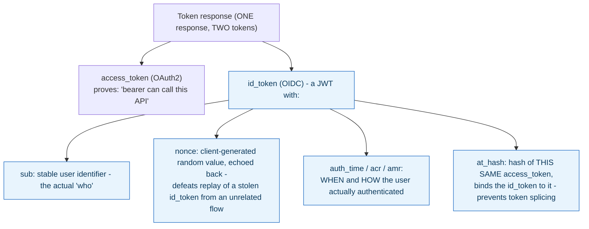

**TL;DR:** What does OAuth2 not tell you about a user that OpenID Connect does? OIDC adds a separate ID token alongside the access token with standardized claims about the authentication event itself — who (`sub`), when and how (`auth_time`/`acr`/`amr`) — plus `at_hash` and `nonce` to bind it to the access token and defeat replay.

**Real repo:** [`ory/hydra`](https://github.com/ory/hydra)

## 1. The Engineering Problem: an access token proves access, not identity

An OAuth2 access token proves "this bearer can call this API" — it says nothing verified about *who* authenticated, *when*, or *how strongly*. A well-known anti-pattern is using a raw OAuth2 access token to "log a user in": an app that does this has no standardized claims about the user at all, just a token that happens to work against some resource server, potentially issued for a completely unrelated purpose than establishing a login session. OAuth2 was designed as an *authorization* framework — delegated access to a resource — not an authentication protocol, and treating it as one leaves real gaps: no reliable user identifier, no record of how recently or how strongly the user actually authenticated, no defense against splicing tokens from different flows together.

---

## 2. The Technical Solution: OpenID Connect adds a dedicated ID token, alongside the access token, with a standardized identity claim set

OIDC issues an **ID token** — a JWT with claims specifically about the authentication event — in the *same* response as the OAuth2 access token, not instead of it. Each claim has a specific, real job:



Two mechanisms worth naming precisely:

- **`at_hash` cryptographically ties the ID token to the specific access token issued alongside it.** It's computed from the access token's own bytes (a hash, truncated per the OIDC spec) and embedded in the ID token. A verifier that checks `at_hash` against the access token it actually received can detect an attacker splicing together a genuine ID token from one flow with a different access token from another — without this binding, "here's an ID token, and separately, here's an access token" is two independently-forgeable claims, not one coherent proof.
- **`nonce` is generated by the *client*, sent in the original authorization request, and must be echoed back unchanged inside the ID token.** This defeats replay: an attacker who captures a valid ID token from one authentication attempt can't reuse it to satisfy a *different* client session, because that session generated its own, different nonce and will reject an ID token that doesn't echo it back.

---

## 3. The clean example (concept in isolation)

```json
// id_token payload (decoded) - alongside a separate access_token in the same response
{
  "iss": "https://auth.example.com",
  "sub": "a1b2c3-user-id",        // stable identifier - THIS is "who"
  "aud": ["my-client-id"],
  "nonce": "xK9f...client-generated, echoed back",
  "auth_time": 1735689000,          // WHEN the user actually authenticated
  "acr": "urn:mfa",                  // HOW strongly (e.g. MFA was used)
  "amr": ["pwd", "otp"],              // WHICH methods specifically
  "at_hash": "MTIzNDU2..."            // binds this id_token to ONE specific access_token
}
```

---

## 4. Production reality (from `ory/hydra`'s vendored `fosite` library)

```go
// fosite/token/jwt/claims_id_token.go
type IDTokenClaims struct {
    JTI                                 string
    Issuer                              string
    Subject                             string
    Audience                            []string
    Nonce                               string
    ExpiresAt                           time.Time
    IssuedAt                            time.Time
    AuthTime                            time.Time
    AccessTokenHash                     string   // at_hash
    AuthenticationContextClassReference string   // acr
    AuthenticationMethodsReferences     []string // amr
    CodeHash                            string   // c_hash
    Extra                               map[string]interface{}
}
```

```go
// ToMap - note which claims are OMITTED when empty, not just zero-valued
func (c *IDTokenClaims) ToMap() map[string]interface{} {
    var ret = Copy(c.Extra)

    if len(c.Nonce) > 0 {
        ret["nonce"] = c.Nonce
    } else {
        delete(ret, "nonce")   // absent nonce is OMITTED, not sent as empty string
    }

    if len(c.AccessTokenHash) > 0 {
        ret["at_hash"] = c.AccessTokenHash
    } else {
        delete(ret, "at_hash")
    }

    if !c.AuthTime.IsZero() {
        ret["auth_time"] = c.AuthTime.Unix()
    } else {
        delete(ret, "auth_time")
    }

    if len(c.AuthenticationContextClassReference) > 0 {
        ret["acr"] = c.AuthenticationContextClassReference
    } else {
        delete(ret, "acr")
    }
    // ...
}
```

What this teaches that a hello-world can't:

- **`ToMap()` explicitly `delete`s a claim rather than serializing it as an empty string or zero value when it wasn't set.** This matters because OIDC relying parties are expected to check claim *presence*, not just content — a client validating `nonce` needs to distinguish "no nonce was requested for this flow" from "a nonce was requested and came back empty," which is a real forgery-adjacent distinction a sloppier implementation (always serializing every field) would blur.
- **`AuthenticationMethodsReferences` (`amr`) is a `[]string`, not a single value** — a real authentication event can involve multiple methods (`["pwd", "otp"]` for password-plus-TOTP), and a relying party doing step-up authentication decisions (e.g., "require MFA for this sensitive action") needs to inspect the actual list, not assume a single method was used.
- **`Extra` exists as a generic escape hatch (`Add`/`Get` methods) alongside the strongly-typed standard claims.** This is a real, common OIDC implementation pattern: the spec defines a fixed core claim set, but issuers routinely need to attach custom claims (tenant ID, internal role names) without needing a schema change to the ID token struct itself — `Extra` is copied into the map first, then the standard claims are layered on top, letting custom and standard claims coexist in one token.

Known-stale fact: using a bare OAuth2 access token as proof of login (skipping the ID token entirely) remains a documented, real anti-pattern — access tokens are opaque-by-design from the client's perspective in the general OAuth2 spec (their format isn't standardized) and were never meant to carry verified identity claims a relying party can trust. If a system is checking "is this a valid access token" to decide whether someone is logged in, it's reasoning about authorization state as if it were authentication state — exactly the gap OIDC's ID token exists to close.

---

## Source

- **Concept:** OpenID Connect (identity layer on OAuth2)
- **Domain:** security
- **Repo:** [ory/hydra](https://github.com/ory/hydra) → [`fosite/token/jwt/claims_id_token.go`](https://github.com/ory/hydra/blob/master/fosite/token/jwt/claims_id_token.go) — Ory's real, production OAuth2/OIDC server.
