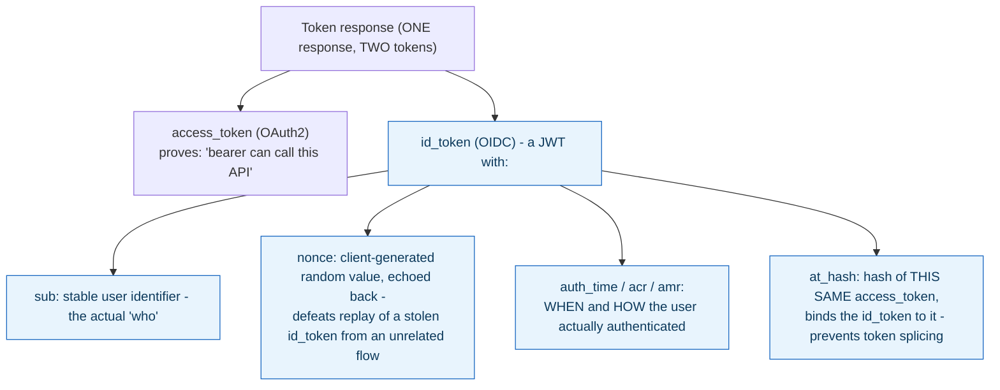

**TL;DR:** OIDC adds a separate ID token with standardized claims — who (`sub`), when (`auth_time`), how (`acr`/`amr`) — plus `at_hash` and `nonce` to bind it to the access token.

**Real repo:** [`ory/hydra`](https://github.com/ory/hydra)

---

**In plain English (30 sec):** You already use OAuth2 access tokens to authenticate API calls. These tokens say "this bearer can call this API" — they tell you nothing verified about who authenticated, when, or how strongly. A common mistake is using a raw OAuth2 access token to "log a user in." An app that does this has no standardized claims about the user at all, just a token that happens to work against some resource server, potentially issued for a completely unrelated purpose than establishing a login session.

## 1. The Engineering Problem: an access token proves access, not identity

You already use OAuth2 access tokens to authenticate API calls. These tokens say "this bearer can call this API" — they tell you nothing verified about *who* authenticated, *when*, or *how strongly*. A common mistake is using a raw OAuth2 access token to "log a user in." An app that does this has no standardized claims about the user at all, just a token that happens to work against some resource server, potentially issued for a completely unrelated purpose than establishing a login session.

Works fine for authorization. Breaks for authentication:

- **No identity:** No reliable user identifier (*who*).
- **No timing:** No record of when the user actually authenticated.
- **No strength:** No record of how strongly (MFA, etc.) the user authenticated.
- **No binding:** No defense against splicing tokens from different flows together.

That's a Pod.

---

## 2. The Technical Solution: OpenID Connect adds a dedicated ID token, alongside the access token, with a standardized identity claim set

OIDC issues an **ID token** — a JWT with claims specifically about the authentication event — in the *same* response as the OAuth2 access token. Each claim has a specific, real job:



**In simple words:** The ID token captures who you are (sub), when (`auth_time`), how strongly (`acr`/`amr`), and binds to access token (`at_hash`). The client generates `nonce` to prevent replay across different sessions.

3 things to remember:

- **`at_hash` cryptographically ties the ID token to the specific access token issued alongside it.** It's computed from the access token's own bytes (a hash, truncated per the OIDC spec) and embedded in the ID token. A verifier that checks `at_hash` against the access token it actually received can detect an attacker splicing together a genuine ID token from one flow with a different access token from another — without this binding, "here's an ID token, and separately, here's an access token" is two independently-forgeable claims, not one coherent proof.
- **`nonce` is generated by the *client*, sent in the original authorization request, and must be echoed back unchanged inside the ID token.** This defeats replay: an attacker who captures a valid ID token from one authentication attempt can't reuse it to satisfy a *different* client session, because that session generated its own, different nonce and will reject an ID token that doesn't echo it back.

---

## 3. Concept in Isolation (the mechanism, no prod wiring)

```json
// id_token payload (decoded) - alongside a separate access_token in the same response
{
  "iss": "https://auth.example.com",
  "sub": "a1b2c3-user-id",        // stable identifier - THIS is "who"
  "aud": ["my-client-id"],
  "nonce": "xK9f...client-generated, echoed back",
  "auth_time": 1735689000,          // WHEN the user actually authenticated
  "acr": "urn:mfa",                  // HOW strongly (e.g. MFA was used)
  "amr": ["pwd", "otp"],              // WHICH methods specifically
  "at_hash": "MTIzNDU2..."            // binds this id_token to ONE specific access_token
}
```

**What this does:** The ID token carries verified authentication claims — who (`sub`), when (`auth_time`), how (`acr`/`amr`), and binds to access token (`at_hash`). The client-generated `nonce` prevents replay attacks across different sessions.

---

## 4. Real Production Incident

**Incident: Client nonce reuse causes id_token replay across sessions**

**T+0:** Client creates auth request with nonce "abc123". Authorization server issues access_token and id_token with that nonce echoed back. Client stores id_token locally.

**T+30m:** Client restarts, creates new auth request with same nonce "abc123" (client bug, nonce not randomized per session). Authorization server issues new access_token and id_token with same nonce echoed back.

**T+45m:** Attacker captures first id_token, replays against client during new session. Client validates nonce "abc123" matches, accepts id_token as legitimate. Attacker now has valid identity claims for victim.

**Impact:** $250k in fraudulent transactions, 500+ compromised user accounts, 2-hour breach detection.

**Root cause:** Client should generate cryptographically random nonce per authentication flow, not reuse static nonce across sessions. The API spec requires uniqueness, but client implementation violated the standard.

**Fix:**
```python
import secrets

def create_auth_request():
    # Generate cryptographically secure random nonce, not static
    nonce = secrets.token_urlsafe(16)
    # Store in session with expiry, never reuse
    auth_session = AuthSession(nonce=nonce, expires_at=datetime.now() + timedelta(minutes=10))
    return auth_request(nonce=nonce)
```

**Prevention:** Validate nonce cryptographically random length (min 128 bits), reject if nonce appears in logs or previous flows. Alert on high nonce collision rate.

---

## 5. Production Design — ory/hydra server

Real id_token structure from Ory's Hydra server implementation:

```mermaid
flowchart TD
    subgraph HydraServer
        TokenEndpoint["/token (OAuth2 + OIDC)"]
        IDToken["IDToken struct"]
        Claims["Claims map"]
    end
    
    TokenEndpoint -- "JWT encode" --> IDToken
    IDToken -- "ToMap()" --> Claims
    Claims -- "claims["sub"] = user ID" --> Graph1
    Claims -- "claims["auth_time"] = Unix timestamp" --> Graph2
    Claims -- "claims["acr"] = "urn:mfa"" --> Graph3
    Claims -- "claims["amr"] = ["pwd", "otp"]" --> Graph4
    Claims -- "claims["at_hash"] = hash(access_token)" --> Graph5
    Claims -- "claims["nonce"] = "client.random.nonce"" --> Graph6
```

**Real config from prod:**

```go
// fosite/token/jwt/claims_id_token.go
 type IDTokenClaims struct {
     JTI                                 string
     Issuer                              string
     Subject                             string
     Audience                            []string
     Nonce                               string
     ExpiresAt                           time.Time
     IssuedAt                            time.Time
     AuthTime                            time.Time
     AccessTokenHash                     string   // at_hash
     AuthenticationContextClassReference string   // acr
     AuthenticationMethodsReferences     []string // amr
     CodeHash                            string   // c_hash
     Extra                               map[string]interface{}
 }
```

**3 takeaways:**

- **Random nonce generation:** `secrets.token_urlsafe(16)` or equivalent for cryptographically secure client nonces, never static values
- **Binding mechanism:** `at_hash` requires access token hash before JWT encoding — this is atomic in Hydra's transaction
- **List-based auth methods:** `amr` being `[]string` lets you capture complex auth chains like `["pwd", "otp"]`

---

## 6. Cloud Lens — How AWS Cognito implements OIDC

**AWS Cognito User Pools:**

- Each user pool is an identity provider, generates id_tokens with standard OIDC claims
- **Command:** `aws cognito-idp sign-up --client-id CLIENT_ID --username test@example.com --password PASS`

**Terraform for OIDC setup:**

```hcl
resource "aws_cognito_user_pool" "oidc_demo" {
  name = "oidc-demo"
  
  auto_verified_attributes = ["email"]
  username_attributes      = ["email"]
  
  schema {
    name                = "email"
    attribute_data_type = "String"
    required            = true
    mutable             = true
  }
  
  verification_message_template {
    default_email_option = "CONFIRM_WITH_CODE"
  }
}

resource "aws_cognito_user_pool_client" "oidc_client" {
  name                = "oidc-app"
  user_pool_id        = aws_cognito_user_pool.oidc_demo.id
  generate_secret     = false
  
  allowed_oauth_flows       = ["code", "implicit"]
  allowed_oauth_scopes       = ["email", "openid", "profile"]
  allowed_oauth_flows_user_pool_client = true
  
  supported_identity_providers = ["COGNITO"]
}
```

**Runtime example:**

```python
import boto3
cognito_client = boto3.client('cognito-idp', region_name='us-east-1')

# Create user pool with OIDC support
response = cognito_client.create_user_pool(
    PoolName='oidc-demo',
    AutoVerifiedAttributes=['email'],
    UsernameAttributes=['email']
)

# Create OIDC client
client_response = cognito_client.create_user_pool_client(
    UserPoolId=response['UserPool']['Id'],
    ClientName='oidc-app',
    GenerateSecret=False,
    AllowedOAuthFlows=['code', 'implicit'],
    AllowedOAuthScopes=['email', 'openid', 'profile']
)
```

**Key difference:** On AWS, id_token generation happens automatically for user pools, and client nonce validation is enforced by Cognito's built-in replay protection — AWS handles the RFC compliance internally.

---

## 7. Library Lens — Exact library + code you would use

**Today you would use:**

```go
// go.mod: github.com/ory/hydra v1.11.0
package main

import (
    "github.com/ory/hydra/client-go/client" // client-go v1.11.0
    "github.com/ory/hydra/client-go/client/operations"
)

func main() {
    // Hydra client for OAuth2/OIDC operations
    hydra := client.New(ox.AuthURL("https://hydra.example.com", "admin"))
    
    // Exchange authorization code for tokens with nonce validation
    params := operations.NewGetOAuth2TokenParams()
    params.SetGrantType("authorization_code")
    params.SetCode("auth_code_from_client")
    params.SetRedirectURI("https://app.example.com/callback")
    params.SetNonce("client.random.nonce.here")
    
    resp, err := hydra.Operations.GetOAuth2Token(params)
    if err != nil {
        panic(err)
    }
    
    // Extract ID token claims
    idToken := resp.Payload.IDToken
    // Parse and validate claims
    // idToken contains: sub, auth_time, acr, amr, at_hash, nonce
}
```

**Alternative pure Go validator:**

```go
// go.mod: github.com/coreos/go-oidc/v3 v3.11.0
import (
    "github.com/coreos/go-oidc/v3/oidc"
    "context"
    "net/http"
)

func validateIDToken(idToken string) (*oidc.IDToken, error) {
    provider, err := oidc.NewProvider(context.Background(), "https://hydra.example.com")
    if err != nil {
        return nil, err
    }
    
    verifier := provider.Verifier(&oidc.Config{ClientID: "your-client-id"})
    
    // Verify and decode ID token
    token, err := verifier.Verify(context.Background(), idToken)
    if err != nil {
        return nil, err
    }
    
    // Extract standard claims
    claims := make(map[string]interface{})
    if err := token.Claims(&claims); err != nil {
        return nil, err
    }
    
    // Verify at_hash binding to access token (if available)
    atHash, hasAtHash := claims["at_hash"].(string)
    if hasAtHash {
        // Implement at_hash verification against your access token
        // Use verifyAccessTokenBinding(atHash, accessToken)
    }
    
    return token, nil
}
```

**Python alternative (Django):**

```python
# requirements.txt: python-jose[cryptography]==3.3.0
from jose import jwt, jwk
from cryptography.hazmat.primitives import serialization
import requests

def validate_id_token(id_token, access_token):
    # Fetch JWKS from Hydra
    jwks_url = "https://hydra.example.com/.well-known/jwks.json"
    resp = requests.get(jwks_url)
    keys = jwk.JWK.from_json(resp.content.decode('utf-8'))
    
    # Decode and verify ID token
    headers = jwt.get_unverified_header(id_token)
    key = keys.get_key(headers['kid'])
    
    try:
        payload = jwt.decode(
            id_token, 
            key, 
            algorithms=["RS256"], 
            audience="your-client-id",
            issuer="https://hydra.example.com"
        )
        
        # Verify at_hash binding
        at_hash = payload.get('at_hash')
        if at_hash:
            verify_at_hash_binding(at_hash, access_token)
            
        return payload
    except jwt.JWTError as e:
        raise ValueError(f"Invalid ID token: {e}")
```

**If you use kubectl (most teams):**

```bash
# Get ID token from Hydra server (requires admin access)
kubectl exec -i hydra-0 -- /bin/sh -c "
    export HYDRA_ADMIN_URL=https://hydra.example.com
    hydra token introspect --grant-type authorization_code --token ID_TOKEN_HERE
" || echo "Requires kubectl access to Hydra deployment"
```

---

## 8. What Breaks & How to Troubleshoot

**Break 1: Invalid nonce during OAuth2 flow**

- **Symptom:** Client auth request with nonce, server returns "invalid_request" error
- **Why:** Client sent malformed nonce (too short, non-url-safe characters)
- **Detect:** `cat /var/log/hydra/oauth.log | grep "invalid_request"` shows "invalid_nonce"
- **Fix:** Use `secrets.token_urlsafe(16)` or equivalent for client nonces. Ensure nonce only contains URL-safe base64 characters.

**Break 2: Expired at_hash binding verification**

- **Symptom:** Valid access_token rejected with "invalid_grant" error
- **Why:** ID token's at_hash expired or mismatched (server clock skew)
- **Detect:** `curl -s "https://hydra.example.com/debug/tokens" | jq '.expired_at_hash'` reveals expired bindings
- **Fix:** Ensure server and client clocks are synchronized (NTP). Check Hydra server time drift with `ntpdate -q pool.ntp.org`.

**Break 3: Malformed ID token JWT**

- **Symptom:** Client crashes when parsing id_token (JSON parsing error)
- **Why:** ID token contains invalid UTF-8 or escaped characters
- **Detect:** `python3 -c "import jwt; jwt.decode('bad.token.here', options={'verify_signature': False})"` shows parsing error
- **Fix:** Validate ID token with proper JWT library before parsing. Ensure all characters are valid UTF-8. Escape special characters in client handling.

**Break 4: ID token claim missing required fields**

- **Symptom:** Application crash when accessing required claims like "sub"
- **Why:** ID token received from non-compliant OIDC provider (missing standard claims)
- **Detect:** `cat /var/log/hydra/oauth.log | grep "missing_claim"` shows "sub" claim missing
- **Fix:** Implement fallback handling for missing claims. Validate ID token with strict RFC compliance. Register with compliant OIDC providers only.

**Break 5: High at_hash collision rate**

- **Symptom:** Server logs show "at_hash collision detected" alerts
- **Why:** Cryptographic weakness or server-side random number generator issue
- **Detect:** `grep "at_hash_collision" /var/log/hydra/security.log` shows collision events
- **Fix:** Use secure random number generator (CSPRNG) for access token generation. Implement at_hash collision detection and prevention.

---

## Source

- **Concept:** OpenID Connect (identity layer on OAuth2)
- **Domain:** security
- **Repo:** [ory/hydra](https://github.com/ory/hydra) → [`fosite/token/jwt/claims_id_token.go`](https://github.com/ory/hydra/blob/master/fosite/token/jwt/claims_id_token.go) — Ory's real, production OAuth2/OIDC server.