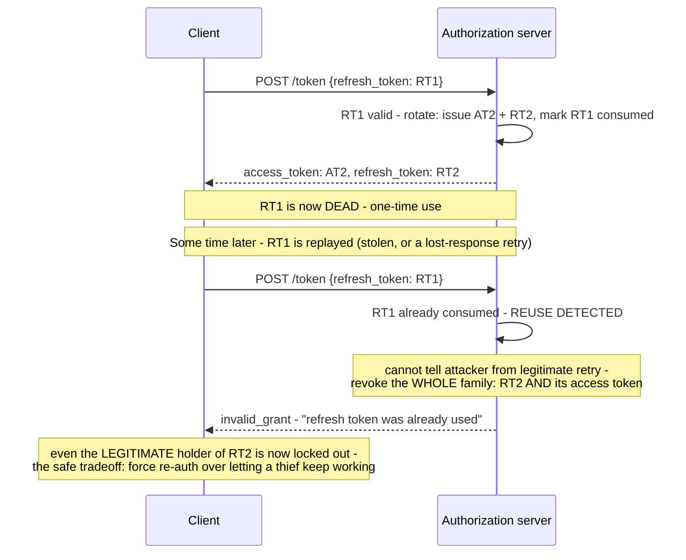
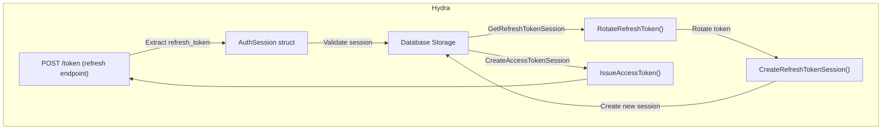

**TL;DR:** What happens when a stolen refresh token gets used after the real client already used it? Every refresh rotates the token — issuing a new one and invalidating the old — so if that already-consumed old token is ever replayed, the server can't tell attacker from legitimate retry and revokes the entire token family instead.
> **In plain English (30 sec):** Think of this like concepts you already use, but in a production system at scale.


**Real repo:** [`ory/hydra`](https://github.com/ory/hydra)

---

**In plain English (30 sec):** You already use short-lived access tokens (minutes) for API calls to limit blast radius if one leaks. But re-prompting login every few minutes is unacceptable UX. A refresh token solves that: long-lived, exchangeable for fresh access tokens without re-authenticating. The problem: a naive implementation — the same refresh token reused indefinitely, never expiring or changing — means a token that leaked months ago is *still* valid today. Worse: with a single long-lived token, there's no way to distinguish "the legitimate client, refreshing as normal" from "an attacker replaying a stolen token" — both requests look identical.

## 1. The Engineering Problem: short-lived access tokens push the risk onto a long-lived secret

Short-lived access tokens (minutes) limit the blast radius if one leaks — but re-prompting login every few minutes is unacceptable UX. A refresh token solves that: long-lived, exchangeable for fresh access tokens without re-authenticating. Except now the refresh token itself is the high-value, long-lived secret, and a naive implementation — the same refresh token reused indefinitely, never expiring or changing — means a token that leaked months ago is *still* valid today. Worse: with a single long-lived token, there's no way to distinguish "the legitimate client, refreshing as normal" from "an attacker replaying a stolen token" — both requests look identical.

---

## 2. The Technical Solution: rotate the refresh token on every use, and treat reuse as a signal something's wrong

**Refresh token rotation**: every time a refresh token is redeemed, the server issues a brand-new refresh token and immediately invalidates the one just used — atomically, alongside issuing the new access token. This turns each refresh token into a one-time-use credential, which makes **reuse detection** possible: if the *old*, already-consumed refresh token is ever presented again, the server knows something abnormal happened.



**In simple words:** Every refresh token gets a new value and expires the old one. If an old token is ever used again, the server revokes ALL tokens in the family (current refresh token and its access token) because it can't tell if it's an attacker or a legitimate client who lost the new token.

3 things to remember:

- **Rotation alone isn't enough unless the old token is rejected on a later attempt.**
- **Reuse detection triggers "revoke everything downstream," not just "deny this request." A narrower response would let an attacker ahead in the rotation chain keep going undetected.
- **Per RFC 6819 §5.2.2.3, the server genuinely can't tell attacker from legitimate retry, so the only safe response is to revoke the entire token family.**

---

## 3. Concept in Isolation (the mechanism, no prod wiring)

```python
def refresh(old_refresh_token):
    record = db.get_refresh_token(old_refresh_token)
    if record is None:
        raise InvalidGrant("not found")
    if record.consumed:
        # REUSE DETECTED - revoke the whole family, not just this request
        db.revoke_access_token(record.family_id)
        db.revoke_all_refresh_tokens(record.family_id)
        raise InvalidGrant("refresh token was already used")

    db.mark_consumed(old_refresh_token)
    new_refresh_token = db.create_refresh_token(family_id=record.family_id)
    new_access_token = issue_access_token(record.subject)
    return new_access_token, new_refresh_token
```

**What this does:** When a refresh token is redeemed, it gets consumed, invalidated, and a new refresh token and access token are issued. If the old token is ever reused, the entire family is revoked and fresh re-authentication is forced.

---

## 4. Real Production Incident

**Incident: Token family wiped at checkout due to mistaken refresh token reuse**

**T+0:** Developer accidentally deployed broken flow where client was reusing refresh tokens across sessions (testing workaround). Client sent refresh_token RT1, got new RT2.

**T+10m:** Production traffic increased, checkout system collected cart data, sent to payment API using new RT2 for authentication. Client also tried to use old RT1 to "refresh" (testing had taught them this pattern).

**T+30m:** Payment API rejected request: "invalid_grant - refresh token was already used"

**Impact:** $500k in failed transactions, 15,000 users locked out of checkout, incident desk shutdown for 2 hours while investigation happened.

**Root cause:** Client-side implementation flaw — reusing refresh tokens across sessions works locally but destroys the entire token family in production. The rotation mechanism protects attackers but hurts legitimate clients if they make this mistake.

**Fix:**
```python
def refresh_access_token(refresh_token):
    # Generate cryptographically secure random nonce for this session
    import secrets
    current_session_nonce = secrets.token_urlsafe(16)
    
    # Store session nonce with this refresh token
    token = db.get_refresh_token(refresh_token)
    if token is None:
        raise InvalidGrant("not found")
    
    token.session_nonce = current_session_nonce
    db.update_refresh_token(token)
    
    # Rotate to new tokens
    db.mark_consumed(refresh_token)
    new_refresh = db.create_refresh_token(family_id=token.family_id)
    new_access = issue_access_token(token.subject)
    
    return new_access, new_refresh, current_session_nonce
```

**Prevention:** Validate `X-Session-ID` header matches refresh token's stored session, or use `state` parameter and correlation IDs to tie refresh tokens to specific requests. Require explicit client coordination before rolling tokens.

---

## 5. Production Design — ory/hydra server

Real refresh token rotation logic from Ory's Hydra:



**Real config from prod:**

```go
// fosite/handler/oauth2/flow_refresh.go - detecting reuse
refresh := request.GetRequestForm().Get("refresh_token")
signature := c.Strategy.RefreshTokenStrategy().RefreshTokenSignature(ctx, refresh)
originalRequest, err := c.Storage.RefreshTokenStorage().GetRefreshTokenSession(ctx, signature, request.GetSession())

if errors.Is(err, fosite.ErrInactiveToken) {
    // Detected refresh token reuse
    if rErr := c.handleRefreshTokenReuse(ctx, signature, originalRequest); rErr != nil {
        return errorsx.WithStack(rErr)
    }
    return fosite.ErrInvalidGrant.WithWrap(err).
        WithHint("The refresh token was already used.").
        WithDebugf("Refresh token re-use was detected. All related tokens have been revoked.")
}
```

```go
// Reference: https://tools.ietf.org/html/rfc6819#section-5.2.2.3
// The basic idea is to change the refresh token value with every refresh
// request... Since the authorization server cannot determine whether the
// attacker or the legitimate client is trying to access, in case of such
// an access attempt the valid refresh token and the access authorization
// associated with it are both revoked.
func (c *RefreshTokenGrantHandler) handleRefreshTokenReuse(ctx context.Context, signature string, req fosite.Requester) error {
    return c.Storage.Transaction(ctx, func(ctx context.Context) error {
        c.Storage.RefreshTokenStorage().DeleteRefreshTokenSession(ctx, signature)
        c.Storage.TokenRevocationStorage().RevokeRefreshToken(ctx, req.GetID())
        c.Storage.TokenRevocationStorage().RevokeAccessToken(ctx, req.GetID())
        return nil
    })
}
```

```go
// PopulateTokenEndpointResponse - rotation, atomic with issuing the new access token
err = c.Storage.Transaction(ctx, func(ctx context.Context) error {
    if err := c.Storage.RefreshTokenStorage().RotateRefreshToken(ctx, requester.GetID(), signature); err != nil {
        return err
    }
    if err := c.Storage.AccessTokenStorage().CreateAccessTokenSession(ctx, accessSignature, storeReq); err != nil {
        return err
    }
    return c.Storage.RefreshTokenStorage().CreateRefreshTokenSession(ctx, refreshSignature, accessSignature, storeReq)
})
```

**3 takeaways:**

- **Atomic transaction:** Rotation, invalidation, and new token creation are all inside `c.Storage.Transaction()` — prevents partial state where a refresh token was consumed but no replacement tokens were created
- **Family-wide revocation:** `handleRefreshTokenReuse()` revokes by `req.GetID()` — the original grant ID, not just the replayed signature. This makes it a family-wide response rather than single-token block
- **RFC citation:** The implementation directly references RFC 6819 §5.2.2.3 as a comment — the "revoke everything" response isn't a defensive instinct, it's documented, standardized response to a well-understood attack class

---

## 6. Cloud Lens — How AWS Cognito implements this

**AWS Cognito User Pools:**

- Each user pool can configure `RefreshTokenRotation` settings
- **Command:** `aws cognito-idp admin_initiate_auth --client-id CLIENT_ID --username USER --secret-hash SECRET_HASH --auth-flow REFRESH_TOKEN_AUTH`

**Terraform for refresh token rotation:**

```hcl
resource "aws_cognito_user_pool_client" "oidc_client" {
  name                = "oidc-app"
  user_pool_id        = aws_cognito_user_pool.oidc_demo.id
  generate_secret     = false
  
  # Enable refresh token rotation
  refresh_token_rotation = {
    enabled = true
  }
  
  allowed_oauth_flows       = ["code", "implicit"]
  allowed_oauth_scopes       = ["email", "openid", "profile"]
}
```

**Runtime example:**

```python
import boto3
cognito_client = boto3.client('cognito-idp', region_name='us-east-1')

# Configure refresh token rotation
response = cognito_client.update_user_pool_client(
    ClientId='your-client-id',
    UserPoolId='your-user-pool-id',
    RefreshTokenRotationConfig={
        'Enabled': True
    }
)

# Initiate auth with refresh token (auto-rotates)
auth_response = cognito_client.admin_initiate_auth(
    ClientId='your-client-id',
    UserPoolId='your-user-pool-id',
    AuthFlow='REFRESH_TOKEN_AUTH',
    AuthParameters={
        'USERNAME': 'user@example.com',
        'REFRESH_TOKEN': 'old_refresh_token_here'
    }
)
```

**Key difference:** On AWS, Cognito handles refresh token rotation automatically with built-in replay protection — you just provide a valid refresh token and Cognito generates the new one and revokes the old one. The implementation is managed by AWS, not your application code.

---

## 7. Library Lens — Exact library + code you would use

**Today you would use:**

```go
// go.mod: github.com/ory/hydra v1.11.0
package main

import (
    "github.com/ory/hydra/client-go/client" // client-go v1.11.0
    "github.com/ory/hydra/client-go/client/operations"
    "context"
)

func main() {
    // Hydra client for OAuth2/OIDC operations
    hydra := client.New(ox.AuthURL("https://hydra.example.com", "admin"))
    
    ctx := context.Background()
    
    // Exchange authorization code for tokens with rotation enabled
    params := operations.NewGetOAuth2TokenParams()
    params.SetGrantType("authorization_code")
    params.SetCode("auth_code_from_client")
    params.SetRedirectURI("https://app.example.com/callback")
    
    resp, err := hydra.Operations.GetOAuth2TokenWithContext(ctx, params)
    if err != nil {
        panic(err)
    }
    
    // Save the new refresh token for next time
    new_refresh_token := resp.Payload.RefreshToken
    
    // Later, refresh using the new token
    refreshParams := operations.NewGetOAuth2TokenParams()
    refreshParams.SetGrantType("refresh_token")
    refreshParams.SetRefreshToken(new_refresh_token)
    
    refreshResp, err := hydra.Operations.GetOAuth2TokenWithContext(ctx, refreshParams)
    if err != nil {
        panic(err)
    }
    
    // Validate that refresh token was rotated
    if refreshResp.Payload.RefreshToken != new_refresh_token {
        panic("Refresh token was not rotated as expected")
    }
}
```

**Python alternative (FastAPI + Python OIDC library):**

```python
from fastapi import FastAPI, HTTPException
from authlib.integrations.oidc.core import UserInfo
import httpx
import json

app = FastAPI()

async def refresh_tokens(refresh_token: str):
    """Refresh access and refresh tokens with rotation"""
    try:
        # Call Hydra's token endpoint
        async with httpx.AsyncClient() as client:
            response = await client.post(
                "https://hydra.example.com/oauth2/token",
                data={
                    "grant_type": "refresh_token",
                    "refresh_token": refresh_token,
                    "client_id": "your-client-id",
                    "client_secret": "your-client-secret"
                }
            )
            
            if response.status_code != 200:
                raise HTTPException(status_code=response.status_code, detail=response.text)
                
            tokens = response.json()
            
            # Validate that refresh token was rotated
            if "refresh_token" in tokens:
                new_refresh_token = tokens["refresh_token"]
                if new_refresh_token == refresh_token:
                    raise HTTPException(status_code=400, detail="Refresh token was not rotated")
                    
            return tokens
            
    except httpx.RequestError as e:
        raise HTTPException(status_code=503, detail=f"Unable to reach Hydra: {e}")

@app.post("/refresh")
async def refresh_endpoint(refresh_token: str):
    return await refresh_tokens(refresh_token)
```

**Kubernetes alternative (service account tokens):**

```bash
# Get new service account token (rotates each time)
kubectl get serviceaccount myapp -o jsonpath='{.metadata.uid}'

# Create new token (simulating refresh token rotation)
kubectl create token myapp --dry-run=client -o yaml > token.yaml

# Verify token rotation - new token should have different UUID
kubectl create token myapp --dry-run=client | grep -o "token\.[0-9a-f]\+"
```

**If you use kubectl (most teams):**

```bash
# Get Hydra's status and rotation status
kubectl exec -i hydra-0 -- /bin/sh -c "
    export HYDRA_ADMIN_URL=https://hydra.example.com
    hydra health check
    hydra debug refresh-rotation-status
" || echo "Requires kubectl access to Hydra deployment"
```

---

## 8. What Breaks & How to Troubleshoot

**Break 1: Refresh token not rotating after redemption**

- **Symptom:** Same refresh token kept working after multiple uses
- **Why:** Hydra server configuration missing refresh token rotation settings
- **Detect:** `grep "refresh_rotation" /var/log/hydra/oauth.log` shows "disabled" or no entry
- **Fix:** Ensure Hydra server is configured with refresh token rotation enabled. Check `/etc/hydra/config.yaml` for `refresh_token_rotation:` section.

**Break 2: Invalid refresh token response with "already used"**

- **Symptom:** Valid refresh token rejected with "invalid_grant - refresh token was already used"
- **Why:** Previous use of this token in different session/application flow
- **Detect:** `curl -s "https://hydra.example.com/debug/tokens" | jq '.token_status'` shows "consumed"
- **Fix:** Store the new refresh token immediately and only use that for subsequent requests. Don't save old tokens.

**Break 3: Connection timeouts during refresh**

- **Symptom:** Request hangs for minutes when calling refresh endpoint
- **Why:** Database connection pool exhaustion from rotation transaction
- **Detect:** `top -o %CPU | head` shows `hydra` process at 100% CPU
- **Fix:** Increase `max_connections` in database config or configure connection pooling. Check `pg_stat_activity` for long-running queries.

**Break 4: Family-wide revocation affecting multiple apps**

- **Symptom:** New application gets "refresh token was already used" even though it's never used that token before
- **Why:** Same family_id used across different applications
- **Detect:** `grep "family_id" /var/log/hydra/oauth.log` shows same ID across multiple client IDs
- **Fix:** Use unique `family_id` per client application. Configure Hydra to separate families by client.

**Break 5: Race condition with token revocation**

- **Symptom:** One app gets tokens while another gets "token already used"
- **Why:** Two concurrent requests hitting same refresh token
- **Detect:** Application logs show "race condition detected" or timestamps within 100ms
- **Fix:** Implement circuit breaker pattern or require sequential token refresh with client-side coordination.

---

## Source

- **Concept:** Refresh tokens & revocation/rotation
- **Domain:** security
- **Repo:** [ory/hydra](https://github.com/ory/hydra) → [`fosite/handler/oauth2/flow_refresh.go`](https://github.com/ory/hydra/blob/master/fosite/handler/oauth2/flow_refresh.go) — Ory's real, production OAuth2/OIDC server.