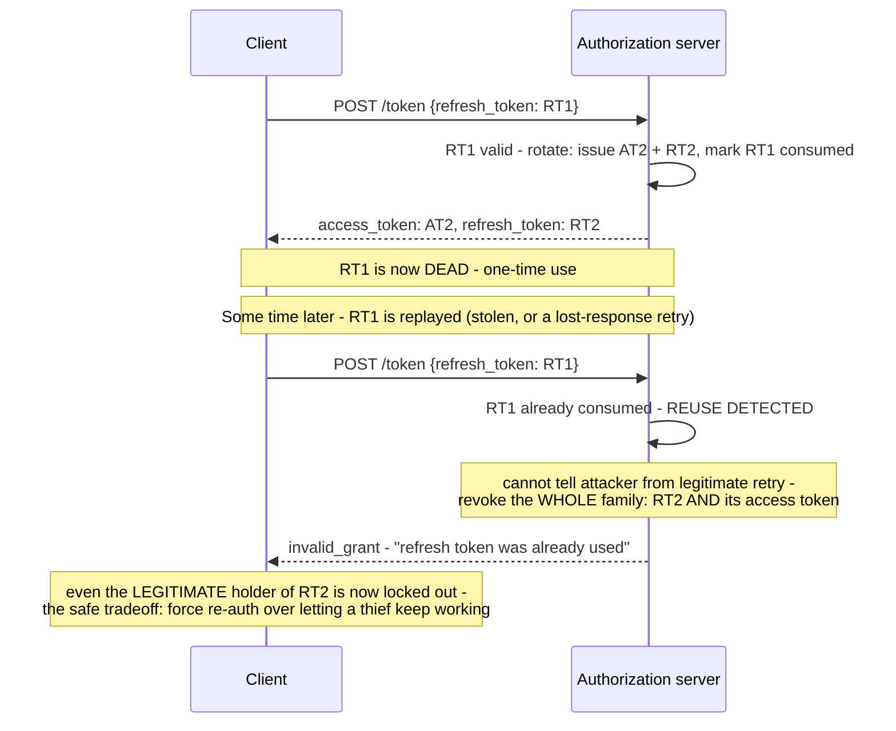

## 1. The Engineering Problem: short-lived access tokens push the risk onto a long-lived secret

Short-lived access tokens (minutes) limit the blast radius if one leaks — but re-prompting login every few minutes is unacceptable UX. A refresh token solves that: long-lived, exchangeable for fresh access tokens without re-authenticating. Except now the refresh token itself is the high-value, long-lived secret, and a naive implementation — the same refresh token reused indefinitely, never expiring or changing — means a token that leaked months ago is *still* valid today. Worse: with a single long-lived token, there's no way to distinguish "the legitimate client, refreshing as normal" from "an attacker replaying a stolen token" — both requests look identical.

---

## 2. The Technical Solution: rotate the refresh token on every use, and treat reuse of an old one as a signal something's wrong

**Refresh token rotation**: every time a refresh token is redeemed, the server issues a brand-new refresh token and immediately invalidates the one just used — atomically, alongside issuing the new access token. This turns each refresh token into a one-time-use credential, which makes **reuse detection** possible: if the *old*, already-consumed refresh token is ever presented again, the server knows something abnormal happened. Per RFC 6819 §5.2.2.3, the server genuinely cannot tell whether that's the legitimate client retrying after losing the new token, or an attacker replaying a stolen one — so the only safe response is to revoke the *entire* token family (the current refresh token and its associated access token), forcing re-authentication either way.



Core truths: **rotation and reuse detection are two halves of one mechanism** — rotation alone (issuing a new token each time) does nothing protective unless the *old* token is actually rejected on a later attempt; and **the response to detected reuse has to be "revoke everything downstream of this token," not just "reject this one request"** — a narrower response (just deny the replayed RT1, leave RT2 alone) would let an attacker who's already ahead in the rotation chain keep going undetected.

---

## 3. The clean example (concept in isolation)

```python
def refresh(old_refresh_token):
    record = db.get_refresh_token(old_refresh_token)
    if record is None:
        raise InvalidGrant("not found")
    if record.consumed:
        # REUSE DETECTED - revoke the whole family, not just this request
        db.revoke_access_token(record.family_id)
        db.revoke_all_refresh_tokens(record.family_id)
        raise InvalidGrant("refresh token was already used")

    db.mark_consumed(old_refresh_token)
    new_refresh_token = db.create_refresh_token(family_id=record.family_id)
    new_access_token = issue_access_token(record.subject)
    return new_access_token, new_refresh_token
```

---

## 4. Production reality (from `ory/hydra`'s vendored `fosite` library)

```go
// fosite/handler/oauth2/flow_refresh.go - detecting reuse
refresh := request.GetRequestForm().Get("refresh_token")
signature := c.Strategy.RefreshTokenStrategy().RefreshTokenSignature(ctx, refresh)
originalRequest, err := c.Storage.RefreshTokenStorage().GetRefreshTokenSession(ctx, signature, request.GetSession())

if errors.Is(err, fosite.ErrInactiveToken) {
    // Detected refresh token reuse
    if rErr := c.handleRefreshTokenReuse(ctx, signature, originalRequest); rErr != nil {
        return errorsx.WithStack(rErr)
    }
    return fosite.ErrInvalidGrant.WithWrap(err).
        WithHint("The refresh token was already used.").
        WithDebugf("Refresh token re-use was detected. All related tokens have been revoked.")
}
```

```go
// Reference: https://tools.ietf.org/html/rfc6819#section-5.2.2.3
// The basic idea is to change the refresh token value with every refresh
// request... Since the authorization server cannot determine whether the
// attacker or the legitimate client is trying to access, in case of such
// an access attempt the valid refresh token and the access authorization
// associated with it are both revoked.
func (c *RefreshTokenGrantHandler) handleRefreshTokenReuse(ctx context.Context, signature string, req fosite.Requester) error {
    return c.Storage.Transaction(ctx, func(ctx context.Context) error {
        c.Storage.RefreshTokenStorage().DeleteRefreshTokenSession(ctx, signature)
        c.Storage.TokenRevocationStorage().RevokeRefreshToken(ctx, req.GetID())
        c.Storage.TokenRevocationStorage().RevokeAccessToken(ctx, req.GetID())
        return nil
    })
}
```

```go
// PopulateTokenEndpointResponse - rotation, atomic with issuing the new access token
err = c.Storage.Transaction(ctx, func(ctx context.Context) error {
    if err := c.Storage.RefreshTokenStorage().RotateRefreshToken(ctx, requester.GetID(), signature); err != nil {
        return err
    }
    if err := c.Storage.AccessTokenStorage().CreateAccessTokenSession(ctx, accessSignature, storeReq); err != nil {
        return err
    }
    return c.Storage.RefreshTokenStorage().CreateRefreshTokenSession(ctx, refreshSignature, accessSignature, storeReq)
})
```

What this teaches that a hello-world can't:

- **The RFC citation is embedded directly in the source as a comment** — the code isn't just implementing "revoke on reuse" as a defensive instinct, it's implementing a specifically documented, standardized response to a well-understood attack class. Reading the comment alongside the code is a rare case where the "why" is verifiably not an afterthought.
- **`RotateRefreshToken` and `CreateAccessTokenSession` happen inside the SAME database transaction (`c.Storage.Transaction(...)`).** If the transaction fails partway, neither the old refresh token gets marked consumed nor the new access token gets created — avoiding a genuinely dangerous partial state where a refresh token was invalidated but no replacement tokens were successfully issued, or vice versa.
- **`handleRefreshTokenReuse` revokes by `req.GetID()` — the original request/grant ID, not the specific token signature that was replayed.** This is what makes it a *family*-wide revocation rather than a single-token block: every access and refresh token descended from that original grant gets killed, not just the one stale refresh token that triggered the detection.

Known-stale fact: a common assumption is that refresh tokens need less protective rigor than access tokens because they're sent less frequently — the opposite is closer to true. A refresh token is arguably the *higher*-value target precisely because it's long-lived and can mint many access tokens over its lifetime; treating it with password-grade handling (never logged, never sent over anything but the token endpoint, rotated on every use) is the current baseline expectation, not an optional hardening step.

---

## Source

- **Concept:** Refresh tokens & revocation/rotation
- **Domain:** security
- **Repo:** [ory/hydra](https://github.com/ory/hydra) → [`fosite/handler/oauth2/flow_refresh.go`](https://github.com/ory/hydra/blob/master/fosite/handler/oauth2/flow_refresh.go) — Ory's real, production OAuth2/OIDC server.
