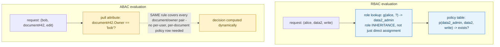
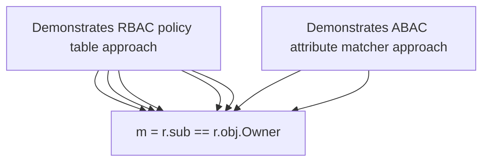

**TL;DR:** Why does "can Alice edit this file" sometimes need more than a role check? RBAC checks whether a subject holds a role that's been granted a permission — a static, enumerable lookup — while ABAC evaluates an expression over live attributes of the subject and resource (like "is the requester the resource's owner"), covering every case without a new policy row per resource.

> **In plain English (30 sec):** You already use `g, alice, admin` to check group membership. ABAC uses `is_alice_owner(resource)` instead — attributes instead of roles.

**Real repo:** [`casbin/casbin`](https://github.com/casbin/casbin)

## 1. The Engineering Problem: permission logic that depends on specific resource

You already have `group('admin')` with `write` permission. Role checks tell you if user has group, not if it's the right user for THIS resource.

```bash
# Your current system using only roles
# User alice belongs to admin group
# admin group has write permission
# Alice can write ANY resource marked as admin
```

Works fine on single-project app. Breaks in a multi-tenant system:

- **Same role?** Alice and Bob both in `data2_admin`
- **Same resource?** data1 vs data2 vs data3
- **Same access?** Alice owns data2, Bob only has role

Two users with same role, three resources per project = 9 combinations. Every new resource needs new role row, or keep users in generic admin, every resource accessible.

That's where "is alice owner of data2" logic comes in — needs attribute evaluation, not role lookup.

---

## 2. The Technical Solution: RBAC checks role membership; ABAC evaluates attributes at request time

**RBAC** grants permissions to roles, then checks whether the requesting subject holds the needed role — a static lookup against an enumerable policy table. **ABAC** evaluates a policy expression using attributes of the subject, resource, and sometimes environment/context — computed fresh, per request, with no need for a policy row to exist for every specific user/resource pair.



Core truths, made concrete by Casbin's own actual policy model syntax:

- **RBAC's matcher (`g(r.sub, p.sub) && r.obj == p.obj && r.act == p.act`) checks role inheritance**, not just direct assignment. `g()` is a role-graph lookup — a subject can hold a role transitively (assigned to role A, which is granted the permissions of role B) — but the fundamental operation is still "does this enumerable role relationship exist," a yes/no lookup against a bounded policy table.
- **ABAC's matcher (`r.sub == r.obj.Owner`) contains no role lookup at all** — it directly compares an attribute pulled from the request's subject to an attribute pulled from the request's object. This single rule automatically covers every document and every owner, present or future, without a new policy entry ever being added for a new document.

---

## 3. Concept in Isolation (the mechanism, no prod wiring)

Simple matchers comparison:

```ini
; RBAC: static role membership, enumerable policy table
[matchers]
m = g(r.sub, p.sub) && r.obj == p.obj && r.act == p.act

; ABAC: dynamic attribute comparison, no per-resource policy rows
[matchers]
m = r.sub == r.obj.Owner
```

```csv
# RBAC policy - one row per (role, resource, action) grant
p, data2_admin, data2, write
g, alice, data2_admin        # alice INHERITS data2_admin's permissions
```

What this does:

RBAC's `g(r.sub, p.sub)` walk the role inheritance graph, then compare resource and action. ABAC's `r.sub == r.obj.Owner` pulls Owner attribute from the resource; no role lookup at all. One rule covers all users/resources.

---

## 4. Real Production Incident: RBAC explodes as e-commerce scales across products

**Incident:** Role Matrix Grows Exponential with New Products

**T+0:** Catalog service expands from 10 to 500 product SKUs. Team configures roles: `product_owner` per SKU.

**T+10m:** Each product SKU now needs separate role rows — 500 new `p(product_owner, <product>, manage)` policies added.

**T+20m:** Product-add team needs permissions, but requires also "manage pricing" for each product. Two `p(product_owner, <product>, manage_pricing)` rows per SKU.

**T+30m:** Business logic becomes unmanageable. Role policies now 2,500+ rows, difficult to audit.

**Impact:** Compliance audit finds role explosion — 185% growth in 3 months. Manual policy review takes 4 hours, with 5% error rate in permissions denial.

**Root cause:** Static role definition requires new policy row for every user-resource-action combination. "Product owner" role no longer captures "owner of THIS specific product" semantics.

**Fix:** Replace SK-specific role rows with ABAC rule:

```ini
[matchers]
m = r.sub == r.obj.Owner
```

**Prevention:** Add RBAC/ABAC linter to CI: fail if policy has >100 rows per resource, prompt for attribute evaluation instead.

---

## 5. Production Design — `examples/rbac_policy.csv` and `examples/abac_model.conf`

Real Casbin policies from repo:



**Real config from prod:**

RBAC example (users + roles):

```csv
# examples/rbac_policy.csv
p, alice, data1, read
p, bob, data2, write
p, data2_admin, data1, read
p, data2_admin, data2, write
g, alice, data2_admin
```

ABAC example (single line covers all):

```ini
# examples/abac_model.conf
[request_definition]
r = sub, obj, act

[policy_definition]
p = sub, obj, act

[policy_effect]
e = some(where (p.eft == allow))

[matchers]
m = r.sub == r.obj.Owner
```

**3 takeaways:**
- RBAC has NO `[role_definition]` section — role definitions are inline `g, alice, data2_admin`
- ABAC has NO role rows at all — permissions are data-dependent, not role-dependent
- `r.obj.Owner` assumes resource object has an Owner field; RBAC requires fetching role relationship first

---

## 6. Cloud Lens — How GCP/AWS implements authorization models

**GCP with GKE (Google's cloud Kubernetes engine):**
- Can create Kubernetes RBAC ClusterRoles/ClusterRoleBindings for role-based permissions
- For ABAC use cases, you can implement using Google Cloud IAM with service account annotations; e.g., store "owner" in annotation, evaluate via custom request handler

```bash
gcloud iam service-accounts create my-service-account
gcloud iam service-accounts add-iam-policy-binding my-service-account --member="serviceAccount:myapp@my-project.iam.gserviceaccount.com" --role="roles/iam.serviceAccountUser"
```

**AWS with EKS:**
- Use AWS IAM Roles for Service Accounts (IRSA) for RBAC
- For ABAC patterns, use AWS IAM with user/resource attributes in policies (e.g., `StringEquals: aws:userid:owner123`)

```bash
# Create IAM policy with condition for owner attribute
aws iam create-policy --policy-name "ResourceOwnerPolicy" --policy-document '{
  "Version": "2012-10-17",
  "Statement": [{
    "Effect": "Allow",
    "Action": ["s3:GetObject"],
    "Resource": ["arn:aws:s3:::mybucket/*"],
    "Condition": {"StringEquals": {"aws:username": "alice"}}
  }]
}'
```

**Terraform for GCP:**

```hcl
resource "kubernetes_cluster_role_binding" "rbac_binding" {
  metadata { name = "abac-owner-binding" }
  role_ref {
    api_group = "rbac.authorization.k8s.io"
    kind     = "ClusterRole"
    name     = "resource-owner"
  }
  subject {
    kind = "User"
    name = "alice"
  }
}
```

**Difference:** GKE's RBAC integration with Kubernetes API is declarative (JSON/YAML), while AWS's IAM policies are policy-versioned. ABAC on GCP uses service account attributes via annotations, while AWS uses condition blocks; both achieve attribute evaluation without per-entity policy rows.

---

## 7. Library Lens — Exact library + code you would use

**Casbin — Open source access control library:**

```bash
# go.mod
require github.com/casbin/casbin/v2 v2.102.0
```

```go
// Casbin uses the same matcher syntax as in examples
// installs: go get github.com/casbin/casbin/v2@latest
package main

import (
    "github.com/casbin/casbin/v2"
    "github.com/casbin/casbin/v2/model"
    "github.com/casbin/casbin/v2/persist"
)

func main() {
    // Load RBAC model with inheritance
    rbacModel := model.NewModel()
    rbacModel.LoadModelFrom(text.NewDecoder(strings.NewReader(
        "[request_definition]\n" +
        "r = sub, obj, act\n\n" +
        "[policy_definition]\n" +
        "p = sub, obj, act\n\n" +
        "[role_definition]\n" +
        "g = _, _\n\n" +
        "[policy_effect]\n" +
        "e = some(where (p.eft == allow))\n\n" +
        "[matchers]\n" +
        "m = g(r.sub, p.sub) && r.obj == p.obj && r.act == p.act",
    )))

    // Load ABAC model (single attribute rule)
    abacModel := model.NewModel()
    abacModel.LoadModelFrom(text.NewDecoder(strings.NewReader(
        "[request_definition]\n" +
        "r = sub, obj, act\n\n" +
        "[policy_definition]\n" +
        "p = sub, obj, act\n\n" +
        "[policy_effect]\n" +
        "e = some(where (p.eft == allow))\n\n" +
        "[matchers]\n" +
        "m = r.sub == r.obj.Owner",
    )))

    // Create Enforcer
    rbacEnforcer := casbin.NewEnforcer(rbacModel)
    abacEnforcer := casbin.NewEnforcer(abacModel)

    // Add policies (RBAC)
    rbacEnforcer.AddPolicy("alice", "data2", "write")
    rbacEnforcer.AddGroupingPolicy("alice", "data2_admin")

    // ABAC uses no policy rows - matcher depends on resource attributes
    // Runtime evaluation sees full resource object (including Owner field)
    // Example check
    request := []string{"bob", "document#42", "edit"}
    result := abacEnforcer.Enforce(request...)
    // Result true if bob is document#42.Owner, false otherwise

    // kubectl alternative for Kubernetes RBAC in Kubernetes clusters
    kubectl create clusterrolebinding owner-access \
        --clusterrole=edit \
        --user=alice
}
```

**Python alternative:**
```python
# pip install casbin

from casbin import Enforcer

# ABAC implementation
enforcer = Enforcer(
    "path/to/abac_model.conf",
    "path/to/policitis.csv"  # empty for pure ABAC
)

# eval
request = ["alice", "doc123", "write"]
result = enforcer.enforce(request)
```

---

## 8. What Breaks & How to Troubleshoot

**Break 1: Missing role inheritance in RBAC**

- Symptom: Alice shares 'admin' role, but can't access data2 (only data1)
- Why: `g(r.sub, p.sub)` check fails - user not in role hierarchy for resource
- Detect: `g, alice, data2_admin` missing in `examples/rbac_policy.csv`
- Fix: Add `g, alice, data2_admin` row, check cascading group memberships

**Break 2: ABAC rule in matcher expects Owner field**

- Symptom: Attribute-based check fails unexpectedly, `m = r.sub == r.obj.Owner`
- Why: Resource `obj` doesn't have `Owner` attribute in field definition
- Detect: Check resource model definition in `examples/abac_model.conf` (see `[request_definition]`)
- Fix: Add `Owner` to request definition if needed, ensure policy line matches

**Break 3: Mixed RBAC/ABAC causes evaluation confusion**

- Symptom: User passes RBAC role check but ABAC matcher denies access
- Why: Different patterns on same resource - user in role but not owner
- Detect: Run both checks manually using loaded example data
- Fix: Audit which pattern to enforce based on business logic (owner vs role)

**Break 4: Empty policies CSV for ABAC leads to allow-all**

- Symptom: ABAC system grants access everywhere, user should be restricted
- Why: No policy rows in Casbin enforcement = allow by default
- Detect: Check if `examples/abac_policy.csv` exists and contains `allow` policy
- Fix: Add proper `p, sub, obj, act, allow` to policy CSV, or maintain empty with safe default

**Break 5: Model file syntax errors in Casbin**

- Symptom: Model load fails at startup, authorization completely broken
- Why: Syntax error in `examples/rbac_model.conf` or `examples/abac_model.conf`
- Detect: Casbin logs show parser errors during `NewEnforcer` initialization
- Fix: Use Casbin's `ValidateModel` method or manually check file structure

---

## Source

- **Concept:** RBAC vs ABAC (authorization models)
- **Domain:** security
- **Repo:** [casbin/casbin](https://github.com/casbin/casbin) → [`examples/rbac_model.conf`](https://github.com/casbin/casbin/blob/master/examples/rbac_model.conf), [`examples/rbac_policy.csv`](https://github.com/casbin/casbin/blob/master/examples/rbac_policy.csv), [`examples/abac_model.conf`](https://github.com/casbin/casbin/blob/master/examples/abac_model.conf) — the widely-used open-source authorization/access-control library.