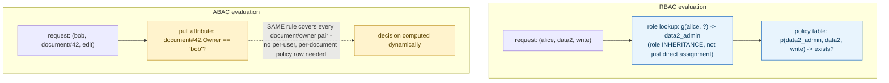

**TL;DR:** Why does "can Alice edit this file" sometimes need more than a role check? RBAC checks whether a subject holds a role that's been granted a permission — a static, enumerable lookup — while ABAC evaluates an expression over live attributes of the subject and resource (like "is the requester the resource's owner"), covering every case without a new policy row per resource.

**Real repo:** [`casbin/casbin`](https://github.com/casbin/casbin)

## 1. The Engineering Problem: static roles don't scale to permission logic that depends on the specific resource

RBAC answers "does this user's role include the needed permission" — clean and auditable, until permission depends on something about the *specific* resource or request, not just a static role. "A user can edit a document if they own it." "A user can approve a purchase order under $500, but needs a second approver above that." "Access is only allowed during business hours." Model every one of these as a new role and the role count explodes combinatorially — one role per document owner? Per dollar threshold? RBAC's enumerable, static roles don't fit permission logic that depends on relationships or dynamic facts about the request.

---

## 2. The Technical Solution: RBAC checks role membership; ABAC evaluates an expression over attributes at request time

**RBAC** grants permissions to roles, then checks whether the requesting subject holds the needed role — a static lookup against an enumerable policy table. **ABAC** evaluates a policy *expression* using attributes of the subject, resource, and sometimes environment/context — computed fresh, per request, with no need for a policy row to exist for every specific user/resource pair.



Core truths, made concrete by Casbin's own actual policy model syntax:

- **RBAC's matcher (`g(r.sub, p.sub) && r.obj == p.obj && r.act == p.act`) checks role *inheritance*, not just direct assignment.** `g()` is a role-graph lookup — a subject can hold a role transitively (assigned to role A, which is granted the permissions of role B) — but the fundamental operation is still "does this enumerable role relationship exist," a yes/no lookup against a bounded policy table.
- **ABAC's matcher (`r.sub == r.obj.Owner`) contains no role lookup at all** — it directly compares an attribute pulled from the request's subject to an attribute pulled from the request's object. This single rule automatically covers every document and every owner, present or future, without a new policy entry ever being added for a new document.

---

## 3. The clean example (concept in isolation)

```ini
; RBAC: static role membership, enumerable policy table
[matchers]
m = g(r.sub, p.sub) && r.obj == p.obj && r.act == p.act

; ABAC: dynamic attribute comparison, no per-resource policy rows
[matchers]
m = r.sub == r.obj.Owner
```

```csv
# RBAC policy - one row per (role, resource, action) grant
p, data2_admin, data2, write
g, alice, data2_admin        # alice INHERITS data2_admin's permissions
```

---

## 4. Production reality (from `casbin/casbin`)

```ini
# examples/rbac_model.conf
[request_definition]
r = sub, obj, act

[policy_definition]
p = sub, obj, act

[role_definition]
g = _, _

[policy_effect]
e = some(where (p.eft == allow))

[matchers]
m = g(r.sub, p.sub) && r.obj == p.obj && r.act == p.act
```

```csv
# examples/rbac_policy.csv
p, alice, data1, read
p, bob, data2, write
p, data2_admin, data2, read
p, data2_admin, data2, write
g, alice, data2_admin
```

```ini
# examples/abac_model.conf
[request_definition]
r = sub, obj, act

[policy_definition]
p = sub, obj, act

[policy_effect]
e = some(where (p.eft == allow))

[matchers]
m = r.sub == r.obj.Owner
```

What this teaches that a hello-world can't:

- **The ABAC model has NO `[role_definition]` section and NO policy CSV at all.** There's nothing to enumerate — the entire authorization logic is the one-line matcher. Compare this to RBAC's `rbac_policy.csv`, which needs a new row every time a new role-to-resource grant is created; ABAC's rule stays exactly one line no matter how many documents or owners exist.
- **`g, alice, data2_admin` demonstrates role inheritance is a first-class relationship, not a flat "user has role X" flag** — Casbin's `g` (grouping) function can express multi-level role hierarchies (a role that itself inherits from another role), and the matcher's `g(r.sub, p.sub)` call transparently walks that hierarchy rather than requiring an exact string match against the subject.
- **`r.obj.Owner` in the ABAC matcher assumes `r.obj` is a structured object with an accessible `Owner` field, not just a string identifier** — this is the real mechanical requirement ABAC imposes that RBAC doesn't: the enforcement layer needs access to the *resource's own data* at decision time (fetching the document to check its owner), not just an opaque resource name. That's a genuinely different integration cost between the two models, easy to gloss over when comparing them only conceptually.

Known-stale fact: RBAC and ABAC are often presented as a binary either/or architectural choice — they're not mutually exclusive, and production systems commonly combine both. Later NIST guidance on attribute-based access control explicitly frames RBAC as a special case of ABAC, where "role" is simply one attribute among many a policy can reference. A real system frequently uses coarse-grained role checks for broad access tiers and layers attribute-based rules on top for resource-specific fine-tuning (like ownership checks), rather than picking one model exclusively.

---

## Source

- **Concept:** RBAC vs ABAC (authorization models)
- **Domain:** security
- **Repo:** [casbin/casbin](https://github.com/casbin/casbin) → [`examples/rbac_model.conf`](https://github.com/casbin/casbin/blob/master/examples/rbac_model.conf), [`examples/rbac_policy.csv`](https://github.com/casbin/casbin/blob/master/examples/rbac_policy.csv), [`examples/abac_model.conf`](https://github.com/casbin/casbin/blob/master/examples/abac_model.conf) — the widely-used open-source authorization/access-control library.


