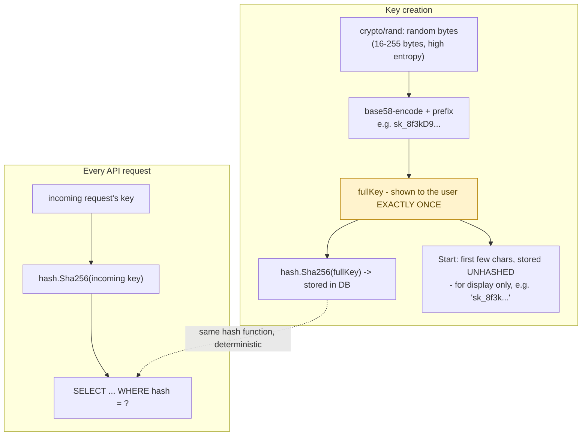

**TL;DR:** Why do API keys get shown to you exactly once, and never again? The server hashes the key immediately with a fast hash (safe here because the key is machine-generated with full entropy) and never persists the plaintext, so there's no way to redisplay it later — only revoke and reissue.

**Real repo:** [`unkeyed/unkey`](https://github.com/unkeyed/unkey)

## 1. The Engineering Problem: a bearer credential that's checked on every request is a high-value, high-frequency target

An API key isn't like a password a user types into a form and never persists anywhere — it gets embedded directly into a client's config, environment variables, or code, and it's validated on *every* API call made with it, potentially thousands of times a second across a whole platform. Store it in plaintext and a single database breach hands an attacker every customer's working credential immediately, no cracking required. Unlike a session cookie's opaque server-tracked reference, the API key genuinely *is* the credential — whoever holds the string can use it.

---

## 2. The Technical Solution: hash the stored key, generate it with full entropy so a fast hash is safe, and show the plaintext exactly once

Hash the key before storing it — same principle as password hashing, with one important difference: an API key is machine-generated with full cryptographic randomness, not chosen by a human, so it isn't vulnerable to dictionary or rainbow-table attacks the way low-entropy human passwords are. That means a **fast** hash (SHA-256) is the right choice here, not a slow memory-hard KDF (bcrypt/Argon2) — verification happens on the hot path of every API call, and slowing that down by design (the whole point of a password KDF) would be a real performance cost bought for a threat model that doesn't apply to a high-entropy machine-generated secret.



Core truths: **the plaintext key is never persisted anywhere after creation** — if a user loses it, there's no "recover my key" flow, only revoke-and-reissue, because the server genuinely doesn't have it anymore; and **the stored "start" fragment is deliberately unhashed and separate from the security-critical hash** — it exists purely so a dashboard can show "sk_8f3k...→ Production key" without ever needing to re-display or re-derive the real secret.

---

## 3. The clean example (concept in isolation)

```python
import secrets, hashlib, base64

# Creation
raw = secrets.token_bytes(32)
full_key = "sk_" + base64.b32encode(raw).decode().rstrip("=").lower()
key_hash = hashlib.sha256(full_key.encode()).hexdigest()
db.store(hash=key_hash, start=full_key[:8])
return full_key   # shown ONCE - never stored, never shown again

# Verification (every request)
incoming_hash = hashlib.sha256(incoming_key.encode()).hexdigest()
record = db.find_by_hash(incoming_hash)   # fast hash - hot path, high volume
```

---

## 4. Production reality (from `unkeyed/unkey`)

```go
// internal/services/keys/create.go
func (s *service) CreateKey(ctx context.Context, req CreateKeyRequest) (CreateKeyResponse, error) {
    keyBytes := make([]byte, req.ByteLength)
    rand.Read(keyBytes)                        // crypto/rand - real entropy

    encodedKey := base58.Encode(keyBytes)       // avoids ambiguous chars (0/O/l/I)
    fullKey := encodedKey
    start := encodedKey[:4]

    if req.Prefix != "" {
        fullKey = fmt.Sprintf("%s_%s", req.Prefix, encodedKey)
        start = fmt.Sprintf("%s_%s", req.Prefix, encodedKey[:4])
    }

    return CreateKeyResponse{
        Key:   fullKey,               // returned to caller ONCE
        Hash:  hash.Sha256(fullKey),   // what actually gets stored
        Start: start,                  // unhashed, for UI display only
    }, nil
}
```

```go
// pkg/hash/sha256.go
// Sha256 computes the SHA-256 hash of a string...
// This function is used primarily for API key validation, where the
// original key is never stored but its hash is used for verification.
func Sha256(s string) string {
    hash := sha256.New()
    hash.Write([]byte(s))
    return base64.StdEncoding.EncodeToString(hash.Sum(nil))
}
```

```sql
-- pkg/db/queries/key_find_live_by_hash.sql
SELECT k.*, ...
FROM `keys` k
WHERE k.hash = sqlc.arg(hash)
    AND k.deleted_at_m IS NULL
```

What this teaches that a hello-world can't:

- **The library's own doc comment states the mechanism directly**: "the original key is never stored but its hash is used for verification" — this isn't inferred from reading between the lines, it's the author's explicit design statement, confirming the plaintext-never-persisted property is deliberate, not an accident of the code's structure.
- **`Start` and `Hash` are computed from the SAME `fullKey` but serve completely different purposes and have completely different sensitivity.** `Start` (`sk_8f3k`) is safe to display in a UI forever — it's a small prefix fragment with nowhere near enough bits to brute-force back to the full key. `Hash` is the actual security boundary, looked up on every request, never displayed anywhere.
- **The lookup query (`WHERE k.hash = sqlc.arg(hash)`) is a plain equality match, not a slow verification loop.** This is only safe *because* the input has full entropy — an equivalent equality lookup against a table of *password* hashes (instead of a proper KDF comparison) would be a real vulnerability, since a fast hash makes offline dictionary attacks against low-entropy human passwords cheap. The same fast-hash choice is safe here and unsafe there, for the exact reason spelled out above: entropy of the input, not just "is it hashed."

Known-stale fact: "just use bcrypt for API keys, same as passwords" is a common but imprecise generalization. Password hashing needs to be deliberately *slow* specifically because human-chosen passwords have low entropy and are vulnerable to dictionary/brute-force attacks that a slow KDF makes economically painful. A machine-generated API key with genuine cryptographic randomness doesn't share that vulnerability — a fast hash like SHA-256 is both sufficient and, given the request-volume the check runs at, the more appropriate engineering tradeoff.

---

## Source

- **Concept:** API key authentication
- **Domain:** security
- **Repo:** [unkeyed/unkey](https://github.com/unkeyed/unkey) → [`internal/services/keys/create.go`](https://github.com/unkeyed/unkey/blob/main/internal/services/keys/create.go), [`pkg/hash/sha256.go`](https://github.com/unkeyed/unkey/blob/main/pkg/hash/sha256.go), [`pkg/db/queries/key_find_live_by_hash.sql`](https://github.com/unkeyed/unkey/blob/main/pkg/db/queries/key_find_live_by_hash.sql) — a real, dedicated open-source API key management platform.
