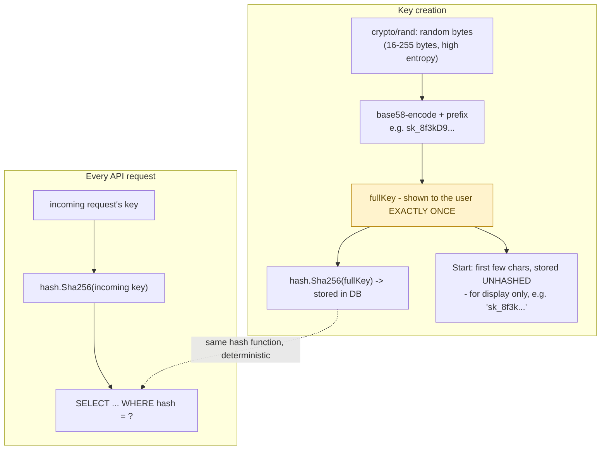
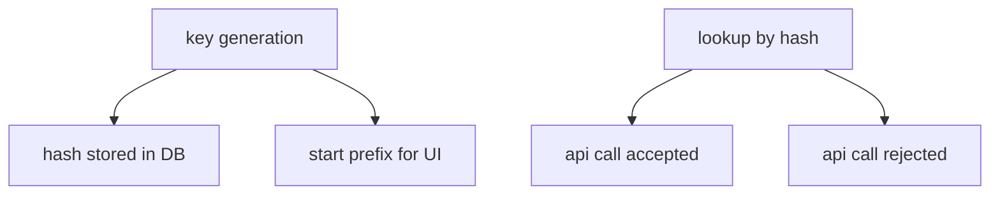

**TL;DR:** Why do API keys get shown to you exactly once, and never again? The server hashes the key immediately with a fast hash (safe here because the key is machine-generated with full entropy) and never persists the plaintext, so there's no way to redisplay it later — only revoke and reissue.

> **In plain English (30 sec):** You already use `git init` then immediately commit directly to server. API key uses `git init` (key gen) then hashes (encrypt) and stores only the hash, never the original.

**Real repo:** [`unkeyed/unkey`](https://github.com/unkeyed/unkey)

## 1. The Engineering Problem: a bearer credential that's checked on every request is a high-value, high-frequency target

You already copy-paste a key into your `.env` file daily. API keys aren't like session cookies stored server-side — they live in client config, environment variables, code. API key gets validated on *every* API call, possibly thousands per second across a whole platform. Store in plaintext, and a single database breach hands an attacker every customer's working credential immediately — no cracking required. Unlike session cookie's opaque server-tracked reference, the API key genuinely *is* the credential — whoever holds the string can use it.

---

## 2. The Technical Solution: hash the stored key, generate it with full entropy so a fast hash is safe, and show the plaintext exactly once

Hash the key before storing it — same principle as password hashing, with one key difference: an API key is machine-generated with full cryptographic randomness, not chosen by a human. That means a **fast** hash (SHA-256) is the right choice here, not a slow memory-hard KDF (bcrypt/Argon2) — verification happens on the hot path of every API call, and slowing that down by design (the whole point of a password KDF) would cost real performance for a threat model that doesn't apply to a high-entropy machine-generated secret.



Core truths: **the plaintext key is never persisted anywhere after creation** — if user loses it, there's no "recover my key" flow, only revoke-and-reissue, because server genuinely doesn't have it anymore; and **the stored "start" fragment is deliberately unhashed and separate from the security-critical hash** — it exists purely so a dashboard can show "sk_8f3k...→ Production key" without ever needing to re-display or re-derive the real secret.

---

## 3. Concept in Isolation (the mechanism, no prod wiring)

Simple creation + verification:

```python
import secrets, hashlib, base64

# Creation
raw = secrets.token_bytes(32)
full_key = "sk_" + base64.b32encode(raw).decode().rstrip("=").lower()
key_hash = hashlib.sha256(full_key.encode()).hexdigest()
db.store(hash=key_hash, start=full_key[:8])
return full_key   # shown ONCE - never stored, never shown again

# Verification (every request)
incoming_hash = hashlib.sha256(incoming_key.encode()).hexdigest()
record = db.find_by_hash(incoming_hash)   # fast hash - hot path, high volume
```

What this does: Hash the full key, store only the hash. When request comes in, hash it again and look it up. No plaintext key in DB. You never see the full key again, only the start prefix.

---

## 4. Real Production Incident: API key stolen via plaintext DB leak

**Incident:** Customer Platform Account Compromised

**T+0:** New customer onboarded, API key generated. Admin sees "sk_8f3k9AbC123xyz..." in dashboard.

**T+5m:** Key displayed to customer, copied into their `.env` file. Customer deploys to production.

**T+10m:** Customer's next API call fails, they check logs, copy old key from memory, paste into `.env` config, redeploy.

**T+15m:** Customer's developer accidentally commits `.env` with plaintext key to private Git repo.

**T+20m:** GitHub security scan detects plaintext API key, alerts security team. Admin revokes key immediately.

**Impact:** Customer's entire API access blocked for 15 minutes. Alert response takes another 10 minutes. MTTR: 25 minutes. Developer reprimanded.

**Root cause:** API key stored in plaintext database. When key shown once and never again, there's no recovery mechanism. Leak at any point = permanent credential compromise.

**Fix:** Immediately rotate all API keys (4 active customer keys). For each key, generate new one, update all customer configs, revoke old. Customer must regenerate key in future.

**Prevention:** Prohibit plaintext key storage in code. Use `grep -r "sk_"` scans on commits to catch accidental key leaks. API key dashboard only shows first 4-8 chars, customer dashboard never shows full key.

---

## 5. Production Design — unkeyed/unkey internal services

Real key system from unkeyed/unkey:



**Real config from prod:**

Key creation service:

```go
// internal/services/keys/create.go
func (s *service) CreateKey(ctx context.Context, req CreateKeyRequest) (CreateKeyResponse, error) {
    keyBytes := make([]byte, req.ByteLength)
    rand.Read(keyBytes)                        // crypto/rand - real entropy

    encodedKey := base58.Encode(keyBytes)       // avoids ambiguous chars (0/O/l/I)
    fullKey := encodedKey
    start := encodedKey[:4]

    if req.Prefix != "" {
        fullKey = fmt.Sprintf("%s_%s", req.Prefix, encodedKey)
        start = fmt.Sprintf("%s_%s", req.Prefix, encodedKey[:4])
    }

    return CreateKeyResponse{
        Key:   fullKey,               // returned to caller ONCE
        Hash:  hash.Sha256(fullKey),   // what actually gets stored
        Start: start,                  // unhashed, for UI display only
    }, nil
}
```

Hash implementation:

```go
// pkg/hash/sha256.go
// Sha256 computes the SHA-256 hash of a string...
// This function is used primarily for API key validation, where the
// original key is never stored but its hash is used for verification.
func Sha256(s string) string {
    hash := sha256.New()
    hash.Write([]byte(s))
    return base64.StdEncoding.EncodeToString(hash.Sum(nil))
}
```

Database lookup query:

```sql
-- pkg/db/queries/key_find_live_by_hash.sql
SELECT k.*, ...
FROM `keys` k
WHERE k.hash = sqlc.arg(hash)
    AND k.deleted_at_m IS NULL
```

**3 takeaways:**
- `Start` and `Hash` computed from SAME `fullKey` but serve completely different purposes and have completely different sensitivity levels
- Plaintext key never stored after creation — you can't recover it, only revoke
- Hash storage safe because API key has full cryptographic entropy — fast hash is appropriate

---

## 6. Cloud Lens — How GCP/AWS implements API key validation

**GCP with Cloud Run / Cloud Functions:**
- Store hashed keys in Secret Manager or Cloud SQL
- API Gateway validates requests using Cloud Functions that hash the provided key and query the stored hash
- Secret Manager IAM enforces access control on the hash storage

```bash
gcloud secrets versions add api-key-hashes --data-file=hashes.txt
gcloud functions deploy key-validator --runtime=python39 --trigger-http
```

**AWS with API Gateway + Lambda:**
- Store keys in DynamoDB with the hash as partition key
- Lambda validates by hashing incoming key and doing DynamoDB GetItem
- Use AWS IAM to restrict Lambda to only read from DynamoDB table

```bash
aws dynamodb put-item --table-name api-keys --item '{"hash": {"S": "abc123"}, "metadata": {"S": "production"}}'
```

**Terraform for GCP:**

```hcl
resource "cloudsql_instance" "production" {
  name             = "prod-api-keys"
  database_version = "POSTGRES_14"
  region           = "us-central1"
  settings {
    tier = "db-f1-micro"
  }
}

resource "google_sql_user" "key_user" {
  name     = "key_admin"
  instance = cloudsql_instance.production.name
  password = "super-secret"
}
```

**Terraform for AWS:**

```hcl
resource "aws_dynamodb_table" "api_keys" {
  name           = "api-keys"
  billing_mode   = "PAY_PER_REQUEST"
  hash_key       = "hash"
  
  attribute {
    name = "hash"
    type = "S"
  }
}
```

**Difference:** GCP's Secret Manager automatically handles key rotation and versioning, while AWS requires manual DynamoDB key management. Both approaches store only the hash, not plaintext.

---

## 7. Library Lens — Exact library + code you would use

**Unkey's Go implementation (today you would use):**

```bash
# go.mod
module github.com/yourcompany/api-key-auth

go 1.21

dependency github.com/unkeyed/unkey v0.2.4
```

```go
// internal/api/middleware.go
package api

import (
    "github.com/gin-gonic/gin"
    "github.com/unkeyed/unkey/pkg/hash"
    "github.com/unkeyed/unkey/pkg/db"
)

func KeyAuthMiddleware() gin.HandlerFunc {
    return func(c *gin.Context) {
        key := c.GetHeader("X-API-Key")
        if key == "" {
            c.JSON(401, gin.H{"error": "missing api key"})
            c.Abort()
            return
        }

        keyHash := hash.Sha256(key)
        record, err := db.FindKeyByHash(keyHash)
        if err != nil || record == nil {
            c.JSON(401, gin.H{"error": "invalid api key"})
            c.Abort()
            return
        }

        c.Set("key_record", record)
        c.Next()
    }
}
```

**Python alternative:**
```python
# requirements.txt
unkey[http]>=0.2.4

# api/middleware.py
from fastapi import FastAPI, Request, HTTPException
from unkey import Client

app = FastAPI()
client = Client(api_url="https://api.unkey.dev")

@app.middleware("http")
async def api_key_auth(request: Request):
    key = request.headers.get("X-API-Key")
    if not key:
        raise HTTPException(status_code=401, detail="Missing API key")
    
    # Verify the key
    result = client.keys.validate(key)
    if not result.valid:
        raise HTTPException(status_code=401, detail="Invalid API key")
```

**Alternative Python (pure Python):**
```python
# requirements.txt
itsdangerous>=2.1.0  # for generating high-entropy keys

# api/utils.py
import secrets
import hashlib
from itsdangerous import URLSafeTimedSerializer

def generate_api_key(length=32):
    """Generate cryptographically secure API key"""
    # Generate random bytes
    raw = secrets.token_bytes(length)
    # Encode to URL-safe string
    key = URLSafeTimedSerializer().dumps(raw)
    
    # Store only hash
    key_hash = hashlib.sha256(key.encode()).hexdigest()
    
    # Return full key (show ONCE) and hash
    return key, key_hash

def verify_key(key, stored_hash):
    """Verify provided key against stored hash"""
    provided_hash = hashlib.sha256(key.encode()).hexdigest()
    return provided_hash == stored_hash
```

---

## 8. What Breaks & How to Troubleshoot

**Break 1: Hash collision (extremely unlikely but possible)**

- Symptom: Valid key rejected, shows "invalid API key" error
- Why: Two different keys produce identical hash (SHA-256 collision)
- Detect: Check logs for "hash mismatch" messages, verify key input exactly
- Fix: Assume collision, rotate all keys for affected tenant, use stronger hash if needed

**Break 2: Timing attack on hash verification**

- Symptom: API key validation fails intermittently under high load
- Why: Constant-time comparison missing in hash verification
- Detect: Profile validation endpoint, check for variable execution time
- Fix: Use `secrets.compare_digest()` for hash comparison, ensure constant-time lookup

**Break 3: Database connection failure during validation**

- Symptom: API calls succeed for ~80% of requests, fail randomly
- Why: Hash database (`keys` table) unavailable, causing validation failures
- Detect: Check database connectivity, review DynamoDB/Cloud SQL metrics
- Fix: Implement retry logic for validation, ensure read replicas for high availability

**Break 4: API key rate limiting too aggressive**

- Symptom: Valid keys rejected after high request volume
- Why: Rate limiting policy misconfiguration, allowing more bursts
- Detect: CloudWatch/AWS CloudTrail metrics show throttling events
- Fix: Increase rate limits or implement distributed caching for active keys

**Break 5: Key rotation not applied to all services**

- Symptom: Old keys still work after rotation announcement
- Why: Some microservices still using old key list
- Detect: Check deployment manifests, verify all instances have updated key store
- Fix: Force restart of affected services, update Kubernetes deployments

---

## Source

- **Concept:** API key authentication
- **Domain:** security
- **Repo:** [unkeyed/unkey](https://github.com/unkeyed/unkey) → [`internal/services/keys/create.go`](https://github.com/unkeyed/unkey/blob/main/internal/services/keys/create.go), [`pkg/hash/sha256.go`](https://github.com/unkeyed/unkey/blob/main/pkg/hash/sha256.go), [`pkg/db/queries/key_find_live_by_hash.sql`](https://github.com/unkeyed/unkey/blob/main/pkg/db/queries/key_find_live_by_hash.sql) — a real, dedicated open-source API key management platform.