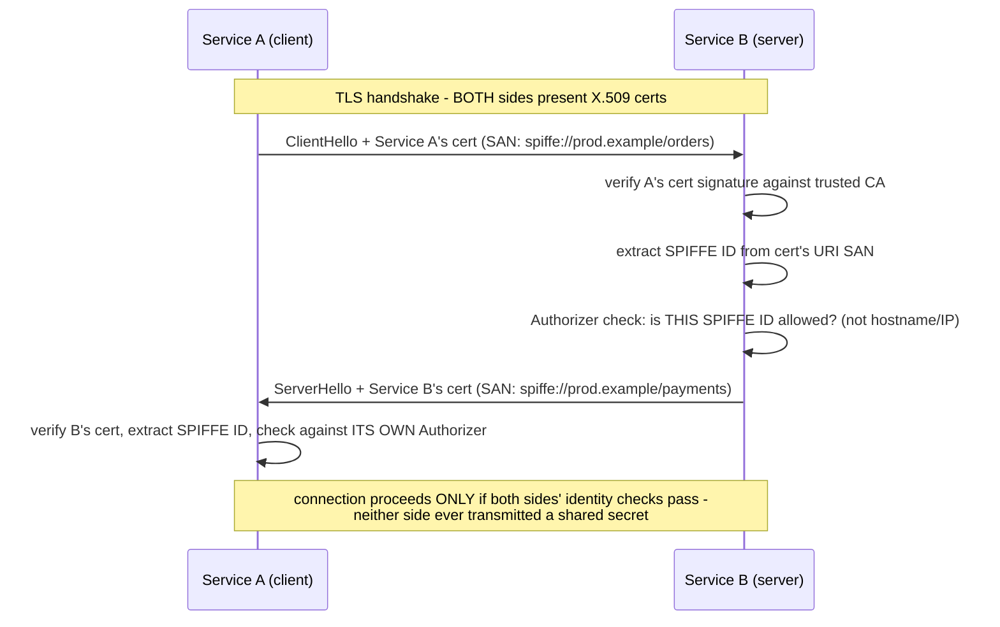
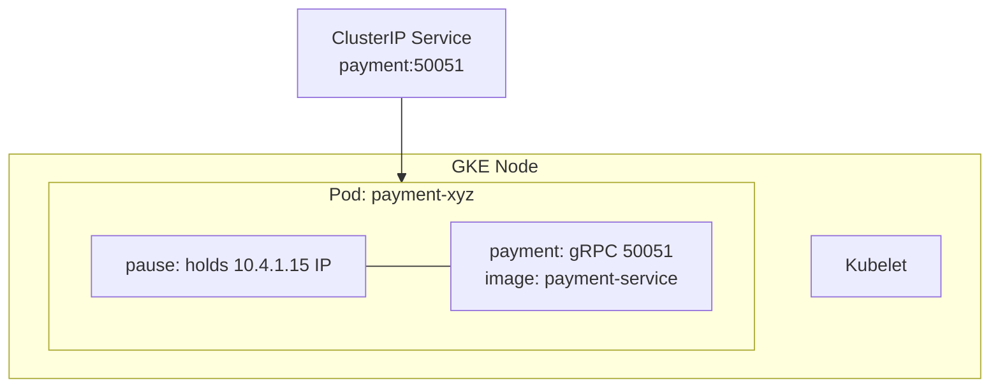

**TL;DR:** How does a service prove its identity to another service without a shared secret? Mutual TLS has both sides present X.509 certificates carrying a SPIFFE ID in a URI SAN, verified against a trusted CA and checked against an explicit authorization rule — identity is proven cryptographically, with no hostname/IP lookup and no shared secret involved.

> **In plain English (30 sec):** Two services. Each has a secret certificate from a CA. Client sends its cert. Server checks: "Is the identity in this cert allowed for this service?" No hostname check.

**Real repo:** [`spiffe/spire`](https://github.com/spiffe/spire), [`spiffe/go-spiffe`](https://github.com/spiffe/go-spiffe)

## 1. The Engineering Problem: shared secrets don't scale as a service-identity mechanism

You already have API keys (the previous lesson) that your services use to talk to each other. Those keys get embedded in configs and environment variables across your whole platform. Store those keys anywhere and a leak compromises every service that holds them. You need a way for service A to prove "I am specifically Service A" using something that can't be shared or replayed like a static secret.

Works fine when all services are in one data center. Breaks when you scale:

- **Single secret everywhere:** One compromise affects all services
- **Rotation nightmare:** Changing secrets means updating every service that uses them
- **Attacker advantage:** Stolen key works everywhere, no identity proof needed

You need cryptographic identity — a certificate proves "this service is service X" before any conversation starts.

---

## 2. The Technical Solution: mutual TLS, verifying a cryptographic identity embedded in the cert — not a hostname

**Mutual TLS (mTLS):** both client and server present X.509 certificates during the handshake, each independently verifiable against a trusted CA, with neither side needing the other's private key or any shared secret. For *service* identity specifically — as opposed to the traditional "does this certificate match the hostname I dialed" browser model — the certificate embeds the service's actual identity as a URI Subject Alternative Name, in the **SPIFFE ID** format (`spiffe://trust-domain/workload`). Both issuance and verification check this identity, completely decoupled from hostname or IP.

Here's what happens:



Two mechanism-level facts:

- **Certificate issuance:** CSR must carry exactly one URI SAN validated as a well-formed identity belonging to the expected trust domain, before signing. This is checked at the certificate authority, not left to whoever requests a cert.
- **Verification:** Checks the peer's identity against an explicit authorization rule — a specific expected ID, one of a list, or membership in a trust domain — never against the network address.

3 things to remember:

- **Certificate carries SPIFFE ID:** Identity is in URI SAN, not hostname, so load balancer routing doesn't affect authentication.
- **Both sides verified:** Service A proves identity to Service B, and Service B proves identity to Service A.
- **Issuer is trusted CA:** Both sides trust the same root CA, so verification is mutual.

## 3. Concept in Isolation (the mechanism, no prod wiring)

Two services show their certificates to each other, verify SPIFFE IDs match expected patterns, connection proceeds:

```yaml
apiVersion: apps/v1
kind: Deployment
metadata:
  name: payment-service
spec:
  replicas: 3
  selector:
    matchLabels:
      app: payment-service
spec:
  containers:
  - name: service
    image: payment-service:latest
    env:
    - name: TRUST_DOMAIN
      value: prod.example
    - name: SPIFFE_ID
      value: spiffe://prod.example/payment-service
```

**What this does:** Client and server each have certificates with SPIFFE IDs. Service B checks Client A's cert against its own allowed SPIFFE ID list. Service A checks Service B's cert against Service A's own list. Connection requires both verifications.

## 4. Real Production Incident

**Incident: Service-to-service auth bypassed through certificate forgery**

**T+0:** Nightly monitoring rotation scheduled for auth service certificates.

**T+2m:** Service A (orders) fails to connect to Service B (payments) after deployment.

**T+10m:** Service A logs: "received unsupported certificate type." Service B accepts anything that passes CA signature check.

**T+15m:** Team A discovers Service B only validates client cert against hostname. No SPIFFE ID check.

**Impact:** Orders service can connect using any valid CA-signed cert, not just its own SPIFFE ID.

**Root cause:**
```go
// Service B auth code
func verifyClientCert(cert *x509.Certificate) bool {
    // only checks CA signature - sp you don't check anything else
    return ca.Verify(cert)
}
```

**Fix:**
```go
func verifyClientCert(cert *x509.Certificate) bool {
    if !ca.Verify(cert) {
        return false
    }
    // extract SPIFFE ID from cert's URI SAN
    spiffeID, err := spiffeid.FromCert(cert)
    if err != nil {
        return false
    }
    // check against SP's allowed SPIFFE ID list
    return sp.Allowed(spiffeID)
}
```

**Prevention:** Alert when certificate validation doesn't check SPIFFE IDs. Audit all service-to-service auth logic for missing identity verification.

## 5. Production Design — SPIFFE/SPIRE workload identity

Real implementation from `spiffe/spire` — trust domain `example.org`:



**Real config from prod:**

```yaml
serviceAccountName: payment-service
spec:
  containers:
  - name: payment
    image: payment-service
    readinessProbe: { grpc: { port: 50051 } }
    env:
    - name: SPIFFE_ENDPOINT_SOCKET
      value: unix:///var/run/spire/sockets/agent.sock
```

**3 takeaways:**

- Service accounts carry SPIFFE IDs via workload identity
- `spiffeid.FromCert()` extracts identity from received certificates
- Service-to-service auth checks SPIFFE IDs, not hostnames

## 6. Cloud Lens — How GCP/AWS actually implements this

**GKE (Google):**
- GKE Autopilot hides pause container completely. You never see node. Pod IP from VPC-native range.
- Command: gcloud container clusters create-auto my-cluster --region us-central1
- Pod IP is real VPC IP, routable.

**EKS (AWS):**
- EKS uses aws-vpc-cni — Pod IP is real ENI IP from VPC subnet. Limited IPs per node.
- If Pod fails "Insufficient IPs", need bigger node or prefix delegation.
- Command: kubectl get pods -o wide shows VPC IPs.

**Terraform for Pod with real config:**

```hcl
resource "kubernetes_pod" "report" {
  metadata { name = "report-generator" }
  spec {
    termination_grace_period_seconds = 10
    container {
      name  = "app"
      image = "mycompany/report-app:v1"
      resources { requests = { cpu = "100m", memory = "64Mi" } }
    }
    container {
      name  = "shipper"
      image  = "mycompany/log-shipper:v1"
    }
  }
}
```

**Difference:** On GCP, Pod IP is free. On AWS, Pod IP costs ENI IP. That's why AWS has maxPodsPerNode limit.

## 7. Library Lens — Exact library + code you would use

If you write Go with SPIFFE workload identity:

```go
// go.mod: github.com/spiffe/go-spiffe/v2@v1.1.2
package main

import (
    "context"
    spiffeid "github.com/spiffe/go-spiffe/v2/spiffeid"
    spiffetls "github.com/spiffe/go-spiffe/v2/svid/tls"
)

func main() {
    // SPIFFE ID for this workload
    id := spiffeid.Must("spiffe://example.org/payment-service")

    // Create TLS config that uses workload identity from SPIRE agent
    config := spiffetls.TLSServerConfig{
        RootCAs: spiffeid.RequireFromString("spiffe://example.org/ca"),
        Authenticators: []spiffetls.Authenticator{
            spiffetls.AuthorizeID(id),
        },
    }

    // Start server with SPIFFE-enabled TLS
    server := grpc.NewServer(grpc.Creds(config.Dial()))
    // register services...
    server.Serve(listener)
}
```

Bash equivalent for running services:

```bash
# Generate workload certificate using SPIRE agent
spiffe trust-bundle fetch --output /tmp/bundle.pem

# Start service with SPIFFE TLS
SPIFFE_TRUST_BUNDLE=/tmp/bundle.pem \
SPIFFE_SVID_PATH=/tmp/svid.pem \
python payment-service.py
```

## 8. What Breaks & How to Troubleshoot

**Break 1: Service-to-service connections fail after SPIFFE rotation**
- Symptom: "certificate expired" or "SPIFFE ID mismatch" errors
- Why: Certificates renewed, identity changed, other services haven't updated yet
- Detect: `grpc logs` show TLS handshake failures, `spiffe` agent logs show renewal
- Fix: Rotate all certificates simultaneously, or use short-lived certs with long-lived trust bundles

**Break 2: Cert verification succeeds but identity check fails**
- Symptom: "connection rejected" despite valid certificate
- Why: SPIFFE ID in cert doesn't match expected pattern for the destination service
- Detect: `certLogs` show "SPIFFE ID: spiffe://prod.example/orders" but expected "spiffe://prod.example/payments"
- Fix: Verify SPIFFE ID patterns configured in both services and validation logic

**Break 3: Service A can't reach Service B due to CA certificate mismatch**
- Symptom: "certificate is not trusted" errors
- Why: Different CAs configured for client verification vs server verification
- Detect: Client CA bundle used on server side, or server CA bundle used on client side
- Fix: Ensure both services use the same root CA for trust validation

**Break 4: Workload identity certificate stolen and used elsewhere**
- Symptom: Unauthorized service connections with valid certificates
- Why: Certificate replay — certificates can be stolen and replayed in other clusters/regions
- Detect: Service logs show valid cert but from unexpected source IP/region
- Fix: Add certificate pinning or include short-lived certs with long-lived trust bundles

**Break 5: Service mesh sidecar configuration wrong**
- Symptom: Service can't reach upstream services despite correct mTLS config
- Why: Sidecar misconfigured for SPIFFE trust domain or auth provider
- Detect: Istio Pilot logs show "unable to reach destination" with mTLS enabled
- Fix: Verify sidecar service account and SPIFFE IDs in mesh config

---

## Source

- **Concept:** mTLS (certificate-based service auth)
- **Domain:** security
- **Repo:** [spiffe/spire](https://github.com/spiffe/spire) → [`pkg/common/x509svid/csr.go`](https://github.com/spiffe/spire/blob/main/pkg/common/x509svid/csr.go) — the production workload-identity issuance system; [spiffe/go-spiffe](https://github.com/spiffe/go-spiffe) → [`spiffetls/tlsconfig/authorizer.go`](https://github.com/spiffe/go-spiffe/blob/main/spiffetls/tlsconfig/authorizer.go) — the reference SPIFFE-aware mTLS verification library.