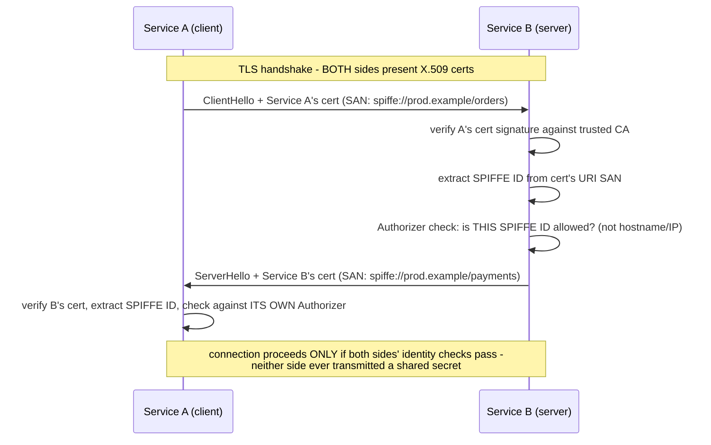

## 1. The Engineering Problem: shared secrets don't scale as a service-identity mechanism

API keys and shared secrets (the previous lesson) have a real structural weakness for service-to-service auth specifically: the *same* secret has to be distributed to and held by every calling service, so a leak anywhere — an exposed env var, a compromised image, a misconfigured log pipeline — compromises every holder simultaneously, and rotation means coordinating every holder at once. You need a way for a service to prove "I am specifically service X" using something that can't be shared or replayed the way a static secret can.

---

## 2. The Technical Solution: mutual TLS, verifying a cryptographic identity embedded in the cert — not a hostname

**Mutual TLS (mTLS)**: both client and server present X.509 certificates during the handshake, each independently verifiable against a trusted CA, with neither side needing the other's private key or any shared secret. For *service* identity specifically — as opposed to the traditional "does this certificate match the hostname I dialed" browser model — the certificate embeds the service's actual identity as a URI Subject Alternative Name, in the **SPIFFE ID** format (`spiffe://trust-domain/workload`). Both issuance and verification check this identity, completely decoupled from hostname or IP.



Two mechanism-level facts worth naming precisely:

- **Certificate issuance requires exactly one URI SAN, validated as a well-formed identity belonging to the expected trust domain, before signing.** This is checked at the certificate authority, not left to whoever requests a cert — a CSR that doesn't carry a properly-scoped identity is rejected before it ever becomes a trusted credential.
- **Verification checks the peer's identity against an explicit authorization rule — a specific expected ID, one of a list, or membership in a trust domain — never against the network address the connection was made through.** This is the real departure from traditional TLS: hostname/IP is irrelevant to the identity check, which is exactly what makes it work correctly behind load balancers, across autoscaling, and through service mesh sidecar routing where "hostname" doesn't map cleanly to "which specific workload is this."

---

## 3. The clean example (concept in isolation)

```go
// Issuance: reject a CSR that doesn't carry exactly one valid identity URI
if len(csr.URIs) != 1 {
    return errors.New("CSR must have exactly one URI SAN")
}
id, err := spiffeid.FromURI(csr.URIs[0])
if id.TrustDomain() != expectedTrustDomain {
    return errors.New("identity does not belong to this trust domain")
}

// Verification: check identity, not hostname
authorizer := tlsconfig.AuthorizeID(spiffeid.RequireFromString("spiffe://prod.example/payments"))
// used inside the TLS config - connection succeeds ONLY if the peer's
// cert carries EXACTLY this identity, regardless of what IP it came from
```

---

## 4. Production reality (from `spiffe/spire` and `spiffe/go-spiffe`)

```go
// spire: pkg/common/x509svid/csr.go - issuance-time identity validation
func ValidateCSR(csr *x509.CertificateRequest, td spiffeid.TrustDomain) error {
    if err := csr.CheckSignature(); err != nil {
        return fmt.Errorf("CSR signature check failed: %w", err)
    }

    if len(csr.URIs) != 1 {
        return errors.New("CSR must have exactly one URI SAN")
    }

    id, err := spiffeid.FromURI(csr.URIs[0])
    if err != nil {
        return fmt.Errorf("CSR with SPIFFE ID %q is invalid: %w", csr.URIs[0], err)
    }
    if id != td.ID() {
        return fmt.Errorf("CSR with SPIFFE ID %q is invalid: must use the trust domain ID for trust domain %q", id, td)
    }
    return nil
}
```

```go
// go-spiffe: spiffetls/tlsconfig/authorizer.go - connection-time identity check
type Authorizer func(id spiffeid.ID, verifiedChains [][]*x509.Certificate) error

func AuthorizeID(allowed spiffeid.ID) Authorizer {
    return AdaptMatcher(spiffeid.MatchID(allowed))
}

func AuthorizeMemberOf(allowed spiffeid.TrustDomain) Authorizer {
    return AdaptMatcher(spiffeid.MatchMemberOf(allowed))
}
```

What this teaches that a hello-world can't:

- **`len(csr.URIs) != 1` rejects a certificate signing request outright if it carries zero OR more than one URI SAN.** A workload identity certificate is meant to represent exactly one identity — allowing multiple would create ambiguity about which identity a downstream Authorizer should actually check, so the issuance path closes that ambiguity structurally, before a cert is ever signed.
- **`Authorizer` is a function type (`func(id spiffeid.ID, verifiedChains [][]*x509.Certificate) error`), not a fixed comparison.** `AuthorizeID` (exact match), `AuthorizeOneOf` (allow-list), and `AuthorizeMemberOf` (trust-domain-wide) are all just different functions matching this same signature — a caller picks the granularity of trust it needs (one specific peer, a known set, or "anyone in our own infrastructure's trust domain") without the underlying TLS verification code changing at all.
- **`AuthorizeMemberOf` checks trust-domain membership, not a specific workload identity at all.** This is the real mechanism behind "any service in our mesh can talk to this shared internal endpoint" — a legitimately different, broader authorization decision from `AuthorizeID`'s "only this exact service," made explicit as a distinct named function rather than a parameter buried in a general-purpose comparison.

Known-stale fact: the traditional TLS mental model — "verification means checking the certificate matches the hostname I dialed" — doesn't apply here at all. Service-to-service mTLS built on workload identity (SPIFFE/SPIRE) explicitly ignores hostname/IP in its authorization decision; only the cryptographically-proven SPIFFE ID embedded in the cert matters. This is precisely why it works correctly in environments where "hostname" is unstable or meaningless at the workload level — behind a load balancer, across pod restarts with new IPs, or through a service mesh sidecar — situations where hostname-based verification alone would be the wrong tool.

---

## Source

- **Concept:** mTLS (certificate-based service auth)
- **Domain:** security
- **Repo:** [spiffe/spire](https://github.com/spiffe/spire) → [`pkg/common/x509svid/csr.go`](https://github.com/spiffe/spire/blob/main/pkg/common/x509svid/csr.go) — the production workload-identity issuance system; [spiffe/go-spiffe](https://github.com/spiffe/go-spiffe) → [`spiffetls/tlsconfig/authorizer.go`](https://github.com/spiffe/go-spiffe/blob/main/spiffetls/tlsconfig/authorizer.go) — the reference SPIFFE-aware mTLS verification library.
