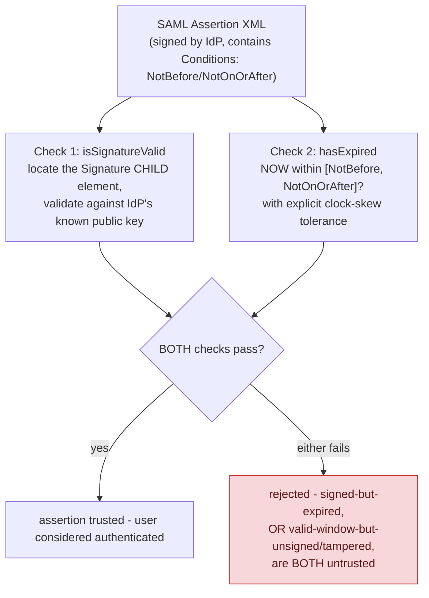

**TL;DR:** Why is verifying a SAML assertion harder than verifying a JWT? A SAML verifier has to independently check that the signature covers the specific signed assertion element (not just that a signature exists somewhere in the XML) and that the assertion is still inside its validity window, because unlike a JWT's single compact signed string, XML signatures can be misdirected via signature-wrapping attacks.

**Real repo:** [`keycloak/keycloak`](https://github.com/keycloak/keycloak)

## 1. The Engineering Problem: SSO needs a signed vouching statement, and XML signatures have a sharper edge than a JWT's

Single sign-on needs an Identity Provider (IdP) to vouch for a user's identity to many Service Providers (SPs) without re-prompting credentials each time. The SP receiving that vouching statement — a SAML **assertion** — has to verify it was genuinely signed by the trusted IdP, hasn't expired, and isn't a replay of an assertion meant for a different flow. Unlike a JWT (a compact string where the signature trivially covers the whole thing), a SAML assertion is a full XML document, and XML signatures can cover a *specific element* within a larger structure — which historically opened a real, distinct vulnerability class: **XML signature wrapping**, where an attacker takes a validly-signed assertion and relocates it inside a new, attacker-controlled XML wrapper, tricking a careless verifier into trusting the wrong element.

---

## 2. The Technical Solution: verify the signature on the right element, AND independently check the validity window

A real SAML verifier separates two genuinely independent checks, and both must pass — neither alone is sufficient trust:



The signature check specifically has to answer a question a JWT verifier never faces: *which element in this document is actually signed?* A SAML response can carry multiple nested elements; a naive verifier that checks "is there a valid signature somewhere in this document" without confirming it covers the specific assertion element being trusted is exactly the gap signature-wrapping attacks exploit — an attacker inserts a new, unsigned (forged) assertion alongside the original signed one, hoping the verifier's application logic reads the forged one while the signature check only confirms the original, untouched one is still validly signed.

Core truths: **the validity window check uses an explicit clock-skew parameter**, the same real-world concern seen in JWT `exp` validation — but here it's two-sided (`NotBefore` *and* `NotOnOrAfter`), not just an expiry; and **signature validity and time validity are checked as separate, independent conditions**, so a system can log (and distinguish) "this assertion's signature failed" from "this assertion's signature is fine but it's expired" — genuinely different failure modes worth telling apart operationally.

---

## 3. The clean example (concept in isolation)

```java
boolean signatureOk = AssertionUtil.isSignatureValid(assertionElement, idpPublicKey);
boolean expired = AssertionUtil.hasExpired(assertion, clockSkewMillis);

if (!signatureOk || expired) {
    throw new SecurityException("assertion rejected");
}
// only trust the identity claims if BOTH checks passed independently
```

---

## 4. Production reality (from `keycloak/keycloak`)

```java
// saml-core/.../v2/util/AssertionUtil.java - signature verification
public static boolean isSignatureValid(Element element, KeyLocator keyLocator) {
    try {
        SAML2Signature.configureIdAttribute(element);

        Element signature = getSignature(element);   // locate the SPECIFIC signed element
        if (signature != null) {
            return XMLSignatureUtil.validateSingleNode(signature, keyLocator);
        }
    } catch (Exception e) {
        logger.signatureAssertionValidationError(e);
    }
    return false;
}
```

```java
// time-window verification, with explicit clock-skew tolerance
public static boolean hasExpired(AssertionType assertion, long clockSkewInMilis) throws ConfigurationException {
    boolean expiry = false;
    ConditionsType conditionsType = assertion.getConditions();

    if (conditionsType != null) {
        XMLGregorianCalendar now = XMLTimeUtil.getIssueInstant();
        XMLGregorianCalendar notBefore = conditionsType.getNotBefore();
        XMLGregorianCalendar updatedNotBefore = XMLTimeUtil.subtract(notBefore, clockSkewInMilis);
        XMLGregorianCalendar notOnOrAfter = conditionsType.getNotOnOrAfter();
        XMLGregorianCalendar updatedOnOrAfter = XMLTimeUtil.add(notOnOrAfter, clockSkewInMilis);

        expiry = !XMLTimeUtil.isValid(now, updatedNotBefore, updatedOnOrAfter);
        if (expiry) {
            logger.samlAssertionExpired(assertion.getID());
        }
    }
    return expiry;
}
```

```java
// createTimedConditions - the ISSUING side setting the same window
public static void createTimedConditions(AssertionType assertion, long durationInMilis, long clockSkew) {
    XMLGregorianCalendar issueInstant = assertion.getIssueInstant();
    XMLGregorianCalendar assertionValidityLength = XMLTimeUtil.add(issueInstant, durationInMilis);
    XMLGregorianCalendar beforeInstant = XMLTimeUtil.subtract(issueInstant, clockSkew);

    ConditionsType conditionsType = new ConditionsType();
    conditionsType.setNotBefore(beforeInstant);
    conditionsType.setNotOnOrAfter(assertionValidityLength);
    assertion.setConditions(conditionsType);
}
```

What this teaches that a hello-world can't:

- **`isSignatureValid` explicitly calls `getSignature(element)` to locate the specific `Signature` child before validating it** — it does not just check "is there a valid signature anywhere in this XML document." This distinction is the entire defense against signature-wrapping-style confusion: the verification is scoped to a specific, located element, not a document-wide "some signature checks out" fact that an attacker could satisfy by leaving the original signed content untouched elsewhere while injecting new, unsigned content the application actually reads.
- **The issuing side (`createTimedConditions`) and the verifying side (`hasExpired`) both apply the SAME clock-skew adjustment, in opposite directions** — the issuer backdates `NotBefore` by the skew amount, and the verifier widens both bounds by the skew amount again when checking. This double-application is deliberate: it accounts for clock drift on both the IdP's machine (at issuance) and the SP's machine (at verification), not just one side.
- **`hasExpired` logs `assertion.getID()` specifically on expiry** — a real operational detail: distinguishing "this particular assertion (identifiable by ID) expired" from a generic verification failure is what makes a production SSO integration's logs actually debuggable when a user reports "I can't log in," rather than a single opaque "authentication failed" message covering every possible rejection reason.

Known-stale fact: SAML is still very much present in enterprise identity providers, but OpenID Connect is the modern default choice for *new* integrations — its flat, compact JWT-based trust model has no equivalent to "which XML element is really signed" ambiguity, sidestepping this entire class of historical SAML vulnerability by construction. Choosing SAML for a greenfield integration today is usually driven by an existing enterprise IdP requirement, not a technical preference for XML-based assertions over JWTs.

---

## Source

- **Concept:** SSO & SAML
- **Domain:** security
- **Repo:** [keycloak/keycloak](https://github.com/keycloak/keycloak) → [`saml-core/src/main/java/org/keycloak/saml/processing/core/saml/v2/util/AssertionUtil.java`](https://github.com/keycloak/keycloak/blob/main/saml-core/src/main/java/org/keycloak/saml/processing/core/saml/v2/util/AssertionUtil.java) — a full IAM server with real SAML/OIDC/SSO support.
