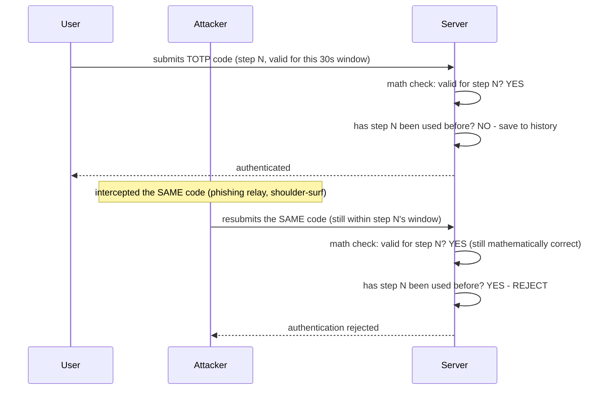
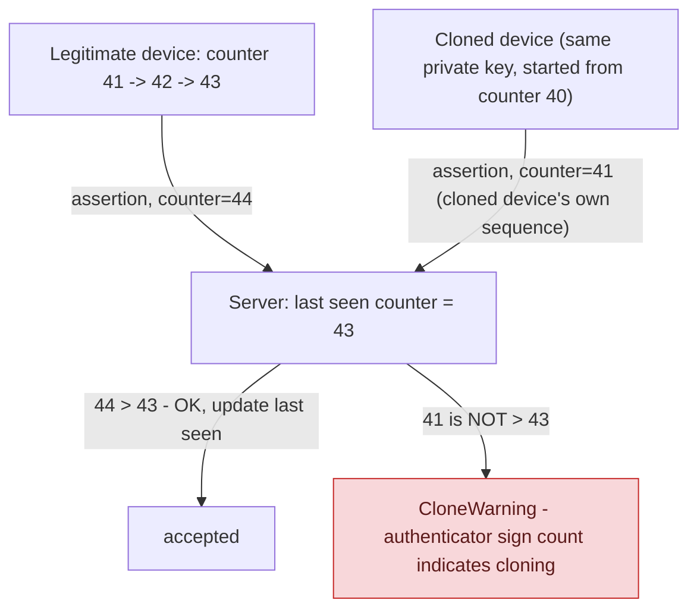

**TL;DR:** How does a security key prove it wasn't cloned, without ever sharing its private key? Every WebAuthn authenticator increments a signature counter with each use and embeds it in the signed assertion, so the server rejects any new assertion whose counter isn't strictly greater than the last one it saw — exactly what happens once a cloned device starts signing from its own duplicate sequence.

**Real repo:** [`authelia/authelia`](https://github.com/authelia/authelia)

## 1. The Engineering Problem: two different second-factor models, two different ways to get compromised

TOTP ("something you have" — an authenticator app) is a **shared-secret** model: both server and device know the same seed, and a valid 6-digit code stays valid for an entire time window (typically 30 seconds, often with adjacent-window tolerance for clock skew). A code intercepted via phishing or shoulder-surfing has a real window where an attacker could replay it — unless the server does more than just check "is this code mathematically valid for the current time." WebAuthn/passkeys solve a different problem entirely: no shared secret exists anywhere — only the device ever holds its private key, using public-key cryptography. But that raises a new question: if a private key were somehow physically duplicated onto a second device (a cloned authenticator), how would the server ever detect it, since both devices could produce cryptographically valid signatures?

---

## 2. The Technical Solution: TOTP tracks which code was already spent; WebAuthn tracks a signature counter that must always increase

**TOTP replay defense**: it's not enough to check that a submitted code is mathematically valid for the current time window — the server must also track *which specific time-step* has already been consumed, and reject a resubmission of the same step even though it would still pass the time-based math.



**WebAuthn clone defense**: every authenticator increments a signature counter on each use and includes it in the signed assertion. The server remembers the last counter value it saw for that specific credential; a new assertion's counter must be strictly greater, or something is wrong.



Core truths: **TOTP's defense is about *time-window reuse*, not the shared secret's strength** — even a perfectly random, unguessable seed doesn't stop replay within a single valid window unless the server separately tracks consumption; and **WebAuthn's clone defense doesn't require detecting the clone directly** — it only requires noticing that a counter, which should monotonically increase across all uses of one physical key, went backward or repeated, which is exactly what happens once two devices start signing from what should be a single, never-duplicated sequence.

---

## 3. The clean example (concept in isolation)

```python
# TOTP: reject reuse of an already-consumed step
valid, step = totp_validate(code, secret)
if valid and not history.exists(user, step):
    history.save(user, step)
    grant_access()
else:
    reject()  # valid code, but already used - OR just wrong

# WebAuthn: reject a non-increasing signature counter
if assertion.sign_count <= credential.last_seen_count:
    raise CloneWarning("authenticator sign count did not increase")
credential.last_seen_count = assertion.sign_count
```

---

## 4. Production reality (from `authelia/authelia`)

```go
// internal/handlers/handler_sign_totp.go
if valid, step, err = ctx.Providers.TOTP.Validate(ctx, bodyJSON.Token, config); err != nil {
    // ...
}

if exists, err = ctx.Providers.StorageProvider.ExistsTOTPHistory(ctx, userSession.Username, step*uint64(config.Period)); err != nil {
    // ...
}

if exists {
    // ... reject: "the user has already used this code recently and will not be permitted to reuse it"
} else if err = ctx.Providers.StorageProvider.SaveTOTPHistory(ctx, userSession.Username, step*uint64(config.Period)); err != nil {
    // ...
}
```

```go
// internal/handlers/handler_sign_webauthn.go
if c.Authenticator.CloneWarning {
    ctx.Logger.WithError(fmt.Errorf("authenticator sign count indicates that it is cloned")).
        Errorf("Error occurred validating a WebAuthn authentication challenge for user '%s': error occurred validating the authenticator response", userSession.Username)

    ctx.SetStatusCode(fasthttp.StatusForbidden)
    ctx.SetJSONError(messageMFAValidationFailed)
    return
}
```

What this teaches that a hello-world can't:

- **`ExistsTOTPHistory` is keyed by `step*uint64(config.Period)`, not by the raw 6-digit code itself.** Keying by the derived time-step (rather than the code string) means the history check is correct even if two different secrets happened to produce the same 6-digit code at the same step — the uniqueness that matters is "this user, this time-step," not "this specific digit sequence."
- **`DisableReuseSecurityPolicy` exists as an explicit, named opt-out, logged as a warning when active** — Authelia's authors clearly considered this protection important enough to make disabling it a deliberate, auditable configuration choice rather than a silent default, and even when disabled, the event is still logged so an operator can see reuse happening.
- **`CloneWarning` is a property Authelia checks and reacts to, not something it computes itself** — the underlying WebAuthn library tracks the counter comparison internally and surfaces this boolean; Authelia's job is simply to treat a `true` value as an authentication failure. This is a real integration pattern worth noting: the hard cryptographic bookkeeping (counter tracking, comparison) is handled by the WebAuthn library layer, while the *policy decision* ("what do we do when clone is suspected") stays in application code.

Known-stale fact: many TOTP explainers stop at "compare the time-based code to what the server computes" and never mention step-reuse tracking — without it, a phished or intercepted TOTP code remains fully usable by an attacker for the rest of its validity window even after the legitimate user already consumed it once, which is a real, exploitable gap, not a theoretical one. Separately, "passkey" specifically refers to a *discoverable* WebAuthn credential usable for primary, passwordless sign-in — a step beyond WebAuthn used purely as a second factor alongside a password, which is what Authelia's dual TOTP-and-WebAuthn setup here still represents; not every WebAuthn integration is a passkey-based passwordless flow.

---

## Source

- **Concept:** Multi-factor authentication (TOTP/WebAuthn/passkeys)
- **Domain:** security
- **Repo:** [authelia/authelia](https://github.com/authelia/authelia) → [`internal/handlers/handler_sign_totp.go`](https://github.com/authelia/authelia/blob/master/internal/handlers/handler_sign_totp.go), [`internal/handlers/handler_sign_webauthn.go`](https://github.com/authelia/authelia/blob/master/internal/handlers/handler_sign_webauthn.go) — a real forward-auth SSO + MFA proxy.
