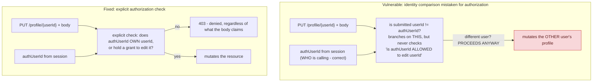

**TL;DR:** What does "broken access control" actually look like in real code? It's an endpoint that verifies who's calling but then trusts a client-supplied ID to decide which resource to act on, without an explicit, independent check that the caller is actually allowed to touch that specific resource — an identity comparison is not an authorization decision.

**Real repo:** [`WebGoat/WebGoat`](https://github.com/WebGoat/WebGoat)

## 1. The Engineering Problem: verifying WHO someone is doesn't verify WHAT they're allowed to touch

Authentication (who are you) and authorization (what are you allowed to do) are separate checks — and a genuinely common real-world bug pattern is implementing the first correctly while quietly skipping the second. An endpoint verifies the caller is logged in, then trusts a client-supplied identifier (a URL path segment, a request body field) to decide *which resource* gets read or modified, without independently checking whether the authenticated identity is actually permitted to act on that specific resource. This is OWASP's #1 reported vulnerability category precisely because "check who you are" is well-understood infrastructure most frameworks build in, while "check whether THIS identity may act on THIS specific resource" is a second check that has to be correctly re-implemented at every single endpoint touching user-scoped data — miss it once, anywhere, and the gap is exploitable.

---

## 2. The Technical Solution: never let a client-supplied ID stand in for an authorization decision

The fix isn't complicated in principle: before acting on any resource identified by a client-supplied ID, independently verify the authenticated principal owns it or holds an explicit grant — a real authorization check, never an identity *comparison* used as a stand-in for one.



Core truth: **an identity comparison is not an authorization decision.** Checking "is the submitted ID different from mine" tells you *which branch of logic to run* — it says nothing about whether running that branch should be permitted at all. The missing piece is always an explicit, positive check — "this identity is allowed to do this" — not an absence-of-mismatch check used as a substitute.

---

## 3. The clean example (concept in isolation)

```python
# VULNERABLE - trusts the path parameter, no ownership/grant check
@app.put("/profile/{user_id}")
def edit_profile(user_id, body, auth_user_id):
    if body.user_id != auth_user_id:
        apply_edit(user_id, body)   # edits ANY user's profile, no check that this is allowed

# FIXED - explicit authorization check before acting
@app.put("/profile/{user_id}")
def edit_profile(user_id, body, auth_user_id):
    if not authz.can_edit(auth_user_id, user_id):   # real, positive permission check
        raise Forbidden()
    apply_edit(user_id, body)
```

---

## 4. Production reality (from `WebGoat/WebGoat`, OWASP's own vulnerable-by-design training app)

```java
// src/main/java/org/owasp/webgoat/lessons/idor/IDOREditOtherProfile.java
@PutMapping(path = "/IDOR/profile/{userId}", consumes = "application/json")
public AttackResult completed(
    @PathVariable("userId") String userId, @RequestBody UserProfile userSubmittedProfile) {

  String authUserId = (String) userSessionData.getValue("idor-authenticated-user-id");
  // this is where it starts ... accepting the user submitted ID and assuming it will be the
  // same as the logged in userId and not checking for proper authorization
  // Certain roles can sometimes edit others' profiles, but we shouldn't just assume that and
  // let everyone, right? Except that this is a vulnerable app ... so we will

  UserProfile currentUserProfile = new UserProfile(userId);
  if (userSubmittedProfile.getUserId() != null
      && !userSubmittedProfile.getUserId().equals(authUserId)) {
    // let's get this started ...
    currentUserProfile.setColor(userSubmittedProfile.getColor());
    currentUserProfile.setRole(userSubmittedProfile.getRole());
    // ... proceeds to persist the change to ANOTHER user's profile
  }
}
```

What this teaches that a hello-world can't:

- **The code's own comment names the exact bug pattern**: "accepting the user submitted ID and assuming it will be the same as the logged in userId and not checking for proper authorization." This is OWASP deliberately writing the vulnerability's root cause into the source itself, as a teaching artifact — the gap isn't subtle once named, but it's exactly the kind of gap that's easy to miss while reviewing code that otherwise "looks like" it's doing an identity check.
- **The `if` condition (`!userSubmittedProfile.getUserId().equals(authUserId)`) is doing double duty it shouldn't** — it's simultaneously deciding "is this a self-edit or an other-edit" AND (incorrectly) treated as sufficient gating for whether the other-edit should be allowed. A correct implementation needs those to be two separate questions: which branch applies, and separately, is the authenticated user permitted to be in that branch at all.
- **`currentUserProfile.setRole(userSubmittedProfile.getRole())` lets the caller set the target profile's ROLE, not just cosmetic fields like color** — this IDOR isn't just "read someone else's data," it's a privilege-escalation-adjacent bug: an attacker exploiting this could potentially elevate another account's role, compounding a missing-authorization-check bug into a full account-takeover-adjacent one.

**A pattern, not three unrelated bugs**: two other real vulnerability classes covered earlier in this security curriculum are variations of the exact same root cause — trusting something the client controls in place of an explicit, independent check. JWT algorithm-confusion attacks happen when a verifier trusts the token's own (attacker-editable) `alg` header instead of pinning the algorithm server-side. Session fixation happens when a server accepts a pre-existing session identifier without rotating it at the moment trust actually changes (login). All three — broken access control, alg confusion, session fixation — are the same underlying lesson wearing different clothes: never let client-supplied state substitute for a server-side, explicit trust decision.

Known-stale fact: Broken Access Control has moved to the #1 position in the current OWASP Top 10, up from a lower rank in earlier editions — reflecting that it's become the *most commonly reported* real-world vulnerability class, not a niche concern. It's also comparatively resistant to automated scanning: unlike SQL injection or XSS, which have detectable syntactic signatures, "is this authorization check missing" requires understanding the application's own business logic about who should be allowed to do what — a genuine, structural reason this class persists despite decades of tooling improvements everywhere else.

---

## Source

- **Concept:** Common authN/authZ vulnerabilities (broken access control, JWT alg confusion, session fixation)
- **Domain:** security
- **Repo:** [WebGoat/WebGoat](https://github.com/WebGoat/WebGoat) → [`src/main/java/org/owasp/webgoat/lessons/idor/IDOREditOtherProfile.java`](https://github.com/WebGoat/WebGoat/blob/main/src/main/java/org/owasp/webgoat/lessons/idor/IDOREditOtherProfile.java) — OWASP's own official, self-documented vulnerable-by-design training application.
