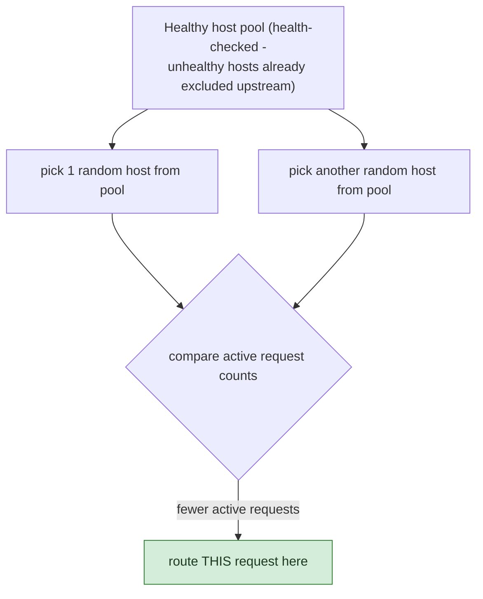

**TL;DR:** Why don't production load balancers check every server before each request? Because true global least-connections requires every proxy instance to have perfectly synchronized state on every backend's connection count; instead, algorithms like Envoy's power-of-two-choices sample just a couple of random healthy hosts and route to whichever has fewer active requests, getting near-optimal load distribution with zero cross-instance coordination.

**Real repo:** [`envoyproxy/envoy`](https://github.com/envoyproxy/envoy)

## 1. The Engineering Problem: true "least connections" needs perfect global knowledge, which doesn't scale

Round-robin is cheap but blind to load — it sends the next request to the next backend regardless of whether that backend is currently the busiest one in the fleet (mid-GC-pause, handling a slow query). "True" least-connections routing, picking whichever backend currently has the fewest active requests, sounds like the obvious fix — but doing it *exactly* requires every load-balancer instance to know every backend's current connection count precisely, at the moment of each decision. With hundreds of backend Pods and many independent proxy instances all routing simultaneously, keeping that global state perfectly synchronized is itself an expensive coordination problem — the "solution" to blind round-robin becomes a distributed-state problem of its own.

---

## 2. The Technical Solution: sample a few random hosts, pick the least loaded of that small sample

First, a structural fork worth naming precisely: **L4** load balancing picks a backend once per TCP connection and is blind to individual HTTP requests multiplexed within it; **L7** load balancing understands HTTP well enough to pick a backend *per request*, even across one persistent connection — which is what makes per-request, load-aware algorithms possible at all.

The algorithm itself, as Envoy actually implements it, doesn't scan every host. It samples a small **random** subset — by default just 2 ("power of two choices") — and picks whichever of that sample currently has fewer active requests:



This is a well-known algorithmic result (power-of-N-choices): sampling just 2 random candidates and picking the better one gets exponentially better load distribution than pure random selection, at a tiny fraction of the coordination cost true global least-connections would need — **no cross-instance state synchronization is required at all**, because each decision only needs local knowledge of the couple of hosts it happened to sample.

Core truths: **health checks feed the pool this algorithm samples from, not the algorithm itself** — an unhealthy host is removed from the eligible set entirely, upstream of any load-balancing logic; the algorithm never has to reason about health directly. And **weighting composes with load-awareness, not against it** — a host's effective selection weight can be scaled down as its active-request count climbs, so even weighted traffic splits stay responsive to real-time load rather than blindly following a fixed ratio.

---

## 3. The clean example (concept in isolation)

```python
import random

def pick_backend(healthy_hosts, n=2):
    candidates = random.sample(healthy_hosts, min(n, len(healthy_hosts)))
    return min(candidates, key=lambda h: h.active_requests)
    # NOT: scan every host (expensive, needs perfect global state)
    # NOT: round-robin (ignores load entirely)
```

---

## 4. Production reality (from `envoyproxy/envoy`)

```cpp
// source/extensions/load_balancing_policies/least_request/least_request_lb.cc
HostSharedPtr LeastRequestLoadBalancer::unweightedHostPickNChoices(const HostVector& hosts_to_use) {
  HostSharedPtr candidate_host = nullptr;

  for (uint32_t choice_idx = 0; choice_idx < choice_count_; ++choice_idx) {
    const int rand_idx = random_.random() % hosts_to_use.size();
    const HostSharedPtr& sampled_host = hosts_to_use[rand_idx];

    if (candidate_host == nullptr) {
      candidate_host = sampled_host;
      continue;
    }

    const auto candidate_active_rq = effectiveActiveRequests(*candidate_host);
    const auto sampled_active_rq = effectiveActiveRequests(*sampled_host);

    if (sampled_active_rq < candidate_active_rq) {
      candidate_host = sampled_host;   // keep whichever of the sample is less loaded
    }
  }

  return candidate_host;
}
```

```cpp
// hostWeight() - weighting scaled DOWN as active requests climb
// weight = load_balancing_weight / (active_requests + 1)^active_request_bias
double LeastRequestLoadBalancer::hostWeight(const Host& host) const {
  double host_weight = static_cast<double>(host.weight());
  const uint64_t active_request_value = effectiveActiveRequests(host) + 1;

  if (active_request_bias_ == 1.0) {
    host_weight = static_cast<double>(host.weight()) / active_request_value;
  } else if (active_request_bias_ != 0.0) {
    host_weight = static_cast<double>(host.weight()) /
                  std::pow(active_request_value, active_request_bias_);
  }
  return host_weight;
}
```

What this teaches that a hello-world can't:

- **`choice_count_` (the "N" in power-of-N-choices) is a tunable, not a hardcoded 2** — a full scan (`unweightedHostPickFullScan`, comparing every host) exists in the same codebase as an alternative for deployments with few enough hosts that the coordination cost of a full comparison is trivial. The random-sampling approach isn't a compromise forced on every deployment; it's specifically the answer for fleets large enough that scanning every host per request would be genuinely expensive.
- **`+1` in `active_request_value` isn't a stylistic choice — it exists purely to avoid dividing by zero** for a host with zero active requests, and the comment even notes the edge case of avoiding integer overflow at `uint64_t` max. Small, unglamorous correctness details like this are exactly what a conceptual explanation of "least request" glosses over.
- **`active_request_bias_ == 0.0` makes this load balancer behave identically to plain round-robin** — the code comment states this directly. Least-request and round-robin aren't two unrelated algorithms; least-request is round-robin generalized with a load-sensitivity knob, and turning that knob to zero recovers round-robin exactly, with the same code path.

Known-stale fact: round-robin is frequently taught as "the" load-balancing algorithm, but it's rarely the default at scale precisely because it has zero awareness of current load — a backend mid-GC-pause or handling a slow query still receives its "fair share" under round-robin, actively making an already-struggling host's problem worse. Modern proxies default to load-aware algorithms like the power-of-N-choices variant shown here specifically to avoid that failure mode, while still avoiding the coordination cost of exact global least-connections.

---

## Source

- **Concept:** Load balancing (L4/L7, algorithms, health checks)
- **Domain:** system-design
- **Repo:** [envoyproxy/envoy](https://github.com/envoyproxy/envoy) → [`source/extensions/load_balancing_policies/least_request/least_request_lb.cc`](https://github.com/envoyproxy/envoy/blob/main/source/extensions/load_balancing_policies/least_request/least_request_lb.cc) — the real, production L4/L7 proxy powering most modern service meshes.


