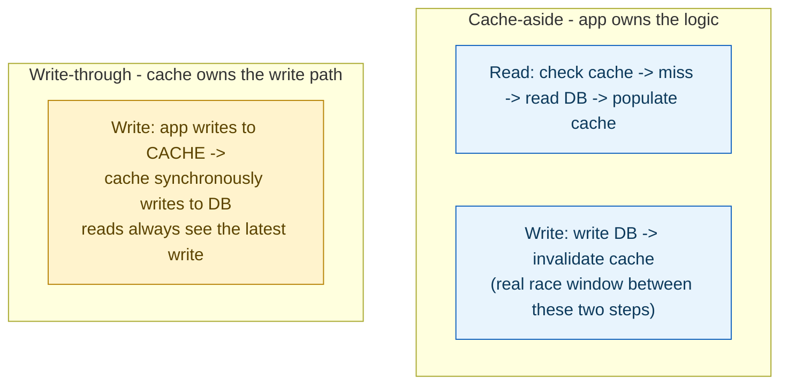
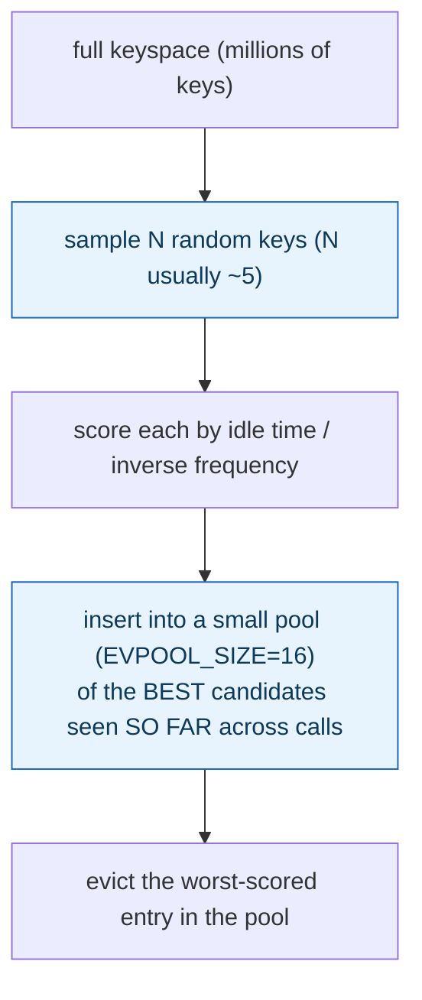

**TL;DR:** What happens when your cache fills up, and who's actually responsible for keeping it in sync? Sync is a choice between cache-aside (the app checks the cache, falls back to the DB on a miss, and invalidates on write) and write-through (writes flow through the cache itself); eviction under memory pressure is handled by sampling a handful of random keys and evicting the worst-scored one from a small candidate pool, not by maintaining a perfectly-ordered LRU list.

**Real repo:** [`redis/redis`](https://github.com/redis/redis)

## 1. The Engineering Problem: two separate questions hide under "add a cache"

"Add caching" conflates two genuinely separate design decisions. First: **who keeps the cache and the source of truth in sync, and when** — does the application check the cache and fall back to the database on a miss (with the database always the authority), or does every write flow *through* the cache layer, which then propagates to the database itself? These have different staleness and complexity tradeoffs. Second, entirely independent of the first: **what happens when the cache is full and a new entry needs room** — under a fixed memory budget, something has to be evicted, and doing that "correctly" (evict the truly least-valuable entry) at real throughput is itself a nontrivial systems problem, not a one-line "just track access order."

---

## 2. The Technical Solution: cache-aside vs write-through for sync; sampled approximation for eviction and expiry



Redis's own eviction mechanism, when memory is full, doesn't maintain a perfectly-ordered LRU/LFU list — that would need constant, expensive bookkeeping on every access across the whole keyspace. Instead it **samples**: pick a handful of random keys, score them by idle time (or inverse access frequency for LFU), keep a small pool of the best eviction candidates seen so far, and evict from that pool:



Expiry (TTL) uses two *complementary* mechanisms, not one: **lazy expiration** removes a key only when something actually tries to access it and notices it's past its expiry; **active expiration** is a separate periodic background cycle that proactively finds and removes expired keys even if nobody ever reads them again. Lazy alone would leak memory for keys nobody revisits; active alone (constantly scanning everything) would waste CPU on keys that get naturally cleaned up by normal access anyway.

Core truths: **a TTL guarantees eventual removal, not synchronized correctness** — it bounds worst-case staleness, it doesn't keep a cache-aside cache correct the moment the underlying data changes; explicit invalidation on write is what actually does that, with TTL as the safety net underneath it. And **eviction sampling is a deliberate, documented tradeoff**, not an accidentally-cut corner — Redis's own source comments frame it explicitly as constant-memory approximation traded for giving up perfect LRU ordering.

---

## 3. The clean example (concept in isolation)

```python
# Cache-aside
def get_product(id):
    if cached := cache.get(id): return cached
    product = db.query(id)
    cache.set(id, product, ttl=300)   # TTL bounds worst-case staleness
    return product

def update_product(id, data):
    db.update(id, data)
    cache.delete(id)                    # explicit invalidation - the REAL correctness mechanism

# Write-through
def update_product_wt(id, data):
    cache.set(id, data)                 # cache itself propagates to DB synchronously
```

---

## 4. Production reality (from `redis/redis`)

```c
/* src/evict.c - LRU approximation algorithm
 * Redis uses an approximation of the LRU algorithm that runs in constant
 * memory. Every time there is a key to expire, we sample N keys (with
 * N very small, usually around 5) to populate a pool of best keys to
 * evict of M keys (the pool size is defined by EVPOOL_SIZE). */
int evictionPoolPopulate(redisDb *db, kvstore *samplekvs, struct evictionPoolEntry *pool) {
    dictEntry *samples[server.maxmemory_samples];
    int slot = kvstoreGetFairRandomDictIndex(samplekvs, randomEvictionShouldSkipDictIndex, 1, 0);
    int count = kvstoreDictGetSomeKeys(samplekvs, slot, samples, server.maxmemory_samples);

    for (int j = 0; j < count; j++) {
        unsigned long long idle;
        /* idle = access recency (LRU) or inverse frequency (LFU) */
        // ... insert into pool at the correct sorted position by idle time ...
    }
    return count;
}
```

```c
/* src/expire.c
 * When keys are accessed they are expired on-access. However we need a
 * mechanism in order to ensure keys are eventually removed when expired
 * even if no access is performed on them. */
int activeExpireCycleTryExpire(redisDb *db, kvobj *kv, long long now) {
    if (now < kvobjGetExpire(kv))
        return 0;
    // key IS expired and nobody read it yet - remove it proactively
    deleteExpiredKeyAndPropagate(db, keyobj);
    server.stat_expiredkeys_active++;
    return 1;
}
```

What this teaches that a hello-world can't:

- **`server.maxmemory_samples` (the sample count N) is a tunable, not a hardcoded constant** — Redis explicitly exposes the precision/cost tradeoff to operators: a higher sample size gets closer to true LRU accuracy at higher CPU cost per eviction, a lower one is cheaper but a coarser approximation. This isn't a fixed algorithm choice, it's a dial.
- **The eviction pool (`EVPOOL_SIZE`) persists candidate quality ACROSS multiple `evictionPoolPopulate()` calls**, not just within one — the comment notes this improves approximation quality over sampling completely fresh each time. A single eviction decision benefits from candidates discovered during *previous* eviction rounds too, not just the current sample.
- **`activeExpireCycleTryExpire` increments `server.stat_expiredkeys_active` as a DISTINCT counter from lazy expirations** — a production Redis deployment can observe, via its own metrics, how many keys were cleaned up by the background cycle versus discovered stale on access. That split is real operational signal: a workload with mostly active-cycle expirations has a lot of "set and forget, never read again" keys; mostly lazy expirations suggests keys are being hit right around their expiry boundary.

Known-stale fact: fixed-TTL invalidation alone is a naive strategy for data where correctness matters — a TTL only bounds *how stale a value can get before it's forced out*, it does nothing to keep the cache correct the moment the underlying data actually changes. The event-driven invalidation shown in the cache-aside write path (`cache.delete(id)` immediately after the DB write) is what provides real correctness; TTL is the fallback net that limits damage if an invalidation is ever missed, not the primary correctness mechanism itself.

---

## Source

- **Concept:** Caching strategies (cache-aside, write-through, TTL, eviction)
- **Domain:** system-design
- **Repo:** [redis/redis](https://github.com/redis/redis) → [`src/evict.c`](https://github.com/redis/redis/blob/unstable/src/evict.c), [`src/expire.c`](https://github.com/redis/redis/blob/unstable/src/expire.c) — the real, production in-memory data store.
