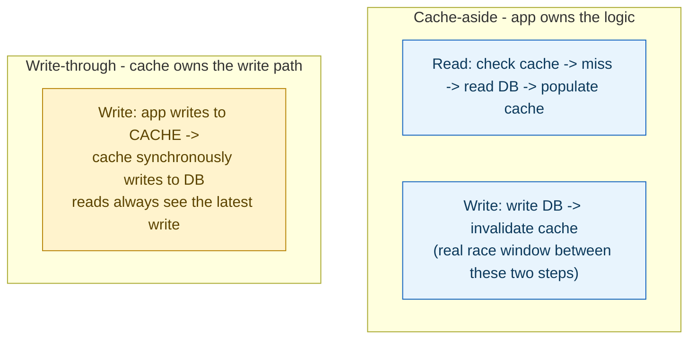
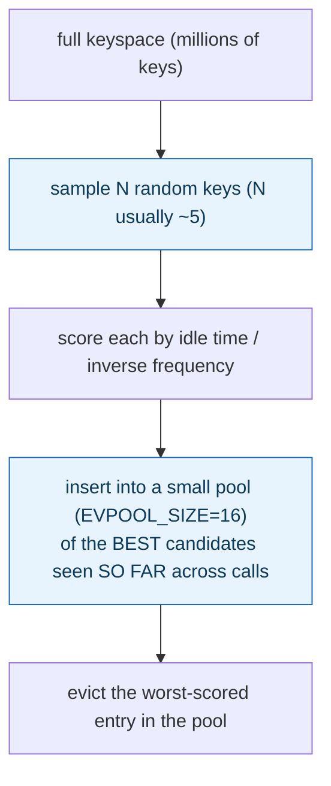
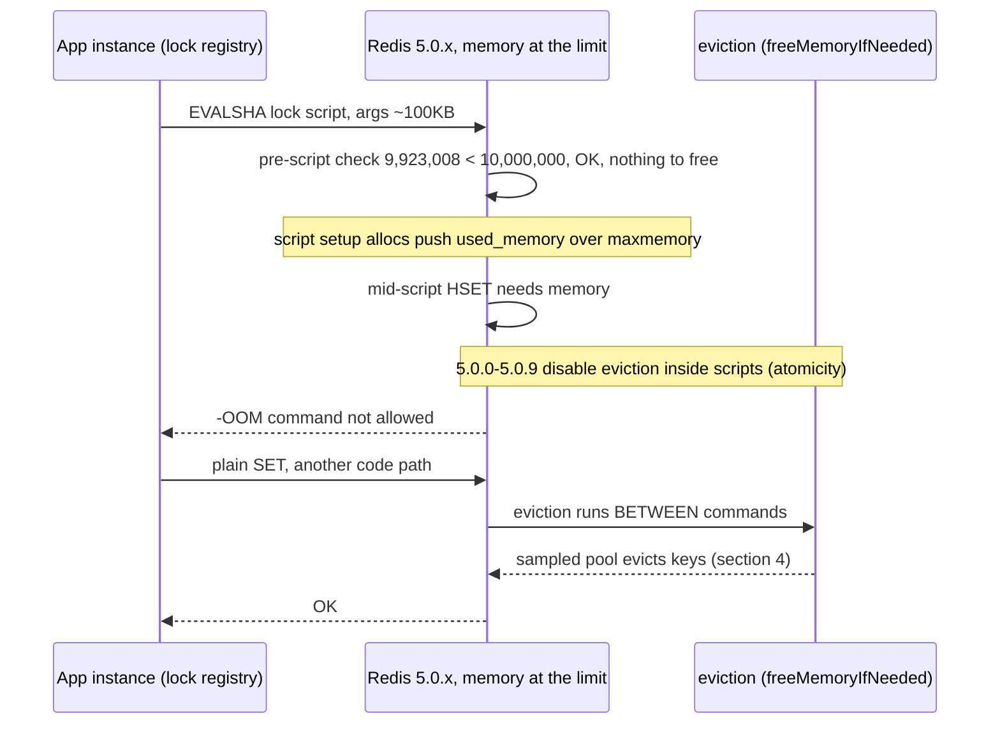
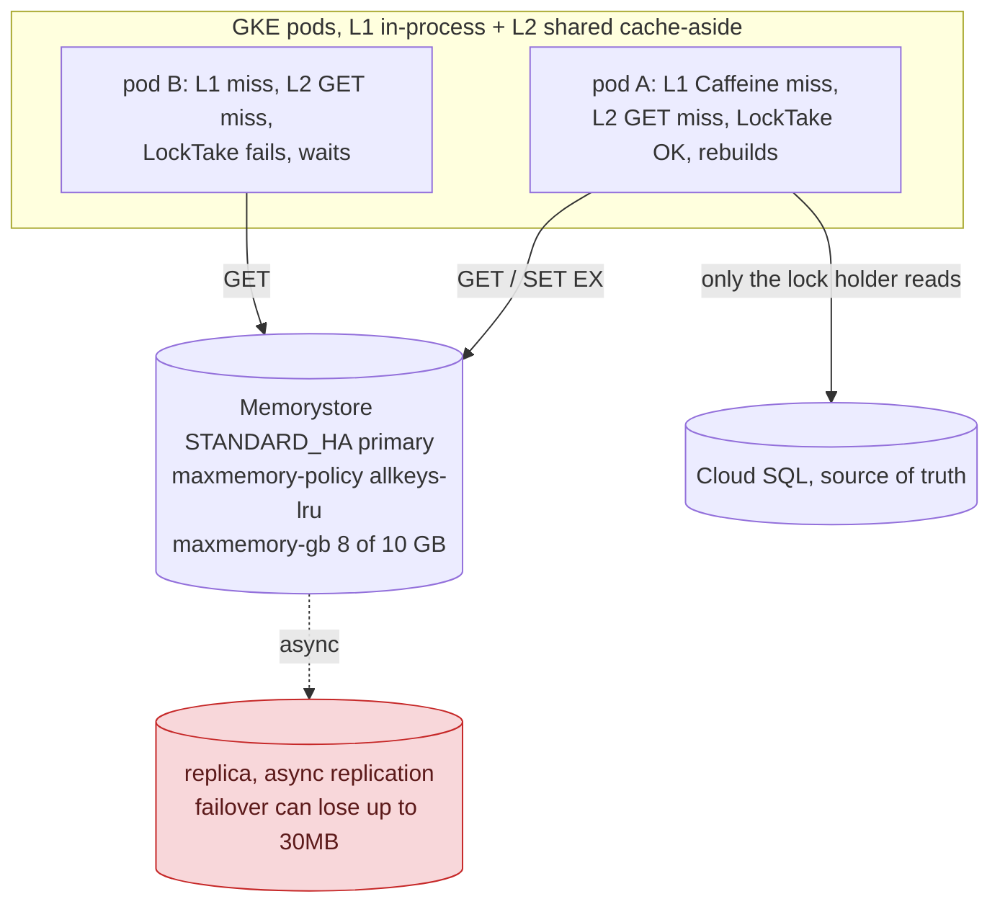

**TL;DR:** What happens when your cache fills up, and who's actually responsible for keeping it in sync? Sync is a choice between cache-aside (the app checks the cache, falls back to the DB on a miss, and invalidates on write) and write-through (writes flow through the cache itself); eviction under memory pressure is handled by sampling a handful of random keys and evicting the worst-scored one from a small candidate pool, not by maintaining a perfectly-ordered LRU list.

**Real repo:** [`redis/redis`](https://github.com/redis/redis)

## 1. The Engineering Problem: two separate questions hide under "add a cache"

"Add caching" conflates two genuinely separate design decisions. First: **who keeps the cache and the source of truth in sync, and when** — does the application check the cache and fall back to the database on a miss (with the database always the authority), or does every write flow *through* the cache layer, which then propagates to the database itself? These have different staleness and complexity tradeoffs. Second, entirely independent of the first: **what happens when the cache is full and a new entry needs room** — under a fixed memory budget, something has to be evicted, and doing that "correctly" (evict the truly least-valuable entry) at real throughput is itself a nontrivial systems problem, not a one-line "just track access order."

---

## 2. The Technical Solution: cache-aside vs write-through for sync; sampled approximation for eviction and expiry



Redis's own eviction mechanism, when memory is full, doesn't maintain a perfectly-ordered LRU/LFU list — that would need constant, expensive bookkeeping on every access across the whole keyspace. Instead it **samples**: pick a handful of random keys, score them by idle time (or inverse access frequency for LFU), keep a small pool of the best eviction candidates seen so far, and evict from that pool:



Expiry (TTL) uses two *complementary* mechanisms, not one: **lazy expiration** removes a key only when something actually tries to access it and notices it's past its expiry; **active expiration** is a separate periodic background cycle that proactively finds and removes expired keys even if nobody ever reads them again. Lazy alone would leak memory for keys nobody revisits; active alone (constantly scanning everything) would waste CPU on keys that get naturally cleaned up by normal access anyway.

Core truths: **a TTL guarantees eventual removal, not synchronized correctness** — it bounds worst-case staleness, it doesn't keep a cache-aside cache correct the moment the underlying data changes; explicit invalidation on write is what actually does that, with TTL as the safety net underneath it. And **eviction sampling is a deliberate, documented tradeoff**, not an accidentally-cut corner — Redis's own source comments frame it explicitly as constant-memory approximation traded for giving up perfect LRU ordering.

---

## 3. The clean example (concept in isolation)

```python
# Cache-aside
def get_product(id):
    if cached := cache.get(id): return cached
    product = db.query(id)
    cache.set(id, product, ttl=300)   # TTL bounds worst-case staleness
    return product

def update_product(id, data):
    db.update(id, data)
    cache.delete(id)                    # explicit invalidation - the REAL correctness mechanism

# Write-through
def update_product_wt(id, data):
    cache.set(id, data)                 # cache itself propagates to DB synchronously

# Eviction: sampled approximation, not a perfect LRU list
def evict_to_make_room():
    sample = random.sample(all_keys, MAXMEMORY_SAMPLES)   # ~5 keys per round
    pool.insert_by_idle_time(sample)                      # pool persists ACROSS rounds
    evict(pool.worst())                                   # worst candidate seen so far

# Expiry: two complementary mechanisms for TTL'd keys
def lazy_expire(key):        # only when the key is accessed
    if past_ttl(key): delete(key); return MISS

def active_expire_cycle():   # periodic background cycle, catches keys nobody reads
    for key in sample_of_keys_with_ttl():
        if past_ttl(key): delete(key)
```

---

## 4. Production reality (from `redis/redis`)

```c
/* src/evict.c - LRU approximation algorithm
 * Redis uses an approximation of the LRU algorithm that runs in constant
 * memory. Every time there is a key to expire, we sample N keys (with
 * N very small, usually around 5) to populate a pool of best keys to
 * evict of M keys (the pool size is defined by EVPOOL_SIZE). */
int evictionPoolPopulate(redisDb *db, kvstore *samplekvs, struct evictionPoolEntry *pool) {
    dictEntry *samples[server.maxmemory_samples];
    int slot = kvstoreGetFairRandomDictIndex(samplekvs, randomEvictionShouldSkipDictIndex, 1, 0);
    int count = kvstoreDictGetSomeKeys(samplekvs, slot, samples, server.maxmemory_samples);

    for (int j = 0; j < count; j++) {
        unsigned long long idle;
        /* idle = access recency (LRU) or inverse frequency (LFU) */
        // ... insert into pool at the correct sorted position by idle time ...
    }
    return count;
}
```

```c
/* src/expire.c
 * When keys are accessed they are expired on-access. However we need a
 * mechanism in order to ensure keys are eventually removed when expired
 * even if no access is performed on them. */
int activeExpireCycleTryExpire(redisDb *db, kvobj *kv, long long now) {
    if (now < kvobjGetExpire(kv))
        return 0;
    // key IS expired and nobody read it yet - remove it proactively
    deleteExpiredKeyAndPropagate(db, keyobj);
    server.stat_expiredkeys_active++;
    return 1;
}
```

What this teaches that a hello-world can't:

- **`server.maxmemory_samples` (the sample count N) is a tunable, not a hardcoded constant** — Redis explicitly exposes the precision/cost tradeoff to operators: a higher sample size gets closer to true LRU accuracy at higher CPU cost per eviction, a lower one is cheaper but a coarser approximation. This isn't a fixed algorithm choice, it's a dial.
- **The eviction pool (`EVPOOL_SIZE`) persists candidate quality ACROSS multiple `evictionPoolPopulate()` calls**, not just within one — the comment notes this improves approximation quality over sampling completely fresh each time. A single eviction decision benefits from candidates discovered during *previous* eviction rounds too, not just the current sample.
- **`activeExpireCycleTryExpire` increments `server.stat_expiredkeys_active` as a DISTINCT counter from lazy expirations** — a production Redis deployment can observe, via its own metrics, how many keys were cleaned up by the background cycle versus discovered stale on access. That split is real operational signal: a workload with mostly active-cycle expirations has a lot of "set and forget, never read again" keys; mostly lazy expirations suggests keys are being hit right around their expiry boundary.

Known-stale fact: fixed-TTL invalidation alone is a naive strategy for data where correctness matters — a TTL only bounds *how stale a value can get before it's forced out*, it does nothing to keep the cache correct the moment the underlying data actually changes. The event-driven invalidation shown in the cache-aside write path (`cache.delete(id)` immediately after the DB write) is what provides real correctness; TTL is the fallback net that limits damage if an invalidation is ever missed, not the primary correctness mechanism itself.

---

## 5. Production incident: distributed locks get `-OOM` with `allkeys-lru` configured — eviction doesn't run inside a Lua script

**Incident:** On Redis 5.0.x, applications whose writes went through Lua scripts — distributed locks (Redisson, Spring's `RedisLockRegistry`), compare-and-set, stream `APPEND` wrappers — started failing with `-OOM command not allowed when used memory > 'maxmemory'` the moment `used_memory` reached `maxmemory`, even though an eviction policy (`allkeys-lru`) was configured and plain `SET`/`HSET` traffic kept working fine.

**Symptom:** lock acquisition throws in the app — `CannotAcquireLockException: Failed to lock mutex ... ERR Error running script ... -OOM command not allowed when used memory > 'maxmemory'` — while `evicted_keys` stays flat. Cache reads look healthy; only the scripted write paths fail.

**Root cause:** section 4's sampled eviction runs via `freeMemoryIfNeeded` *between* commands. Redis 5.0 deliberately disabled eviction *during* Lua script execution (scripts are atomic, and the 5.0 replication rework needed script effects to be deterministic). A user's instrumented server log on the issue shows the exact borderline: `EVALSHA` arrives with `used_memory` at 9,923,008 of a 10,000,000 `maxmemory` — the pre-script check passes, no eviction runs; the script's own setup allocations (~100KB of args plus the Lua stack) push `used_memory` over the limit; the mid-script `HSET` then hits the OOM check with eviction unavailable and aborts.

**Blast radius:** every write path implemented as a script, fleet-wide, while memory hovers at the limit — lock acquisition fails, so scheduled jobs and mutex-protected sections stop. Plain commands are unaffected because eviction still runs between them, which is exactly what makes the failure so confusing to diagnose. Affected versions: 5.0.0 through 5.0.9 (the same failure was reported in the wild on 5.0.3 via Spring's lock registry).

The business impact hides behind the exception type: a lock that *throws* on acquisition fails one of two ways. **Fail-closed** — the guarded work simply doesn't run (the scheduled service in the #8623 report). **Fail-open** — the caller treats the error as "not acquired" and proceeds anyway, so two workers execute a section the mutex existed to serialize. Neither direction surfaces as a cache problem on an application dashboard; both are business-visible.



The fix landed as [PR #6797](https://github.com/redis/redis/pull/6797) ("Check OOM at script start to get stable lua OOM state"), merged by antirez for 6.0 and backported to 5.0.10: the OOM condition is checked **once at script start** — abort deterministically before executing if already over `maxmemory`, otherwise let the script run to completion with no random mid-script abort. Note what the fix deliberately does *not* do: eviction still doesn't run inside a script, and a long-running script occupies the single main thread, so eviction can't run between *other* clients' commands either — the failure class survives the fix in a different shape (a maintainer makes exactly this point on [#8623](https://github.com/redis/redis/issues/8623): a script that keeps timing out prevents eviction from executing).

Source: [Eviction does not occur during lua scripts · redis/redis#6565](https://github.com/redis/redis/issues/6565) — confirmed by antirez ("That looks like a bug indeed"), with production reports from Redisson and Spring `RedisLockRegistry` users; the in-the-wild 5.0.3 report is [redis/redis#8623](https://github.com/redis/redis/issues/8623).

---

## 6. Troubleshooting & resolution

1. **Check the version first — this failure is version-gated:**

   ```bash
   redis-cli INFO server | grep redis_version
   ```

   `5.0.0`–`5.0.9` means the instance carries the exact bug above; the resolution *is* the upgrade (≥ 5.0.10, or 6.0+). On any other version, the same symptom points at the surviving variant — a long script starving eviction — so keep going.

2. **Confirm memory is actually at the limit and eviction is stalled:**

   ```bash
   redis-cli INFO memory | grep -E 'used_memory_human|maxmemory_human'
   redis-cli INFO stats | grep evicted_keys
   redis-cli CONFIG GET maxmemory-policy
   ```

   `used_memory` pinned at `maxmemory` while `evicted_keys` barely moves — despite a real policy like `allkeys-lru` — is the incident's signature: writes are being refused while eviction isn't executing.

3. **Look for the long-running script that blocks the main thread:**

   ```bash
   redis-cli SLOWLOG GET 5
   ```

   `EVALSHA` entries with multi-millisecond runtimes are the suspect (the default `slowlog-log-slower-than` is 10000µs). While a script runs, no eviction can happen between other clients' commands either — memory overshoots the limit and *every* write path gets closer to `-OOM`, not just scripted ones.

4. **Resolution:** upgrade past 5.0.10 / 6.0 for the deterministic abort-at-start semantics; keep `used_memory` below `maxmemory` with real headroom so script argument allocations can't straddle the boundary the way the issue's 76KB gap did; and keep scripts short — eviction for the whole fleet waits on the main thread while one runs.

---

## 7. Prevention & production checklist

- **Pin a version floor of Redis ≥ 5.0.10 (or 6.0+) everywhere scripts touch memory-limited instances.** Enforce it in the base image or the Terraform module's version constraint — the failure is silent until the first script executes against a full instance, so no staging idle-run will catch it.
- **Alert on divergence between client `-OOM` errors and server `evicted_keys`.** Client-visible OOM errors climbing while the server's eviction counter stays flat means eviction is not executing — an alert on `evicted_keys` alone reads this as "nothing to evict," and an alert on errors alone reads as generic pressure. The pair is the signal. As a concrete expression (oliver006 `redis_exporter` metric names, verified against its exporter source; `and on()` because the two sides carry different label sets):

  ```promql
  (sum(rate(redis_errors_total{err="OOM"}[5m])) > 0) and on() (sum(rate(redis_evicted_keys_total[5m])) == 0)
  ```

  The `err="OOM"` label comes from Redis's `errorstat_*` INFO counters, which exist only in Redis 6.2+ (confirmed in `src/server.c` — absent from the 5.0 branch) — on the affected 5.0.x versions the client-side error rate is the only half of this pair you can measure, itself an argument for the version floor. On Memorystore the early-warning half is a native metric: alert on `redis.googleapis.com/keyspace/keys_with_expiration` sitting at zero under a `volatile-*` policy — GCP's docs spell out the consequence, with no expirable keys there is nothing to evict when the instance reaches `maxmemory-gb`.
- **Set `maxmemory` below instance capacity, not equal to it.** Script setup allocations (arguments plus the Lua stack) land on top of `used_memory` — with zero headroom, a script that passes the pre-script check can still push the instance over mid-execution. GCP's Memorystore docs describe exactly this pattern: on a 10 GB instance, set `maxmemory-gb` to 8 and keep 2 GB as overhead.
- **Load-test the scripted write path against a *full* instance.** A test that only sends plain `SET`/`HSET` cannot reproduce this failure — eviction runs between those commands and everything looks fine. Reproduction needs `EVALSHA` arriving while `used_memory` sits at `maxmemory`.
- **Watch `SLOWLOG` for `EVALSHA`, not just for slow reads.** A script exceeding `lua-time-limit` (5000ms, and unmodifiable on Memorystore) doesn't just add latency — it starves eviction fleet-wide for its whole runtime, and on Memorystore an indefinitely-running Lua script even blocks a `limited-data-loss` manual failover.

---

## 8. Cloud & library lens: the three layers where production caching actually lives

This lesson's mechanisms — TTL expiry, sampled eviction, cache-aside invalidation — run at every layer a cache can live, and the production choice is about **where a key's eviction and invalidation semantics actually come from**:

| Layer | Real implementation | The deciding gotcha |
|-------|--------------------|---------------------|
| In-process | Caffeine (Java), `IMemoryCache` (.NET) | Zero network hop, but each pod holds its own copy — there is no shared invalidation, so section 3's `cache.delete(id)` on write only clears *one* instance's entry, and a cold 50-pod deploy can hit the database 50 times for the same key. Right for read-mostly reference data, wrong as the consistency layer. |
| Managed shared | [Memorystore for Redis](https://cloud.google.com/memorystore/docs/redis/memorystore-for-redis-overview), Basic vs Standard tier | The tier decides what a failure costs: Basic has **no replication and no failover** — a node failure is a flushed cache. Standard replicates across zones, but replication is asynchronous — even a *manual* failover's default `limited-data-loss` mode proceeds with up to 30 MB of unreplicated writes lost ([failover docs](https://cloud.google.com/memorystore/docs/redis/about-manual-failover)). And the provider owns the config surface: the [default `maxmemory-policy` is `volatile-lru`](https://cloud.google.com/memorystore/docs/redis/supported-redis-configurations), which evicts **only keys with TTLs** — a cache-aside `SET` without `EXPIRE` is unevictable, so a full instance walks straight into section 5's `-OOM` wall under a policy that *looks* correct. `lua-time-limit` is pinned at 5000 and unmodifiable. |
| Client library | [`StackExchange/StackExchange.Redis`](https://github.com/StackExchange/StackExchange.Redis) (curated repo) | The expiry stampede: a hot key's TTL fires, every instance misses at once, every instance rebuilds from the database. The fix lives in the client — an atomic `SET NX PX` rebuild lock so exactly one caller recomputes. On AWS, ElastiCache for Redis exposes the same `maxmemory-policy` knob through its parameter group ([docs](https://docs.aws.amazon.com/AmazonElastiCache/latest/dg/ParameterGroups.Redis.html)) — same decision, different console. |

The in-process row of the table gets its stampede protection for free, and the real library shows why: Caffeine's `LoadingCache.get` coalesces concurrent loads of the same key into one computation, per its own JavaDoc:

```java
// ben-manes/caffeine, caffeine/src/main/java/com/github/benmanes/caffeine/cache/LoadingCache.java
// JavaDoc on get(K): "If another call to get is currently loading the value
// for the key, this thread simply waits for that thread to finish and returns
// its loaded value... the function is applied at most once per key."
LoadingCache<String, Product> local = Caffeine.newBuilder()
    .expireAfterWrite(Duration.ofMinutes(5))
    .build(id -> db.query(id));   // N threads miss together -> ONE db.query, per pod
```

"At most once per key" is scoped to the instance — 50 pods still issue 50 queries for the same expired key. The Redis-backed rebuild lock exists precisely because coalescing has to span pods, and it is real code in the curated repo, not a pattern diagram — `LockTake` *is* an atomic set-if-absent:

```csharp
// src/StackExchange.Redis/RedisDatabase.cs
public bool LockTake(RedisKey key, RedisValue value, TimeSpan expiry, CommandFlags flags = CommandFlags.None)
{
    if (value.IsNull) throw new ArgumentNullException(nameof(value));
    return StringSet(key, value, expiry, When.NotExists, flags);
}
```

and `LockRelease` deletes only if the token still matches, with a telling fallback:

```csharp
// without transactions (twemproxy etc), we can't enforce the "value" part
return KeyDelete(key, flags);
```

That fallback is the production-only detail a hello-world lock never shows: behind a proxy that can't run the token-checking delete, releasing a lock can delete a key *someone else* re-acquired — the compare-the-token step is the correctness mechanism, not ceremony.

An illustrative Memorystore config (clean example, same status as section 3 — not fetched production code):

```hcl
resource "google_redis_instance" "cache" {
  # STANDARD_HA adds the replica; BASIC has no failover at all
  tier           = "STANDARD_HA"
  memory_size_gb = 10

  redis_configs = {
    # volatile-lru (the default) only evicts keys that have TTLs;
    # allkeys-lru makes every key evictable, including no-TTL ones
    maxmemory-policy = "allkeys-lru"
  }
}
```

The decision: **in-process for data that must never leave the pod and can tolerate per-instance staleness, managed shared cache when invalidation has to mean one thing across the fleet** — and whichever layer holds the data, the stampede lock and the incident's `-OOM` failure mode live at the client and the server respectively, which is why "we set an eviction policy" is the beginning of the review, not the end of it.

### Production design on GCP (real services, real config)

Wiring the verified pieces together — the same shape as the incident's deployment (a distributed lock registry sharing the cache instance):



- **Placement is a hard constraint, not a tuning knob:** clients must sit in the same authorized VPC as the instance (private IP only) — the GKE cluster and Memorystore are peers in one network, which is also where the sub-millisecond access the service promises comes from.
- **`maxmemory-gb 8` on a 10 GB instance is section 7's headroom rule expressed as config** — the default is the full capacity, so headroom is a deliberate choice, not something the tier gives you. And on Standard Tier, GCP's right-sizing docs reserve **10% of instance capacity as a replication buffer** — provision for it, because the 10 GB you buy is not the 10 GB you can fill.
- **On the managed tier, section 5's wall wears a different error string:** at 100% system memory usage ratio, Memorystore blocks writes with `-OOM command not allowed under OOM prevention` and tracks how long in the `system_memory_overload_duration` metric — the documented alert threshold is 80%, and GCP's own docs note eviction is a background process a high write-rate can outpace. The headroom rule above is what keeps you off that wall.
- **The rebuild lock's TTL must outlive a slow DB rebuild.** If the lock expires before pod A finishes reading Cloud SQL and populating the key, pod B takes the lock and rebuilds a second time — the stampede the lock exists to prevent, one TTL-misconfiguration away.
- **Locks and cache share one instance here, so memory pressure takes down both.** That is exactly section 5's blast radius: `used_memory` at the limit didn't just risk evicting cached products, it made `EVALSHA` lock acquisition fail. The replica (red) is the second lossy surface: async replication means a failover can drop recent writes — acceptable for cache entries, another reason correctness lives in Cloud SQL plus delete-on-write invalidation, never in Redis.

---

## Source

- **Concept:** Caching strategies (cache-aside, write-through, TTL, eviction)
- **Domain:** system-design
- **Repo:** [redis/redis](https://github.com/redis/redis) → [`src/evict.c`](https://github.com/redis/redis/blob/unstable/src/evict.c), [`src/expire.c`](https://github.com/redis/redis/blob/unstable/src/expire.c) — the real, production in-memory data store.
