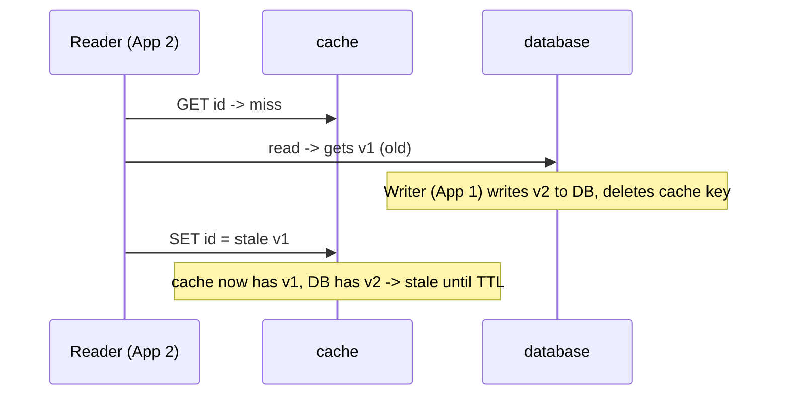
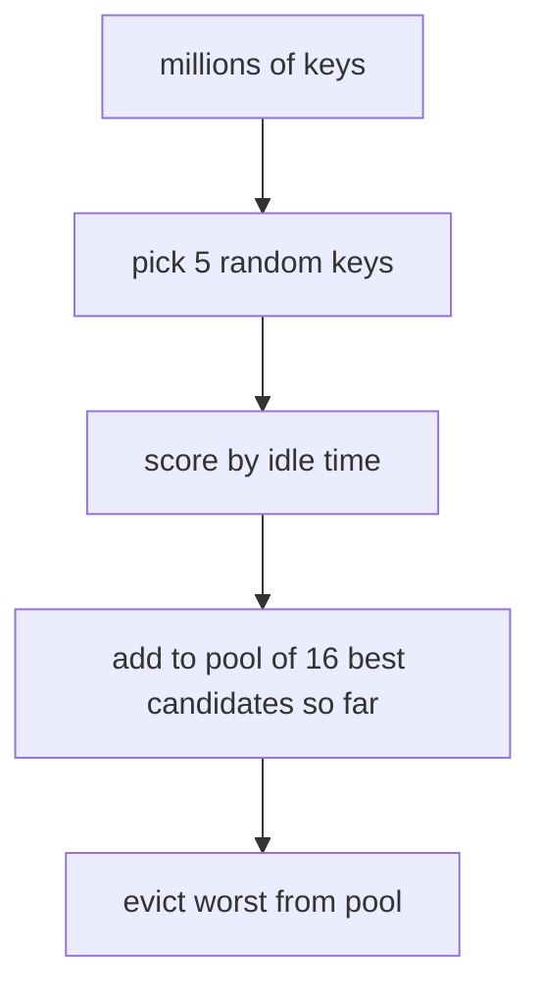
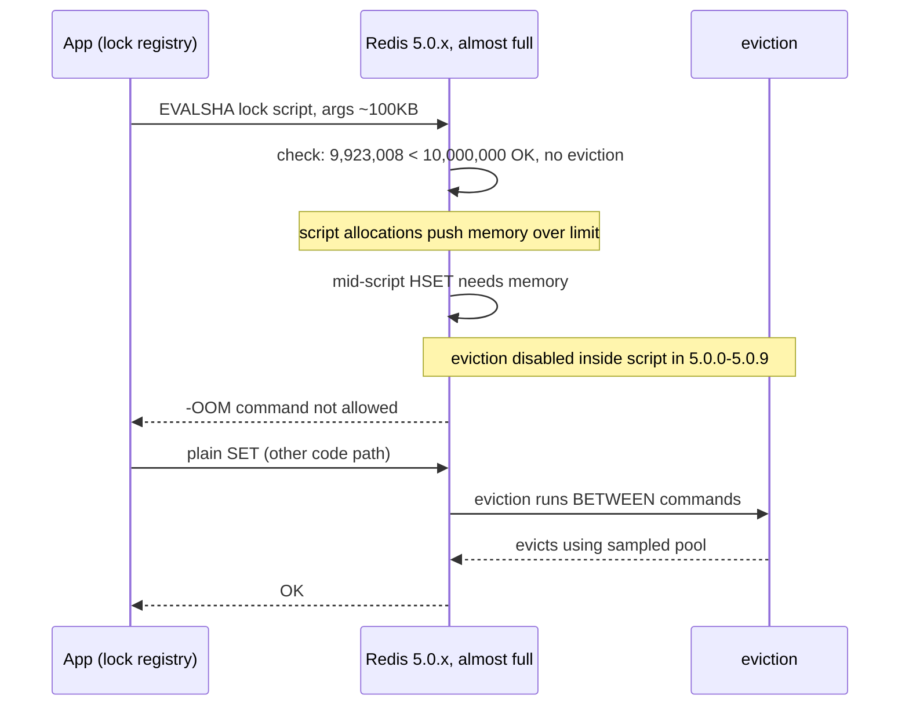
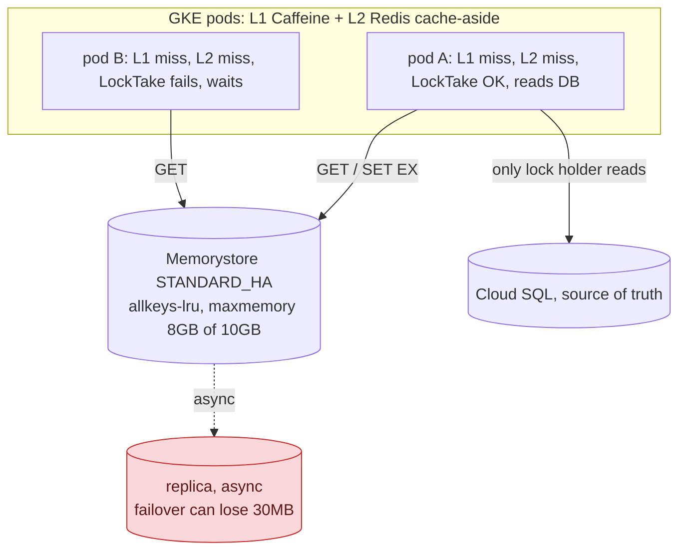

**TL;DR:** You put a dict in front of your database to make it fast. Three problems come next: who deletes the old value when DB changes, what do you delete when the dict is full, and how do expired keys actually go away? This post shows cache-aside vs write-through for the first problem, sampled eviction + lazy/active expiry for the other two, and a real prod incident where locks failed with `-OOM` even though `allkeys-lru` was set.

> **In plain English (30 seconds):** This is memoization you already do. `get_user(id)` hits DB every time, so you add a dict: check dict first, only call DB on miss, store result. That dict is your cache. The rest is details: who deletes `cache[id]` when DB row changes, what to throw out when dict is full, and how keys with expiry actually disappear.

**Real repo:** [`redis/redis`](https://github.com/redis/redis)

## 1. The Engineering Problem: two questions hiding under "add a cache"

Every dev has written this:

```python
def get_user(id):
    return db.query(id)      # ~100ms every time
```

Call it 1000 times/sec and DB dies. So you add a dict:

```python
cache = {}

def get_user(id):
    if id in cache:
        return cache[id]     # ~1ms
    user = db.query(id)
    cache[id] = user
    return user
```

Works until two questions show up:

**Q1: Who keeps cache and DB saying same thing?** When DB row changes, `cache[id]` still has old value. Something must delete it.

**Q2: What happens when cache is full?** Memory is limited. When new entry comes, what do you throw out? And how do expired keys actually get deleted?

These two questions are independent. You can answer each one in different ways.

---

## 2. The Technical Solution

### Part A — Who syncs: your app (cache-aside) or cache itself (write-through)

**Cache-aside: your app does the work. This is what 90% of teams use.**

Read: check cache first. Miss? Read DB and put in cache.
Write: write DB first, then delete cache key.

Why delete? TTL only limits how long wrong data lives. Delete is what makes cache correct.

```python
def get_product(id):
    if cached := cache.get(id): 
        return cached
    product = db.query(id)
    cache.set(id, product, ttl=300)
    return product

def update_product(id, data):
    db.update(id, data)
    cache.delete(id)  # this is the correctness part
```

**Write-through: cache owns the write path.**

App writes only to cache. Cache writes to DB for you.

```python
def update_product_wt(id, data):
    cache.set(id, data)  # cache writes to DB internally
```

Pros: No stale window. Reads always get latest.
Cons: If cache is down, you can't write. Writes are slower because they hit two systems.

**The race that bites in production:**

Cache-aside delete-on-write has a small race window. A reader can put stale data back *after* writer deleted it:



The window is small but never closes by itself.

### Part B — When cache is full: pick 5 random keys, don't sort all

Perfect LRU would need to track exact order of every key. Every read would update that order. Too slow at high QPS.

Redis does something cheaper that is almost as good:

1. Pick ~5 random keys (configurable via `maxmemory_samples`)
2. Score them by idle time (how long since last access)
3. Put best candidates in a small pool of 16 slots. Pool stays across rounds, so it remembers good candidates from before.
4. Evict the worst key from that pool.

More samples = closer to perfect LRU but more CPU. Less = faster but less accurate. It's a tunable, not fixed.



### Part C — Expired keys: deleted on read + by background cleaner

TTL keys need to disappear. Two ways, you need both:

- **Lazy:** When you read a key, Redis checks if TTL passed. If yes, delete it right there. Free, but if no one ever reads it, it stays forever.
- **Active:** Background job runs 10 times/sec. Each time it picks 20 random keys that have TTL. If expired, delete. If more than 25% were expired, it does extra work instead of waiting.

Lazy alone leaks memory. Active alone wastes CPU on keys that would be cleaned by normal reads anyway.

**Core truths:**
- TTL guarantees eventual removal, not correctness. `cache.delete(id)` on write is correctness.
- Eviction sampling is deliberate tradeoff: constant memory and fast, not perfect, by design.

---

## 3. The clean example (copy-paste mental model)

```python
# Cache-aside - what you use 90% of time
def get_product(id):
    if cached := cache.get(id): return cached
    product = db.query(id)
    cache.set(id, product, ttl=300)   # TTL = safety net
    return product

def update_product(id, data):
    db.update(id, data)
    cache.delete(id)                 # delete = correctness

# Eviction when full - not perfect LRU
def evict_to_make_room():
    sample = random.sample(all_keys, 5)        # 5 random keys
    pool.add_sorted_by_idle(sample)            # pool size 16, persists across calls
    evict(pool.worst())

# Expiry - two ways
def lazy_expire(key):          # on read
    if is_expired(key): delete(key)

def active_expire_cycle():     # background job, 10 times/sec
    for key in sample_keys_with_ttl(20):
        if is_expired(key): delete(key)
```

---

## 4. Production reality (from `redis/redis` — real C code)

Now let's see how Redis actually implements Part B and C in production.

```c
/* src/evict.c - LRU approximation
 * Redis samples N keys (usually ~5) to fill a pool of M keys (EVPOOL_SIZE=16) */
int evictionPoolPopulate(redisDb *db, kvstore *samplekvs, struct evictionPoolEntry *pool) {
    dictEntry *samples[server.maxmemory_samples];
    int slot = kvstoreGetFairRandomDictIndex(samplekvs, randomEvictionShouldSkipDictIndex, 1, 0);
    int count = kvstoreDictGetSomeKeys(samplekvs, slot, samples, server.maxmemory_samples);
    for (int j = 0; j < count; j++) {
        unsigned long long idle;
        /* idle = how long since last access (LRU) or inverse frequency (LFU) */
        // ... insert into pool sorted by idle time ...
    }
    return count;
}
```

```c
/* src/expire.c - active expiry */
int activeExpireCycleTryExpire(redisDb *db, kvobj *kv, long long now) {
    if (now < kvobjGetExpire(kv))
        return 0;
    // key is expired and no one read it - delete proactively
    deleteExpiredKeyAndPropagate(db, keyobj);
    server.stat_expiredkeys_active++;
    return 1;
}
```

What production code teaches you:

- **`maxmemory_samples` is tunable.** More samples = closer to true LRU, more CPU. It's a dial, not fixed.
- **Pool persists across calls.** Next eviction benefits from keys sampled last time. Better approximation without scanning everything.
- **Two different counters.** `stat_expiredkeys_active` vs lazy expirations. If most expirations are active, you have many keys that are set and never read again.

---

## 5. Production incident: distributed locks get `-OOM` even though `allkeys-lru` is set

**What happened:** On Redis 5.0.0 to 5.0.9, apps using Lua scripts for locks (Redisson, Spring `RedisLockRegistry`) started failing with `-OOM command not allowed when used memory > 'maxmemory'`. But `allkeys-lru` was configured. And normal `SET`/`HSET` still worked.

**Symptom you see in app:**
```
CannotAcquireLockException: Failed to lock mutex ... 
ERR Error running script ... -OOM command not allowed when used memory > 'maxmemory'
```
And `evicted_keys` metric stays flat. Cache reads look fine. Only lock paths fail.

**Why:** Redis eviction runs *between* commands via `freeMemoryIfNeeded`. In Redis 5.0, eviction was disabled *inside* a Lua script because scripts must be atomic and deterministic for replication.

Real numbers from the bug report: `EVALSHA` arrives when `used_memory` is 9,923,008 of 10,000,000 `maxmemory`. Pre-script check passes (still under limit), so no eviction. Script setup itself allocates ~100KB for args + Lua stack. Now memory is over limit. Mid-script `HSET` needs memory, hits OOM check, eviction is disabled inside script, so it fails.

Plain `SET` works because eviction runs between plain commands.



**Blast radius:** Every write that uses Lua script fails fleet-wide when memory is at limit. Locks fail, so scheduled jobs run twice, mutex-protected sections break.

**Fix:** PR #6797 “Check OOM at script start”. Merged in 5.0.10 and 6.0. Check OOM once at script start: if already over limit, fail fast. Otherwise let script finish. Eviction still doesn't run inside script, so long scripts can still starve eviction for everyone else (see #8623).

Source: [redis/redis#6565](https://github.com/redis/redis/issues/6565) confirmed by antirez, [redis/redis#8623](https://github.com/redis/redis/issues/8623) in-the-wild report on 5.0.3.

---

## 6. Troubleshooting & resolution — runbook

**1. Check version first. This bug is version-gated.**

```bash
redis-cli INFO server | grep redis_version
```
If `5.0.0` to `5.0.9` → you have the bug. Upgrade to `>=5.0.10` or `6.0+`. If other version and same symptom, it's the long-script variant. Keep going.

**2. Confirm memory is at limit and eviction is stuck:**

```bash
redis-cli INFO memory | grep -E 'used_memory_human|maxmemory_human'
redis-cli INFO stats | grep evicted_keys
redis-cli CONFIG GET maxmemory-policy
```

Signature: `used_memory` stuck at `maxmemory` and `evicted_keys` not moving, even though policy is `allkeys-lru`. Writes fail but eviction not running.

**3. Find long script blocking main thread:**

```bash
redis-cli SLOWLOG GET 5
```

Look for `EVALSHA` with high runtime. While one script runs, main thread is blocked. No eviction can run for any client. Memory keeps going over limit.

**4. Fix:**

- Upgrade past 5.0.10 / 6.0 for deterministic fail-at-start behavior.
- Keep headroom: don't set `maxmemory` equal to instance size. Script args need space. On 10GB instance, set 8GB as maxmemory.
- Keep scripts short. Eviction for whole fleet waits while one script runs.

---

## 7. Prevention & production checklist

- **Pin Redis version >=5.0.10 or 6.0+ everywhere you use Lua scripts.** Enforce in base image and Terraform. Staging won't catch it because bug only shows when instance is full AND script arrives.
- **Alert on client OOM errors + flat evicted_keys.** If clients see OOM but server evicted_keys not increasing, eviction is stuck.
  ```promql
  (sum(rate(redis_errors_total{err="OOM"}[5m])) > 0) and on() (sum(rate(redis_evicted_keys_total[5m])) == 0)
  ```
  Note: `err="OOM"` exists only in Redis 6.2+ (`errorstat` counters). On 5.0.x, watch client-side errors.
- **Set maxmemory below instance size.** On 10GB instance, set `maxmemory-gb` to 8, keep 2GB headroom. GCP docs recommend this.
- **Load test scripted path against FULL instance.** Testing only plain `SET` won't reproduce bug. You need `EVALSHA` when memory is at maxmemory.
- **Watch SLOWLOG for EVALSHA.** `lua-time-limit` is 5000ms default and unmodifiable on Memorystore. Long script blocks eviction and even blocks manual failover.

---

## 8. Cloud & library lens: where caching lives in production

Caching happens at three layers. You need to pick where eviction and invalidation come from.

| Layer | Real service | What breaks in prod |
|-------|--------------|---------------------|
| **In-process** | Caffeine (Java), `IMemoryCache` (.NET) | Zero network hop, super fast. But each pod has its own copy. `cache.delete(id)` on write only clears one pod. 50 pods cold start = 50 DB queries for same key. Good for reference data, bad for consistency. |
| **Managed shared** | [Memorystore for Redis](https://cloud.google.com/memorystore/docs/redis/memorystore-for-redis-overview) Basic vs Standard | Basic = **no replica, no failover**. Node failure = cache flushed. Standard = async replication, manual failover can lose up to 30 MB. Default `maxmemory-policy` is `volatile-lru` = evicts **only keys with TTL**. If you do `SET` without `EXPIRE`, key is unevictable and you hit Section 5 OOM even though policy looks correct. `lua-time-limit` fixed at 5000. |
| **Client library** | [StackExchange.Redis](https://github.com/StackExchange/StackExchange.Redis) | Hot key expiry = stampede. TTL fires, 50 pods miss at same time, 50 DB queries. Fix is `SET NX PX` lock so only one pod rebuilds. Same knob on AWS ElastiCache via parameter group. |

### Library Lens — real code that prevents stampede

Caffeine coalesces concurrent loads of same key inside one pod (per JavaDoc):

```java
// LoadingCache.get doc: "If another call to get is currently loading the value
// for the key, this thread simply waits... function is applied at most once per key."
LoadingCache<String, Product> local = Caffeine.newBuilder()
    .expireAfterWrite(Duration.ofMinutes(5))
    .build(id -> db.query(id));   // 10 threads miss together -> 1 db.query
```

But that's per-pod. 50 pods still = 50 queries. For cross-pod, you need Redis lock. Real code from StackExchange.Redis:

```csharp
// LockTake is SET if not exists - atomic
public bool LockTake(RedisKey key, RedisValue value, TimeSpan expiry, ...) {
    return StringSet(key, value, expiry, When.NotExists, flags);
}

// LockRelease deletes only if token matches
// Behind proxy like twemproxy, token check not possible, so it falls back to KeyDelete
// That fallback can delete someone else's lock - token check is correctness, not ceremony
```

### Simple stampede fix (programming pattern you can copy)

```python
# Only one pod rebuilds, others wait
def get_with_lock(id):
    if cached := cache.get(id): return cached
    
    lock_key = f"lock:{id}"
    if cache.set(lock_key, "1", nx=True, px=1000):  # SET NX PX = atomic lock
        try:
            data = db.query(id)
            cache.set(id, data, ex=300)
            return data
        finally:
            cache.delete(lock_key)
    else:
        time.sleep(0.05)
        return get_with_lock(id)  # retry
```

If lock TTL is shorter than DB query time, two pods rebuild. So lock TTL must be longer than slow DB query.

An illustrative Memorystore config:

```hcl
resource "google_redis_instance" "cache" {
  tier           = "STANDARD_HA"  # BASIC has no failover
  memory_size_gb = 10
  redis_configs = {
    maxmemory-policy = "allkeys-lru"  # volatile-lru (default) only evicts keys with TTL
  }
}
```

**Decision rule:** In-process for data that can be stale per-pod. Shared Redis when invalidation must mean one thing across fleet.

### Production design on GCP (real services)



Key points:

- **Placement matters:** GKE and Memorystore must be in same VPC, same zone for <1ms. Cross-zone = +30ms p99.
- **Headroom:** 10GB instance, set `maxmemory-gb` 8. 2GB headroom for Lua args and replication buffer. GCP reserves 10% for replication buffer anyway.
- **Memorystore OOM looks different:** At 100% system memory, error is `-OOM command not allowed under OOM prevention`, metric `system_memory_overload_duration`. Alert at 80% as per GCP docs.
- **Locks + cache sharing same instance:** Memory pressure takes down both. That's Section 5 blast radius.

---

## Source

- **Concept:** Caching strategies (cache-aside, write-through, TTL, eviction)
- **Domain:** system-design
- **Repo:** [redis/redis](https://github.com/redis/redis) → [`src/evict.c`](https://github.com/redis/redis/blob/unstable/src/evict.c), [`src/expire.c`](https://github.com/redis/redis/blob/unstable/src/expire.c)


