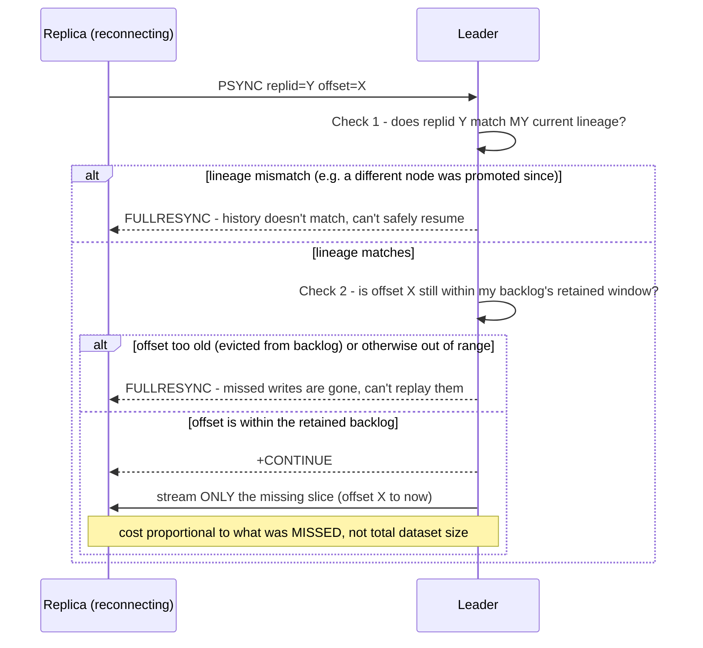

**TL;DR:** How does a replica catch up after a network blip without re-copying the whole database? The leader keeps a bounded replication backlog tagged with an offset, and on reconnect checks that the replica's replication lineage still matches and that the needed offset is still within the backlog before streaming only the missing slice; if either check fails, it falls back to a full resync.

**Real repo:** [`redis/redis`](https://github.com/redis/redis)

## 1. The Engineering Problem: reconnection shouldn't cost as much as the initial copy

Leader-follower replication needs every replica to receive every write, in order, to eventually converge with the leader. But leader-replica network connections aren't perfectly reliable — brief blips, replica restarts, transient failovers all cause disconnections a replica needs to recover from. The naive recovery — every reconnection triggers a full resync, the leader re-sends its *entire* dataset — is wildly wasteful for a connection that dropped for two seconds: re-transferring gigabytes to recover from a moment's hiccup, multiplied across every replica in a fleet, is a real and recurring cost, not an edge case.

---

## 2. The Technical Solution: a bounded backlog buffer, plus a lineage check before trusting a cheap resume

The leader keeps a **replication backlog** — a bounded ring buffer of the most recent write stream, tagged with a monotonically increasing offset. On reconnect, a replica reports "I already have everything up to offset X, from replication lineage Y." Before agreeing to a cheap **partial** resync, the leader checks two independent things:



The lineage check matters for a reason easy to underestimate: **if the leader's own identity or history changed — a different node was promoted during a failover — resuming from an offset in what's now a *different* write history could silently apply the wrong sequence of writes.** It's not enough to check "do I have data at this offset" — the leader has to confirm that offset belongs to the *same continuous history* the replica thinks it's resuming.

Core truths: **partial resync is a bet that only pays off within a bounded window** — the backlog has finite size, so a disconnection long enough (or a write volume high enough) to push the needed offset out of the backlog forces a full resync regardless of how short the actual outage was; and **a full resync is not a failure mode, it's the deliberately-chosen safe fallback** whenever a cheap resume can't be verified as correct — expensive but never wrong, versus a partial resume that's cheap but only ever offered when both checks actually pass.

---

## 3. The clean example (concept in isolation)

```python
def try_partial_resync(replica_replid, replica_offset):
    if replica_replid != leader.current_replid:
        return full_resync()   # different lineage - can't safely resume
    if replica_offset < backlog.oldest_offset or replica_offset > backlog.newest_offset:
        return full_resync()   # needed writes have aged out of the backlog
    missing = backlog.slice(replica_offset, backlog.newest_offset)
    return continue_resync(missing)   # cheap - proportional to what was missed
```

---

## 4. Production reality (from `redis/redis`)

```c
// src/replication.c
int masterTryPartialResynchronization(client *c, long long psync_offset) {
    char *master_replid = c->argv[1]->ptr;

    /* Is the replication ID of this master the same advertised by the
     * wannabe slave via PSYNC? If the replication ID changed this master
     * has a different replication history, and there is no way to continue. */
    if (strcasecmp(master_replid, server.replid) &&
        (strcasecmp(master_replid, server.replid2) ||
         psync_offset > server.second_replid_offset))
    {
        serverLog(LL_NOTICE,"Partial resynchronization not accepted: "
            "Replication ID mismatch (Replica asked for '%s', my "
            "replication IDs are '%s' and '%s')",
            master_replid, server.replid, server.replid2);
        goto need_full_resync;
    }

    /* We still have the data our slave is asking for? */
    if (!server.repl_backlog ||
        psync_offset < server.repl_backlog->offset ||
        psync_offset > (server.repl_backlog->offset + server.repl_backlog->histlen))
    {
        serverLog(LL_NOTICE,
            "Unable to partial resync with replica %s for lack of backlog (Replica request was: %lld).",
            replicationGetSlaveName(c), psync_offset);
        goto need_full_resync;
    }

    // both checks passed - stream ONLY the missing slice, +CONTINUE
}
```

What this teaches that a hello-world can't:

- **Two replication IDs are checked, not one (`server.replid` and `server.replid2`), and the second is only valid up to a specific offset (`second_replid_offset`).** This is the real mechanism handling a failover gracefully: when a replica is promoted to leader, it keeps track of the OLD leader's replication ID as a still-valid-up-to-a-point secondary lineage, so replicas that were following the old leader can still partial-resync against the newly-promoted one, instead of every replica in the fleet being forced into a full resync the moment a failover happens.
- **The backlog window check (`psync_offset < backlog->offset || psync_offset > backlog->offset + histlen`) checks BOTH directions**, not just "is this too old." An offset *greater* than what the leader has is logged as a distinct warning — a replica claiming to be ahead of the leader's own replication offset indicates something is genuinely wrong (a split-brain scenario, a replica that was talking to a different leader), not just a normal cache-miss-style "not in the backlog" case.
- **Every rejection path logs the SPECIFIC reason** — replication ID mismatch and backlog-window failure are distinguishable in the leader's own logs, not merged into one generic "resync failed" message. This is what makes a real production replication topology's failures diagnosable: an operator can tell "this replica fell too far behind" apart from "this replica was talking to the wrong leader" just from the log line.

Known-stale fact: "replication is just copying data to another server" undersells where the actual engineering difficulty lives — the hard part is efficiently recovering from the *routine*, expected disconnections without paying full-resync cost every time, while correctly distinguishing "this resume is merely unavailable" (backlog too small) from "this resume would be unsafe" (lineage changed). Both require dedicated state (a bounded backlog *and* a tracked replication lineage), not just "resend everything since the replica's last acknowledged offset."

---

## Source

- **Concept:** Database replication (leader-follower, read replicas)
- **Domain:** system-design
- **Repo:** [redis/redis](https://github.com/redis/redis) → [`src/replication.c`](https://github.com/redis/redis/blob/unstable/src/replication.c) — the real, production in-memory data store's replication implementation.
