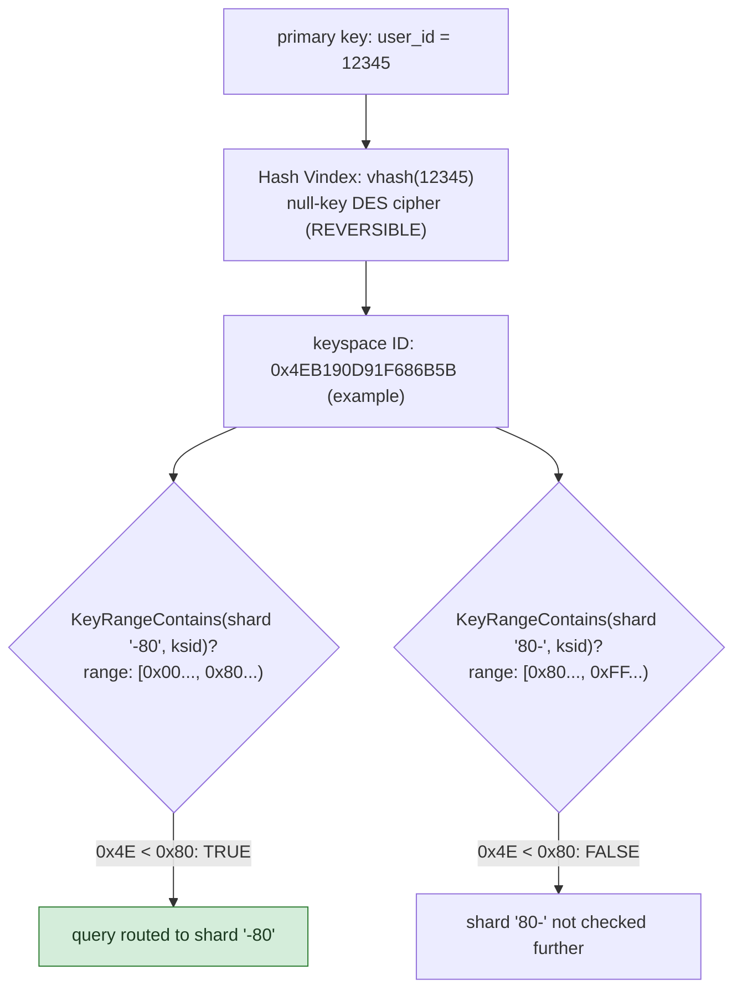

**TL;DR:** Which shard does a specific row actually land on, and why? Vitess deterministically hashes a primary key into a keyspace ID via a reversible Vindex, then routes to whichever shard's byte-range interval contains that keyspace ID — a pure comparison against range boundaries, not a lookup table or a modulo that would break on resharding.

**Real repo:** [`vitessio/vitess`](https://github.com/vitessio/vitess)

## 1. The Engineering Problem: "split the data across many databases" hides a real routing question

Sharding splits data across many independent database instances by key, once a single instance can't hold the data or serve the throughput a system needs. But "split by key" glosses over the actual mechanism: given any primary key value, how does the system deterministically know *which* shard holds it, every single time, without a lookup table that itself becomes a bottleneck or single point of failure? And can the mapping ever be reversed — given an internal identifier on a specific shard, recover the original key it came from?

---

## 2. The Technical Solution: hash the key to a keyspace ID, then find which shard's byte-range owns it

Vitess's routing has two real, composable steps. First, a **Vindex** deterministically maps a primary key value to a **keyspace ID** via a hash function. Vitess's default `Hash` Vindex uses a null-key DES cipher specifically because it's **reversible** — a typical one-way hash (MurmurHash, CRC32) can't be inverted, but Vitess needs to go both directions: hash a key to route a write, and later recover the original key from a keyspace ID when needed.



Second, each shard **owns a byte-range interval** `[Start, End)` over the keyspace ID space — Vitess's shard names (`-80`, `80-`) literally encode these hex boundaries. Routing a query for a given key means: hash the key to a keyspace ID, then find which shard's range *contains* that ID — a pure comparison, no lookup table, no coordination needed at query time.

Core truths: **the hash function's reversibility is a deliberate design choice, not a default property of "a hash"** — most sharding hash functions (MurmurHash, xxHash) are intentionally one-way and faster; Vitess trades some of that speed for the ability to reconstruct an original key from a keyspace ID. And **shard ownership is a range check, not a modulo** — `id % num_shards` breaks catastrophically on resharding (nearly every key remaps the instant `num_shards` changes); range-based ownership lets a *subset* of the keyspace move to a new shard by adjusting boundaries, leaving every key that stays put with an unchanged route.

---

## 3. The clean example (concept in isolation)

```python
def route_key(key: int, shards: list[ShardRange]) -> str:
    keyspace_id = deterministic_hash(key)   # same input -> same output, always
    for shard in shards:
        if shard.start <= keyspace_id < shard.end:
            return shard.name
    raise ValueError("no shard owns this keyspace ID - gap in shard map")

shards = [
    ShardRange(name="-80", start=0x00, end=0x80),
    ShardRange(name="80-", start=0x80, end=0xFF),
]
```

---

## 4. Production reality (from `vitessio/vitess`)

```go
// go/vt/vtgate/vindexes/hash.go - reversible hash: DES cipher on a null key
var blockDES cipher.Block

func init() {
    blockDES, _ = des.NewCipher(make([]byte, 8))   // null key - deterministic
}

func vhash(shardKey uint64) []byte {
    var keybytes, hashed [8]byte
    binary.BigEndian.PutUint64(keybytes[:], shardKey)
    blockDES.Encrypt(hashed[:], keybytes[:])
    return hashed[:]
}

func vunhash(k []byte) (uint64, error) {
    var unhashed [8]byte
    blockDES.Decrypt(unhashed[:], k)   // the REVERSE operation - only possible because
    return binary.BigEndian.Uint64(unhashed[:]), nil   // a block cipher is invertible
}

func (vind *Hash) Map(ctx context.Context, vcursor VCursor, ids []sqltypes.Value) ([]key.ShardDestination, error) {
    out := make([]key.ShardDestination, len(ids))
    for i, id := range ids {
        ksid, _ := vind.Hash(id)
        out[i] = key.DestinationKeyspaceID(ksid)
    }
    return out, nil
}
```

```go
// go/vt/key/key.go - shard ownership as a half-open byte range
func KeyRangeContains(keyRange *topodatapb.KeyRange, id []byte) bool {
    if KeyRangeIsComplete(keyRange) {
        return true
    }
    return (Empty(keyRange.Start) || Compare(id, keyRange.Start) >= 0) &&
           (Empty(keyRange.End) || Compare(id, keyRange.End) < 0)
}
```

What this teaches that a hello-world can't:

- **`des.NewCipher(make([]byte, 8))` uses an all-zero key, deliberately.** This isn't for secrecy — DES here isn't protecting anything from an attacker, it's being repurposed purely for its mathematical property of being a fixed, invertible bijection on 8-byte blocks. Using a real secret key would make the mapping non-reproducible across VTGate instances that all need to compute the identical keyspace ID for the same input independently.
- **`KeyRangeContains` treats an empty `Start` or `End` as "unbounded in that direction"** (`Empty(keyRange.Start)` short-circuits the lower check) — this is what lets the *first* and *last* shard in a keyspace have open-ended ranges (`-80` genuinely means "everything below 0x80," with no explicit lower bound stored at all) rather than needing an artificial `0x00` sentinel value.
- **`Map` returns a slice of destinations for a *batch* of IDs (`ids []sqltypes.Value`), not one at a time** — a real query touching multiple rows (an `IN (...)` clause, a multi-row insert) gets routed as a single batched hash operation, and different IDs in that batch can legitimately resolve to different shards, each handled by VTGate fanning the query out appropriately.

Known-stale fact: a common assumption is that sharding just means `key % num_shards` — that formula is simple but breaks badly under resharding: changing `num_shards` remaps nearly every key to a different shard simultaneously, requiring a massive coordinated data migration. Range-based ownership over a hashed keyspace (as shown here) is the production-standard alternative precisely because it supports incremental resharding — splitting or moving a range boundary affects only the keys within that specific range, not the entire keyspace at once.

---

## Source

- **Concept:** Database sharding/partitioning
- **Domain:** system-design
- **Repo:** [vitessio/vitess](https://github.com/vitessio/vitess) → [`go/vt/vtgate/vindexes/hash.go`](https://github.com/vitessio/vitess/blob/main/go/vt/vtgate/vindexes/hash.go), [`go/vt/key/key.go`](https://github.com/vitessio/vitess/blob/main/go/vt/key/key.go) — the real production database sharding proxy built for YouTube's MySQL scale.
