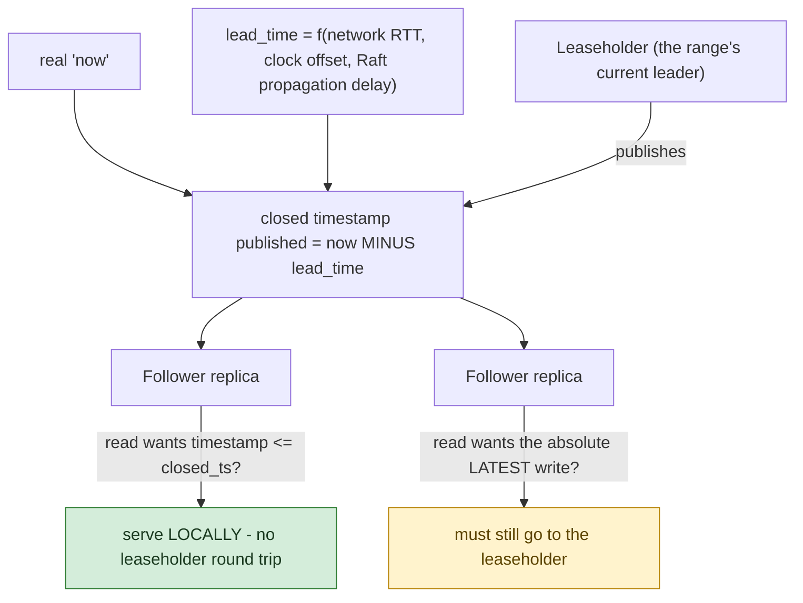

**TL;DR:** Why does "consistent" sometimes mean "wait a little longer," even when nothing is broken? Because PACELC extends CAP theorem to the non-partition case: CockroachDB's closed timestamps let a follower serve a read locally once it holds a promise that no more writes will land below a given timestamp, trading a computed lead time of staleness for lower latency and availability, while reads that need the absolute latest write still go to the leaseholder.
> **In plain English (30 sec):** Think of this like concepts you already use, but in a production system at scale.


**Real repo:** [`cockroachdb/cockroach`](https://github.com/cockroachdb/cockroach)

## 1. The Engineering Problem: CAP only describes the bad day, not the other 99.9% of the time

CAP theorem is usually taught as "during a network partition, pick two of Consistency, Availability, Partition tolerance" — true, but incomplete. It says nothing about behavior when there *isn't* a partition, which is the overwhelming majority of the time a real distributed system runs. Yet even in the healthy case, a real tradeoff persists: serve a read from the nearest, fastest available replica (low latency) versus guarantee that read reflects the absolute latest write (which usually means routing through a single leader, adding a network hop). This is exactly what **PACELC** formalizes as CAP's missing half: even without a Partition, there's an ongoing tradeoff between Latency and Consistency.

---

## 2. The Technical Solution: a quantified promise about how far behind "now" a follower is allowed to be

CockroachDB's **closed timestamps** mechanism is a real, numerically-computed answer to exactly this tradeoff. A closed timestamp is a promise from a range's leaseholder: "no more writes will ever be applied to this range below timestamp T." Once a *follower* replica has received a closed timestamp at or above the time a read wants to observe, it can serve that read **locally, without contacting the leaseholder at all** — lower latency, and availability even if the leaseholder is slow or briefly unreachable.



The catch, and the actual tradeoff made explicit: **the closed timestamp published right now is always slightly behind real "now," by a deliberately-computed lead time** — accounting for network round-trip time, clock uncertainty between nodes, and how long Raft consensus takes to actually propagate a write to followers. That lead time isn't arbitrary; CockroachDB computes it from real, measurable quantities specifically so followers have *just enough* margin to have actually replicated everything up to the promised timestamp before making that promise.

Core truths: **this isn't "pick strong or eventual consistency" as a binary architectural choice** — it's a continuously-tuned latency/consistency dial, where the lead time IS the price paid, in staleness, for the ability to serve reads locally instead of paying a network hop to the leaseholder every time; and **a read that specifically needs the absolute latest write still has an escape hatch** — it goes to the leaseholder directly, paying the extra latency, exactly when correctness actually requires it rather than by default.

---

## 3. The clean example (concept in isolation)

```
closed_timestamp = now() - lead_time   # lead_time accounts for RTT + clock skew + propagation

# Follower can serve this read LOCALLY (fast, available even if leaseholder is down):
read_at(t) where t <= closed_timestamp

# This read needs the true latest state - must go to the leaseholder (slower, but current):
read_at(t) where t > closed_timestamp
```

---

## 4. Production reality (from `cockroachdb/cockroach`)

```go
// pkg/kv/kvserver/closedts/policy.go
const (
    DefaultMaxNetworkRTT             = 150 * time.Millisecond
    closedTimestampPolicyBucketWidth = 20 * time.Millisecond
)

// computeLeadTimeForGlobalReads calculates how far ahead of the current time
// a node should publish closed timestamps to ensure that followers can serve
// global reads. It accounts for network latency, clock offset, and both Raft
// and side-transport propagation delays.
//
//  closed_ts_at_follower = now + max_offset
//  closed_ts_at_sender = closed_ts_at_follower + propagation_time
//  propagation_time = max(raft_propagation_time, side_propagation_time)
//
//  # Raft propagation takes 3 network hops:
//  # 1. leader sends MsgProp with entry
//  # 2. followers send MsgPropResp with vote
//  # 3. leader sends MsgProp with higher commit index
//  raft_propagation_time = max_network_rtt * 1.5 + raft_overhead
//
//  # Side-transport propagation takes 1 network hop, no voting -
//  # but delayed by the full side_transport_close_interval worst-case.
//  side_propagation_time = max_network_rtt * 0.5 + side_transport_close_interval
func computeLeadTimeForGlobalReads(
    networkRTT time.Duration,
    maxClockOffset time.Duration,
    sideTransportCloseInterval time.Duration,
    sideTransportPacingInterval time.Duration,
) time.Duration {
    // ... combines the above into a single lead time ...
}
```

What this teaches that a hello-world can't:

- **The lead time is computed from real, independently-measurable inputs — network RTT, clock offset, propagation delay — not a single hardcoded "staleness allowance."** This is the difference between "eventual consistency" as a vague promise and a system that can tell you, numerically, exactly how stale a follower read is allowed to be under its current network conditions.
- **Two different propagation paths (Raft-based and a separate "side transport") are compared with `max()`, and the SLOWER one determines the lead time.** The system can't promise a closed timestamp any earlier than its slowest actual replication mechanism can guarantee — a closed timestamp is only ever as fresh as the slowest path data could have taken to reach every follower.
- **Raft propagation is explicitly modeled as three network hops (`max_network_rtt * 1.5`), not one round trip.** This reflects consensus's real cost: a leader proposing an entry, followers voting, and the leader confirming a higher commit index are three distinct legs, not a single request/response — a detail invisible to anyone treating "the write is replicated" as an instantaneous fact rather than a multi-hop process with real latency.

Known-stale fact: CAP theorem is frequently oversimplified as "you get to pick 2 of 3, permanently" — as if it's a one-time architectural decision baked in forever. It actually describes system behavior *specifically during a network partition*; PACELC is the more complete framing precisely because it names the tradeoff that exists all the rest of the time too — the closed-timestamp lead time above is a real, live, continuously-recalculated instance of exactly that latency/consistency dial, not a partition-recovery mechanism at all.

---

## Source

- **Concept:** CAP theorem & consistency models (strong vs eventual)
- **Domain:** system-design
- **Repo:** [cockroachdb/cockroach](https://github.com/cockroachdb/cockroach) → [`pkg/kv/kvserver/closedts/policy.go`](https://github.com/cockroachdb/cockroach/blob/master/pkg/kv/kvserver/closedts/policy.go) — the real distributed SQL database's closed-timestamp/follower-reads mechanism.


