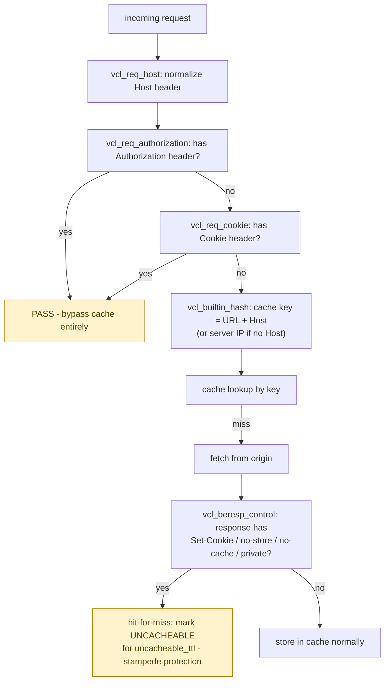

**TL;DR:** Why does adding one cookie header silently turn off your CDN's caching? Because Varnish's default rules bypass the cache entirely for any request carrying a Cookie or Authorization header (and mark a response uncacheable if the origin's reply sets a cookie or is `no-store`/`private`) — a deliberate safety default against leaking one user's response to another, not a bug — while "hit-for-miss" caches that uncacheable state briefly to prevent a stampede of repeated origin fetches.

> **In plain English (30 sec):** Memoization you already do: check Map first, only call DB on miss.

**Real repo:** [`varnishcache/varnish-cache`](https://github.com/varnishcache/varnish-cache)

## 1. The Engineering Problem: caching isn't safe by default, and that's a feature, not a bug

A CDN sits in front of an origin, serving repeat requests without hitting the backend — but caching a response is not automatically safe. A personalized response (one that sets a cookie, was requested with an `Authorization` header, or is explicitly marked private) cached and served to a *different* user is a real, serious bug class: cross-user data leakage through a shared cache. Treat every response as uncacheable and the CDN accomplishes nothing; treat every response as cacheable and you risk leaking one user's session or personal data to the next visitor who happens to hit the same URL. The system needs principled default rules for when caching is even attempted — not something left entirely to per-site configuration to get right.

---

## 2. The Technical Solution: explicit default rules, at every stage, for what's safe to cache

Varnish's real default VCL (the config language running many production CDN/reverse-proxy cache deployments) encodes these rules explicitly, in a defined order:



The "hit-for-miss" step is worth naming precisely: when the origin's response turns out to be uncacheable, Varnish doesn't just skip storing *this* response — it marks the cache key itself uncacheable for a bounded time window (`uncacheable_ttl`). Without this, a burst of near-simultaneous requests for a URL the origin always marks `no-store` would each independently trigger a full lookup-then-fetch cycle, hammering the origin exactly when load is highest — a cache stampede on a URL that was never going to be cacheable in the first place.

Refreshing an expired object is handled with the same care: it uses **conditional requests** (`If-Modified-Since`/`If-None-Match`) to the origin, and explicitly re-validates that the stale object being refreshed wasn't invalidated by something else *during* the refresh (`obj_stale.is_valid`) before merging in the fresh response — protecting against a race where the object's identity changed underneath the in-flight refresh.

Core truths: **the cache key is built from URL plus Host by default, not URL alone** — two requests for the identical path under different hostnames are different cache entries unless something explicitly unifies them; and **request-side and response-side bypass rules are independent checks, both real** — a request can be cacheable-looking (no Cookie, no Authorization) and still get marked uncacheable once the *origin's actual response* reveals it shouldn't be cached, and vice versa.

---

## 3. The clean example (concept in isolation)

```vcl
sub vcl_req_cookie {
    if (req.http.Cookie) {
        return (pass);   # bypass cache entirely - don't risk serving this to someone else
    }
}

sub vcl_builtin_hash {
    hash_data(req.url);
    if (req.http.host) {
        hash_data(req.http.host);   # cache key includes the HOST, not just the path
    }
}
```

---

## 4. Production reality (from `varnishcache/varnish-cache`'s real default `builtin.vcl`)

```vcl
sub vcl_req_authorization {
    if (req.http.Authorization) {
        # Not cacheable by default.
        return (pass);
    }
}

sub vcl_req_cookie {
    if (req.http.Cookie) {
        # Risky to cache by default.
        return (pass);
    }
}

sub vcl_builtin_hash {
    hash_data(req.url);
    if (req.http.host) {
        hash_data(req.http.host);
    } else {
        hash_data(server.ip);
    }
}

sub vcl_beresp_control {
    if (beresp.http.Surrogate-control ~ "(?i)no-store" ||
        (!beresp.http.Surrogate-Control &&
          beresp.http.Cache-Control ~ "(?i:no-cache|no-store|private)")) {
        call vcl_beresp_hitmiss;
    }
}

sub vcl_beresp_hitmiss {
    set beresp.ttl = param.uncacheable_ttl;
    set beresp.uncacheable = true;
    return (deliver);
}

# Refreshing a stale object - conditional request + re-validation
sub vcl_refresh_valid {
    if (!obj_stale.is_valid) {
        return (error(503, "Invalid object for refresh"));
    }
}

sub vcl_refresh_conditions {
    if (!bereq.http.if-modified-since &&
        !bereq.http.if-none-match) {
        return (error(503, "Unexpected 304"));
    }
}
```

What this teaches that a hello-world can't:

- **`Surrogate-Control` is checked FIRST, and `Cache-Control` is only consulted if `Surrogate-Control` is absent.** `Surrogate-Control` is a CDN-specific header meant to be stripped before the response reaches the end client, letting an origin give the CDN different caching instructions than it gives browsers — this default logic implements that separation directly: a CDN-facing override takes precedence over the client-facing `Cache-Control` header when both are present.
- **`vcl_beresp_hitmiss` sets a bounded `beresp.ttl = param.uncacheable_ttl`, not an infinite or zero TTL.** Marking something uncacheable still needs its own expiry — without one, a URL that was uncacheable for a transient reason (a one-time debug header, a misconfigured response) would stay marked uncacheable forever, even after the origin starts returning genuinely cacheable responses again.
- **`vcl_refresh_conditions` explicitly rejects a refresh attempt that lacks `If-Modified-Since` or `If-None-Match`** — refreshing a stale object is only permitted as a *conditional* request, never a blind full re-fetch, at this stage. This is what makes 304 Not Modified responses meaningful: the refresh path is structurally required to ask "has this changed?" rather than always re-downloading the full body.

Known-stale fact: a very common real-world "why isn't my CDN caching anything" incident traces back to exactly the request/response rules shown here — an analytics script, A/B test framework, or session-refresh mechanism silently attaching a `Set-Cookie` (or the request carrying a `Cookie`) to what would otherwise be a fully static, cacheable page. This isn't a CDN malfunction; it's the correct, safe default behavior working exactly as designed — the fix is removing unnecessary cookies from cacheable responses or explicitly overriding the default VCL logic for routes known to be safe, not treating it as a caching bug to route around blindly.

---

## Source

- **Concept:** Content Delivery Networks (CDN)
- **Domain:** system-design
- **Repo:** [varnishcache/varnish-cache](https://github.com/varnishcache/varnish-cache) → [`bin/varnishd/builtin.vcl`](https://github.com/varnishcache/varnish-cache/blob/master/bin/varnishd/builtin.vcl) — the real default caching logic shipped with Varnish, used by many production CDN/reverse-proxy deployments.


