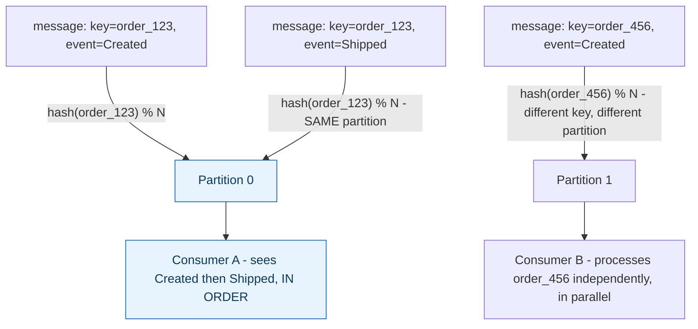

**TL;DR:** Why does a message with the same key always land on the same partition? Kafka routes each keyed message via `hash(key) % numPartitions`, deterministically landing the same key on the same partition every time to guarantee per-key ordering, while different keys spread across partitions for parallel processing — unkeyed messages instead use load-aware "sticky" batching rather than pure round-robin.
> **In plain English (30 sec):** Think of this like concepts you already use, but in a production system at scale.


**Real repo:** [`apache/kafka`](https://github.com/apache/kafka)

## 1. The Engineering Problem: parallelism and ordering pull in opposite directions

A message queue serving high throughput needs many consumers processing in parallel. But related messages often need strict ordering — all events for `order_id=123` must be processed in the sequence they happened, or a "cancelled" event overtaking a "shipped" event silently corrupts business state. A single unordered pool of messages loses ordering guarantees entirely; a single strictly-ordered queue loses parallelism, since only one consumer can safely drain it without risking out-of-order processing. You need many parallel processing lanes while still guaranteeing order *within* each lane for messages that must stay ordered relative to each other.

---

## 2. The Technical Solution: partitions as independent ordered logs, keyed by a deterministic hash

Kafka splits a topic into N independent, ordered logs called **partitions**. A message with a **key** is routed deterministically: `hash(key) % numPartitions` — the same key always lands on the same partition (as long as the partition count doesn't change), which guarantees per-key ordering, while *different* keys spread naturally across all N partitions for parallelism.



A message with **no key** doesn't use pure round-robin — Kafka's producer uses "sticky" partitioning instead: it sends a whole *batch* of unkeyed records to one partition before switching to another, specifically to build larger, more efficient batches (fewer, bigger network requests instead of many tiny ones scattered thin across every partition). It can even weight partition selection by real-time load, not treat every partition as uniformly available.

On the **consumer** side, within one consumer group, each partition is assigned to exactly one consumer at a time — this is what actually caps useful parallelism at the partition count, not the number of consumers running. A 6th consumer added to a group reading a 5-partition topic sits idle: there's no smaller unit of work left to hand it.

Core truths: **ordering is a per-key guarantee, not a global one** — Kafka never promises "all messages across the whole topic arrive in send order," only "messages sharing a key, within one partition, arrive in send order"; and **changing the partition count breaks the key-to-partition mapping for every key that existed before the change** — `hash(key) % N` with a new N routes the same key to a *different* partition than it used to, silently ending the ordering guarantee across that boundary for anything sent before versus after.

---

## 3. The clean example (concept in isolation)

```python
def choose_partition(key: bytes | None, num_partitions: int, sticky_partition: int) -> int:
    if key is not None:
        return positive(murmur2(key)) % num_partitions   # deterministic - same key, same partition
    return sticky_partition   # unkeyed: stick to one partition per batch, switch periodically

# consumer group assignment
partitions = 5
consumers = 6
# only 5 consumers get assigned a partition - the 6th is idle, no smaller unit to give it
```

---

## 4. Production reality (from `apache/kafka`)

```java
// clients/.../producer/internals/BuiltInPartitioner.java
/**
 * Default hashing function to choose a partition from the serialized key bytes
 */
public static int partitionForKey(final byte[] serializedKey, final int numPartitions) {
    return Utils.toPositive(Utils.murmur2(serializedKey)) % numPartitions;
}
```

```java
// nextPartition() - unkeyed records: sticky + load-aware, NOT plain round-robin
private int nextPartition(Cluster cluster) {
    int random = randomPartition();
    PartitionLoadStatsHolder partitionLoadStats = this.partitionLoadStatsHolder;
    int partition;

    if (partitionLoadStats == null) {
        // No load stats yet - fall back to uniform distribution across available partitions
        List<PartitionInfo> availablePartitions = cluster.availablePartitionsForTopic(topic);
        partition = availablePartitions.get(random % availablePartitions.size()).partition();
    } else {
        // Calculate next partition based on REAL load distribution, not uniform chance
        PartitionLoadStats partitionLoadStatsToUse = partitionLoadStats.total;
        // ... weighted selection favoring less-loaded partitions ...
    }
    return partition;
}
```

What this teaches that a hello-world can't:

- **`Utils.toPositive(...)` wraps the murmur2 hash before the modulo** — a raw hash can be negative (signed integer overflow), and `% numPartitions` on a negative value in Java doesn't reliably land in `[0, numPartitions)`. This is a small, easy-to-miss correctness detail: implementing "hash mod N" naively without this step could route some keys to an invalid negative partition index.
- **The constructor takes a `stickyBatchSize` parameter ("how much to produce to a partition before switch")** — sticky partitioning isn't "pick one partition and never leave it," it's a deliberately bounded stickiness window, balancing batch-size efficiency against eventually spreading load across all partitions rather than concentrating everything on one.
- **`rackAware` and the rack-filtering logic in `nextPartition`** show unkeyed partitioning can also account for physical topology — preferring partitions whose leader replica lives in the *same* datacenter rack as the producer, reducing cross-rack network cost, with a documented fallback to the full partition set if no in-rack partitions are available. Ordering/parallelism isn't the only axis this mechanism optimizes for; network locality is a real, separate consideration layered on top.

Known-stale fact: "add more consumers for more throughput" is a common but incomplete mental model — consumer-group parallelism is capped by **partition count**, not consumer count. A frequent real operational mistake is scaling a consumer group past a topic's partition count expecting linear throughput gains and getting none (the extra consumers sit idle), or under-provisioning partitions at topic-creation time without realizing that increasing partition count *later* silently breaks the "same key, same partition" ordering guarantee for every key that existed under the old partition count.

---

## Source

- **Concept:** Message queues & async processing
- **Domain:** system-design
- **Repo:** [apache/kafka](https://github.com/apache/kafka) → [`clients/src/main/java/org/apache/kafka/clients/producer/internals/BuiltInPartitioner.java`](https://github.com/apache/kafka/blob/trunk/clients/src/main/java/org/apache/kafka/clients/producer/internals/BuiltInPartitioner.java) — the real, production log-based streaming platform.


