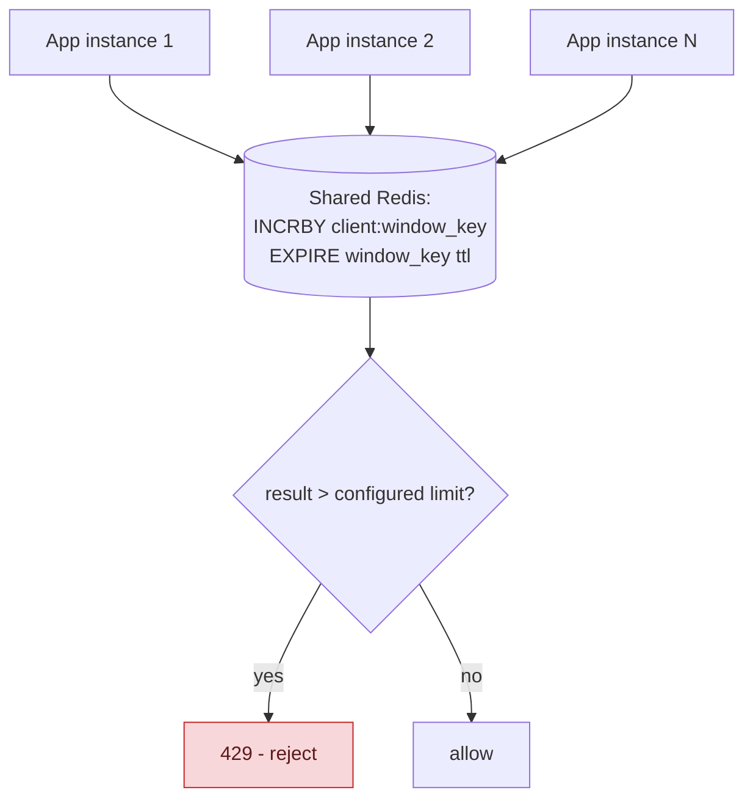

## 1. The Engineering Problem: an in-memory counter only sees its own instance's traffic

An in-process rate limiter (a token bucket held in one server's memory) works perfectly as long as a client's requests all land on the *same* instance. Behind a load balancer, they don't — a client's 100 requests might spread across 20 app instances, each running its own independent in-memory counter that only ever sees a fraction of that client's total traffic. Every instance might individually think the client is well under its limit, while the *aggregate* rate across all instances is effectively the configured limit multiplied by however many instances happen to be running — the rate limit silently stops meaning what it's supposed to mean.

---

## 2. The Technical Solution: move the counter to shared state every instance consults

The fix is structural: the counter has to live somewhere every app instance can see and update atomically — typically Redis. Each request increments a key representing `(client, time window)` via `INCRBY`, with an `EXPIRE` set to the window's length so the counter naturally resets when the window rolls over; if the incremented value exceeds the configured limit, reject.



Two real production refinements matter beyond the naive version. First, a **local, per-instance cache of "definitely over limit"** clients: once a key is confirmed over its limit, that fact is cached briefly *inside each app instance* — so the next request from that same throttled client doesn't need a fresh Redis round-trip just to get rejected again, cutting real load on the shared backend for exactly the traffic pattern (a client that's already being throttled, and will keep retrying) most likely to generate a lot of it. Second, **jittered expiration**: adding random jitter to each key's TTL prevents many different clients' rate-limit windows from expiring at the exact same moment — without jitter, every window boundary becomes a synchronized burst of key recreation hitting Redis all at once, the same thundering-herd shape a naive cache-expiry scheme runs into.

Core truths: **the shared counter is the source of truth; local caching only ever short-circuits the "already known to be over" case**, it never grants extra allowance a request wouldn't otherwise have — a request that isn't locally cached as over-limit still goes to Redis for the real, authoritative check. And **jitter on expiration is purely an operational smoothing technique**, it doesn't change what's being rate-limited or by how much, only when the underlying Redis operations spike.

---

## 3. The clean example (concept in isolation)

```python
def is_allowed(client_id, limit, window_seconds):
    key = f"rl:{client_id}:{current_window(window_seconds)}"
    if local_cache.get(key) == "over_limit":
        return False   # short-circuit - skip the Redis round-trip

    count = redis.incrby(key, 1)
    redis.expire(key, window_seconds + random_jitter())   # jittered TTL

    if count > limit:
        local_cache.set(key, "over_limit", ttl=short_local_ttl)
        return False
    return True
```

---

## 4. Production reality (from `envoyproxy/ratelimit`)

```go
// src/redis/fixed_cache_impl.go
func pipelineAppend(client Client, pipeline *Pipeline, key string, hitsAddend uint64, result *uint64, expirationSeconds int64) {
    *pipeline = client.PipeAppend(*pipeline, result, "INCRBY", key, hitsAddend)
    *pipeline = client.PipeAppend(*pipeline, nil, "EXPIRE", key, expirationSeconds)
}
```

```go
// jittered expiration, to avoid synchronized window-boundary spikes
expirationSeconds := utils.UnitToDivider(limits[i].Limit.Unit)
if this.baseRateLimiter.ExpirationJitterMaxSeconds > 0 {
    expirationSeconds += this.baseRateLimiter.JitterRand.Int63n(this.baseRateLimiter.ExpirationJitterMaxSeconds)
}
```

```go
// local in-process cache checked BEFORE any Redis round-trip
for i, cacheKey := range cacheKeys {
    if this.baseRateLimiter.IsOverLimitWithLocalCache(cacheKey.Key) {
        isCacheKeyOverlimit = true
        isOverLimitWithLocalCache[i] = true
        // no Redis call needed - already known to be over limit
    }
}
```

What this teaches that a hello-world can't:

- **`INCRBY` and `EXPIRE` are appended to the SAME Redis pipeline (`pipelineAppend`), not issued as two separate round-trips.** Batching them into one pipeline is what keeps the shared-state approach fast enough to sit on the hot path of every request — a design that sent two sequential network calls to Redis per rate-limit check would add real, compounding latency at scale.
- **`ExpirationJitterMaxSeconds` is added ON TOP of the base window length, not used to replace it** — the jitter only ever makes a key's expiry slightly *later* and randomized, never changes the actual rate-limit window duration a client experiences. The smoothing is purely about *when Redis does the eviction/recreation work*, completely decoupled from the rate limit's actual semantics.
- **The local-cache check happens before ANY cache keys are even sent to Redis in this request** — `IsOverLimitWithLocalCache` is checked in a loop over all descriptors *before* the pipeline is built. This ordering is deliberate: a client hammering an endpoint while already over its limit generates zero Redis traffic for those requests past the first rejection, until the local cache entry itself expires.

Known-stale fact: rate limiting is often assumed to be a purely application-code concern — a library call living inside one process. At real infrastructure scale behind a load balancer or service mesh, that assumption breaks silently: per-instance in-memory counters don't coordinate, so the effective limit becomes the configured limit multiplied by instance count, with no error or warning anywhere. A dedicated, shared-state rate-limiting layer (Redis-backed, consulted by every instance) is what closes that exact gap — not a more clever local algorithm.

---

## Source

- **Concept:** Rate limiting & throttling
- **Domain:** system-design
- **Repo:** [envoyproxy/ratelimit](https://github.com/envoyproxy/ratelimit) → [`src/redis/fixed_cache_impl.go`](https://github.com/envoyproxy/ratelimit/blob/main/src/redis/fixed_cache_impl.go) — the real, production distributed rate-limiting service used with Envoy.
