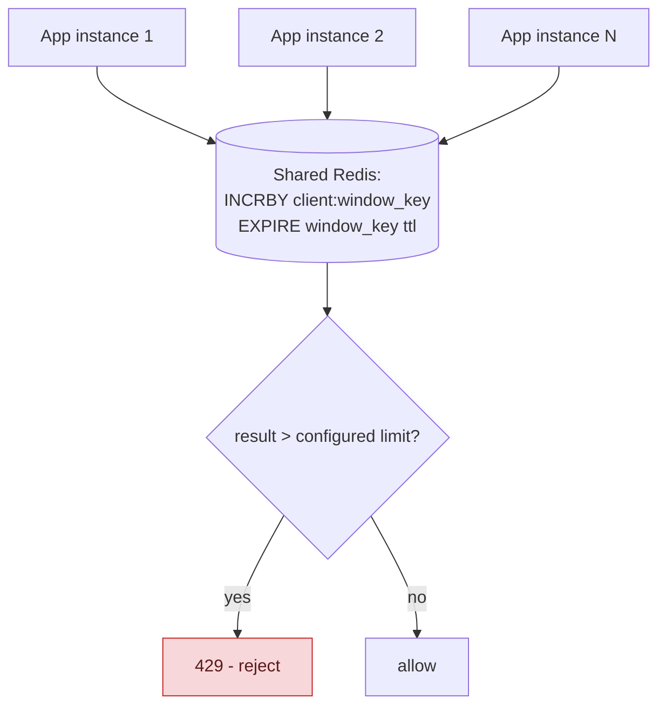
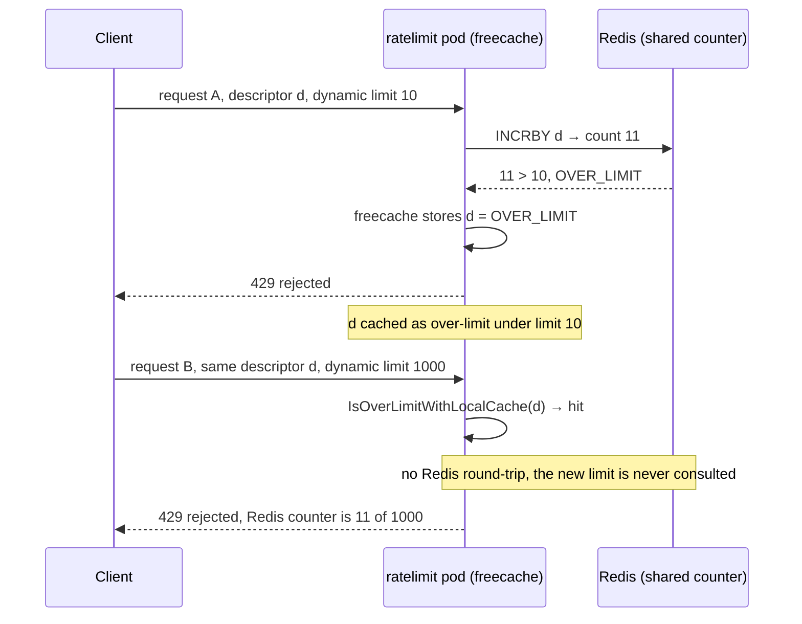

**TL;DR:** How do you rate-limit a client when their requests might hit any of 50 app servers? By moving the counter out of each instance's memory into shared state (Redis) that every instance atomically increments and checks via `INCRBY`/`EXPIRE`, with a local per-instance cache of already-over-limit clients and jittered TTLs to avoid a Redis round-trip on every retry and a thundering herd at window boundaries.

**Real repo:** [`envoyproxy/ratelimit`](https://github.com/envoyproxy/ratelimit)

## 1. The Engineering Problem: an in-memory counter only sees its own instance's traffic

An in-process rate limiter (a token bucket held in one server's memory) works perfectly as long as a client's requests all land on the *same* instance. Behind a load balancer, they don't — a client's 100 requests might spread across 20 app instances, each running its own independent in-memory counter that only ever sees a fraction of that client's total traffic. Every instance might individually think the client is well under its limit, while the *aggregate* rate across all instances is effectively the configured limit multiplied by however many instances happen to be running — the rate limit silently stops meaning what it's supposed to mean.

---

## 2. The Technical Solution: move the counter to shared state every instance consults

The fix is structural: the counter has to live somewhere every app instance can see and update atomically — typically Redis. Each request increments a key representing `(client, time window)` via `INCRBY`, with an `EXPIRE` set to the window's length so the counter naturally resets when the window rolls over; if the incremented value exceeds the configured limit, reject.



Two real production refinements matter beyond the naive version. First, a **local, per-instance cache of "definitely over limit"** clients: once a key is confirmed over its limit, that fact is cached briefly *inside each app instance* — so the next request from that same throttled client doesn't need a fresh Redis round-trip just to get rejected again, cutting real load on the shared backend for exactly the traffic pattern (a client that's already being throttled, and will keep retrying) most likely to generate a lot of it. Second, **jittered expiration**: adding random jitter to each key's TTL prevents many different clients' rate-limit windows from expiring at the exact same moment — without jitter, every window boundary becomes a synchronized burst of key recreation hitting Redis all at once, the same thundering-herd shape a naive cache-expiry scheme runs into.

Core truths: **the shared counter is the source of truth; local caching only ever short-circuits the "already known to be over" case**, it never grants extra allowance a request wouldn't otherwise have — a request that isn't locally cached as over-limit still goes to Redis for the real, authoritative check. And **jitter on expiration is purely an operational smoothing technique**, it doesn't change what's being rate-limited or by how much, only when the underlying Redis operations spike.

---

## 3. The clean example (concept in isolation)

```python
def is_allowed(client_id, limit, window_seconds):
    key = f"rl:{client_id}:{current_window(window_seconds)}"
    if local_cache.get(key) == "over_limit":
        return False   # short-circuit - skip the Redis round-trip

    count = redis.incrby(key, 1)
    redis.expire(key, window_seconds + random_jitter())   # jittered TTL

    if count > limit:
        local_cache.set(key, "over_limit", ttl=short_local_ttl)
        return False
    return True
```

---

## 4. Production reality (from `envoyproxy/ratelimit`)

```go
// src/redis/fixed_cache_impl.go
func pipelineAppend(client Client, pipeline *Pipeline, key string, hitsAddend uint64, result *uint64, expirationSeconds int64) {
    *pipeline = client.PipeAppend(*pipeline, result, "INCRBY", key, hitsAddend)
    *pipeline = client.PipeAppend(*pipeline, nil, "EXPIRE", key, expirationSeconds)
}
```

```go
// jittered expiration, to avoid synchronized window-boundary spikes
expirationSeconds := utils.UnitToDivider(limits[i].Limit.Unit)
if this.baseRateLimiter.ExpirationJitterMaxSeconds > 0 {
    expirationSeconds += this.baseRateLimiter.JitterRand.Int63n(this.baseRateLimiter.ExpirationJitterMaxSeconds)
}
```

```go
// local in-process cache checked BEFORE any Redis round-trip
for i, cacheKey := range cacheKeys {
    if this.baseRateLimiter.IsOverLimitWithLocalCache(cacheKey.Key) {
        isCacheKeyOverlimit = true
        isOverLimitWithLocalCache[i] = true
        // no Redis call needed - already known to be over limit
    }
}
```

What this teaches that a hello-world can't:

- **`INCRBY` and `EXPIRE` are appended to the SAME Redis pipeline (`pipelineAppend`), not issued as two separate round-trips.** Batching them into one pipeline is what keeps the shared-state approach fast enough to sit on the hot path of every request — a design that sent two sequential network calls to Redis per rate-limit check would add real, compounding latency at scale.
- **`ExpirationJitterMaxSeconds` is added ON TOP of the base window length, not used to replace it** — the jitter only ever makes a key's expiry slightly *later* and randomized, never changes the actual rate-limit window duration a client experiences. The smoothing is purely about *when Redis does the eviction/recreation work*, completely decoupled from the rate limit's actual semantics.
- **The local-cache check happens before ANY cache keys are even sent to Redis in this request** — `IsOverLimitWithLocalCache` is checked in a loop over all descriptors *before* the pipeline is built. This ordering is deliberate: a client hammering an endpoint while already over its limit generates zero Redis traffic for those requests past the first rejection, until the local cache entry itself expires.

Known-stale fact: rate limiting is often assumed to be a purely application-code concern — a library call living inside one process. At real infrastructure scale behind a load balancer or service mesh, that assumption breaks silently: per-instance in-memory counters don't coordinate, so the effective limit becomes the configured limit multiplied by instance count, with no error or warning anywhere. A dedicated, shared-state rate-limiting layer (Redis-backed, consulted by every instance) is what closes that exact gap — not a more clever local algorithm.

---

## 5. Production incident: the local over-limit cache rejects clients who are under their *new* limit

**Incident:** Deployments using the service's dynamic per-request limit overrides saw clients wrongly rejected. A descriptor first limited under a **low** dynamic limit had its key written into the pod's local cache as over-limit; a later request carrying the **same descriptor but a higher dynamic limit** was rejected straight from that local cache — no Redis round-trip — even though the shared Redis counter sat far below the new, higher threshold.

**Symptom:** `over_limit` statistics keep climbing for a descriptor whose Redis counter is visibly under its limit — rejections that follow individual ratelimit pods, not the shared state.

**Root cause:** the local over-limit cache from section 4 (`IsOverLimitWithLocalCache`, backed by freecache) keys only on the descriptor's cache key. It stores the *verdict* — "over limit" — but not the *limit* that produced the verdict. With dynamic overrides, "over limit" is relative to a threshold that can change per request; the cache replays a verdict computed under a different limit.

**Blast radius:** any descriptor combining dynamic limit overrides with the local cache enabled. Descriptors with static configured limits are unaffected — their limit can't change, so a cached verdict stays valid.



Source: [Descriptors with dynamic limits get limited by local cache though redis counter is under the limit · envoyproxy/ratelimit#1077](https://github.com/envoyproxy/ratelimit/issues/1077) — closed without a merged code fix (marked stale), which is why the resolution below is operational, not a version upgrade.

---

## 6. Troubleshooting & resolution

1. **Watch the service's own verdict stats, not just Redis.** Port-forward the debug port and check the per-descriptor counters:

   ```bash
   kubectl port-forward deploy/ratelimit 6070:6070
   curl -s localhost:6070/stats | grep over_limit
   ```

   If `ratelimit.service.rate_limit.<domain>.<descriptor>.over_limit` keeps incrementing while the descriptor's Redis counter (the key the service `INCRBY`s for this descriptor-window) sits below the limit, the rejection is being decided *locally*, not by the shared counter.

2. **Diff the loaded config against what clients send:**

   ```bash
   curl -s localhost:6070/rlconfig
   ```

   This prints the statically configured limits. Dynamic overrides arrive per-request and never appear here — a descriptor in this config whose clients also send per-request limit overrides is exactly the setup for this failure.

3. **Isolate in-memory state.** Restart one ratelimit pod (`kubectl delete pod <ratelimit-pod>`). False rejections from that pod stop immediately — and resume only after a fresh over-limit verdict re-caches the key. State that dies with the pod was freecache, not Redis.

4. **Resolution (operational, since no upstream fix merged):** for deployments whose descriptors use dynamic limit overrides, disable the local cache — the README's Local Cache section: *"If `LocalCacheSizeInBytes` is 0, local cache is disabled"* — and accept the extra Redis round-trip per check on those paths. There is no configuration that keeps both behaviors, because the cache key does not include the limit. Keep the cache enabled for static-limit descriptors, where a cached verdict can't go stale. False rejections do self-heal when the cached entry expires (section 4's "until the local cache entry itself expires") — but they reappear on the next over-limit verdict under any lower limit, so expiry is not a fix.

---

## 7. Prevention & production checklist

- **Dynamic overrides ⇒ local cache off.** Any descriptor whose clients send per-request limit overrides must be served with `LocalCacheSizeInBytes: 0`. Enforce this as a config-review rule when the override feature is adopted — the failure is silent until the first low-limit verdict gets cached.
- **Alert on divergence, not just on volume.** `over_limit` climbing for a descriptor while its Redis counter stays below threshold is the signature of a local-verdict bug — an alert on `over_limit` alone can't distinguish it from real limiting, so pair the check with the counter.
- **Use `near_limit` as the early warning.** The service emits `near_limit` once a key crosses `NEAR_LIMIT_RATIO` (default 0.8) of its threshold — the last clean signal before an over-limit verdict gets written into a local cache.
- **Load-test with non-uniform limits.** A test that only ever sends one limit value per descriptor cannot reproduce this failure — it needs a low-then-high sequence on the *same* descriptor. If dynamic limits are part of the design, that sequence belongs in the pre-prod test suite.

---

## 8. Cloud & library lens: the three layers where production rate limiting actually lives

This lesson's architecture — shared Redis counters consulted by every instance — is one of three real deployment shapes. Production systems choose per layer, and the choice is about **where a single shared counter exists**:

| Layer | Real implementation | The deciding gotcha |
|-------|--------------------|---------------------|
| Edge (managed) | Google Cloud Armor `throttle` / `rate_based_ban` rules — [docs](https://cloud.google.com/armor/docs/rate-limiting-overview) | Keys are IP/header/cookie/region (up to 3 combined), thresholds are enforced **independently per region** and are documented as *"approximate… use rate limiting only for abuse mitigation or maintaining application and service availability, not for enforcing strict quota or licensing requirements."* Edge limiting structurally can't do strict per-user business logic. |
| Proxy, in-process | Envoy's [local rate limit filter](https://www.envoyproxy.io/docs/envoy/latest/configuration/http/http_filters/local_rate_limit_filter) | A token bucket *inside each Envoy process* (per-process by default, per-connection with `local_rate_limit_per_downstream_connection`). Zero network hop — but 50 pods × 100 RPS each is 5,000 RPS effective. A cheap first line of self-protection, wrong as the business limit. |
| Global service | `envoyproxy/ratelimit` + Redis (this lesson) | The only layer with one shared counter — strict descriptor-based limits, dynamic overrides — at the cost of a network hop per check (pipelined, section 4) and the local-cache semantics behind the incident above. |

An in-process Envoy filter config looks like this (illustrative example, condensed from the Envoy docs page linked above):

```yaml
http_filters:
- name: envoy.filters.http.local_ratelimit
  typed_config:
    "@type": type.googleapis.com/envoy.extensions.filters.http.local_ratelimit.v3.LocalRateLimit
    stat_prefix: http_local_rate_limiter
    token_bucket:
      max_tokens: 10000
      tokens_per_fill: 1000
      fill_interval: 1s
    # false (default): bucket shared per Envoy process — per-pod, not fleet-wide
    local_rate_limit_per_downstream_connection: false
```

The decision: **abuse mitigation at the edge** (Cloud Armor throttles floods before they reach your pods), **cheap self-protection per proxy** (the local filter — no Redis to operate, no correctness across pods), and **strict business limits only at the global service** — per-user quotas, plan tiers, coupon rules — because that's the only layer where "the counter" means one thing. One managed-pairing detail worth knowing: the ratelimit service's own README calls out GCP Memorystore's TLS certificate behavior explicitly (`REDIS_TLS_SKIP_HOSTNAME_VERIFICATION`, "in environments where the certificate has an invalid hostname, such as GCP Memorystore") — the managed-Redis + global-service pairing is a documented deployment shape, not an exotic one.

---

## Source

- **Concept:** Rate limiting & throttling
- **Domain:** system-design
- **Repo:** [envoyproxy/ratelimit](https://github.com/envoyproxy/ratelimit) → [`src/redis/fixed_cache_impl.go`](https://github.com/envoyproxy/ratelimit/blob/main/src/redis/fixed_cache_impl.go) — the real, production distributed rate-limiting service used with Envoy.
