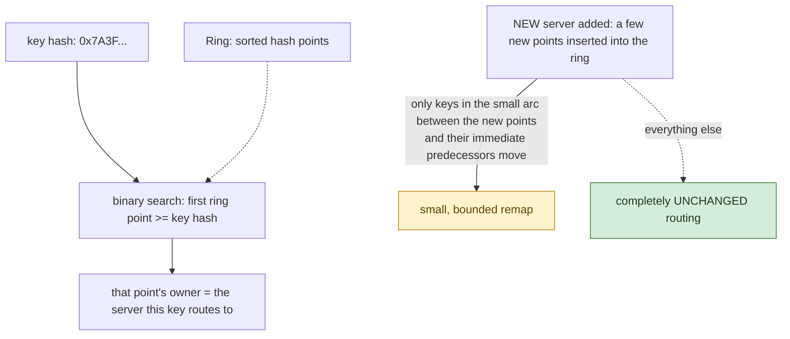

**TL;DR:** Why does adding a 4th server only remap a quarter of your keys, not all of them? Because consistent hashing places servers on a ring and routes each key to the next point clockwise, so adding a server only reassigns the keys in the small arc near its new position instead of remapping the whole keyspace the way `hash(key) % num_servers` does; virtual nodes (multiple ring points per server) then smooth out otherwise-uneven load distribution.

**Real repo:** [`golang/groupcache`](https://github.com/golang/groupcache)

## 1. The Engineering Problem: modulo sharding falls apart the moment the server count changes

`hash(key) % num_servers` is the obvious way to spread keys across a fleet — until `num_servers` changes. Add or remove even one server and the modulo shifts for almost *every* key simultaneously, remapping nearly the entire keyspace at once. For a cache, that's a near-total cache-miss storm the instant you scale up or down. For a sharded database, it's an enormous, all-at-once data migration just to add capacity — exactly the operation elastic scaling is supposed to make cheap, not catastrophic.

---

## 2. The Technical Solution: place servers on a ring, route each key to the next point clockwise

**Consistent hashing** arranges server hash values on a conceptual ring (a circular hash-value space). A key is routed to whichever server's point comes *next*, walking clockwise from the key's own hash. Adding a new server only affects the keys falling in the small arc between the new server's position and the previous server's position — everything else's routing is completely undisturbed.



A real problem this raises on its own: with only one hash point per server, load distribution is statistically lumpy — pure luck in where each server's single point lands can give one server a much larger arc (and thus much more traffic) than another. The fix is **virtual nodes**: each real server is hashed multiple times (with an index or replica number mixed into the hash input), placing several points on the ring for the same physical server. More points per server smooths the load distribution — the law of large numbers works in your favor with more samples — at the cost of a bigger sorted point array and marginally slower lookups.

Core truths: **the ring is just a sorted array of hash values plus a lookup back to which server owns each point** — the "ring" shape is conceptual (wrapping from the highest hash value back to the lowest), implemented as a plain sorted list with wraparound in the lookup logic; and **the number of virtual points per server is a real, tunable knob**, not a fixed constant — too few and distribution stays uneven, more and you pay for it in memory and lookup cost.

---

## 3. The clean example (concept in isolation)

```python
import bisect, hashlib

class ConsistentHashRing:
    def __init__(self, replicas=100):
        self.replicas = replicas
        self.ring = []          # sorted hash points
        self.point_to_node = {}

    def add(self, node):
        for i in range(self.replicas):
            h = self._hash(f"{i}{node}")
            bisect.insort(self.ring, h)
            self.point_to_node[h] = node

    def get(self, key):
        h = self._hash(key)
        idx = bisect.bisect_left(self.ring, h)
        if idx == len(self.ring):
            idx = 0   # wrap around the ring
        return self.point_to_node[self.ring[idx]]

    def _hash(self, s):
        return int(hashlib.md5(s.encode()).hexdigest(), 16)
```

---

## 4. Production reality (from `golang/groupcache`)

```go
// consistenthash/consistenthash.go
type Map struct {
    hash     Hash
    replicas int
    keys     []int // Sorted
    hashMap  map[int]string
}

// Add adds some keys to the hash.
func (m *Map) Add(keys ...string) {
    for _, key := range keys {
        for i := 0; i < m.replicas; i++ {
            hash := int(m.hash([]byte(strconv.Itoa(i) + key)))
            m.keys = append(m.keys, hash)
            m.hashMap[hash] = key
        }
    }
    sort.Ints(m.keys)
}

// Get gets the closest item in the hash to the provided key.
func (m *Map) Get(key string) string {
    if m.IsEmpty() {
        return ""
    }
    hash := int(m.hash([]byte(key)))

    // Binary search for appropriate replica.
    idx := sort.Search(len(m.keys), func(i int) bool { return m.keys[i] >= hash })

    // Means we have cycled back to the first replica.
    if idx == len(m.keys) {
        idx = 0
    }
    return m.hashMap[m.keys[idx]]
}
```

What this teaches that a hello-world can't:

- **`strconv.Itoa(i) + key` mixes a replica index INTO the hash input, not the raw server name alone** — hashing `"0server-A"`, `"1server-A"`, `"2server-A"`, ... produces `replicas` genuinely different, scattered ring positions for the same physical server, rather than the same value computed `replicas` times (which would just be one point, uselessly duplicated).
- **`sort.Search` performs a binary search for the first ring point `>= hash`, and `idx == len(m.keys)` explicitly handles the wraparound case** — this two-line check is the entire implementation of "the ring is circular": if the key's hash is greater than every server's highest point, ownership wraps back to the *first* point in the sorted array, exactly as if the array's end connected back to its beginning.
- **`m.keys` is kept sorted after every `Add` call (`sort.Ints`), making `Get` a fast binary search rather than a linear scan.** This is what keeps routing decisions cheap even with a large `replicas` count — the whole point of virtual nodes (smoother distribution) would be undermined if achieving it also made every lookup linear in the number of virtual points.

Known-stale fact: `key % num_shards` remains the first instinct for many engineers implementing sharding from scratch, without realizing why production caches and databases specifically avoid it for anything expected to scale elastically. The real-world lesson from systems like memcached client libraries and DynamoDB's internal partitioning is that ring-based consistent hashing (with virtual nodes) is the standard answer precisely because it bounds the cost of scaling the fleet up or down to a small, predictable fraction of the keyspace, instead of an all-or-nothing remap.

---

## Source

- **Concept:** Consistent hashing
- **Domain:** system-design
- **Repo:** [golang/groupcache](https://github.com/golang/groupcache) → [`consistenthash/consistenthash.go`](https://github.com/golang/groupcache/blob/master/consistenthash/consistenthash.go) — Google's canonical, widely-referenced consistent-hashing ring implementation.
