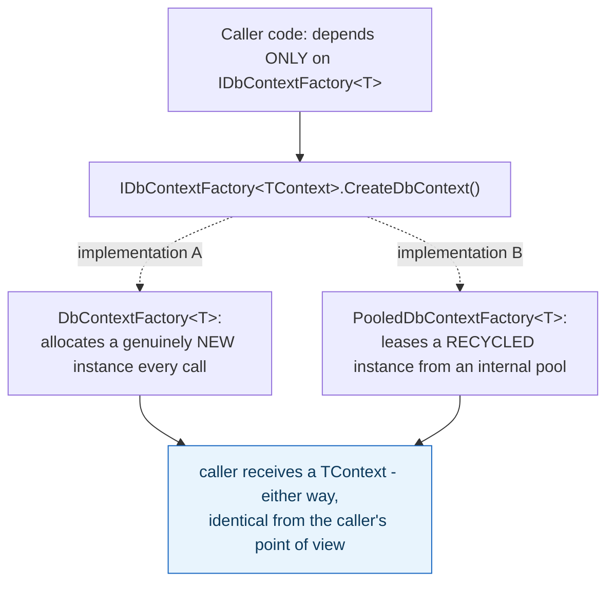

## 1. The Engineering Problem: `new T()` couples every call site to one specific way of creating T

`new DbContext(options)` (or any direct constructor call) hardcodes "always allocate a brand-new instance" into every place that needs one. That's fine until you need something different underneath — pooling instances for reuse instead of allocating fresh every time, choosing a concrete implementation based on runtime configuration, or wrapping construction with extra setup. Now every one of those call sites has to change, or you end up routing around the problem with increasingly awkward constructor overloads and static helper soup.

---

## 2. The Technical Solution: depend on a factory interface, never on a concrete constructor

**Factory Method**: define an interface with a `Create...()` method; callers depend only on that interface, never on `new SomeConcreteType()` directly. The concrete factory implementation decides *how* to actually produce the instance — and that decision can change completely (plain allocation vs. pooled reuse) without any caller code changing at all, because the caller only ever sees "I asked the factory for a `T`, I got one."



Core truth: **the whole point is that the caller can't tell the difference, and doesn't need to.** Swapping which concrete factory is registered (plain vs. pooled) is a dependency-injection configuration change, not a code change anywhere that calls `CreateDbContext()`.

---

## 3. The clean example (concept in isolation)

```csharp
public interface IWidgetFactory
{
    Widget Create();
}

public class PlainWidgetFactory : IWidgetFactory
{
    public Widget Create() => new Widget();   // fresh allocation every call
}

public class PooledWidgetFactory : IWidgetFactory
{
    private readonly Pool<Widget> _pool;
    public Widget Create() => _pool.Rent();     // recycled instance
}

// Caller code is IDENTICAL either way:
void Process(IWidgetFactory factory)
{
    var widget = factory.Create();
}
```

---

## 4. Production reality (from `dotnet/efcore`)

```csharp
// src/EFCore/IDbContextFactory.cs - the factory contract
public interface IDbContextFactory<TContext> where TContext : DbContext
{
    TContext CreateDbContext();
    Task<TContext> CreateDbContextAsync(CancellationToken cancellationToken = default)
        => Task.FromResult(CreateDbContext());
}
```

```csharp
// src/EFCore/Internal/DbContextFactory.cs - plain implementation: fresh every call
public class DbContextFactory<TContext> : IDbContextFactory<TContext> where TContext : DbContext
{
    private readonly Func<IServiceProvider, DbContextOptions<TContext>, TContext> _factory;

    public virtual TContext CreateDbContext()
        => _factory(_serviceProvider, _options);   // genuinely NEW instance
}
```

```csharp
// src/EFCore/Infrastructure/PooledDbContextFactory.cs - pooled implementation
public class PooledDbContextFactory<TContext> : IDbContextFactory<TContext> where TContext : DbContext
{
    private readonly IDbContextPool<TContext> _pool;

    public virtual TContext CreateDbContext()
    {
        var lease = new DbContextLease(_pool, standalone: true);   // RECYCLED instance
        lease.Context.SetLease(lease);
        return (TContext)lease.Context;
    }
}
```

What this teaches that a hello-world can't:

- **Both classes implement the exact same `IDbContextFactory<TContext>` interface with the identical `CreateDbContext()` signature, yet one allocates and the other recycles.** This is the real, working proof of the pattern's value: swap `services.AddDbContextFactory<T>()` for `services.AddPooledDbContextFactory<T>()` in DI configuration, and every single line of application code calling `factory.CreateDbContext()` continues to work unmodified, unaware which strategy is now in effect.
- **`DbContextFactory<TContext>` doesn't call `new TContext(...)` directly either — it invokes a cached delegate (`_factory`) built by `IDbContextFactorySource<TContext>`.** Even the "plain" implementation has its own internal factory-like indirection, specifically because compiling and caching a constructor-invoking delegate once is significantly faster than reflection-based instantiation on every call — a real performance detail hidden behind the same public contract.
- **The pooled factory's `CreateDbContext()` wraps the leased context in a `DbContextLease` before returning it (`lease.Context.SetLease(lease)`)** — disposing the returned `DbContext` doesn't destroy it, it returns the instance to the pool. The caller's code (`using var ctx = factory.CreateDbContext(); ...`) looks identical to the non-pooled case, but "dispose" now means something fundamentally different underneath, entirely because of which factory implementation was injected.

Known-stale fact: classic GoF Factory Method and Abstract Factory were designed for class-based, statically-typed OOP with deep inheritance hierarchies choosing between many concrete product subclasses. In modern practice, the pattern shows up far more often as exactly what's demonstrated here — a single generic interface with a small number of interchangeable implementations selected via dependency injection — rather than an elaborate multi-level factory hierarchy. The underlying principle (callers depend on an abstraction, not a constructor) is what survived; the heavyweight class-hierarchy machinery mostly didn't need to.

---

## Source

- **Concept:** Factory Method & Abstract Factory
- **Domain:** design-patterns
- **Repo:** [dotnet/efcore](https://github.com/dotnet/efcore) → [`src/EFCore/IDbContextFactory.cs`](https://github.com/dotnet/efcore/blob/main/src/EFCore/IDbContextFactory.cs), [`src/EFCore/Internal/DbContextFactory.cs`](https://github.com/dotnet/efcore/blob/main/src/EFCore/Internal/DbContextFactory.cs), [`src/EFCore/Infrastructure/PooledDbContextFactory.cs`](https://github.com/dotnet/efcore/blob/main/src/EFCore/Infrastructure/PooledDbContextFactory.cs) — the real, production .NET ORM.
