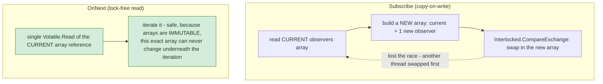

**TL;DR:** How do you notify 1,000 subscribers without a lock blocking every notification? By making the observer list an immutable array that's swapped atomically with `Interlocked.CompareExchange` on subscribe/unsubscribe, so publishing a notification only ever needs a single lock-free read of the current array.

**Real repo:** [`dotnet/reactive`](https://github.com/dotnet/reactive)

## 1. The Engineering Problem: the textbook Observer pattern isn't thread-safe, and locking the hot path is expensive

The GoF textbook Observer pattern — a subject holding a `List<Observer>`, iterating it to notify everyone on each event — has a real problem the moment subscribing or unsubscribing can happen *while* a notification broadcast is in progress. That's not an edge case; it's routine in real systems (an observer's own handler unsubscribing itself, or subscribing a new observer, mid-notification). A naive mutable list either needs a lock around every publish (serializing all notification under contention — a real throughput bottleneck for high-frequency events) or throws a "collection was modified" error with no lock at all.

---

## 2. The Technical Solution: an immutable observer list, swapped atomically, never locked to read

Rx.NET's real `Subject<T>` avoids locking the notification path entirely using a **lock-free copy-on-write** technique: the observer list is an *immutable* array. Subscribing or unsubscribing builds an entirely new array (one entry longer or shorter) and atomically swaps it in with `Interlocked.CompareExchange` — an optimistic-concurrency retry loop: read the current array, build the new one, try to swap, retry from scratch if another thread's swap won the race first.



Core truths: **the array being iterated during a publish can never be mutated out from under that iteration**, because arrays aren't mutated at all — a new one is built and swapped in wholesale; concurrent subscribe/unsubscribe calls create *new* arrays for *future* reads, never touching the one an in-flight `OnNext` is currently iterating. And **terminal states use sentinel array instances compared by reference identity, not content** — `Terminated` and `Disposed` are specific, singleton array objects; checking "has this subject ended" is a reference-equality check against those exact instances, not an inspection of array contents.

---

## 3. The clean example (concept in isolation)

```csharp
private SubjectDisposable[] _observers = [];

public void Subscribe(Observer o)
{
    for (;;)
    {
        var current = Volatile.Read(ref _observers);
        var next = new SubjectDisposable[current.Length + 1];
        current.CopyTo(next, 0);
        next[^1] = new SubjectDisposable(o);

        if (Interlocked.CompareExchange(ref _observers, next, current) == current)
            break;   // swap succeeded
        // otherwise: another thread changed it first - retry from scratch
    }
}

public void OnNext(T value)
{
    var observers = Volatile.Read(ref _observers);   // ONE read, no lock
    foreach (var o in observers) o.OnNext(value);
}
```

---

## 4. Production reality (from `dotnet/reactive`)

```csharp
// Rx.NET/Source/src/System.Reactive/Subjects/Subject.cs
private SubjectDisposable[] _observers;
private static readonly SubjectDisposable[] Terminated = new SubjectDisposable[0];
private static readonly SubjectDisposable[] Disposed = new SubjectDisposable[0];

public override void OnNext(T value)
{
    var observers = Volatile.Read(ref _observers);

    if (observers == Disposed)   // REFERENCE comparison against the sentinel
    {
        ThrowDisposed();
        return;
    }

    foreach (var observer in observers)
        observer.Observer?.OnNext(value);   // no lock needed
}

public override IDisposable Subscribe(IObserver<T> observer)
{
    for (;;)
    {
        var observers = Volatile.Read(ref _observers);

        if (observers == Terminated)
        {
            // subject already ended - REPLAY the terminal notification immediately
            var ex = _exception;
            if (ex != null) observer.OnError(ex);
            else observer.OnCompleted();
            break;
        }

        var n = observers.Length;
        var b = new SubjectDisposable[n + 1];
        Array.Copy(observers, b, n);
        b[n] = disposable ??= new SubjectDisposable(this, observer);

        if (Interlocked.CompareExchange(ref _observers, b, observers) == observers)
            break;   // swap succeeded - retry loop otherwise
    }
    return disposable;
}
```

What this teaches that a hello-world can't:

- **`Terminated` and `Disposed` are two distinct empty-array sentinel instances, even though both have zero elements** — the code comment explicitly notes their *identity* matters, so they can't share `Array.Empty<T>()`. `OnNext` checks against `Disposed` (throws), while `Subscribe` checks against `Terminated` (replays the final notification) — the same-length array means two entirely different behaviors depending on *which specific object* it is, not what it contains.
- **Subscribing to an already-terminated subject doesn't silently accept a subscription that will never fire — it immediately calls `OnError` or `OnCompleted` on the new observer.** This is a real correctness detail: a naive Observer implementation might let a late subscriber join a list that's no longer being notified, leaving that subscriber waiting forever for an event that already happened. Rx.NET replays the terminal signal instead, so "did I subscribe before or after this stream ended" never leaves an observer hanging.
- **The `Interlocked.CompareExchange` retry loop has no upper bound on attempts, and that's intentional** — under contention, a thread might lose the race and retry several times, but each retry is cheap (just building a new small array and trying again), and the alternative (a lock) would mean threads *blocking* rather than retrying, which is strictly worse for a hot notification path under real concurrent load.

Known-stale fact: the classic GoF-era Observer pattern diagram typically shows a plain `List<Observer>` with add/remove/notify methods and says nothing about thread safety — a real gap once applied to any genuinely concurrent system, which is most production systems. Naive list-based implementations are a real, recurring source of race conditions in practice; copy-on-write (or an equivalent lock-free technique) is what production reactive libraries actually use instead of reaching for a lock around the notification path, precisely because locking there would serialize all publishing under contention.

---

## Source

- **Concept:** Observer pattern (in-process event subscription/pub-sub)
- **Domain:** design-patterns
- **Repo:** [dotnet/reactive](https://github.com/dotnet/reactive) → [`Rx.NET/Source/src/System.Reactive/Subjects/Subject.cs`](https://github.com/dotnet/reactive/blob/main/Rx.NET/Source/src/System.Reactive/Subjects/Subject.cs) — Rx.NET's real, production `IObservable<T>`/`IObserver<T>` implementation.
