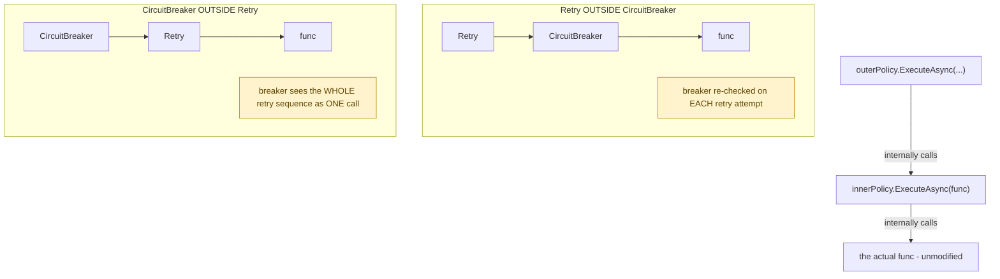

**TL;DR:** How does Polly wrap retry, circuit breaker, and timeout around one call without changing it? Each policy implements the same interface as the call it wraps and calls the wrapped delegate internally, so composing policies is just nesting their execution — and the nesting order itself changes the resulting behavior.

> **In plain English (30 sec):** Like a fuse — if service fails 5 times, stop calling for 30s.

**Real repo:** [`App-vNext/Polly`](https://github.com/App-vNext/Polly)

## 1. The Engineering Problem: cross-cutting behaviors baked into a method don't compose or reorder cleanly

A single outbound call often needs several resilience behaviors layered on top — retry on transient failure, a circuit breaker to stop hammering a dead dependency, a timeout bounding any single attempt, a concurrency cap. Bake all of this directly into the method making the call, and that method balloons with unrelated concerns; changing *which* behaviors apply, or their order, means editing that method's internals every time. You want behaviors that can be added, removed, and reordered around a call without ever touching the call's own code.

---

## 2. The Technical Solution: each policy wraps the next, all through the same interface

**Decorator**: each policy (retry, circuit breaker, timeout) implements the *same* interface as the thing it wraps, and its execution method calls the wrapped delegate internally, adding its own behavior before, after, or around that inner call. Composing policies means literally nesting their execution:



Core truth: **nesting order is a real behavioral decision, not a cosmetic one.** Retry wrapping a circuit breaker means the breaker's open/closed state is re-evaluated on *every* retry attempt — a retry can be short-circuited mid-sequence if the breaker trips partway through. A circuit breaker wrapping a retry means the breaker only sees the retry sequence as one opaque unit — it counts the whole sequence as a single success or failure, blind to how many individual attempts happened inside it. Same two policies, same code, genuinely different resilience behavior purely from composition order.

---

## 3. The clean example (concept in isolation)

```csharp
// The nesting IS the decoration - each Execute wraps the next
Task<TResult> Execute<TResult>(IAsyncPolicy outer, IAsyncPolicy inner, Func<Task<TResult>> func) =>
    outer.ExecuteAsync(() => inner.ExecuteAsync(func));

// Declarative composition - order determines nesting (outermost first)
var resilientCall = Policy.WrapAsync(retryPolicy, circuitBreakerPolicy, timeoutPolicy);
await resilientCall.ExecuteAsync(() => httpClient.GetAsync(url));
```

---

## 4. Production reality (from `App-vNext/Polly`)

```csharp
// src/Polly/Wrap/AsyncPolicyWrapEngine.cs
internal static Task<TResult> ImplementationAsync<TResult>(
    Func<Context, CancellationToken, Task<TResult>> func,
    Context context,
    bool continueOnCapturedContext,
    IAsyncPolicy<TResult> outerPolicy,
    IAsyncPolicy<TResult> innerPolicy,
    CancellationToken cancellationToken) =>
    outerPolicy.ExecuteAsync(
        (ctx, ct) => innerPolicy.ExecuteAsync(   // outer's execution WRAPS inner's execution
            func,
            ctx,
            ct,
            continueOnCapturedContext),
        context,
        cancellationToken,
        continueOnCapturedContext);
```

```csharp
// src/Polly/Wrap/IAsyncPolicyPolicyWrapExtensions.cs
public static AsyncPolicyWrap WrapAsync(this IAsyncPolicy outerPolicy, IAsyncPolicy innerPolicy)
{
    if (outerPolicy == null)
        throw new ArgumentNullException(nameof(outerPolicy));

    return ((AsyncPolicy)outerPolicy).WrapAsync(innerPolicy);
}
```

What this teaches that a hello-world can't:

- **`outerPolicy.ExecuteAsync` doesn't call `func` directly — it calls a lambda that calls `innerPolicy.ExecuteAsync(func, ...)`.** This one line is the entire mechanism: the outer policy never even sees the original function, only a wrapped version of it that happens to route through the inner policy first. Each layer is genuinely blind to what's further inside it, only aware of "the thing I was asked to execute."
- **`WrapAsync` exists as an overload set (four separate overloads in the file, for every combination of generic/non-generic outer and inner policy)** — decoration in Polly composes across both typed (`IAsyncPolicy<TResult>`) and untyped (`IAsyncPolicy`) policies, and the type system needs each combination spelled out explicitly to keep the composed result's type correct, rather than a single loosely-typed "wrap anything in anything" method.
- **The cast `((AsyncPolicy)outerPolicy).WrapAsync(...)` inside the public extension method** shows the public interface (`IAsyncPolicy`) and the internal concrete implementation (`AsyncPolicy`) are deliberately kept separate — callers write code against the interface, but the actual wrapping logic lives on the concrete base class, a real, common pattern for exposing a clean public surface while keeping composition machinery internal.

Known-stale fact: Decorator is usually taught as a pure OOP class-wrapping pattern — a `ConcreteDecorator : Component` holding a reference to another `Component` and implementing the same abstract interface. Polly's real implementation shows the pattern's more common modern shape: decorators composing *functions/delegates* (`Func<Context, CancellationToken, Task<TResult>>`) rather than object instances sharing an inheritance hierarchy. The underlying principle — wrap, add behavior, delegate to the wrapped thing — is identical; the concrete mechanism (delegate composition instead of class inheritance) is what actually changed.

---

## Source

- **Concept:** Decorator pattern (composable behavior wrapping)
- **Domain:** design-patterns
- **Repo:** [App-vNext/Polly](https://github.com/App-vNext/Polly) → [`src/Polly/Wrap/AsyncPolicyWrapEngine.cs`](https://github.com/App-vNext/Polly/blob/main/src/Polly/Wrap/AsyncPolicyWrapEngine.cs), [`src/Polly/Wrap/IAsyncPolicyPolicyWrapExtensions.cs`](https://github.com/App-vNext/Polly/blob/main/src/Polly/Wrap/IAsyncPolicyPolicyWrapExtensions.cs) — the real, production .NET resilience library.


