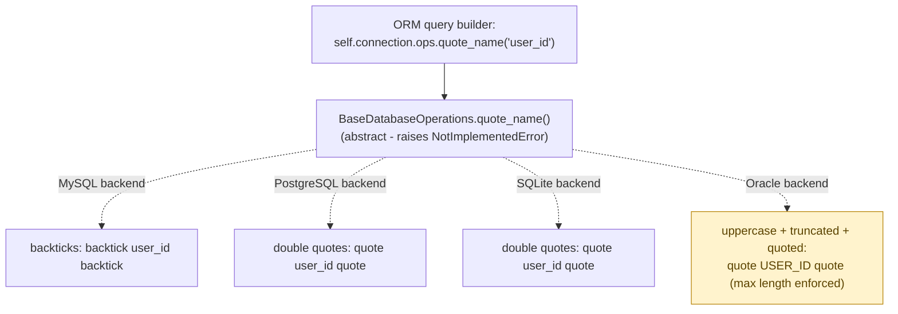

**TL;DR:** How does Django run the same ORM query against Postgres, MySQL, and SQLite unchanged? Because `BaseDatabaseOperations` defines one common interface for dialect-specific details like quoting and date truncation, and each backend implements that same interface to translate calls into its own database's actual syntax.

**Real repo:** [`django/django`](https://github.com/django/django)

## 1. The Engineering Problem: every database speaks a genuinely different SQL dialect

PostgreSQL, MySQL, SQLite, and Oracle all speak SQL, but their dialects diverge in real, incompatible ways — even something as basic as quoting an identifier (a table or column name) uses entirely different characters, and deeper behaviors (auto-increment ID retrieval, date truncation, `LIMIT`/`OFFSET` syntax) diverge further still. An ORM that wants application code to write one query and run it unchanged against any of these databases needs something translating "what the ORM wants to do" into "the exact SQL this specific database understands" — without application code ever needing to know which database it's actually talking to.

---

## 2. The Technical Solution: one interface, one incompatible-dialect-translating implementation per backend

**Adapter**: `BaseDatabaseOperations` defines the common interface (`quote_name`, `date_trunc_sql`, `last_insert_id`, and dozens more) the ORM's query-building code calls uniformly. Each concrete backend implements that *same* interface, translating each call into its own database's actual syntax.



Core truth: **the ORM's query-building code never branches on "which database am I talking to."** That branching is entirely encapsulated inside *which concrete `Operations` subclass got instantiated* for the configured database — decided once, at connection setup, based on the `DATABASES` setting — never repeated as an `if backend == "mysql"` scattered through query-generation code.

---

## 3. The clean example (concept in isolation)

```python
class BaseDatabaseOperations:
    def quote_name(self, name):
        raise NotImplementedError

class MySQLOperations(BaseDatabaseOperations):
    def quote_name(self, name):
        return f"`{name}`"

class PostgreSQLOperations(BaseDatabaseOperations):
    def quote_name(self, name):
        return f'"{name}"'

# ORM code calls this uniformly, unaware which one is active:
sql = f"SELECT * FROM {connection.ops.quote_name('users')}"
```

---

## 4. Production reality (from `django/django`)

```python
# django/db/backends/base/operations.py
class BaseDatabaseOperations:
    """
    Encapsulate backend-specific differences, such as the way a backend
    performs ordering or calculates the ID of a recently-inserted row.
    """
    def quote_name(self, name):
        """
        Return a quoted version of the given table, index, or column name.
        """
        raise NotImplementedError("subclasses of BaseDatabaseOperations may require a quote_name() method")
```

```python
# django/db/backends/mysql/operations.py
def quote_name(self, name):
    if name.startswith("`") and name.endswith("`"):
        return name  # Quoting once is enough.
    return "`%s`" % name
```

```python
# django/db/backends/postgresql/operations.py
def quote_name(self, name):
    if name.startswith('"') and name.endswith('"'):
        return name  # Quoting once is enough.
    return '"%s"' % name
```

```python
# django/db/backends/oracle/operations.py
def quote_name(self, name):
    # SQL92 requires delimited (quoted) names to be case-sensitive. When
    # not quoted, Oracle has case-insensitive behavior for identifiers, but
    # always defaults to uppercase. We simplify things by making Oracle
    # identifiers always uppercase.
    if not name.startswith('"') and not name.endswith('"'):
        name = '"%s"' % truncate_name(name, self.max_name_length())
    # ...
```

What this teaches that a hello-world can't:

- **Every concrete `quote_name` checks whether the name is already quoted before re-wrapping it** (`if name.startswith("\`") and name.endswith("\`")`) — a real idempotency guard. Query-building code that composes SQL fragments from multiple sources could plausibly call `quote_name` on an already-quoted value; each adapter defensively handles that instead of silently producing doubly-quoted, broken SQL.
- **Oracle's adapter does meaningfully MORE work than a simple character swap** — it forces uppercase and truncates to `max_name_length()`, reflecting Oracle's genuinely different, historically case-insensitive-by-default and length-limited identifier rules. This is the real test of whether something is a proper Adapter: it's not just substituting one quote character for another, it's reconciling an actually different set of underlying rules into the same call signature every other backend also satisfies.
- **`BaseDatabaseOperations.quote_name` raises `NotImplementedError` rather than providing any default behavior.** This is a deliberate design choice: quoting rules are so backend-specific that there's no safe generic default to fall back to — every concrete backend is *required* to supply its own, and forgetting to do so fails loudly at first use rather than silently producing SQL that happens to work only by accident on whichever database the code was tested against.

Known-stale fact: Adapter is sometimes conflated with Facade — both "provide a simpler, unified interface" in a loose sense. The distinguishing detail: an Adapter's job is specifically translating an *existing, incompatible* interface or behavior into the shape callers expect — here, four databases' genuinely disagreeing quoting rules, reconciled into one method signature. A Facade, by contrast, simplifies or hides complexity behind a new interface without necessarily reconciling pre-existing incompatibilities. Django's backend `Operations` classes are Adapters specifically because MySQL, Postgres, SQLite, and Oracle really do disagree, and something has to resolve that disagreement, not just paper over it.

---

## Source

- **Concept:** Adapter pattern (interface translation between incompatible APIs)
- **Domain:** design-patterns
- **Repo:** [django/django](https://github.com/django/django) → [`django/db/backends/base/operations.py`](https://github.com/django/django/blob/main/django/db/backends/base/operations.py), [`django/db/backends/mysql/operations.py`](https://github.com/django/django/blob/main/django/db/backends/mysql/operations.py), [`django/db/backends/postgresql/operations.py`](https://github.com/django/django/blob/main/django/db/backends/postgresql/operations.py), [`django/db/backends/oracle/operations.py`](https://github.com/django/django/blob/main/django/db/backends/oracle/operations.py) — the reference implementation for one of the most widely deployed web frameworks.


