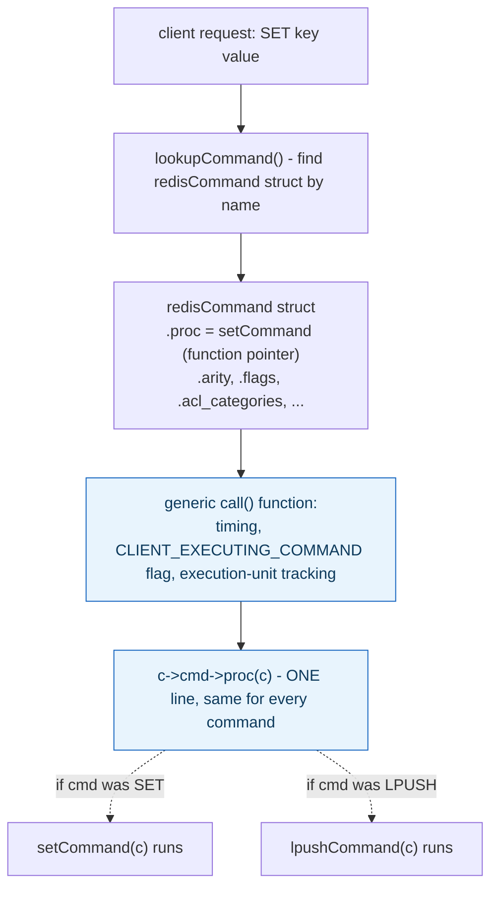

**TL;DR:** How does Redis run 200+ different commands through the exact same dispatch code? Each command is represented as a `redisCommand` struct holding a function pointer plus metadata, so the generic execution path looks up the struct once and dispatches through a single, uniform `c->cmd->proc(c)` call regardless of which command is running.
> **In plain English (30 sec):** Think of this like concepts you already use, but in a production system at scale.


**Real repo:** [`redis/redis`](https://github.com/redis/redis)

## 1. The Engineering Problem: hard-coded dispatch couples infrastructure to every individual request handler

A server handling many request types (`SET`, `GET`, `LPUSH`, `EXPIRE`, ...) could match the command name in a giant `if`/`else` chain and call the right handler inline — but that couples dispatch mechanics (timing, logging, replication, flag tracking) directly to every individual command's implementation. Adding a new command means touching that central dispatch code every time, and every cross-cutting concern has to be re-threaded through each branch by hand. You want the generic mechanics of "run a command" to be completely independent of *which* specific command is running.

---

## 2. The Technical Solution: represent each command as a struct with a function pointer, dispatch through one line

**Command pattern**: Redis represents each command as a struct (`redisCommand`) containing a function pointer (`proc`) to that command's actual implementation, plus metadata (arity, flags, ACL categories). The generic execution path looks up the right struct once, by name, and then dispatch is a single, uniform line — the exact same call site runs regardless of which of Redis's 200+ commands is executing.



Core truth: **everything wrapped around `c->cmd->proc(c)` — timing, flags, execution tracking — is written exactly once and applies uniformly to every command, without that generic code ever needing to know which specific command it's currently running.** The command's identity is fully encapsulated in the struct's function pointer, resolved once during lookup, invisible to everything else in the dispatch path.

---

## 3. The clean example (concept in isolation)

```c
typedef void (*CommandProc)(Client *c);

typedef struct Command {
    const char *name;
    CommandProc proc;   // the actual implementation, as a function pointer
    int arity;
} Command;

Command commandTable[] = {
    {"SET",   setCommand,   3},
    {"GET",   getCommand,   2},
    {"LPUSH", lpushCommand, 3},
};

// Generic dispatch - identical for every command
void executeCommand(Client *c, Command *cmd) {
    startTimer();
    cmd->proc(c);         // the ONE line that varies by which command this is
    stopTimer();
    logForReplication(c);
}
```

---

## 4. Production reality (from `redis/redis`)

```c
// src/server.h
struct redisCommand {
    const char *declared_name;
    redisCommandProc *proc;      /* Command implementation - THE function pointer */
    int arity;                    /* Number of arguments */
    uint64_t flags;                /* Command flags, see CMD_*. */
    uint64_t acl_categories;       /* ACL categories */
    keySpec *key_specs;
    int key_specs_num;
    redisGetKeysProc *getkeys_proc;
    struct redisCommand *subcommands;
    struct redisCommandArg *args;
    // ...
};
```

```c
// src/server.c - the actual generic dispatch call site
c->flags |= CLIENT_EXECUTING_COMMAND;

c->cmd->proc(c);   // <-- THIS is the ONE line, identical for all 200+ commands

exitExecutionUnit();

if (!(c->flags & CLIENT_BLOCKED)) c->flags &= ~(CLIENT_EXECUTING_COMMAND);
```

What this teaches that a hello-world can't:

- **`c->cmd->proc(c)` is a genuinely single call site in the entire codebase for invoking a command's logic** — everything from `SET` to `EXPIRE` to a Lua script's `EVAL` passes through this exact line. Searching the codebase for "where does a command actually run" leads to one place, not two hundred.
- **The `redisCommand` struct carries far more than just the function pointer** — `acl_categories`, `key_specs`, `flags` are all metadata the GENERIC dispatch machinery reads to make decisions (is this client allowed to run this command? which keys does it touch, for cluster routing?) *before* ever calling `proc`. The command-as-object isn't just "a callable," it's a self-describing unit the surrounding infrastructure can introspect without executing it.
- **`CLIENT_EXECUTING_COMMAND` is set immediately before the dispatch line and cleared immediately after, unconditionally, regardless of which command ran.** This is exactly the property that makes the pattern valuable in practice: a piece of infrastructure logic (tracking "is a command currently executing" for client-side caching notifications) is written once, wrapped around the single dispatch point, and automatically correct for every current and future command — nobody has to remember to add this bookkeeping when implementing command number 201.

Known-stale fact: Command pattern is often introduced primarily through its undo/redo use case — an executed command object can, by construction, be reversed. That's a real, classic application of the pattern, but it's not what's load-bearing in Redis's actual production use of it. The real value here is decoupling generic request-handling infrastructure (parsing, timing, replication logging, ACL checks) from an ever-growing, ever-changing set of individual command implementations — the "requests as interchangeable objects" property is what matters, independent of whether anything ever gets undone.

---

## Source

- **Concept:** Command pattern (requests as objects, undo/redo, task queues)
- **Domain:** design-patterns
- **Repo:** [redis/redis](https://github.com/redis/redis) → [`src/server.h`](https://github.com/redis/redis/blob/unstable/src/server.h) (`struct redisCommand`), [`src/server.c`](https://github.com/redis/redis/blob/unstable/src/server.c) (the real dispatch call site) — the real, production in-memory data store.


