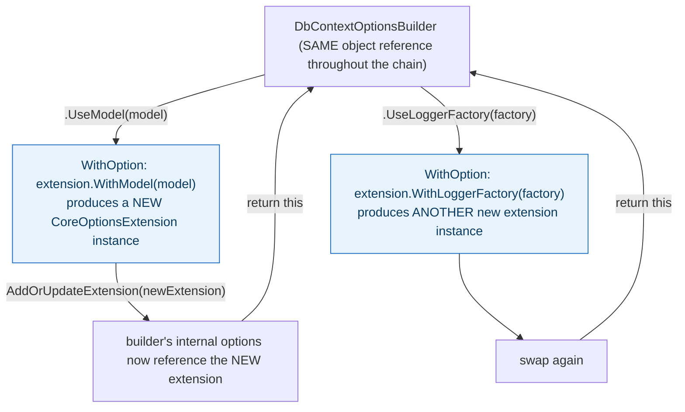

**TL;DR:** Why does every EF Core builder method return 'this' instead of void? Returning the same builder instance is what enables fluent chaining like `.UseModel(...).UseLoggerFactory(...)`, while underneath, each call actually swaps in a brand-new immutable configuration extension rather than mutating the old one in place.

**Real repo:** [`dotnet/efcore`](https://github.com/dotnet/efcore)

## 1. The Engineering Problem: many optional configuration knobs don't fit one constructor call cleanly

Configuring a complex object with many optional settings — a `DbContext`'s model, logger factory, log filtering, connection string, provider-specific extras — through a single constructor means either one giant constructor with dozens of optional parameters (unreadable positional arguments, easy to mix up) or a scattering of individual setter calls that don't read as one coherent configuration statement and don't guarantee every required step happened before the object counts as "built."

---

## 2. The Technical Solution: a fluent builder whose methods return itself, backed by immutable configuration data underneath

**Builder**: a separate object accumulates configuration through a chain of fluent method calls, each returning the *same* builder instance so calls can chain: `.UseModel(...).UseLoggerFactory(...).LogTo(...)`. EF Core's real implementation adds a second layer most simplified explanations skip: the actual configuration data is held in *immutable* extension objects — every `With...()` call produces a brand-new extension instance rather than mutating the old one, and the builder swaps the new immutable extension into itself.



Core truth: **the builder reference stays the same object across the entire chain (enabling fluent syntax), while the configuration data it holds internally is rebuilt immutably on every single call.** This isn't accidental complexity — an immutable configuration payload can be safely shared and read by multiple consumers afterward (a `DbContextFactory` caching one `Options` instance and creating many `DbContext` instances from it) without any of them being able to accidentally mutate configuration state that others also depend on.

---

## 3. The clean example (concept in isolation)

```csharp
public class OptionsBuilder
{
    private ImmutableOptions _options = ImmutableOptions.Empty;

    public OptionsBuilder UseModel(Model model)
    {
        _options = _options.WithModel(model);   // NEW immutable instance, not mutated in place
        return this;                              // SAME builder, enables chaining
    }

    public OptionsBuilder UseLogger(ILogger logger)
    {
        _options = _options.WithLogger(logger);
        return this;
    }
}

// Fluent chain - reads as one coherent configuration statement
var options = new OptionsBuilder()
    .UseModel(myModel)
    .UseLogger(consoleLogger);
```

---

## 4. Production reality (from `dotnet/efcore`)

```csharp
// src/EFCore/DbContextOptionsBuilder.cs
public virtual DbContextOptionsBuilder UseModel(IModel model)
    => WithOption(e => e.WithModel(Check.NotNull(model)));

public virtual DbContextOptionsBuilder UseLoggerFactory(ILoggerFactory? loggerFactory)
    => WithOption(e => e.WithLoggerFactory(loggerFactory));

private DbContextOptionsBuilder WithOption(Func<CoreOptionsExtension, CoreOptionsExtension> withFunc)
{
    ((IDbContextOptionsBuilderInfrastructure)this).AddOrUpdateExtension(
        withFunc(Options.FindExtension<CoreOptionsExtension>() ?? new CoreOptionsExtension()));

    return this;   // same builder instance, enables .UseModel(...).UseLoggerFactory(...) chaining
}
```

What this teaches that a hello-world can't:

- **Both `UseModel` and `UseLoggerFactory` funnel through the exact same private `WithOption` helper**, not separate ad-hoc mutation logic each. Every public fluent method in this builder follows the identical shape: transform the current immutable extension into a new one, swap it in, return `this`. New configuration methods (and EF Core has dozens across its core and provider-specific builders) inherit this behavior for free just by calling `WithOption`, rather than each reimplementing the swap-and-chain logic independently.
- **`e.WithModel(...)` and `e.WithLoggerFactory(...)` are calls on the extension object itself, not the builder** — `CoreOptionsExtension` has its own `With*` methods that return new instances of itself, following the same immutable-update convention. The builder's job is purely orchestration (call the right `With*`, swap it in, return itself); the actual immutable-update logic lives on the data object, not the builder.
- **`Options.FindExtension<CoreOptionsExtension>() ?? new CoreOptionsExtension()`** handles the very first configuration call gracefully — if no `CoreOptionsExtension` exists yet, one is created fresh rather than the code assuming it's always already present. This null-coalescing fallback is what lets `UseModel(...)` work correctly whether it's the first call in a chain or the fifth.

Known-stale fact: fluent builder chains are often explained as "just setters that return `this`," which captures the syntax but misses why a production builder like this one *also* layers immutability underneath. A purely mutable shared options object handed out to multiple consumers (several `DbContext` instances created from one cached options set, for instance) would be a real, subtle bug source — one code path's configuration change silently affecting every other consumer reading the same object. The immutable-extension-swap underneath the mutable-looking fluent surface is what actually prevents that.

---

## Source

- **Concept:** Builder pattern (complex object construction)
- **Domain:** design-patterns
- **Repo:** [dotnet/efcore](https://github.com/dotnet/efcore) → [`src/EFCore/DbContextOptionsBuilder.cs`](https://github.com/dotnet/efcore/blob/main/src/EFCore/DbContextOptionsBuilder.cs) — the real, production .NET ORM's fluent options builder.


