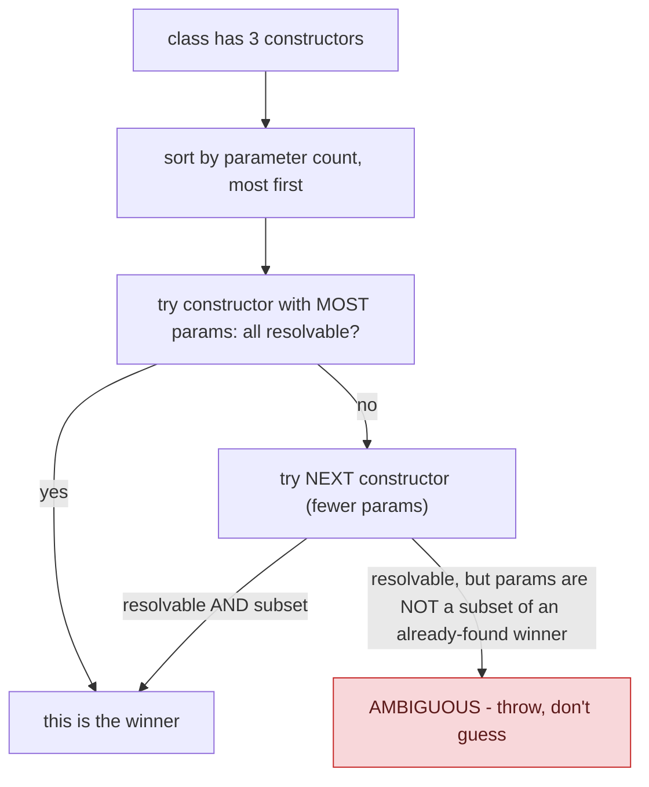
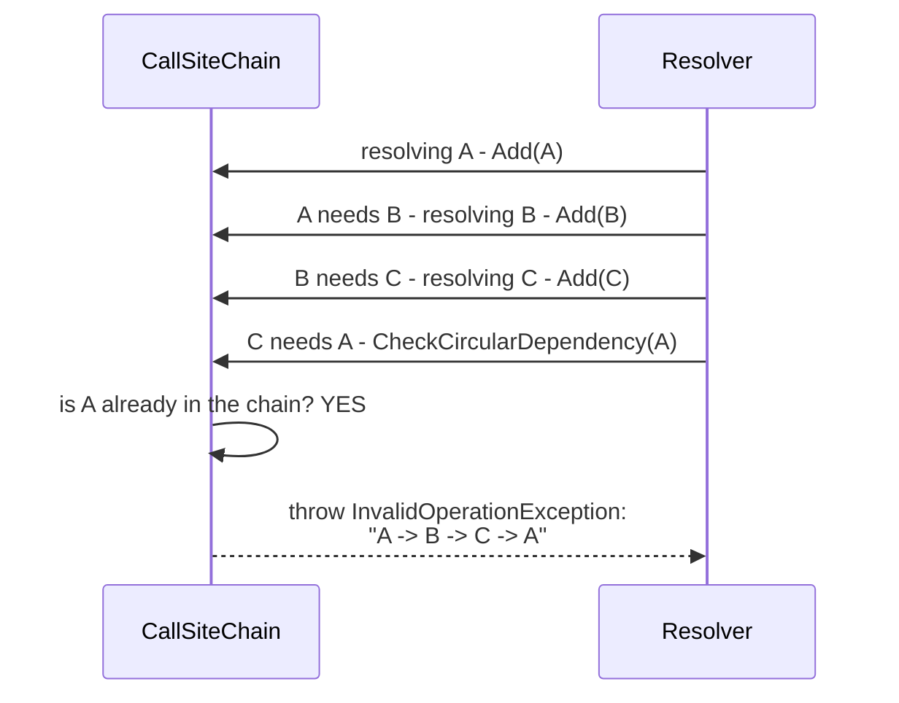

## 1. The Engineering Problem: a real object graph isn't always one clean constructor per class

Dependency Injection's core idea — a class declares what it needs via its constructor, a container supplies it — sounds simple for a class with one constructor and no dependency cycles. Real object graphs aren't always that clean. A class might have multiple constructors (different overloads for different scenarios). Two services might end up depending on each other transitively — A needs B needs C needs A — a genuine infinite loop if a container naively recursed to resolve it. Something has to deterministically decide *which* constructor to use when there's more than one candidate, and something has to detect and fail fast on a dependency cycle instead of recursing until the stack overflows.

---

## 2. The Technical Solution: sort-and-try for constructors, a tracked chain for cycles

**Constructor selection**: .NET's container sorts a type's constructors by parameter count — most parameters first — then tries each in order, picking the first one whose parameters can *all* be resolved (found in the container, or backed by a default value). If a shorter, later constructor is *also* fully resolvable, its parameters must be a strict subset of the winning constructor's — otherwise the two are genuinely ambiguous, and resolution fails loudly rather than guessing.



**Circular dependency detection**: a chain tracks which services are *currently* being resolved, in order, as the container recursively walks a constructor's dependencies. Before resolving service X, the container checks whether X is already in the chain — if so, that's a cycle, and it throws immediately with a readable resolution path built from the tracked chain (`A -> B -> C -> A`), instead of crashing with an opaque stack overflow.



Core truths: **the container never silently picks an arbitrary constructor when more than one is plausible** — ambiguity is a hard error, not resolved by convention or declaration order; and **the circular-dependency chain exists specifically to turn an otherwise-opaque stack overflow into a diagnosable error with the exact resolution path that caused it.**

---

## 3. The clean example (concept in isolation)

```csharp
public class Service
{
    public Service(IFoo foo, IBar bar, IBaz baz) { }   // 3 params - tried first
    public Service(IFoo foo, IBar bar) { }               // 2 params - tried if the above fails
    public Service(IFoo foo) { }                          // 1 param - tried last
}
// Container tries the 3-param constructor first. If IBaz can't be resolved,
// falls back to the 2-param one - but ONLY if its params (IFoo, IBar) are a
// subset of what the 3-param constructor already required.
```

---

## 4. Production reality (from `dotnet/runtime`'s `Microsoft.Extensions.DependencyInjection`)

```csharp
// src/libraries/.../ServiceLookup/CallSiteFactory.cs
// With more than one constructor, select the "best" one: the constructor with the
// most parameters whose arguments can all be resolved... Constructors are ordered
// from the most parameters to the fewest... the first fully resolvable one becomes
// the best match. Every subsequent resolvable constructor must have parameters
// that are a subset of the best one... otherwise the two are ambiguous.

// sort constructors by parameter count, descending
for (int i = 0; i < constructorCount; i++)
{
    // ... insertion sort by parameters.Length ...
}

for (int i = 0; i < constructorCount; i++)
{
    ConstructorInfo constructor = constructors[i];
    if (bestConstructor is null)
    {
        var currentParameterCallSites = CreateArgumentCallSites(
            serviceIdentifier, implementationType, callSiteChain, sortedParameters[i],
            throwIfCallSiteNotFound: false, currentResolvedParameters);

        if (currentParameterCallSites is null) continue;   // not resolvable - try the next one
        bestConstructor = constructor;
    }
    // ... else: check this constructor's params are a SUBSET of bestConstructor's ...
}
```

```csharp
// src/libraries/.../ServiceLookup/CallSiteChain.cs
internal sealed class CallSiteChain
{
    private readonly Dictionary<ServiceIdentifier, ChainItemInfo> _callSiteChain;

    public void CheckCircularDependency(ServiceIdentifier serviceIdentifier)
    {
        if (_callSiteChain.ContainsKey(serviceIdentifier))
            throw new InvalidOperationException(CreateCircularDependencyExceptionMessage(serviceIdentifier));
    }

    public void Add(ServiceIdentifier serviceIdentifier, Type? implementationType = null)
        => _callSiteChain[serviceIdentifier] = new ChainItemInfo(_callSiteChain.Count, implementationType);

    // Builds a readable "A -> B -> C -> A" path from the tracked chain, ordered by
    // when each service entered the chain - not just an opaque exception.
}
```

What this teaches that a hello-world can't:

- **The subset check on ambiguous constructors is the real subtlety here** — a fully-resolvable shorter constructor doesn't automatically lose; it only loses if its parameters were *already covered* by the winning constructor. Two constructors requiring genuinely different, non-overlapping sets of resolvable services are treated as a real ambiguity error, not silently resolved by "whichever came first."
- **`CallSiteChain` orders entries by `_callSiteChain.Count` at insertion time (`ChainItemInfo(_callSiteChain.Count, ...)`), not by dictionary iteration order** — dictionaries don't guarantee insertion order in general, so the chain explicitly tracks *when* each service entered resolution, which is what lets the error message reconstruct the exact resolution path in the order it actually happened, not an arbitrary order.
- **`Remove(serviceIdentifier)` exists alongside `Add`** — the chain isn't just an ever-growing log, it's actively maintained to reflect only what's *currently* on the resolution stack. A service successfully resolved and returned gets removed from the chain, so resolving the *same* service again later (not as part of a cycle, just a second, independent request) doesn't falsely trigger the circular-dependency check.

Known-stale fact: many explanations of DI/IoC containers treat "how does it pick a constructor and detect cycles" as an implementation detail not worth knowing. In practice, both are real, encounterable production errors — an ambiguous-constructor exception or a circular-dependency exception — that any non-trivial DI-based codebase eventually hits. Understanding the actual algorithm (most-parameters-first, subset-based ambiguity, a tracked resolution chain) is what lets a developer fix such an error with confidence instead of reshuffling constructors and registrations by trial and error.

---

## Source

- **Concept:** Dependency Injection (constructor/setter injection, IoC containers)
- **Domain:** design-patterns
- **Repo:** [dotnet/runtime](https://github.com/dotnet/runtime) → [`src/libraries/Microsoft.Extensions.DependencyInjection/src/ServiceLookup/CallSiteFactory.cs`](https://github.com/dotnet/runtime/blob/main/src/libraries/Microsoft.Extensions.DependencyInjection/src/ServiceLookup/CallSiteFactory.cs), [`CallSiteChain.cs`](https://github.com/dotnet/runtime/blob/main/src/libraries/Microsoft.Extensions.DependencyInjection/src/ServiceLookup/CallSiteChain.cs) — the real .NET dependency injection container.
