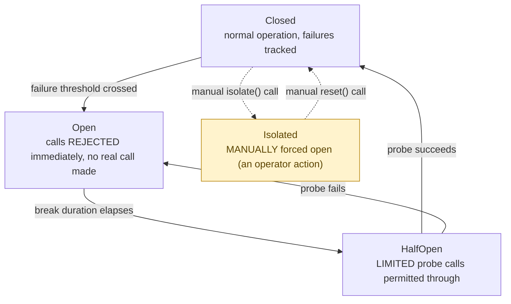

## 1. The Engineering Problem: repeatedly calling a failing dependency wastes resources and can make things worse

Repeatedly calling a failing or slow dependency wastes resources on calls virtually guaranteed to fail, and can compound the dependency's own problem by piling more load onto something already struggling. You need a mechanism that, after enough recent failures, stops calling the dependency entirely for a while — protecting both the caller and the struggling dependency — then cautiously tests whether it's recovered before fully resuming traffic. Never a binary "detect one failure and block forever" or "keep retrying blindly forever."

---

## 2. The Technical Solution: a real state machine, not a boolean flag — plus a state most explanations skip

Polly's real circuit breaker is a genuine state machine with three "automatic" states — **Closed** (normal operation, failures tracked), **Open** (tripped: calls rejected immediately with no real call made), **HalfOpen** (after the break duration elapses, a limited probe is permitted through to test recovery) — plus a fourth state most textbook explanations never mention: **Isolated**, a manually-forced-open state distinct from an automatic trip.



The distinction between Open and Isolated matters in practice: an automatically-tripped circuit throws `BrokenCircuitException` ("the system detected repeated failures"), while a manually-isolated one throws a *different* type, `IsolatedCircuitException` ("a human deliberately took this offline"). Monitoring and error-handling code can tell these apart — a spike in `BrokenCircuitException` is a real incident signal; a spike in `IsolatedCircuitException` just reflects a known, deliberate maintenance action.

Core truths: **HalfOpen only permits a bounded number of test calls, not a full flood** — real recovery testing has to avoid immediately re-overwhelming a dependency that's only just starting to recover; and **a stale result arriving after the circuit already transitioned states is deliberately ignored, not double-counted** — the real implementation explicitly notes it takes no special action on a success/failure that was already in flight before the circuit's state changed underneath it, avoiding both masking real call outcomes and duplicate-signaling state transitions that already happened.

---

## 3. The clean example (concept in isolation)

```csharp
enum CircuitState { Closed, Open, HalfOpen, Isolated }

Task Execute(Func<Task> action)
{
    if (State == CircuitState.Open && BreakDurationElapsed())
        State = CircuitState.HalfOpen;   // permit a probe

    if (State == CircuitState.Open)
        throw new BrokenCircuitException();     // automatic trip
    if (State == CircuitState.Isolated)
        throw new IsolatedCircuitException();    // manual, distinguishable

    try
    {
        await action();
        if (State == CircuitState.HalfOpen) State = CircuitState.Closed;   // probe succeeded
    }
    catch
    {
        if (State == CircuitState.HalfOpen || ShouldBreak())
            State = CircuitState.Open;   // probe failed, or threshold crossed
        throw;
    }
}
```

---

## 4. Production reality (from `App-vNext/Polly`)

```csharp
// src/Polly.Core/CircuitBreaker/Controller/CircuitStateController.cs
public ValueTask<Outcome<T>?> OnActionPreExecuteAsync(ResilienceContext context)
{
    lock (_lock)
    {
        // check if circuit can be half-opened
        if (_circuitState == CircuitState.Open && PermitHalfOpenCircuitTest_NeedsLock())
        {
            _halfOpenAttempts++;
            _circuitState = CircuitState.HalfOpen;
            isHalfOpen = true;
        }

        exception = _circuitState switch
        {
            CircuitState.Open => CreateBrokenCircuitException(),
            CircuitState.HalfOpen when !isHalfOpen => CreateBrokenCircuitException(),
            CircuitState.Isolated => new IsolatedCircuitException(),   // DIFFERENT exception type
            _ => null
        };
    }
}
```

```csharp
public Task OnUnhandledOutcomeAsync(Outcome<T> outcome, ResilienceContext context)
{
    lock (_lock)
    {
        _behavior.OnActionSuccess(_circuitState);

        // HalfOpen - close the circuit
        // Closed - do nothing
        // Open, Isolated - a successful call result may arrive when the circuit is open,
        // if it was placed before the circuit broke. We take no special action; only time
        // passing governs transitioning from Open to HalfOpen state.
        if (_circuitState == CircuitState.HalfOpen)
            task = CloseCircuit_NeedsLock(outcome, manual: false, context);
    }
}

public Task OnHandledOutcomeAsync(Outcome<T> outcome, ResilienceContext context)
{
    lock (_lock)
    {
        _behavior.OnActionFailure(_circuitState, out var shouldBreak);

        // HalfOpen - open the circuit again
        // Closed - break the circuit if the behavior indicates it
        if (_circuitState == CircuitState.HalfOpen || (_circuitState == CircuitState.Closed && shouldBreak))
            task = OpenCircuitFor_NeedsLock(outcome, _breakDuration, manual: false, context);
    }
}
```

What this teaches that a hello-world can't:

- **`PermitHalfOpenCircuitTest_NeedsLock()` gates the Open-to-HalfOpen transition, and `_halfOpenAttempts` is tracked explicitly** — this isn't a simple timer expiry check; the implementation tracks *how many* half-open attempts have been made, allowing more nuanced policies than "exactly one probe call" (a real production circuit breaker often permits a small handful of concurrent probes rather than serializing recovery testing one call at a time).
- **The code comment on `OnUnhandledOutcomeAsync` explicitly documents the race it's handling**: a success result can legitimately arrive for a call that was *dispatched* while the circuit was still Closed, but *completes* after the circuit has since tripped Open. The implementation deliberately takes no action in that case rather than incorrectly closing an Open circuit based on a stale, already-in-flight call's result.
- **`OnActionFailure` returns `shouldBreak` as an out parameter, computed by a separate `_behavior` object** — the decision "has this Closed circuit seen enough failures to trip" is delegated to a pluggable behavior/threshold policy (e.g., failure-rate-over-a-sampling-window, or consecutive-failure-count), decoupled from the state-transition logic itself. The state machine doesn't know or care *which* threshold algorithm decided to break; it only reacts to the boolean result.

Known-stale fact: textbook circuit breaker explanations typically describe exactly three states (Closed/Open/Half-Open) and frame the pattern as purely reactive to detected failures. Production implementations commonly add a fourth, manual state specifically because operators need a way to deliberately take a dependency offline — during planned maintenance, or in response to a known incident before automatic detection would even trip — without waiting for the failure threshold, and that deliberate action needs to be distinguishable from an automatic trip in both monitoring and exception-handling code.

---

## Source

- **Concept:** Circuit Breaker (code-level pattern)
- **Domain:** design-patterns
- **Repo:** [App-vNext/Polly](https://github.com/App-vNext/Polly) → [`src/Polly.Core/CircuitBreaker/Controller/CircuitStateController.cs`](https://github.com/App-vNext/Polly/blob/main/src/Polly.Core/CircuitBreaker/Controller/CircuitStateController.cs) — the real, production .NET resilience library's circuit breaker state machine.
