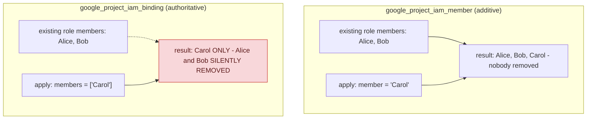

## 1. The Engineering Problem: two IAM binding modes look similar in code and behave completely differently

Google Cloud IAM role grants can be applied in two fundamentally different modes that look deceptively similar in Terraform. One mode adds a member to a role's list without touching any existing members. The other *replaces the entire member list* for that role with exactly what you specify. Using the wrong one is a real, common, damaging mistake: someone intending to grant themselves access reaches for the "replace" resource type instead of the "add" one, and instantly revokes every other principal that previously held that role — in production, with no warning, because Terraform did exactly what was asked.

---

## 2. The Technical Solution: additive grants coexist, authoritative grants replace — and the choice is explicit

**`google_project_iam_member`** is additive: it grants one member a role and coexists safely with grants managed elsewhere — by hand, by another team's Terraform config, by a different automation entirely. **`google_project_iam_binding`** is authoritative *for that one role*: the `members` list becomes the complete, exclusive membership for that role — anyone not listed loses access, even if they were granted it outside this specific Terraform run.



The real production Terraform IAM module makes this an explicit, chosen input (`mode`) rather than leaving it to whichever resource type someone happened to reach for — the same configuration structure produces either resource type depending on that one setting, making the choice visible and deliberate instead of an accident of which Terraform snippet got copy-pasted.

Core truths: **the authoritative mode isn't a bug, it's the correct tool for a genuinely different job** — declaring "this is the *complete* set of principals allowed this role, full stop" is sometimes exactly what you want (a tightly-controlled admin role, for instance); and **least-privilege discipline compounds with binding mode** — an authoritative-mode mistake on a broad role (a basic Owner/Editor grant) does far more damage than the same mistake on a narrowly-scoped custom role, because the blast radius of "who got silently dropped" scales with how much that role could actually do.

---

## 3. The clean example (concept in isolation)

```hcl
# Additive - safe to run alongside other teams' IAM management
resource "google_project_iam_member" "deploy_bot" {
  project = "my-project"
  role    = "roles/run.developer"
  member  = "serviceAccount:deploy-bot@my-project.iam.gserviceaccount.com"
}

# Authoritative - this list becomes the COMPLETE membership for this role
resource "google_project_iam_binding" "org_admins" {
  project = "my-project"
  role    = "roles/resourcemanager.organizationAdmin"
  members = [
    "user:admin1@example.com",
    "user:admin2@example.com",
  ]
  # Anyone else with this role, granted anywhere else, loses it on apply.
}
```

---

## 4. Production reality (from `terraform-google-modules/terraform-google-iam`)

```hcl
# modules/projects_iam/main.tf

# Project IAM binding AUTHORITATIVE
resource "google_project_iam_binding" "project_iam_authoritative" {
  for_each = module.helper.set_authoritative
  project  = module.helper.bindings_authoritative[each.key].name
  role     = module.helper.bindings_authoritative[each.key].role
  members  = module.helper.bindings_authoritative[each.key].members
  dynamic "condition" {
    for_each = module.helper.bindings_authoritative[each.key].condition.title == "" ? [] : [module.helper.bindings_authoritative[each.key].condition]
    content {
      title       = module.helper.bindings_authoritative[each.key].condition.title
      description = module.helper.bindings_authoritative[each.key].condition.description
      expression  = module.helper.bindings_authoritative[each.key].condition.expression
    }
  }
}

# Project IAM binding ADDITIVE
resource "google_project_iam_member" "project_iam_additive" {
  for_each = module.helper.set_additive
  project  = module.helper.bindings_additive[each.key].name
  role     = module.helper.bindings_additive[each.key].role
  member   = module.helper.bindings_additive[each.key].member
  dynamic "condition" {
    for_each = module.helper.bindings_additive[each.key].condition.title == "" ? [] : [module.helper.bindings_additive[each.key].condition]
    content { title = ... description = ... expression = ... }
  }
}
```

What this teaches that a hello-world can't:

- **Both blocks share the exact same conditional-binding structure (`title`/`description`/`expression`), regardless of mode.** IAM Conditions — the mechanism for context-aware, least-privilege access (e.g., "only valid until this date," "only for resources matching this attribute") — compose identically whether the underlying grant is additive or authoritative. Choosing a binding mode and adding a least-privilege condition are two independent decisions, not tied together.
- **The module resolves which resource type to actually create via a shared `helper` module and a `mode` variable, not by which Terraform block a user happened to write.** This is the real production answer to "how do you stop people from accidentally using the wrong one" — the dangerous choice (additive vs authoritative) is surfaced as one explicit, named input rather than left implicit in which of two similarly-named resource types someone reached for.
- **`for_each = module.helper.set_authoritative` (and the additive equivalent) means EVERY authoritative binding in this configuration is managed as its own explicit for_each set**, not one giant blob. A change to one role's authoritative membership doesn't require Terraform to re-evaluate every other role's bindings — each authoritative binding is scoped to exactly one project/role pair, limiting the blast radius of any single planned change.

Known-stale fact: basic IAM roles (Owner, Editor, Viewer) are legacy and explicitly discouraged by Google in favor of predefined or custom granular roles — worth restating precisely here, since it directly compounds the binding-mode risk above. An authoritative-mode mistake on a narrowly-scoped custom role (say, "may only restart Cloud Run revisions") has a small, contained blast radius; the identical mistake applied to a broad basic role can silently strip meaningful access from an entire team. Least privilege isn't just about which principals get which roles — it's also about keeping the roles themselves narrow enough that a configuration mistake stays cheap.

---

## Source

- **Concept:** IAM (roles, service accounts, least privilege)
- **Domain:** gcp
- **Repo:** [terraform-google-modules/terraform-google-iam](https://github.com/terraform-google-modules/terraform-google-iam) → [`modules/projects_iam/main.tf`](https://github.com/terraform-google-modules/terraform-google-iam/blob/main/modules/projects_iam/main.tf) — Google's own real, versioned Terraform IAM module.
