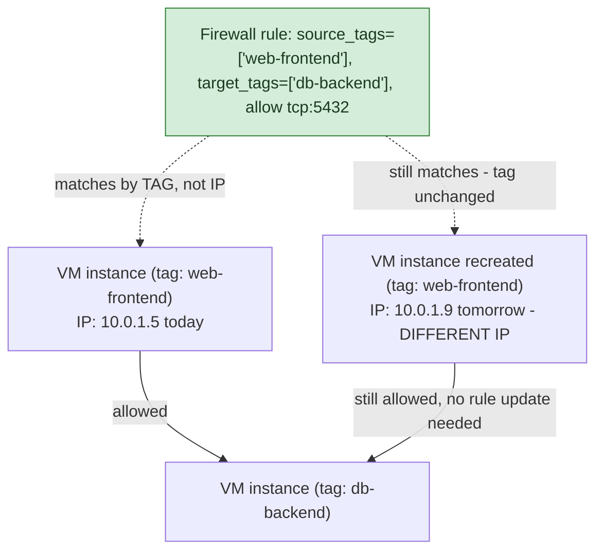

**TL;DR:** How does a GCP firewall rule target "the web tier" without knowing any IP addresses? GCP firewall rules can match by network tag or service-account identity instead of CIDR range, so a rule stays correct as instances are recreated with different IPs; subnets separately support secondary IP ranges so a single subnet can carve out an independent address space for Pod and Service IPs alongside Node IPs.

> **In plain English (30 sec):** Code you already write — Map, function, API call, just bigger.

**Real repo:** [`terraform-google-modules/terraform-google-network`](https://github.com/terraform-google-modules/terraform-google-network)

## 1. The Engineering Problem: IP-based firewall rules are brittle when instances constantly change IPs

Traditional network firewalls are CIDR/IP-based — "allow traffic from `10.0.1.0/24` to `10.0.2.0/24` on port 5432." That's brittle in a cloud environment where instances are created, destroyed, and rescheduled constantly, often picking up different IPs each time. A rule written against a specific IP range breaks the moment actual instance placement doesn't match it anymore, forcing constant firewall-rule churn just to keep pace with infrastructure changes. Separately, a subnet's single IP range can't cleanly serve both "an IP for this VM/node" and "IPs for hundreds of ephemeral Kubernetes Pods scheduled onto that node" — those need distinct, independently-sized ranges even though they share the same physical subnet.

---

## 2. The Technical Solution: identity-based firewall targeting, and secondary ranges for a second IP space per subnet

GCP firewall rules can target by **network tag** or **service account identity** instead of (or alongside) IP ranges. A rule like "allow from tag `web-frontend` to tag `db-backend` on port 5432" survives instances being recreated with entirely different IPs, because the rule is about *who the instance is* (its tag or identity), not *where it happens to be numerically*.



Separately, subnets support **secondary IP ranges** alongside their primary range — exactly the mechanism GKE VPC-native clusters use. The subnet's primary range gives Node VMs their IPs; separate secondary ranges are carved out specifically for Pod IPs and Service IPs, as alias IP ranges routed to the correct node, letting thousands of ephemeral Pod IPs coexist cleanly with a much smaller, stable set of Node IPs on the same VPC subnet.

Core truths: **tag/service-account-based targeting is identity-aware, not location-aware** — a rule survives IP churn entirely because it never referenced an IP in the first place; and **a subnet's primary and secondary ranges serve genuinely different address spaces on the same subnet resource**, not a single pool split arbitrarily — GKE deliberately keeps Node IPs (primary range) and Pod/Service IPs (secondary ranges) in separate, independently-sized allocations.

---

## 3. The clean example (concept in isolation)

```hcl
resource "google_compute_firewall" "allow_web_to_db" {
  name    = "allow-web-to-db"
  network = google_compute_network.vpc.name

  allow {
    protocol = "tcp"
    ports    = ["5432"]
  }

  source_tags = ["web-frontend"]   # matches by TAG, not IP range
  target_tags = ["db-backend"]
}

resource "google_compute_subnetwork" "gke_subnet" {
  name          = "gke-subnet"
  ip_cidr_range = "10.0.0.0/24"        # PRIMARY range - Node IPs

  secondary_ip_range {
    range_name    = "pods"
    ip_cidr_range = "10.4.0.0/14"       # SECONDARY range - Pod IPs
  }
  secondary_ip_range {
    range_name    = "services"
    ip_cidr_range = "10.8.0.0/20"       # SECONDARY range - Service IPs
  }
}
```

---

## 4. Production reality (from `terraform-google-modules/terraform-google-network`)

```hcl
# main.tf - firewall rule definitions support identity-based targeting
locals {
  rules = [
    for f in var.firewall_rules : {
      name                    = f.name
      direction               = f.direction
      ranges                  = lookup(f, "ranges", null)
      source_tags             = lookup(f, "source_tags", null)
      source_service_accounts = lookup(f, "source_service_accounts", null)
      target_tags             = lookup(f, "target_tags", null)
      target_service_accounts = lookup(f, "target_service_accounts", null)
      allow                   = lookup(f, "allow", [])
      deny                    = lookup(f, "deny", [])
    }
  ]
}
```

```hcl
# modules/subnets/main.tf
resource "google_compute_subnetwork" "subnetwork" {
  for_each                  = local.subnets
  name                       = each.value.subnet_name
  ip_cidr_range              = each.value.subnet_ip           # PRIMARY range
  private_ip_google_access   = lookup(each.value, "subnet_private_access", "false")

  dynamic "secondary_ip_range" {
    for_each = contains(keys(var.secondary_ranges), each.value.subnet_name) == true ? var.secondary_ranges[each.value.subnet_name] : []
    content {
      range_name    = secondary_ip_range.value.range_name
      ip_cidr_range = secondary_ip_range.value.ip_cidr_range   # SECONDARY range(s)
    }
  }
}
```

What this teaches that a hello-world can't:

- **`source_service_accounts` and `source_tags` are listed as independent, equally-valid targeting options alongside `ranges` (IP-based) in the same rule schema** — GCP's firewall model treats IP-range matching as *one option among several*, not the only or default one. A production rule set commonly mixes all three: broad IP-range rules for coarse network segmentation, tag-based rules for workload-tier isolation, and service-account-based rules for the tightest, identity-bound targeting.
- **`secondary_ip_range` is a `dynamic` block gated by `contains(keys(var.secondary_ranges), ...)`** — not every subnet gets secondary ranges; they're opt-in per subnet, reflecting that only subnets actually hosting VPC-native GKE clusters (or similar alias-IP consumers) need this second address space at all. A subnet with no secondary ranges configured simply gets none, no wasted allocation.
- **`private_ip_google_access` is set independently of both firewall rules and secondary ranges** — it controls whether instances *without* external IPs can still reach Google APIs (Cloud Storage, BigQuery, etc.) over Google's internal network rather than the public internet. This is a third, separate axis of "how does traffic actually get where it needs to go" that composes with, but is distinct from, both firewall targeting and subnet IP allocation.

Known-stale fact: a networking background from traditional on-prem or purely IP/CIDR-based cloud firewalls can miss that GCP's firewall model is identity-aware by design, not IP-only — relying exclusively on IP-based rules in a GCP VPC means missing the more robust, churn-resistant targeting mechanism (tags and service accounts) the platform actually offers, and re-fighting the "instances keep changing IPs" problem that identity-based targeting exists specifically to solve.

---

## Source

- **Concept:** VPC networking (subnets, firewall rules, private/public IP)
- **Domain:** gcp
- **Repo:** [terraform-google-modules/terraform-google-network](https://github.com/terraform-google-modules/terraform-google-network) → [`main.tf`](https://github.com/terraform-google-modules/terraform-google-network/blob/main/main.tf), [`modules/subnets/main.tf`](https://github.com/terraform-google-modules/terraform-google-network/blob/main/modules/subnets/main.tf) — Google's own real, versioned Terraform VPC module.


