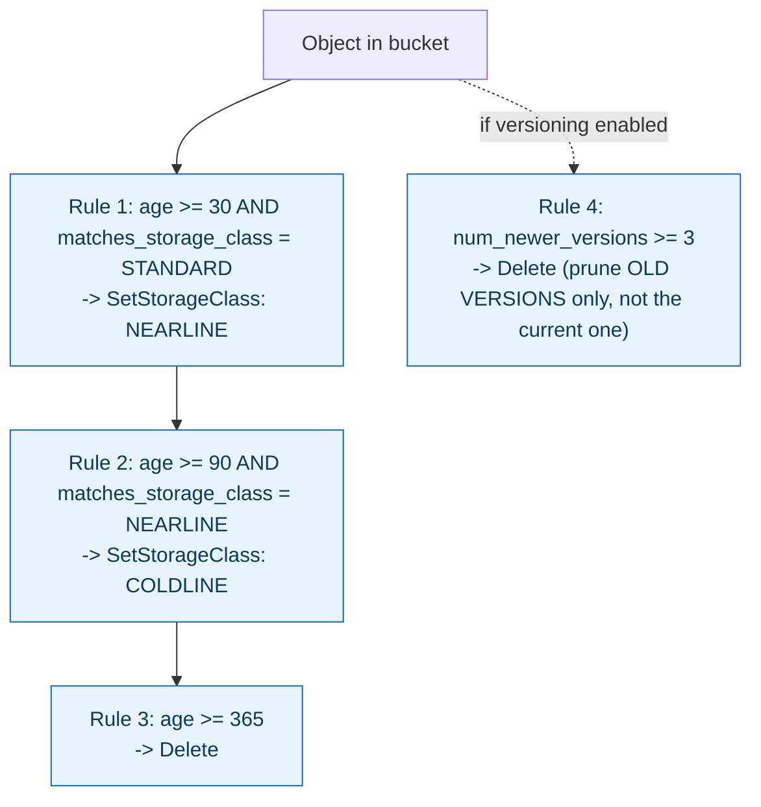

**TL;DR:** Why does "delete files older than 30 days" undersell what a Cloud Storage lifecycle rule can do? Lifecycle rules are a real condition-and-action engine — conditions like age, current storage class, and version count compose together, and actions include cost-driven `SetStorageClass` transitions (STANDARD → NEARLINE → COLDLINE) as well as `Delete`, not deletion alone.

> **In plain English (30 sec):** Code you already write — Map, function, API call, just bigger.

**Real repo:** [`terraform-google-modules/terraform-google-cloud-storage`](https://github.com/terraform-google-modules/terraform-google-cloud-storage)

## 1. The Engineering Problem: data accessed less over time still costs full price without intervention

Data accessed frequently when it's new is often accessed rarely, or never, after some point — but storing it at the same storage class forever means paying premium `STANDARD`-class prices for data nobody's touching, when cheaper classes built for infrequent access (`NEARLINE`, `COLDLINE`, `ARCHIVE`) exist specifically for this. Manually re-classifying or deleting objects based on age or access patterns doesn't scale past a handful of files — the storage system itself needs to apply rules automatically, based on conditions richer than a single "older than N days" check.

---

## 2. The Technical Solution: a real condition-and-action rule engine attached to the bucket

Cloud Storage lifecycle rules are a genuine rule engine evaluated automatically and continuously against every object in a bucket. An **action** is either `SetStorageClass` (transition to a cheaper class) or `Delete` (remove entirely). A **condition** can combine multiple independent signals — not just age.



The `matches_storage_class` condition is what makes staged transitions actually correct: Rule 2 only fires on objects *currently* in `NEARLINE` — an object that Rule 1 already moved there. Without this scoping, a naive age-only rule set would try to re-apply every stage to every object regardless of where it currently sits, producing incorrect or redundant transitions.

Core truths: **deletion is one action among several, not the pattern's primary purpose** — cost-driven storage-class transitions are arguably the more common real-world use; and **conditions compose, letting a rule target a precise subset of objects** — `num_newer_versions` combined with object versioning implements "keep only the N most recent versions, prune older noncurrent ones" without ever touching the current live object, a materially different (and more surgical) operation than blanket age-based deletion.

---

## 3. The clean example (concept in isolation)

```hcl
resource "google_storage_bucket" "archive" {
  name = "my-archive-bucket"

  lifecycle_rule {
    condition { age = 30, matches_storage_class = ["STANDARD"] }
    action    { type = "SetStorageClass", storage_class = "NEARLINE" }
  }
  lifecycle_rule {
    condition { age = 90, matches_storage_class = ["NEARLINE"] }
    action    { type = "SetStorageClass", storage_class = "COLDLINE" }
  }
  lifecycle_rule {
    condition { num_newer_versions = 3 }   # prune old VERSIONS only
    action    { type = "Delete" }
  }
}
```

---

## 4. Production reality (from `terraform-google-modules/terraform-google-cloud-storage`)

```hcl
# main.tf
dynamic "lifecycle_rule" {
  for_each = setunion(var.lifecycle_rules, lookup(var.bucket_lifecycle_rules, each.value, toset([])))
  content {
    action {
      type          = lifecycle_rule.value.action.type
      storage_class = lookup(lifecycle_rule.value.action, "storage_class", null)
    }
    condition {
      age                        = lookup(lifecycle_rule.value.condition, "age", null)
      created_before             = lookup(lifecycle_rule.value.condition, "created_before", null)
      with_state                 = lookup(lifecycle_rule.value.condition, "with_state", null)
      matches_storage_class      = lifecycle_rule.value.condition["matches_storage_class"] != null ? split(",", lifecycle_rule.value.condition["matches_storage_class"]) : null
      num_newer_versions         = lookup(lifecycle_rule.value.condition, "num_newer_versions", null)
      custom_time_before         = lookup(lifecycle_rule.value.condition, "custom_time_before", null)
      days_since_custom_time     = lookup(lifecycle_rule.value.condition, "days_since_custom_time", null)
      days_since_noncurrent_time = lookup(lifecycle_rule.value.condition, "days_since_noncurrent_time", null)
      noncurrent_time_before     = lookup(lifecycle_rule.value.condition, "noncurrent_time_before", null)
    }
  }
}
```

What this teaches that a hello-world can't:

- **`days_since_custom_time` is timed from a `custom_time` value you explicitly set on the object, not the object's creation timestamp.** This exists for exactly the case where "age" as understood by the storage system (upload time) doesn't match business-relevant age — a document whose real "age" should be measured from when it was last relevant, not when it happened to be uploaded to the bucket.
- **`days_since_noncurrent_time` is a separate condition from plain `age`, specific to versioned buckets** — it measures time since a version *stopped being current* (was superseded by a newer version), not time since it was originally created. A version could be years old but only recently become noncurrent; this condition targets that transition point specifically, distinct from the object's overall age.
- **`with_state` (LIVE vs ARCHIVED) only becomes meaningful once object versioning is enabled** — on a non-versioned bucket every object is trivially "LIVE," making this condition a no-op. It's a real example of a lifecycle condition whose usefulness is entirely contingent on a separate bucket setting (versioning) being turned on elsewhere in the configuration.

Known-stale fact: "lifecycle rules just delete old files" is a common oversimplification — deletion is one action among two (`Delete` and `SetStorageClass`), and cost-optimization transitions are arguably the more frequently used real-world case. Conditions compose across multiple independent signals (age, current storage class, version count, custom timestamps), which is specifically what makes a correct, staged STANDARD→NEARLINE→COLDLINE→ARCHIVE pipeline possible — each stage's rule scoped by `matches_storage_class` so it only fires on objects the *previous* stage actually moved there, not on every object in the bucket regardless of where it currently sits.

---

## Source

- **Concept:** Cloud Storage (buckets, storage classes, object lifecycle)
- **Domain:** gcp
- **Repo:** [terraform-google-modules/terraform-google-cloud-storage](https://github.com/terraform-google-modules/terraform-google-cloud-storage) → [`main.tf`](https://github.com/terraform-google-modules/terraform-google-cloud-storage/blob/main/main.tf) — Google's own real, versioned Terraform Cloud Storage module.


