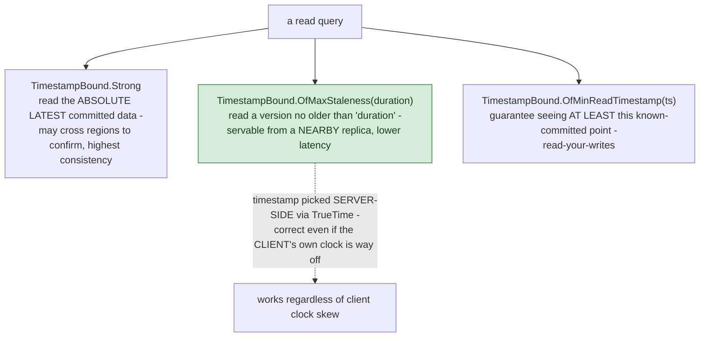

## 1. The Engineering Problem: three "managed databases" with fundamentally different architectures, easy to conflate

Cloud SQL, Spanner, and Firestore all get pitched as "managed database" options, and it's tempting to treat the choice as a minor detail. It isn't. **Cloud SQL** is a single-primary managed database (fully-managed Postgres/MySQL/SQL Server) — vertical scaling plus read replicas, but one primary handles all writes, capped by that machine's throughput ceiling. **Spanner** is globally distributed — data sharded and replicated across regions, with writes that can still be strongly, externally consistent *across* that geographic spread, which sounds like it should require either a single global lock or catastrophically slow cross-region consensus on every write. **Firestore** is a different data model entirely (NoSQL documents), with its own separate consistency story. Picking the wrong one isn't a small mistake — it's picking a fundamentally different scaling ceiling and consistency model for the whole application built on top of it.

---

## 2. The Technical Solution: TrueTime lets Spanner assign real, externally-ordered timestamps without a global coordinator

Spanner's real mechanism for reconciling "globally distributed" with "strongly consistent" is **TrueTime** — a globally-synchronized clock with a *bounded uncertainty interval*, not just "a clock that's close enough." This lets Spanner assign genuine, externally-ordered timestamps to transactions without a single global lock for every read. It's exposed directly in the client API as a tunable, per-query consistency/latency choice:



Core truths: **the consistency/latency tradeoff is chosen per query, not fixed for the whole database** — the same Spanner instance can serve a strongly-consistent read for one query and a bounded-staleness read from a nearby replica for another, in the same application. And **the timestamp is chosen by Spanner itself using TrueTime, not derived from the calling client's clock** — this is exactly why a client with a badly skewed local clock still gets correct results, since the client never has to compute or trust its own notion of "now" for the read to be valid.

Neither Cloud SQL nor Firestore has an equivalent knob — Cloud SQL never needed one, because it never tries to solve "consistent writes across globally distributed replicas" in the first place; Firestore's consistency model is shaped by its document/NoSQL structure and its own separate synchronization approach, not TrueTime.

---

## 3. The clean example (concept in isolation)

```csharp
// Full consistency - read the absolute latest, may cost more latency
using var strongTx = connection.BeginReadOnlyTransaction(TimestampBound.Strong);

// Bounded staleness - faster, servable from a nearby replica,
// guarantees nothing more than ~10s old
using var staleTx = connection.BeginReadOnlyTransaction(
    TimestampBound.OfMaxStaleness(TimeSpan.FromSeconds(10)));
```

---

## 4. Production reality (from `googleapis/google-cloud-dotnet`)

```csharp
// apis/Google.Cloud.Spanner.Data/Google.Cloud.Spanner.Data/TimestampBound.cs

/// Read at a timestamp where all previously committed transactions are visible.
public static TimestampBound Strong { get; } =
    new TimestampBound(TimestampBoundMode.Strong, TimeSpan.Zero, s_utcMinValue);

/// Executes all reads at a timestamp that is `duration` old...
/// Guarantees that all writes that have committed more than the specified
/// number of seconds ago are visible. Because Cloud Spanner chooses the
/// exact timestamp, this mode works even if the client's local clock is
/// substantially skewed from Cloud Spanner commit timestamps.
///
/// Useful for reading at nearby replicas without the distributed timestamp
/// negotiation overhead of OfMaxStaleness.
public static TimestampBound OfExactStaleness(TimeSpan duration) =>
    new TimestampBound(TimestampBoundMode.ExactStaleness, duration, s_utcMinValue);

/// Read data at a timestamp >= `NOW - duration`. Guarantees that all writes
/// that have committed more than the specified number of seconds ago are visible.
/// Useful for reading the freshest data available at a nearby replica, while
/// bounding the possible staleness if the local replica has fallen behind.
public static TimestampBound OfMaxStaleness(TimeSpan duration) =>
    new TimestampBound(TimestampBoundMode.MaxStaleness, duration, s_utcMinValue);

/// Executes all reads at a timestamp >= minReadTimestamp.
/// Useful for requesting fresher data than some previous read, or data that
/// is fresh enough to observe the effects of some previously committed
/// transaction whose timestamp is known.
public static TimestampBound OfMinReadTimestamp(DateTime minReadTimestamp) => ...
```

What this teaches that a hello-world can't:

- **`OfExactStaleness` and `OfMaxStaleness` are two distinct modes, not the same idea twice.** `OfExactStaleness` reads at a timestamp exactly `duration` old, chosen once near the start of the read — genuinely useful for reading at a nearby replica without the "distributed timestamp negotiation overhead" the doc comment calls out explicitly on `OfMaxStaleness`. `OfMaxStaleness` reads at `NOW - duration` *or newer*, which needs more coordination to determine "now" precisely — the API models this real cost difference as two separate methods rather than one parameterized call.
- **The doc comment states directly that exact/max-staleness reads "work even if the client's local clock is substantially skewed"** — this is TrueTime's actual payoff made concrete: the server, not the client, is the authority on what timestamp a staleness bound resolves to, so a laptop with a wrong system clock still gets correct, bounded results.
- **`OfMinReadTimestamp` solves read-your-writes without requiring `Strong` consistency for every subsequent read** — a client that just wrote something and knows its commit timestamp can request "give me data at least this fresh" rather than paying for a fully strong read on every follow-up query, a real middle ground the API exposes as a first-class option rather than an all-or-nothing choice between always-strong and arbitrarily-stale.

Known-stale fact: Cloud SQL and Spanner are frequently discussed as if choosing between them is mostly about scale ("Spanner for bigger workloads") — the real distinguishing fact is architectural, not just capacity. Spanner's entire value proposition — horizontal write scalability *with* strong consistency across regions — depends specifically on TrueTime, a mechanism Cloud SQL has no equivalent of and doesn't need, because Cloud SQL never attempts the "consistent writes across globally distributed replicas" problem in the first place. Choosing Spanner for a workload that doesn't actually need global distribution pays its real operational and cost complexity without ever using the capability that justifies it.

---

## Source

- **Concept:** Cloud SQL vs Spanner vs Firestore (managed relational vs globally-distributed SQL vs NoSQL document store)
- **Domain:** gcp
- **Repo:** [googleapis/google-cloud-dotnet](https://github.com/googleapis/google-cloud-dotnet) → [`apis/Google.Cloud.Spanner.Data/Google.Cloud.Spanner.Data/TimestampBound.cs`](https://github.com/googleapis/google-cloud-dotnet/blob/main/apis/Google.Cloud.Spanner.Data/Google.Cloud.Spanner.Data/TimestampBound.cs) — the official Google Cloud Spanner client library for .NET.
