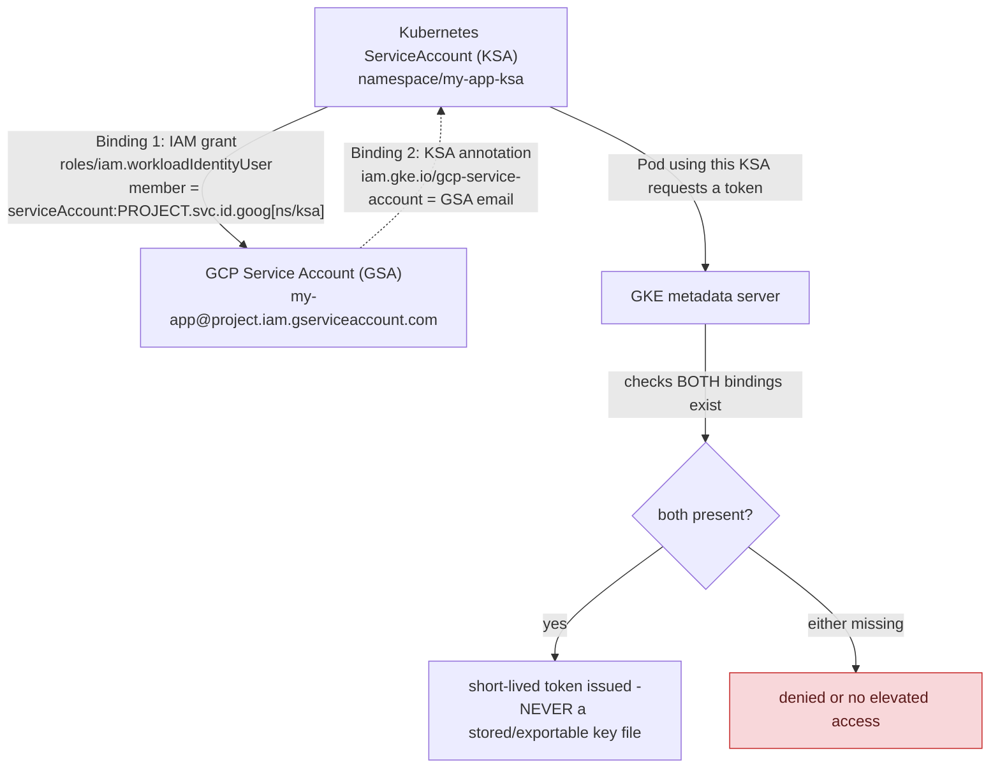

## 1. The Engineering Problem: a downloaded service account key is a long-lived, exportable secret

A Pod running in GKE that needs to call a GCP API (Cloud Storage, Pub/Sub, and so on) traditionally needed a downloaded JSON service account key mounted into the Pod — a long-lived, fully exportable secret. If that key leaks (committed to a repo by mistake, dumped from a compromised container), an attacker gets persistent access with no built-in expiration and no straightforward revocation short of deleting the key entirely and redeploying every workload that used it.

---

## 2. The Technical Solution: two independent bindings, in both directions, and no stored credential at all

**Workload Identity** replaces the downloaded key with runtime impersonation, requiring two independent bindings, each pointing a different direction:



**Binding 1 (IAM grant, KSA→GSA):** an IAM binding on the GCP service account grants a *specific* Kubernetes ServiceAccount — expressed in Google's special identity format, `serviceAccount:PROJECT.svc.id.goog[NAMESPACE/KSA_NAME]` — the `roles/iam.workloadIdentityUser` role, meaning that exact KSA is authorized to impersonate the GSA. **Binding 2 (annotation, GSA→KSA):** an annotation on the Kubernetes ServiceAccount itself, `iam.gke.io/gcp-service-account: <GSA email>`, tells the GKE metadata server which GCP service account a Pod using this KSA should receive tokens for.

Core truths: **both bindings are required, and each one alone is insufficient** — the IAM grant alone doesn't tell the metadata server what to hand out (nothing points the KSA at a specific GSA); the annotation alone doesn't grant actual impersonation permission (nothing authorizes the KSA to act as that GSA). Missing either half is a real, common Workload Identity misconfiguration. And **the token a Pod actually receives at runtime is short-lived and fetched on-demand from the metadata server** — never written to disk as a file, never a long-lived exportable secret at all.

---

## 3. The clean example (concept in isolation)

```hcl
# Binding 1: authorize the KSA to impersonate the GSA
resource "google_service_account_iam_member" "workload_identity_binding" {
  service_account_id = google_service_account.app_gsa.name
  role                = "roles/iam.workloadIdentityUser"
  member              = "serviceAccount:my-project.svc.id.goog[default/my-app-ksa]"
}
```

```yaml
# Binding 2: tell GKE's metadata server which GSA this KSA maps to
apiVersion: v1
kind: ServiceAccount
metadata:
  name: my-app-ksa
  annotations:
    iam.gke.io/gcp-service-account: my-app-gsa@my-project.iam.gserviceaccount.com
```

---

## 4. Production reality (from `terraform-google-modules/terraform-google-kubernetes-engine`)

```hcl
# modules/workload-identity/main.tf

# Binding 2 (annotation) - part of the KSA resource itself
resource "kubernetes_service_account_v1" "main" {
  count = var.use_existing_k8s_sa ? 0 : 1
  metadata {
    name      = local.k8s_given_name
    namespace = var.namespace
    annotations = {
      "iam.gke.io/gcp-service-account" = local.gcp_sa_email
    }
  }
}

# Binding 1 (IAM grant) - authorizes the KSA to impersonate the GSA
resource "google_service_account_iam_member" "main" {
  service_account_id = google_service_account.cluster_service_account[0].name
  role                = "roles/iam.workloadIdentityUser"
  member              = local.k8s_sa_gcp_derived_name
}

locals {
  k8s_sa_gcp_derived_name = "serviceAccount:${local.k8s_sa_project_id}.svc.id.goog[${var.namespace}/${local.output_k8s_name}]"
}
```

What this teaches that a hello-world can't:

- **`k8s_sa_gcp_derived_name` constructs the special `PROJECT.svc.id.goog[namespace/name]` identity format explicitly, as a local value** — this isn't an ordinary GCP principal identifier; it's a specific syntax GCP IAM understands as "this exact Kubernetes ServiceAccount, in this exact namespace, in this exact cluster's project" — getting any part of this string wrong (wrong namespace, wrong KSA name) means the IAM binding silently doesn't apply to the Pod you think it does.
- **The module also supports annotating a pre-existing KSA via a separate `annotate-sa` submodule (using `kubectl annotate`), for the `use_existing_k8s_sa` case** — Workload Identity setup isn't always "create a fresh KSA with the annotation already on it." A real, common scenario is retrofitting an *existing* KSA that other resources already reference, and the module explicitly handles that path differently (a `kubectl` command wrapper) rather than assuming every KSA is created fresh by this same Terraform run.
- **`google_project_iam_member.workload_identity_sa_bindings` (a separate resource, iterating `var.roles`) is what actually grants the GSA real permissions on GCP resources** — the Workload Identity bindings above only establish *who can impersonate this GSA*; they say nothing about what the GSA itself is allowed to do. Least-privilege here means scoping `var.roles` narrowly — Workload Identity solves the credential-management problem, not the authorization-scope problem, and both need deliberate attention.

Known-stale fact: mounting a downloaded service account JSON key into a Pod — commonly stored as a Kubernetes Secret holding a base64-encoded key file — is exactly the pattern Workload Identity exists to eliminate. Google explicitly discourages long-lived exportable service account keys in general; for GKE specifically, the dual-binding mechanism above (IAM grant plus KSA annotation) is the current recommended replacement, issuing short-lived tokens on demand rather than any credential a Pod could accidentally leak as a persistent file.

---

## Source

- **Concept:** GKE (node pools, Workload Identity)
- **Domain:** gcp
- **Repo:** [terraform-google-modules/terraform-google-kubernetes-engine](https://github.com/terraform-google-modules/terraform-google-kubernetes-engine) → [`modules/workload-identity/main.tf`](https://github.com/terraform-google-modules/terraform-google-kubernetes-engine/blob/main/modules/workload-identity/main.tf) — Google's own real, versioned Terraform GKE module.
