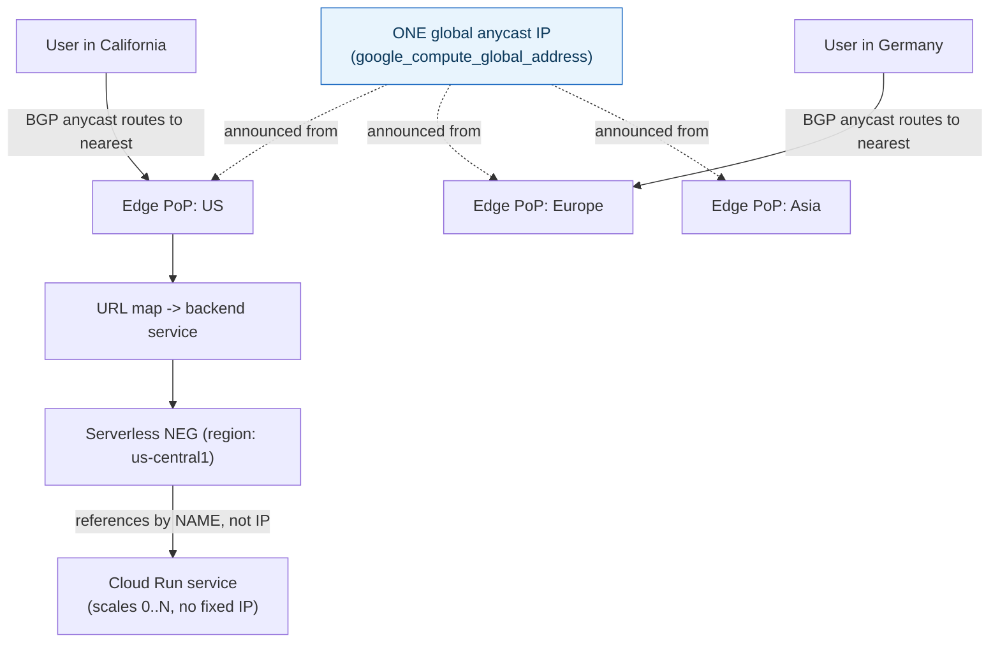

**TL;DR:** How does one global IP address route users to the nearest regional backend? A single global anycast IP is announced from many of Google's edge locations at once, so BGP routes each user to the nearest one with no DNS involved; Serverless NEGs then let the load balancer reference a Cloud Run service by name rather than a fixed IP, so it stays correctly routed even as instances scale to zero and back.

> **In plain English (30 sec):** Code you already write — Map, function, API call, just bigger.

**Real repo:** [`terraform-google-modules/terraform-google-lb-http`](https://github.com/terraform-google-modules/terraform-google-lb-http)

## 1. The Engineering Problem: regional load balancers need a global routing layer, and serverless backends have no fixed IP to target

Traditional load balancing is regional — an LB in one region distributes traffic across backends in that region. Reaching users globally with low latency traditionally means DNS-based geo-routing: different DNS answers per region, each pointing at a *different* regional LB IP. That has real downsides — DNS caching and TTLs delay failover, and it means managing multiple separate IPs and LB instances, one per region, with DNS as the layer stitching them together. Separately, serverless backends (Cloud Run, Cloud Functions) have no stable, fixed IP address or persistent instance set a traditional load-balancer backend definition could reference — they scale to zero and back up dynamically.

---

## 2. The Technical Solution: one global anycast IP, and backends referenced by name instead of address

**One global anycast IP** handles the "reach the nearest region" problem structurally, not via DNS. A single `google_compute_global_address` is announced from many of Google's physical edge locations worldwide simultaneously; BGP-level anycast routing sends each user's traffic to the nearest edge automatically, at the network layer — no DNS TTL, no caching delay, no per-region IP to manage.



**Serverless NEGs** (Network Endpoint Groups with `network_endpoint_type = "SERVERLESS"`) solve the second problem: the backend service references a regional Cloud Run service *by name*, not by IP or instance group. Google's own infrastructure resolves that name to the service's actual current backend dynamically, so the load balancer stays correctly routed even as Cloud Run scales instances up, down, or to zero underneath it.

Core truths: **this is genuinely one global resource, not a DNS trick layered over several regional load balancers** — GCP's global HTTP(S) load balancer really is a single logical entity with one global IP; and **a Serverless NEG is a pointer to "whatever Cloud Run is currently running for this service," resolved continuously, not a snapshot of specific backend addresses** — the load balancer never needs to be told about a new Cloud Run revision or instance count change, because it was never tracking individual instances in the first place.

---

## 3. The clean example (concept in isolation)

```hcl
resource "google_compute_global_address" "lb_ip" {
  name       = "my-app-ip"
  ip_version = "IPV4"
}

resource "google_compute_global_forwarding_rule" "https" {
  name       = "my-app-https"
  ip_address = google_compute_global_address.lb_ip.address
  target     = google_compute_target_https_proxy.default.self_link
  port_range = "443"
}

resource "google_compute_region_network_endpoint_group" "cloud_run_neg" {
  name                   = "my-app-neg"
  network_endpoint_type = "SERVERLESS"
  region                 = "us-central1"
  cloud_run {
    service = "my-cloud-run-service"   # referenced by NAME, not IP
  }
}
```

---

## 4. Production reality (from `terraform-google-modules/terraform-google-lb-http`)

```hcl
# main.tf - ONE global forwarding rule, ONE global anycast IP
resource "google_compute_global_forwarding_rule" "https" {
  provider              = google-beta
  count                 = var.ssl ? 1 : 0
  name                  = "${var.name}-https"
  target                = google_compute_target_https_proxy.default[0].self_link
  ip_address             = local.address
  port_range             = var.https_port
  load_balancing_scheme = var.load_balancing_scheme
}

resource "google_compute_global_address" "default" {
  provider   = google-beta
  count      = local.is_internal ? 0 : var.create_address ? 1 : 0
  name       = "${var.name}-address"
  ip_version = "IPV4"
}
```

```hcl
# modules/serverless_negs/main.tf - regional Serverless NEG, referenced by SERVICE NAME
resource "google_compute_region_network_endpoint_group" "serverless_negs" {
  for_each = merge([
    for backend_index, backend in var.backends : {
      for serverless_neg_backend in backend.serverless_neg_backends :
      "neg-${backend_index}-${serverless_neg_backend.region}" => serverless_neg_backend
    }
  ]...)

  provider              = google-beta
  name                   = each.key
  network_endpoint_type = "SERVERLESS"
  region                 = each.value.region

  dynamic "cloud_run" {
    for_each = each.value.type == "cloud-run" ? [1] : []
    content {
      service = each.value.service.name   # by NAME - resolved dynamically by Google
    }
  }
}
```

What this teaches that a hello-world can't:

- **The module also supports IPv6 dual-stack via a parallel set of resources (`google_compute_global_forwarding_rule.https_ipv6`, `google_compute_global_address.default_ipv6`)** — a real production load balancer isn't single-protocol; the same global-anycast principle applies to a separate IPv6 global address, both fronting the same backend configuration.
- **The Serverless NEG's `for_each` key is `"neg-${backend_index}-${serverless_neg_backend.region}"` — one NEG per region, per backend.** A global load balancer with Cloud Run deployed in multiple regions gets one Serverless NEG *per region*, each independently resolving to that region's Cloud Run service — the "global" load balancer is genuinely aware of regional backend topology, routing each anycast-arrived request to whichever region's NEG the URL map and backend service configuration selects.
- **`network_endpoint_type = "SERVERLESS"` is a structurally different NEG type from the traditional instance-group or IP-based NEGs** used for VM or GKE backends — this isn't a special case bolted onto the same mechanism; serverless backends get their own dedicated NEG type specifically because "backend address" isn't even a meaningful concept for something that scales to zero and has no persistent instances at all.

Known-stale fact: a common assumption carried over from other platforms is that "global load balancing" just means DNS-based geo-routing across several regional load balancer instances — GCP's global HTTP(S) load balancer genuinely is one resource with one global anycast IP, not a DNS layer stitching together multiple regional LBs. This is a real architectural difference, and it's exactly why this load balancer can fail over between regions or backend changes without any DNS propagation delay at all — the routing decision happens at the network layer, before DNS is even relevant to the request.

---

## Source

- **Concept:** Cloud Load Balancing (global HTTP(S) LB, backend services)
- **Domain:** gcp
- **Repo:** [terraform-google-modules/terraform-google-lb-http](https://github.com/terraform-google-modules/terraform-google-lb-http) → [`main.tf`](https://github.com/terraform-google-modules/terraform-google-lb-http/blob/main/main.tf), [`modules/serverless_negs/main.tf`](https://github.com/terraform-google-modules/terraform-google-lb-http/blob/main/modules/serverless_negs/main.tf) — Google's own real, versioned Terraform global HTTP(S) load balancer module.


